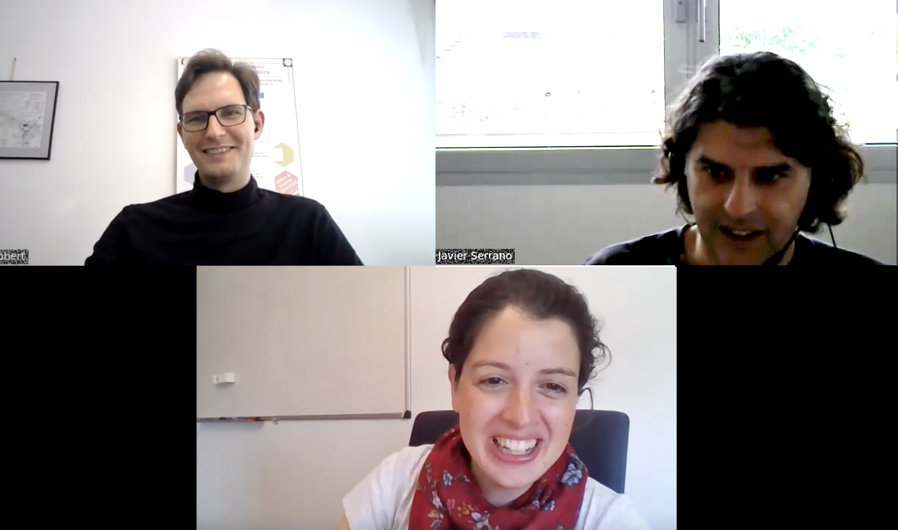

# Interview: White rabbit

*by the Open make team, Javier Serrano and Amanda Diez Frenandez. Copyright to the authors, distributed under a CC-BY 4.0 licence.*

**Sections:**
- [The project](#the-project)
- [The Hardware](#the-hardware)
- [The Research outputs](#research-outputs)
- [The participants](#participants)

*Banner image: white rabbit logo, By CERN, distributed under a CC-BY-SA 4.0*

>Interviewee: Javier Serrano (CERN) & Amanda Diez Fernandez (CERN)
>
>Interviewers: Robert Mies (TU Berlin) & Moritz Maxeiner (FU Berlin)
>
>Transcription and editing: Diana Paola Americano Guerrero, Robert Mies, Moritz Maxeiner & Julien Colomb

*Screenshot of the interview.*

At CERN, the European Laboratory for Particle Physics, researchers perform experiments in which particle beams are passed through a series of increasingly higher energy accelerators, until they reach the LHC, the Large Hadron Collider, which is currently the biggest accelerator at CERN. There, the beams are made to collide so the physicists can study the outcome.

From an engineering perspective, this requires a distributed real-time system to ensure all components are synchronized at sub-nanosecond accuracy - something previously existing solutions were unable to provide. The project to develop the necessary hard- and software as open source, spearheaded at CERN by a team of electronics designers and Linux kernel developers around Javier Serrano (section leader), became known as “White Rabbit”. Amanda Diez has joined the project recently to increase the communication efforts and further drive the uptake of the technology outside CERN.



 

*Photos of the White Rabbit team and equipment, OPEN-PHO-TECH-2020-002-14, source and copyright CERN*

- Project start: 2006
- Core development team size: 5-10

### Hardware products
The White Rabbit is a distributed real time system to ensure all components are synchronized at sub-nanosecond accuracy.

As soon as you want to go into the microsecond realm, then you need hardware support. So, we use optical fibres with two different wavelengths of light going in different directions.

The main product is the White Rabbit switch. This is something that you need in every White Rabbit network. Then, for people who want to design White Rabbit nodes, we tell them a recipe. No two nodes are equal. People have different needs.

White Rabbit is an extension of Ethernet. You can do anything you can do with Ethernet and more.
### Hardware maturity
These things are in the market, but they could be improved for sure.
### Rebuilds
There are, I think, four companies that commercialize White Rabbit switches. So at CERN, we don’t make them, we just buy them from these companies.

If the purchasing people tell us that we should be looking for providers in this or that country, it is a much simpler prospect with White Rabbit than with any proprietary hardware.



## The project



In 2005-2006, we started discussing about the next generation of timing system at CERN.

We wanted to get an atmosphere, an environment for hardware developers, that would be similar to the software developers who were working with the Linux Kernel community.

We decided that we would use standards whenever possible, and when not possible, we would extend the standard. We also decided that we would open source the whole thing and involve commercial companies from day one. These were all very basic decisions in the beginning of the project that ultimately played a key role in the success of White Rabbit.

>How did it all start with the White Rabbit project?


At CERN, we need a synchronization system in the accelerators, as the particle beam is our end product. We give that to the physicists who are our users. We make these beams collide, and they watch what happens. They see and they study the outcome of these collisions. For us, the particle beam is our end product. It is the result of acceleration and transfer from an accelerator to another, moving to higher and higher energy accelerators until the LHC, the Large Hadron Collider, which is the biggest accelerator at CERN. There are many things to synchronize, it's a highly distributed real time system from the controls perspective. And we need to have a common notion of time, everywhere so that, if we say that we are starting to accelerate at a given time, everybody around the accelerator starts to accelerate at that same time.

We have had timing systems, since the beginning of the operation of the accelerators, and in 2005-2006, we started discussing about the next generation of timing system at CERN.

So, we decided that it would be good if we solved a larger problem than just particle accelerator control or particle accelerator synchronization. And by that time, we had a team in which our low-level software developers were very much involved with the Linux kernel community. And we wanted to get, for the hardware experts, for the hardware developers, an atmosphere, an environment similar to what our software colleagues were experiencing, in terms of the ability to work with others, to learn from others, to contribute back to society, and so on. 

So, this is where the vision for open hardware came from, at least insofar as CERN is concerned. And White Rabbit was an opportunity for us to put these concepts into practice. We selected Ethernet as the technology to base it on, because we wanted to have something as standard as possible. When we studied the different standards on top of Ethernet that could help us with synchronization, we identified that IEEE 1588, also known as precision time protocol, was one possibility that didn't quite make it in terms of precision. So, we decided that we would use standards whenever possible, and when not possible, we would extend the standards. We also decided that we would open source the whole thing and that we will involve commercial companies from day one. 

These were all very basic decisions in the beginning of the project that ultimately played a key role in the in the success of White Rabbit. So, just to say how it started: We had a meeting, it must have been 2008, where we invited people from other institutes, laboratories, experts from industry, and we exposed the problem, we explained our preliminary ideas, and we kick started the project.



As soon as you want to go into the microsecond realm, and we go into the nanoseconds, that is six orders of magnitude better than Network Time Protocol, then you need hardware support. So, we use optical fibres with two different wavelengths of light going in different directions.

White Rabbit is an extension of Ethernet. You can do anything you can do with Ethernet and more.

>Today, what is the core benefit of this project? And how does the hardware fit in the overall project?

 
Synchronization systems are useful in many places. I mentioned one, which is in the control of a particle accelerator, which is a highly distributed real time system. They also play a role in other scientific facilities when you want to, for example, make a big telescope, a big cosmic ray detector or a big neutrino detector, but you cannot make it as big as you would like. So instead, what you do is you make smaller telescopes or smaller neutrino or cosmic ray detectors, and you synchronize them together. And then after the fact, in software, you mimic the operation of these bigger instruments, by having detections in many different places which are synchronized with one another. Hardware is needed because ultimately, what you want is this common notion of time everywhere. And everybody must agree on what the current time of day is. And one way of doing it is to send a message, let's say, to designate a node, which is the master of time, and then synchronize all the other nodes with respect to that master. Now, the problem then is when this node says, "Okay, it's midday for me", and it sends a message out, by the time it is received on the other nodes, it's not midday anymore. So, you need to evaluate very carefully the time spent on the wires by this message, and then correct it on the receiving end to set the clocks right. If you do that, at the millisecond level of accuracy, you can do something called NTP, which is a purely software protocol, Network Time Protocol. But as soon as you want to go into the microsecond realm, and we go into the nanoseconds, that is six orders of magnitude better than NTP, then you need hardware support.

So, we use optical fibres with two different wavelengths of light going in different directions. We have a mathematical model to extract from online measurements the delay of the message going through the optical fibres, and we do this continuously. And that needs hardware support, basically. So, we have White Rabbit nodes all around interconnected by White Rabbit switches. The nice thing about Ethernet is that we get very nice diagnostics out of the box. All the tools that you can use to manage an Ethernet network, you can use to manage a White Rabbit network, because it is an extension of Ethernet. You can do anything you can do with Ethernet and more. 

It turned out to be a very good decision to base everything on Ethernet. It's also very scalable, actually kind of infinitely scalable. We can add nodes and switches as we want, and the whole kind of management of addresses happens automatically. So, there are many, many good things about Ethernet that White Rabbit benefits from. But basically, to answer your question, the core of a White Rabbit network is the White Rabbit switch, which we can replicate and interconnect as needed. And, then, people design White Rabbit nodes which are specialized for something. They benefit from this common notion of time that White Rabbit gives them, but then they do something else.



A lot of the funding comes from CERN. There was a grant from the Spanish government. Two Spanish companies worked on the initial design of White Rabbit, one on the hardware side and one on the software side. And that was a very good initial push. Then other people joined.

White Rabbit has been going on for something like 13 years. The involvement at CERN has ranged from three or four FTEs at the height of the development to one, one and a half FTEs at the lowest parts of development.

>How is it funded, overall?
 
 
A lot of the funding comes from CERN. Traditionally, before we did open hardware, these types of ad-hoc systems for the accelerators were designed at CERN and paid completely by CERN. So, we had a budget for this project. A lot of the development of the core infrastructure for White Rabbit happened thanks to this budget. One of the differences with respect to past efforts at CERN was that we involved industry from day one, and there was a grant from the Spanish government. I think it was called industry for science. It was supposed to give Spanish companies a competitive advantage for these types of projects, collaborating with big international laboratories to get some kind of competitive edge. So, we benefited from that grant. Two Spanish companies worked on the initial design of White Rabbit, one on the hardware side and one on the software side. And that was a very good initial push. Other laboratories like GSI in the south of Germany [GSI Helmholtz Centre for Heavy Ion Research](https://www.gsi.de/) joined very early on and they also contributed financially and in-kind with the effort of their designers.

Then with time many people joined. Many of them just as a user, but also some of them like [Nikhef](https://www.nikhef.nl/), the physics laboratory in the Netherlands, which ultimately became quite an important actor, also from the design point of view. So, from the budget perspective, a big portion of it comes from CERN, but there are also many other players.


>Can you give an overall estimate over the years, how much funding you have received?
 
 
I don't have a straight answer, because how do you count? We have budgets for material and we have people working on it, which I don't know how you count. White Rabbit has been going on for something like 13 years now. Typically, the involvement at CERN has ranged from three or four FTEs at the height of the development to maybe one, one and a half FTEs at the lowest parts of development. Our expenditure in materials, testing gear, subcontracting to companies, etc. typically ranges in the 100k per year. Some years are bigger than that, never smaller. So, that's roughly the order of magnitude of things, but I have not made a precise calculation.



It was a very clear program of work, and we handled it in an open source way inspired by open source software. It was quite informal in the end.

We had annual meetings where everybody would show up and show their latest work, and synchronize with the rest face to face.

>Could you describe the overall process in the project?
 
 
It is quite informal actually. In the beginning, it was less informal, because we had a very clear idea of what the basic building blocks of a White Rabbit network are. Therefore, we knew what needed to be done. We needed to design a switch which complies with the IEEE standard 802.1 that specifies what Ethernet switches should do. It was a very clear program of work, and we handled it in an open source way inspired by open source software. 

So, we had a team at CERN working on it, but people would regularly show up volunteering to do some work and we had work packages. And they went for it, they merged their work. Most of these was either HDL, what we call gateware, or embedded software running in the switch. The PCB (Printed Circuit Board) of the switch itself, the mechanical case... And all these were packages taken by people. I was coordinating this effort. It was relatively informal. We had meetings to coordinate. That's also the time when we started having workshops, like on a kind of annual basis, not exactly annual sometimes, but meetings where everybody would show up, show their latest work, and synchronize with the rest face to face.

There were also visits, so people from GSI, for example, spending time at CERN. Otherwise, it was a bit more formal for the Spanish companies, because they needed to report more formally to their funders. But for the rest of the project, I would say, you know, if you imagine your typical free and open source software project and how it's managed, it was a bit like that. It was quite informal.


 
Some of the issues were brought about by people who utilise White Rabbit in an environment which was not what we anticipated at CERN. That was actually a very good thing, because we had bugs that we had not noticed at CERN. They made those improvements, fed it to us, and they merged it with the standard open source projects. So, that was very nice.

That was one of the organizational challenges: how to coordinate all the actors and how to motivate them to play the game, to stay within the main project and also to open source their improvements.

>What major issues have you come across in this project and how did you resolve them? It's a long stretch of time, I guess.

 
On the technical side, quite surprisingly, I don't think there were any major issues that I can remember. Lately, we have been trying to push the performance very much. And we have run across technical issues as we want to synchronize to the picosecond instead of the nanosecond. 

That's yet three orders of magnitude better than what the standard White Rabbit does, and then you start coming across technical issues, which have to do with electrical noise, power dissipation and things like that. But okay, those are technical issues that we coped with just through standard good practices for engineering. And by the way, one thing I should say is that some of the issues were brought about by people who exercise White Rabbit in an environment which was not what we anticipated at CERN. 

That was actually a very good thing, because we had bugs that we had not noticed at CERN because, for example, our links were never longer than 10 kilometres. Somebody in Finland started using White Rabbit over a stretch of 900 kilometres between two cities in Finland, and then there was a counter overflow, because the number of bits in a counter was not enough, effects that we would not have seen at CERN. Then, for example, people in China use the white rabbit in a cosmic ray detector, which is very high up in the mountains near Tibet. And with a big excursion of temperatures from day to night, also exposed to a lot of dust. There were problems with the fans that were being clogged with dust. So, they made a finalised version of the switch which dissipates power through conduction instead of using fans. They also contributed to an improvement in the calibration of White Rabbit, which takes into account these effects in delays that come as a consequence of these big temperature excursions that we have not seen at CERN. Because at CERN, most of the electronics is in places where the temperature stays quite constant. They made those improvements, fed it to us, and they merged it like the standard open source projects. So, that was very nice.

On the non-technical side, I think the biggest challenge was to have all these people have appropriate incentives to contribute back to the development. So, if you are in another institute, and your need is slightly different, you might be tempted to fork the project, or you might be tempted to do your own variant [instead of staying in the project].

But if you stay within the project, even if it's not fully optimal from a technical point of view, you still benefit from trying to be part of the community and try to merge your kind of variations into the main trunk of the project. Then, also the open sourcing of the improvements: you know, some people will not be motivated to open source their improvements. The license of White Rabbit actually allows that to happen, you can have proprietary extensions. So sometimes I would ask myself, or I would say, we need to be nice if these improvements have been open sourced. And sometimes it was a private company, so that there was nothing for me to say, you know, if a private company says I'm not open sourcing this, I'm doing it with my money. They are perfectly legitimized to take that decision and I would never tell a company what to do with their money. But sometimes it would be publicly financed laboratories, and then I would ask the question, why is it that you're not open sourcing this? And then there could be different reasons. 



The project works insofar as people find it useful to play the game and to contribute to the main branch that we are maintaining.

We’re starting to put in place with Amanda that we should communicate more broadly the advantages of doing so.

People just [contribute to the project] if and when they consider that this is useful for them. 

There are colleagues who are going to test and participate in the validation. But most of the time, the decision happens just at an individual level.

>How were the decisions made within the project?

 
We are, at CERN, in charge of maintaining the main branch of the project. We release regularly, or a bit less regularly than we would like, new versions of the switch, the switch hardware, gateware, software, and new versions of the White Rabbit PTP core (which is a piece of HDL that people instantiate inside their FPGAs when they design a node. It gives you the basic White Rabbit functionality). Somebody can decide to not use what we publish, or to not contribute to what we publish, right? And they are perfectly free to do so. The project works insofar as people find it useful to play the game and to contribute to the main branch that we are maintaining. There is no ability for me, and I don't even want to do that, to impose anything upon anybody outside CERN. People just do it if and when they consider that this is useful for them. 

From that point of view, I think it's interesting. We're starting to put in place with Amanda that we should communicate more broadly the advantages of doing so. Because there has been people with the best intentions, not playing the game, just because they didn't understand that it was in their interest. And, we have been maybe lacking a bit in proper communication.

>Who essentially decides what's good enough to be merged back into the main branch? Is there one person whose job that is or a committee who decides this?
 
 
Yes, this is a very good question, and this is one question that we are asking ourselves as we are trying to move to a White Rabbit Collaboration which is a bit more formalized. Right now, it all happens inside a certain team. For example, we have one person in charge of making the new release of the White Rabbit PTP core. And I trust the judgment of this person. And, of course, there are colleagues around who are going to test and who are going to participate in the validation. But most of the time, the decision happens just at an individual level.

## The Hardware



The main product is the White Rabbit switch. This is something that you need in every White Rabbit network. We're in version three now, and we are preparing version four.

And then, for people who want to design White Rabbit nodes, we tell them a recipe. There's a reference design, because no two nodes are equal; people have different needs. For example, somebody working on cosmic ray detection or in the stocks market might be interested in a time-stamping node.

There are, I think, four companies that commercialize White Rabbit switches. At CERN, we don’t make them. We just buy them from these companies. 

>What are the hardware products that you have developed as part of this project?

 
The main product is the White Rabbit switch. This is something that you need in every White Rabbit network. It has gone through a number of versions. We're in version three now, and we are preparing version four. It's a complete open hardware project in the sense that it involves open mechanics. So, there's a case and open PCBs for the electronics inside. Inside those electronics, we have FPGAs which are configured using hardware description languages for which the code is also open source. And there is a processor running Linux for the non-time-sensitive parts of the operation of the switch, like learning MAC addresses. This is something that gets done in Linux and all the code for that embedded Linux is also open source; not only the Linux but also the tasks that we run on top of it.  That's the main ingredient. 

And then, for people who want to design White Rabbit nodes, we tell them a recipe. There's a reference design, because no two nodes are equal; people have different needs. For example, somebody working on cosmic ray detection or in the stocks market might be interested in a time-stamping node. That means a node that receives pulses and provides a timestamp corresponding to the rising edge of each pulse, and it stores that in memory. This is used for tracking financial transactions, for example, or it is used for signalling the detection of a high energy particle in a cosmic ray detector. It's exactly the same type of node, but there are many other types of nodes. So, we provide a reference design for a node, which includes what you should have in your printed circuit board, a Programmable Oscillator and things like that. And also, the HDL code, the hardware description language code, that you must instantiate inside your FPGA to have a White Rabbit interface. With a clear interface, also to your own logic inside the FPGA, you can extend it.

So, that's the main deliverables of the project. Those are kind of the common blocks that everybody uses. It's like the core and it's all open source. Then around it, the basic way in which people customize a White Rabbit solution is by designing other types of nodes that do other things. And this is something that people do all the time taking as a reference our node design.

>If you were to rate the maturity of the hardware components that you've developed, like prototype, demonstrator or market-ready product, how would you rate them?

 
I think it's all a bit subjective, of course, these products are in the market. Whether they are market-ready or not, is something that we could discuss about. Of course, they can always be better. And we are always [doing that]. For example, right now, it's a very common trend in gateware design to adopt best practices from the software world: For example, continuous integration, so that every time I make a commit to the HDL code of the switch, or the node, there's a battery of tests that run and that let me know if there are any mistakes I introduced in my latest contribution. This is something that we are working on. And we're also looking at technology readiness levels, which are what other people like the European Commission use to characterize the maturity of a product. And one of the things we want to do within the White Rabbit Collaboration is improve the TRL levels of the releases we have in the core of the White Rabbit project. So, we don't have a formal evaluation of what TRL level we are at today. These things are in the market, but they could be improved for sure.

I could not tell you what TRL level they correspond to today. Maybe a year from now, when we have gone through this discussion in the frame of a new White Rabbit Collaboration, I will be able to tell you.

>You said the GSI Center has been using one of those switches and people in China as well. Have they reproduced those switches themselves? Or did you build them at CERN and send them?
 
 
There are, I think, four companies that commercialize White Rabbit switches. At CERN, we don't make them. We just buy them from these companies. We design them, but even if we [were to] have a process at CERN to produce our own hardware / if we wanted to, I don't think it's a good use of our time. Maybe for prototypes or such we do that kind of thing. But when we buy 50 switches or 100 switches, we have a standard procedure at CERN which involves a price inquiry and call for tender, a competitive tender. We ask for quotes to different companies.

One of the big advantages of open hardware is that the design is there for any company to use. If a company in a given country wants to bid, I could take this design and manufacture it and test it and sell it for you for this price. The access to the design files is the same for everybody. This is very convenient, because sometimes at CERN there are countries which are poorly balanced, in the sense that they contribute more than what they are getting in terms of purchases, hiring of people and so on. There is a representative for a country called the ILO, the industrial liaison officer, whose task is to oversee that, for example, the ILO for Germany will see how much Germany is paying to CERN and how much is coming back in terms of orders to German companies and so on. If there is a big disagreement, they will push for more business to be done with German companies. 

White Rabbit in particular and open hardware in general, gives us the flexibility that if the purchasing people tell us that we should be looking for providers in this or that country, it is a much simpler prospect than with proprietary hardware. Because if we had to work with a German company for our timing system, we'd have to look for a timing company in Germany that does exactly what we need. Whereas if we have an open source design, we can work with many hardware companies in Germany that could understand this design and commercialize it and test it.

## Research outputs


Hardware, software, and documentation, and papers. The hardware itself is available from commercial companies, which we always thought would make things scalable.

There has been a lot of publications. Not only about the technical features of White Rabbit, but about the White Rabbit phenomenon in itself, like, people studying the open source hardware phenomenon and the White Rabbit community

>What were the envisaged outputs of the hardware development in terms of documentation, prototypes, journal publications, and these kinds of things?
 
 
Well, all of that. We have hardware. There has been a lot of publications. Not only about the technical features of White Rabbit, but about the White Rabbit phenomenon in itself, like, people studying the open source hardware phenomenon and the White Rabbit community, writing scripts to look at... I don't know who is contributing to White Rabbit by looking at our Git repos. Making statistics to study why this or that part of the project is succeeding and trying to explain that to see if other projects can benefit from it, and so on. Yeah, quite a lot of publications.

The hardware itself is available from commercial companies, which is something that we always thought would make things scalable. We were concerned that if this technology were successful, which it ended up being, the original design team would be swamped by requests for support. So, we counted on commercial companies to take a part of that support by selling white rabbit gear and by offering support to their clients. So, hardware has also been an output of the project and software as well. So hardware, software, documentation, and papers.



We present and publish papers in conferences on big physics facilities and synchronisation. 

In its latest incarnation, the Open Hardware Repository [the platform where the hardware documentation is] is nothing else than an instance of GitLab Community Edition. It would be nice to have things more indexable, easier to find. So, I see space for improvements in the way these projects are documented and presented to the world. It is true that open sourcing something needs an extra effort on quality.

>Where did you publish these things? I mean in what journals and did you put the hardware files on your own systems or on other systems?

 
We go to conferences which deal with controls and data acquisition for big physics facilities. This is our reference community where we meet people with similar problems in different places in the world. For example, people who are working on telescopes or on neutrino detectors, cosmic ray detectors, synchrotron light sources, all types of experiments in big physics facilities. We all share many common problems. Synchronization is one of them. So, that's one type of conference. ICALEPCS is the main one we go to and we publish there. Then, there are synchronisation conferences. ISPCS [IEEE International Symposium on Precision Clock Synchronization for Measurement, Control, and Communication] is one example of a conference where we regularly go and publish. You have people there who have [to solve] a synchronization problem, and that's not limited to big physics facilities. Most of them come from sectors like telecom, energy distribution, and others that need fine synchronization in their systems. So, those are the two main types of conferences we go present and publish papers.


>How did you publish the documentation, including the CAD files and all the other digital parts that describe the hardware?

 
The open hardware repository evolved through time. At the beginning, when we started this effort, it was not so common to just upload stuff to GitHub. I don't even know if it existed at the time. So, we created our own repository, which evolved with time. In its latest incarnation it's nothing else than an instance of GitLab Community Edition. We didn't want to reinvent the wheel, it makes a lot of sense. People are used to these kinds of flows and tools. That's where we put most of our designs and design-related information. It's ohwr.org, the open hardware repository.

It is easy, but it can always be improved. If I'm looking for an ADC board, something at one giga sample per second in PCI, or PCI Express form factor, it wouldn't be easy to find in the open hardware repository or in any GitLab Community Edition instance for that matter. It would be nice to have things more indexable, easier to find. There's a number of things we have put in place through the years because we noticed it was useful, like frequently asked questions for every project, so that we don't end up answering the same questions over and over [again] in the forums. 

If we had to identify one thing which is kind of lacking, in our opinion, this is indexability / findability, because it's the same thing in software. You have lots of stuff on GitHub, but maybe nobody knows about it, because it's not easy to find. Already, on the aim of creating one site, because now that we have GitHub and gitlab.com as well, the question could be, why don't we upload all our stuff there. But that will probably dilute it even more and make it even less easy to find. So, I see space for improvements in the way these projects are documented and presented to the world. It's not our highest priority right now, because it's good enough for most of what we do. But there are efforts ongoing in other places to improve the way hardware designs are documented and I look forward to being able to use them. But it's not our highest priority right now.

>Was there anything that you didn't publish? And if you didn't publish it, why not?

 
I can't think of anything we didn't publish. Let's see. If it were the case, it would be either that we just didn't have time, or that we didn't think of it. But it was never a deliberate decision to not publish something. It is true that when I go to other places at CERN and I ask some of my colleagues what is keeping them from open sourcing their stuff, lack of time, sometimes comes as a recurrent theme. And when you go public with something, your standards for quality go up because you want to look good in public. Maybe it is something that you would accept in a private setting, but it would not be good enough to go public. So, this is a very common issue: open sourcing something needs an extra effort on quality. In a perfect world, you could argue that you want very good stuff, also private stuff. But in the real world, you cut corners much more often for things that you don't have to submit to the scrutiny of the world. That's a fact of life. And yes, definitely lack of time, and sometimes lack of mandate. Some colleagues say, okay, they’ve designed this because they were asked to solve a given problem in our detector of particles, or in a piece of an accelerator. But nobody is asking them to publish it, look for commercial partners and try to have an impact beyond that. Or if someone is asking them, they're not giving them the means to do it, either economically, or in terms of time assigned to this task. So, I can imagine these two things, but in our case, we didn't have that problem.

Some colleagues told me, nobody is asking them to publish it. Or if someone is asking them, they're not giving them the means to do it, either economically, or in terms of time assigned to this task. But in our case, we didn't have that problem.



It had an impact way beyond what we expected, beyond the physics realm, like telecom, energy distribution, or stock market. It was also very interesting because it brought other types of feedback to the project that improved it even more.

To align our visions with the competitive interests of partner companies was not so successful. This kind of friction, we did not anticipate. We're trying to see how we can fix it in the new White Rabbit Collaboration that we're preparing

>What would you say was successful about this project and what wasn't?



The success clearly is that it had an impact way beyond what we expected. We wished for these impacts, it was not something that came as a surprise. But definitely there's bigger impact than just on the accelerators. It actually happened in two different stages. 
First, it went to the outside of CERN, but still within the physics realm. This was something that could still be kind of considered normal, because many of our problems are very close to the problems of some of our colleagues that we meet in conferences all the time. It was not that spectacular, yet still very nice that White Rabbit is used to find neutrinos inside of the Mediterranean Sea, or in Antarctica, or in the search for very highly energetic particles in China. That's still within the normality. But then we went beyond science and we had impact in sectors which are typically very removed from fundamental research, like telecom, energy distribution, or stock market. This was very nice, very rewarding for the designers, and also very interesting because it brought other types of feedback to the project that improved it even more. So, that's on the successful side.

On the less successful side, when I was discussing with some of the key companies that make up the White Rabbit ecosystem, it was difficult sometimes to align our visions in a sense that the open source core of the White Rabbit project would be seen as a benefit and an advantage for everybody. There was a risk at some point that part of the open source core, when it gets expanded as a result of a decision of the core team, is seen as competition by some of the companies to some of their proprietary products. This kind of friction, we did not anticipate. It didn't happen that often. But it is one part of the project, which was less successful. I had this idea that companies would be building on top of the open source core making bigger margins with proprietary developments in the periphery of the project. It's just that there is this time dimension where what's in the periphery, at some point becomes part of the core, because the core is growing. Then, companies need to innovate in a proprietary way somewhere else, because something just becomes open source and they cannot have so big margins in that part of the project. This was sometimes not perfectly synchronized, to employ a term that's very commonly linked with White Rabbit. So yeah, that would be something that we're trying to see how to fix in the new White Rabbit Collaboration that we're preparing. If I have to point out something that has been less successful, it will be probably that.

## Participants



At CERN, we have a mission to conduct research in fundamental physics, but also to share the things we do with the rest of the world. So, the mandate of CERN suits me perfectly. And in 2008, at the start of this project, I had been at CERN for 10 years already. I had reached a kind of maturity at an engineering level that allowed me to innovate in my domain.

>What brought you to work for this project at CERN ?


The reasons I work at CERN and in White Rabbit are very similar. My way of understanding CERN is the mandate, which is very inspiring to me. In the mandate, which comes from a very nice document written in the 50s called the CERN Convention, we have a mission to conduct research in fundamental physics, but also to share the things we do with the rest of the world. In particular, the developments that we carry out in the course of those physics discoveries. I've always been into sharing knowledge and collaboration. So, the mandate of CERN suits me perfectly. In 2008, I had been at CERN for 10 years already. I have been building a profile that made me a mature enough engineer to have a vision, to innovate and to realize the mandate of CERN being able to contribute. I had reached a kind of maturity at an engineering level that allowed me to innovate in my domain, which is synchronization systems, in a way which is aligned with the mandate of CERN as I understand it.

I am responsible for a yearly budget that we spend on White Rabbit, and I coordinate the work of the people working in the White Rabbit team.
 *from Amanda Diez Fernandez:*
ow I came to White Rabbit? Well, first, how I came to knowledge transfer? I had a bit of experience doing research from when I did my PhD, but the topic was a bit too narrow, too far away from a direct application. In that sense, a knowledge transfer job is the opposite. It's very close to the application. You see technologies when they're very mature and ready to have an impact. Also, the topics you can cover are very diverse. In terms of White Rabbit, before coming to CERN I had previous experience working at the interface of science and policy on the topic of quantum technologies. Now, I am working to facilitate the uptake of CERN technologies by companies active in the quantum domain.  White Rabbit is one of the technologies that is being considered for quantum communications, and this was my first link to the technology.

When a colleague left, I took White Rabbit in its full application range. Already, years ago, when I first looked into Quantum, I learned about the timing distribution challenges, because it is also important to understand the potential impact of atomic clocks. And already back then I found it was a fascinating problem with applications in many areas. So, I was very happy to take on the topic.



The key contributors to White Rabbit would be a few tens of people. It would not reach a hundred. In terms of users, it's many more than that.

I think a big part of that success, in hiring and attracting talent, has been the open source nature of White Rabbit.

The obvious advantage for everyone is they got something that none of us could have developed alone.

>How many members worked on the project over the course of time?


It's difficult to say. The key contributors to White Rabbit would be a few tens of people. It would not reach a hundred. In terms of users, it is many more than that. Depending on how you count, the key contributors to the project would be anywhere from 20 to 50-60 people. Most of them are people like us who work as engineers in an organization whose main objective is research, but we are not researchers. We're just developing the infrastructure that the researchers use. So, the researchers are our clients or users. What we did with White Rabbit was quite a lot of innovation as well and it could be described as research in itself. In fact, one of my colleagues did a PhD thesis on White Rabbit, but that's not the research that people imagine when they think of CERN, which is more on particle physics. In that sense, the particle physics researchers are users or clients of White Rabbit. And while we do a bit of research as well, most of our work is engineering work.


>How did you find suitable project members? With such competences.


It was really an embarrassment of riches. White Rabbit was a very nice project, very attractive to brilliant developers, because it had a lot of impact. I guess inside CERN people are very happy with their jobs fulfilling the basic CERN mission. Also, having an impact outside is really nice and interacting with people from outside is something that people find rewarding in general. So, there was no shortage of people wanting to work on White Rabbit that I can recall. There have always been very, very, very talented people showing up and saying that they want to contribute, which was always great. In the hiring process, different parts of CERN have different degrees of difficulty finding good candidates to apply. And we have never had that problem. A big part of that success in hiring and attracting talent has been [due to] the open source nature of White Rabbit, which exposed us to many communities. In fact, if I look at our team right now, most of the people came because they knew us already. It's not that they saw a vacancy notice somewhere and said, okay, let's apply to CERN. They knew us, they knew the project and during the interviews, they already could mention very detailed information about what we were doing and how they would like to contribute. So, definitely, open source is very good for hiring in general, at least in our experience.





Most, if not all of the teachings from the open source software world transpose quite nicely: respecting people, treating them as first-class citizens, making them feel part of a community and valuing their work. All these things that people do well in successful open source projects.

We created Frequently Asked Questions for every project, so that we don't end up answering the same questions over and over in the forums.

>How did you coordinate the work of the key contributors?


Well, at CERN, it is relatively straightforward because I am their supervisor. What's trickier is when you go out of CERN and you want a contribution from somebody of course. That's where the whole experience from the open source software world applies. We have seen that the world has a lot of experience by now in the dynamics and the good practices for running a good open source project. I would say, most, if not all of the teachings from the open source software world, transpose quite nicely. So, respecting people, treating them as first-class citizens, making them feel part of a community and valuing their work. All these things that people do well in successful open source projects.


>Can you say how the members have benefited from their work in the project?


Well, the obvious thing is that everybody's getting something that they could not have done on their own. White Rabbit is much bigger than any laboratory could have done on their own. All of our developers are also users of White Rabbit. They joined the project because they wanted to be able to influence its direction, to improve it, very often in a given sense that would favour the application they had in mind for White Rabbit. But in the end, all these people would not have been able to develop White Rabbit on their own. So, the obvious advantage is they got something that none of us could have developed alone.

