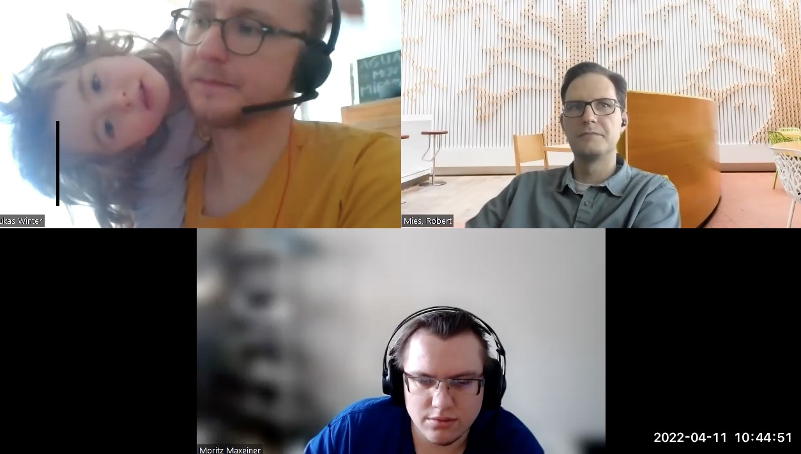

# Interview: OpenMRI - Halbach array

*by the Open make team and Lukas Winter. Copyright to the authors,
distributed under a CC-BY 4.0 licence.*

**Sections:**

-   [The project](#the-project)
-   [The Hardware](#the-hardware)
-   [The Research outputs](#research-outputs)
-   [The participants](#participants)

\*Banner image:open-source-imaging logo, by the OSI community, CC-BY-SA

> Interviewee: Lukas Winter
>
> Interviewers: Robert Mies (TU Berlin) & Moritz Maxeiner (FU Berlin)
>
> Transcription and editing: Diana Paola Americano Guerrero, Robert
> Mies, Moritz Maxeiner & Julien Colomb

*Screenshot of the interview.*

# The Open Source Imaging Initiative

The Open Source Imaging Initiative (OSI²) represents a new approach to
the development of medical imaging devices, aiming to make the
health-care benefits of modern instruments accessible to many more
people around the globe. The project will pool the knowledge and
experience of many experts in open-source designs for Magnetic Resonance
Imaging devices (MRI) which can be built and maintained for a fraction
of the price of current instruments. Its [hardware
section](https://www.opensourceimaging.org/category/hardware/) is rich
of 36 projects.

Lukas Winter is a core member of the large community behind this
project.



*Photograph of a constructed magnet array, consisting of 2948 individual
magnet elements. The rings are held together using threaded brass rods,
with nuts and washers acting as spacers between individual rings.*

-   Project start: 2016
-   Core development team size: 5-6 people

### Hardware products

Our goal with open source imaging is to have a completely transparent
and open source MRI scanner, ideally somewhere in the clinic. Our main
output is now a Low-field MRI System.

There were lots of different amplifiers and phantoms. All the modules
that you need for an MRI system to run. We list above 100 projects at
the moment (both hardware and software).

### Hardware maturity

It's a prototype but it's mostly because of ethical issues (the hardware
works, but cannot be applied to human imaging).

### Rebuilds

Different modules were produced and successfully tested, the overall
system not in its completeness yet.



## The project



There are two parts. One is around the website and the community
efforts. The other one is actually the development of hardware (and
software).

Overall we have more than hundred people involved, but it's not a fixed,
structured hierarchy.

The low-field scanners is something we can do with moderate funding. We
can now have more precise goals around one system with a larger group of
people. Initially it was not possible nor very effective because
everyone has different interests.



> Could you give a short introduction about the hardware project that
> you've been working on recently, the Halbach array magnet for in vivo
> imaging?


 Our goal with open source imaging is to have a completely
transparent and open source MRI scanner, ideally somewhere in the
clinic. We worked initially in different working groups on different
components or different modules of the system. Currently, this is all
coming together into one scanner. In MRI you have different types of
scanners. This one is called Low-field MRI System. Probably the most
important goals are a more affordable medical technology and access to
more people. The secondary goal is a transparent systems for science
which has the advantage of being more effective and bringing more people
to the table, more percisely bring the ones that  are currently excluded from the
scientific discussion. Further, open source systems are pretty
beneficial for society. For example, there is a lot of discussion around
AI entry into medical products. However, it's already difficult with
AI by itself. But if you had some transparent systems, you could
evaluate, understand, test the robustness, and maybe implement more
physics-based learning models that are more robust in a clinical
setting. This still has to be determined. It's on the research side so
to speak. 
I think for regulatory purposes that's quite interesting to
have. Then you have not necessarily only MR companies but you have other
companies that work together with MR. If they would have more access to
such transparent systems, they could test more products and create more
innovation. There are many different aspects of why we want to have it open
source. If you want to have whatever outputs, I think it's more
effective doing it in an open source way, and it connects the globe.


> How is it funded?


It's funded by the volunteers that spent their time on it. Different
researchers, different professionals and people are contributing time.
That's the biggest resource we have.



We had no public funding.

We make it work with what we have. The idea is to have many different people doing it like that. 

Some have project funding and they use it. The only difference is that they make it open source. 



> Did you have public funding?


We had no public funding, we only had very small grants that helped us
to make some videos and a bit of content for the websites in the beginning.


> Can you describe to us the overall process and how the project is
> organized?


There are two parts. One is the more around the website and the
community efforts. The other one is actually the development of
hardware. The community efforts are made by a few people that just tried
to keep the topic in the conversation and convince more people around
it. 
The hardware development is independent of that, it's happening in
research labs and on different interests and modules. The connecting
part is to make it open source. When we post it on the website, we know
that we can put it together into a single system. The organization isn't
clear for both parts. There is no clear organizational structure for the
website and community parts. They are three to five people which keep it
running in the small core and for the ultra developments the
organization is based on the labs.

> Robert Mies  
> Yeah, so many more people.

There are a lot of on and off experts. Overall we have more than hundred
people involved, but it's not a fixed, structured hierarchy. Decision is
made by a discussion and besides there are also some individual efforts
to promote things. 



The motivation was to change the market behavior to prevent
monopolization of MRI scanners. A solution is by open source.

We started off by providing visibility to the scientists.

It didn't happen that we had one place and around this place it
developed, but with time we put it together. 

> You have no clear organizational structure. Does that mean everybody
> works on what they're interested in or whatever they decide to work
> on? (Later, you discuss what of the work is included in some kind of
> mainline version of the Open MRI, I guess everyone has their own
> version of this, this Open MRI, and there is no mainline version of
> it.)

  
I can tell you the short history of how things happened, how it was
supposed to be and how it in practice developed. Initially we wanted to
have an open platform around open source imaging where people start
working in one direction. We started off by providing simple visibility
to the scientists something that was not there. If they do open source,
visibility inside the community is an extra effort. This is very simple
how it started. We highlight the projects, you get visibility, you get
something back and you're in a way part of this community. But I think
one of the most difficult things in most such community efforts and
things in general is its own interests and ecosystems. Everyone had the
urge to keep it in their own domain, repositories, websites and servers.
It didn't happen that we had one place and around this place it
developed, everyone was doing their their small modules. With time we
put this together. We work with some smaller teams within this whole
ecosystem towards one system. With open source imaging that goes a bit
wider than just one single low-field MR system. There are other
technologies for other field strengths, very specific things which may
cannot be applied to the low field scanner. Now we have this low field
scanner, in the beginning the goal was to keep people open sourcing
their stuff. Now we can bring some of these modules together and have
enough of this modules to make a whole system. The next step is to have
one system with communicating and improvement around it. Besides will be
people in this community that have other interests and outside of this
low-field system which is completely fine. It gives value and benefits.
In the lab setting we cannot reproduce a 1.5 or 3 Tesla MRI scanner
where you need superconductors for the magnet. That's not realistic. The
low-field scanners are a bit smaller. It is something we can do with
moderate funding. We can have more precise goals around one system with
a larger group of people. Initially it was not possible and very
effective because everyone has different interests. There is no one
funding pot for this project. Everyone has to make it work from within
their environment.


> You changed your requirements to resolve some of these issues?

  
We changed strategies a little bit. We had a different communication
strategy. We tried to get more people involved. Then it seemed to be to
much dispersion. We went away from that. One example, we have a Slack
channel with like 300 people. In the beginning we used this, but we
figured out that we just need one system to work around. We started to
get back from that. The community was not inactive just the Slack
channel communication. We started to focus on getting this one system up
and running. Now we will work around this system, it will make sense to
have something with a wider community again. The goals were pretty clear
and the details, but not how to fulfill them, this is in progress. You
learn and always get pieces of puzzles. The strategy changes to see what
works because there are no real blueprints for such complex open source
projects.


# the Hardware

> What hardware products have you developed as part of the product? We
> mean physical objects. They wouldn't have to end up in a clinic.
> Please describe the system and roughly the subsystems.

  
I would define a product as something useful to the research community
because we don't have a clinical system yet. In Europe a clinical system
requires certification which can only be done by a company that has
certified production facilities. That is a piece of hardware which is
helping someone in whatever task. If you just look at open source
imaging, there are a lot of different hardware pieces. It can be small
things like a phantom to scan or a piece of hardware that is used to
very specific MRI related tasks. For example, you noticed this COSI
Measure robot from us which is working at different working groups in
different continents. That's pretty useful to have because it's
something very specific without a big market for it. It solves a very
specific task. It's customizable which is one of the keys to really use
it. If you want to purchase such devices or make a company, do it for
you, the prices are quite high. You would need to have funding before.
If you have some students and a bit of money for materials, you can
pretty much reproduce this components. That's the big advantage.


> If I buy your product or commercialize it what are the major items I
> would be buying in terms of mechanical, electrical or even software?

  
If it was a product you could buy the low field system. It's a machine
itself which you put something in and you make an image.

Of course it isn't certified. You couldn't make a human image at least
not in Europe but you could make images of other objects. You could take
it apart and purchase it in modules. In principle, you could buy the RF
power amplifier components. You don't necessarily need to use it for
MRI, maybe for different applications where you need power amplification
or you use other amplifiers. Basically, you can either buy the whole
system or modules of the system.


> Is there software on the control?

  
There are lots of different software packages that are open source. You
don't need to buy anything. Everything is open source from imagery
construction over to image post processing algorithms, they are much
further ahead than in hardware.

Maybe one thing that is interesting to have open source as a product, at
some point it will be a cloud based solution to operate these MRI
scanners. This is something very interesting and powerful because you
could not only free up the system. There are other organizations working
on it. You can open up data as well and use this data for AI. This is a
big thing because most data is in private hands. And then you could have
around this platform different means of comparing results. These things
will happen. If you think of this as a product, this could be done very
well as a product.


> If you say cloud, do you mean a system where everybody can remotely
> operate such imaging devices? Or do you mean a database with imaging
> results that can any anybody search through and use?

  
Different things, I mean that you don't need to have some fancy
reconstruction hardware like GPUs. You could have slim hardware with the
scanners, then you transfer the data to the cloud. Image reconstruction
is a big part in MRI. There's not always the same thing to do, there're
different methods with different effectiveness. Some of them just need
good and fast hardware. If you have it in clouds, this would make it
easier. You have a small tablet or probably a phone, the rest is done in
the cloud. Compared to local hardware you could use an exchange. In
terms of image post processing the results in the cloud have
segmentation, you have other clinically relevant algorithms that fetches
some information from the images that you acquired and present you
clinically relevant and research wise results. This you could exchange
with the community. There are different ways that a cloud based system
around these open source devices would be very interesting, similar to
comparing different AI algorithms and solutions on your data.


> This leads some more to the question of the maturity of the product.
> Is it a prototype, a demonstrator, or market-ready product?


It's a prototype but it's mostly because of ethical issues. Different
modules were produced and successfully tested, the overall system not in
its completeness yet.

Pre-prototypes exist but we want to have a multicenter evaluation and
this is not 100% there yet. 

> When this project continues who will develop it further and by whom?
> You mentioned centers.

  
Primarily at this stage are research institutions. There will be
transition to commercial entities. Both isn't limited to a few regions
in the world.


> How did you end up working on this product?

  
As a scientist and not only as a scientist. I try to work on something
that creates impact and there're different ways how to create impact.
With my time available, I'm trying to maximize the impact I can create.
This leads one to the other, ending up with an open source version. It
has the most impact thinking it from a big picture.


> Why do you believe doing it open source has the biggest impact?

  
On a scientific level it's not yet as effective as it could be if we
would all share and work together. From generating knowledge you need to
have access to knowledge the easiest way possible within a global
perspective. This is one system, the next one is the system of products.
It's something very similar because the price of products is based on a
variety of different factors which is a lot of redundancy. It's based on
access to information. This is the value of the product, to not have
access to this information. That's the protection of this product, but
it's also very inefficient and a lot of overhead. I don't mind if it's
in products that are not necessary to be alive. There are products which
are necessary to be alive like in healthcare. Then it's a different
story. If you have a public healthcare system, there're things that
transparency would be very beneficial for. We as a global society should
search for solutions together for our issues and we shouldn't separate
this strongly, depending on where you are and on what resources you
have.


> But we talked a little bit about the project overall and about the
> product and hardware. How did it all start?

  
When we found it, my and some others motivation was open source imaging.
It was out of this question for impact. I was researcher in ultra high
field MRI which are systems that are even more expensive than the
current standard MRI systems. You ask yourself, how is it successful?
How many people will it reach? Then what's the problem? Why doesn't it
reach more people? You start to investigate. You try to pinpoint the
reasons. The classic one is the cost. Then it gets more complicated. You
think what can I do about it? Is there a way to do it different? You
pinpoint the most impactful parts of the system. First technology wise
you say there are superconductors which are very expensive, can I do
standard magnets? You start to investigate a little bit into this
direction and figure out that's possible. You see the next issue. If I
even make it happen, I have this whole other area of certification. If
initially it's a cheap device, it will not be cheap on the market. Then
you figure out how can I change this market behavior to not have this
monopolization in the end? A solution is by open source. This was the
motivation, to start, take it off and see if we can get the community
together because this community is very open and very susceptible to go
into this direction.


## Research outputs


I need to make a paper and the paper is unfortunately not the whole documentation of the failures. It’s mostly the positive results. 
We are happy at this stage if together with the paper comes some open source documentation to reproduce this paper.


> What has been the output of your hardware development so far?

  
I'm again answering for the community, not for my personal output. There
were lots of different amplifiers and phantoms. All the modules that you
need for an MRI system to run. Nearly all the modules are open source
hardware. If it isn't there is an open source software that makes non
open source hardware very usable. Different reconstruction algorithms
and post processing algorithms are different. Very specific things for
specific MRI related applications. There's a lot of projects in open
source imaging. It should be above 100 projects that we list at the
moment.


> In terms of output, do they have some kind of knowledge create or
> knowledge management result? Like a document of things they found
> while developing. This is important for someone else who wants to do
> this same kind of development? What's about failures?

  
Apart from the standard documentation, how to rebuild, the whole
development process depends on the project. Some have it, most don't
have it. It's a lot of extra effort. Thinking it from from a research
perspective I'm mostly interested in papers. I need to make a paper and
the paper is unfortunately not the whole documentation of the failures.
It's mostly the positive results. We are happy at this stage if together
with the paper comes some open source documentation to reproduce this
paper. The paper is more than a usual documentation of the piece of
hardware. Because you have some more explanation and results, you
wouldn't have normally, but you don't have the whole history. Some
projects do, they have more testing and more reasoning why they use
certain components over others.



Publications, abstracts, conference proceedings and presentations were
produced, but they do not talk much about how you develop the hardware,
it's more about what it has been used for.

There is no real complete standard on what you have to publish. We try
to give the information that is necessary to rebuild it, but it's
difficult to keep it updated. 

> Where happen project publics in relation to the hardware?

  
Project findings were published in how to construct the hardware. But
how the hardware was used to gain some results is typically done in
publications, abstracts, conference proceedings and presentations. It's
not much about how you develop the hardware, it's more about what it has
been used for.


> What information have you shared in terms of a bill of materials,
> catfights, assembly and instructions? If someone comes and joins your
> group what do they find?

  
It's pretty much based on the project. In the beginning we were more
inclusive what we post on open source imaging. For our projects
published we try to have the OSHWA type checklist. There is no real
complete standard on what you have to publish. We try to give the
information that is necessary to rebuild it, but it's difficult to keep
it updated. It's not always complete, for example the COSI Measure robot
from us. We have bill of materials and a assembly instructions for the
individual components, mechanical electronics and software. There are
some things missing which are in some email communication. For example,
if the US group wants to rebuild it and they have difficulties with some
distributors, it should be added to the bill of materials. This
maintenance work is difficult. We don't have dedicated resources for
that. In principle that depends on the project. Some have more, some
have less documentation.



People are not used to work openly. People only share  when it’s perfect enough.

ou want to publish something when it’s done. When you have new results. If you do it on the way, you risk someone taking over. You wait until you’re done. Then you present the last results.

This documentation part is a lot of extra work, it’s optional. You need resources for that.


> Why has there not been published any other output?

  
The progress of development you mean? It has not been published for
several reasons. One is the extra time it takes to publish something.
Second is people are not used to openly. It's a culture change. People
growing up, they are more used to share, upload videos, share their life
and their things, but classically it's not like that. You just do it
when it's perfect enough. Another reason might be that the scientific
world is competitive. You want to publish something when it's done. When
you have new results. If you do it on the way, you risk someone taking
over. Someone that maybe have has more resources and then they publish
before you. That's a disadvantage for you. You wait until you're done.
Then you present the last results. This documentation part is a lot of
extra work, it's optional. You need resources for that. For example
institutions, the tech transfer could be actually a real tech transfer
and work for open source projects instead of other things. You could
have these resources in institutions. Then you could have a culture
change towards more open and more early open.

We just need to be patient. I think that the younger people have it much
easier to have it early. Many others wait until it's perfect, then it's
still difficult to share.



 If I go anywhere and have this open source project there is no discussions around who has which interests.
 This is the huge advantage of open source way of doing it because it makes it much easier. And it’s much more fun.
 
 I get much faster the information I need.
 
 If we can manage to not close it down, I think the potential impact is much higher than just getting this specific system to some patients. From the immediate impact it’s less. But long term is the way to go.
 
 We have to try it, even if we fail, we might prove a point that there’s some big value to it.


> Been there some things you did where it was easy to do and it didn't
> cost as much? Because you're after impact in terms of the barriers
> that you mentioned and of the things that work.

  
I think the easiest and best that works with open source is connecting
elements. It's low on hurdles to any type of collaboration. If I go
anywhere and have this open source project there is no discussions
around who has which interests. Of course, everyone has their own
interests but not as much as in other disciplines. If there is a
commercial product, you have to set the stage how you collaborate
together. What information can you share and what not. You must have
nondisclosure agreements. Maybe some other contracts, who does what for
what. It's always about what do I get back for my time invested? This is
the huge advantage of open source way of doing it because it makes it
much easier. And it's much more fun. I can be more honest and open. It
makes things happen faster. People like it.


> You said it makes things faster. Could you elaborate on that slightly
> from your experience you've made there, or others you've seen?

  
I get much faster the information I need. Without this information I
cannot continue on some paths regardless if it's development, regulatory
or whatever. I can build upon it long term. I other areas you always
have to rebuild before actually making the next step. That's very
inefficient.


-   I would erase this part, the question was not understood\*

    > Would you say today it's possible to reproduce and modify the
    > product with the published information?

  
Current products on the market? No.
Modify without the company isn't possible. Of course the
company needs to interested in that. But what's the benefit? What does
it give them? Modifying, maybe some software, but it's very difficult.
You do have some very specific applications, you can work it out with
the company.


> If another group wants to join in the development, would they be able
> to replicate the prototype right now?

  
At the moment they would be able to if they have specific knowledge.
It's not yet at the level where it's a step by step. We would like to
have it as a IKEA manual. I think everything can be simplified to
understandable steps. It's an educational thing, but at the moment you
need an expertise to make some of these parts. Back to the information
of current commercial products, I remember that some commercial products
came actually with electronic schematics. There was a manual and a
schematics plan that you could repair or modify some of these components
for example radios or radio amplifiers. We've been there. Now it gets
more secret in a way you cannot repair many of the things. This is a
negative trend. One way is to keep it like that and just force the
companies. Like in the automobile industry where you have a huge
ecosystem that depends on being able to repair the cars. It's much
simpler with mechanical parts because you know even if you don't have
the information how it works. With electronics that is connected to some
software which is hidden that makes it very difficult.


> Do you want to encourage that or even force that?

  
There are two ways. One is to force it to be at least a sustainable,
ecologically friendly version. The other way is to have open source
designs.


## Participants


I try to work on something that creates impact.  An open source version of a MRI will have the most impact, thinking it from a big picture.
The most significant part is to have a good feeling about it.

You can continue your own work and have advanced it which gives you publications.



> You answered how many people have worked on a project and there are
> different levels of where they work on within two parts you mentioned.
> What are the occupations of the people, is it researchers or postdocs?

  
It's mostly researcher in different levels of their career,students, PhD
students, postdocs and PI's,
Bachelor thesis and master thesis.

We do not have technicians dedicated for the project,
some can help with with parts of the project.
We don't have a dedicated resource just for this project.

You make it work with what you have. The idea is to have many
different people doing it like that. It's the significant resource.


> How did you find so many suitable project members with the needed
> competences to join in?

  
I think it's from the idea of it, it's a very natural and convincing to
do. People are working on their own projects anyway. The only difference
is, can you actually share what you've been doing. You don't need to
convince to do technology or develope this. It's like you're developing
it and asked to share your your files because then other can use them
and work together on something bigger than on your project. You will
have more impact because others will see more what you have been doing.
It's just natural synergy. It works with a lot of people.


> Are some volunteers part of the work?

  
Some have project funding and they use it. The only difference is that
they make it open source. How they give access to the information is
based on the funding sources. In the end that is public funding. Somehow
it should be returning to the public and not only with an open access
paper but with open source code, open source hardware and open data. All
together should be part of the package.




We used to have a different communication strategy. We tried to get more
people involved, with a large slack. Now, we will work around the low
field scanner system until it make sense to have something with a wider
community again.

There are some documentation missing which are in some email
communication.

It's not a sprint, it's a marathon. We use multiple communication
channels. Whatever works. We have meetings and talk about things.

We think it's important to keep it enjoyable and to not have to strict
milestones. 

> How do you coordinate the work between the members?

  
We use multiple communication channels. Whatever works. It's not a
sprint, it's a marathon. It could be more effectively. The good thing
with this project is that time is on our side. We think it's important
to keep it enjoyable and to not have to strict milestones. We're doing
health care, we don't want to make ourselves unhealthy to create health.
We should do both in parallel and it works. We have meetings and talk
about things. But we don't have very strict deadlines. That's what get
people a burnout in the end. Sometimes you have a lot of sprints and
it's stressful. I don't want to say that. If you do it out of your own
conviction, the stress feels differently.


> How do the members benefit from the work in the project?

  
The most significant part is to have a good feeling about it. Similar
like, why people do charity or help others? I think you feel you
participating in doing something or doing it the right way. If you work
on something you love, it's much better than you work for something to
give you money, just to make you survive and for other reasons that you
try to exchange for some happiness in different ways. It's in a way all
egoistic but for a common good. You have on the side note, you get a lot
of knowledge, you get a lot of products in the sense of prototypes for
your own work. You can continue your own work and have advanced it which
gives you publications. That are things which make you happy on a
different path.


> I listened to your statement about happiness specifically. Did you
> have to choose between continue working on something open that
> supposedly increases your happiness or getting commercial support and
> having to make make it close? What would you prefer?

  
I'm not against commercializing anything. I do think capitalism has its
faults. It's the right way how to make it work. It has to be
commercialized because there's a big difference between these prototypes
and products. It would just be great to get rid of this overheads
redundancy that we talked about. It's a good question because there are
two things. One is you can focus on the patient aspect. Where you fokus
on how can I most effectively and in my time get these systems to
patients. This is very beneficial. Maybe a closed approach would make
sense. It's the classical approach people go who are very much driven by
values. It's very legitimate. The other focus is the chance of making a
point and to change how it's currently done. It's difficult to decide
for one route because if we make an open source device which is maybe
commercially failing for other reasons, we can still make a point that
this is something very valuable. Maybe we need more efforts and other
tools to support such projects in the future. For example there's public
money available not only for innovations, also for redoing some critical
designs that go together with commercial entities based on an open
source approach. We talk about public health care, we have increasing
public healthcare costs. If you focus on this part, you can not close it
down. It's not easy to decide. If we can manage to not close it down, I
think the potential impact is much higher than just getting this
specific system to some patients. From the immediate impact it's less.
But long term is the way to go. Other like the ultrasound project from
Paris went the closed down path. They still have one open source branch,
but the product is closed. There are two things, there's a company and a
foundation. They have some contract how they interact. They went an open
source work and made a closed on product which is still beneficial. I
think to make a point and to do things differently, we have to keep it
open. It won't be easy. Maybe with current commercial models it might
not be successful. We have to try it, even if we fail, we might prove a
point that there's some big value to it. I would answer, let's not close
anything down. We haven't given up on it yet.


> That's a very sensible answer. Thank you very much Lukas.
