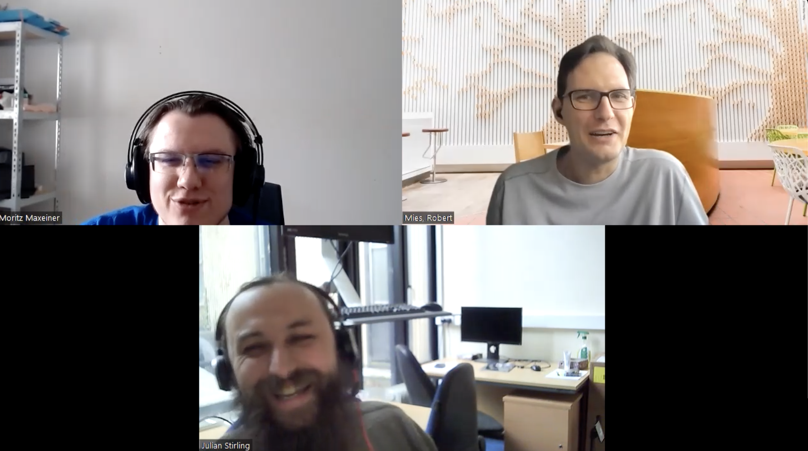

# Interview: OpenFlexure microsocpe

*by the Open make team and Julian Stirling. Copyright to the authors,
distributed under a CC-BY 4.0 licence.*

**Sections:**

-   [The project](#the-project)
-   [The Hardware](#the-hardware)
-   [The Research outputs](#research-outputs)
-   [The participants](#participants)

> Interviewee: Julian Stirling
>
> Interviewers: Robert Mies (TU Berlin) & Moritz Maxeiner (FU Berlin)
>
> Transcription and editing: Diana Paola Americano Guerrero, Robert
> Mies, Moritz Maxeiner & Julien Colomb

*Screenshot of the interview.*

# the OpenFlexure microscope

The OpenFlexure project makes high precision mechanical positioning
available to anyone with a 3D printer - for use in microscopes,
micromanipulators, and more.

Its core development has been mainly organised by Julian Stirling in
the UK, in cooperation with a group in Tanzania.



*image of a built microscope*

Project start: 2016 Core development team size: 3-5

### Hardware products

The OpenFlexure Microscope is a customisable, open-source optical
microscope, using either very cheap webcam optics or lab quality, RMS
threaded microscope objectives. It uses an inverted geometry and has a
high quality mechanical stage which can be motorised using low cost
geared stepper motors.

### Hardware maturity

I'd say, sort of 80 to 90 percent of the way to product ready. In terms
of performance, its product ready. We're doing clinical evaluations to check it’s good enough to diagnose malaria.

### Rebuilds

So far, it's been used and built on every continent, including
Antarctica in at least 40 countries. 250 people participated in the
forum, but it is difficult to know how may built the microscope. We
assume there are thousands of microscopes out there, but we don't know
for sure.

Lab Maker, a company in Germany, has just started selling the parts kit, not the printed parts, just the fasteners.



## The project


We're very interested in medical microscopy, where to diagnose malaria, you need to look at 100 fields of view with a x100 objective and count the parasites. So it needs to be automated and reproducible.

Rather than looking at how professional metal motorized microscope are made, and building a cheap imitation, the whole thing was designed for being 3d printed from the ground up.

We are now moving on to the stage of improving the software and making it more robust as we get towards production.

The aim has always been around local manufacturing and to be maintainable : it’s not just about building it in Tanzania, it’s about being able to make the parts and service on site.


> How did it all start with the OpenFlexure Microscope project?


I joined the OpenFlexure microscope project: it’s building a microscope that’s 3d printed, the optics are not 3d printed, but the rest of the mechanics are.
Indeed microscope optics haven’t changed that much, for a very long time. They’re quite standard, the components are very easily available and quite standardized. Whereas the mechanics are very difficult, you’ve got to position the sample, you’ve got to position the objective relative to the sample to sub-micron accuracy. Or at least, in one direction, and you then need to move the sample around very precisely.
There are different ways to build a stage that is that accurate, but a lot of them involve very expensive machining processes to make very sort of flat ways for dovetails. What we’ve done, or what Richard had done even before I started, was to create a flexure stage, which is a monolithic part that you print in one go. It does the X, Y and Z translations, by bending of plastic.
Then you’re not limited by the fact that the 3d printer produces sort of very rough surfaces. So rather than looking at how professional metal ones are made, and building a cheap imitation, the whole thing is designed to 3d print from the ground up.
There are a lot of projects, which do open microscopy. But a lot of them might fall into the category of “cool tools”: you can stick a thing to your phone or move around this little thingy. These tools can produce really great image, but what the users don’t show you, is the time spent poking it, swearing, getting angry, shifting it around, before they eventually got an image that was worth sharing. And we’re very interested in medical microscopy, where to diagnose malaria, you need to look at 100 fields of view with a x100 objective and count the parasites. You don’t want to be sitting there fighting for every single image. It needs to be really reproducible, so you need a motorized microscope. And we’re now moving on to the stage of improving the software and making it more robust as we get towards production.

The OpenFlexure is a digital microscope. So the computer is obviously not 3D printed, the camera is not 3D printed, the motor drivers are not, the screws are not, but the main custom components are. You take the camera, the objective, some standard motors and then all of the custom mechanical parts are 3D printed. The only exception to that is a couple of electronics parts that are custom.




The project started as a hobby project for Richard. We got a research project which is how I became employed about two years later. Also on that research project, there was some sort of wider team around some other low cost instruments, but the main OpenFlexure team was me and Richard and a group in Tanzania.



> So could you describe a little bit the overall process to us?


It started probably about five or six years ago. The project started as a hobby project for Richard on a Friday that somebody showed him a 3D printed microscope and he wanted to show that he can 3D print more of a microscope. Then he got interested after talking to some people about water testing, and whether it would be useful if you could actually make a microscope in countries where access to microscopy is hard. We got a research project which is how I became employed just over four years ago. 
Also on that research project, there was some sort of wider team around some other low cost instruments, but the main OpenFlexure team was me and Richard and a group in Tanzania. We've been very much interested in building it locally in Tanzania and it's not just about building it,  it's about being able to make the parts and service themselves. Because one of the biggest problems, if you look at medical devices in Africa, is that about 70% of them are non-functioning because people can't get spare parts and company certified technicians to fix them. So the aim has always been around local manufacturing and to be maintainable. There were three people from Tanzania working on the project which finished a couple of years ago. We are still in contact with them and they're still working on the microscope, it's maybe not their main focus because they don't have so much funding. For example, I talked to Paul this morning, we're still very much in contact. We also have two PhD students in the group in Bath, though only one is focused on the microscope. We've had other postdocs in the past and we had a technician. But as always with academic projects it sort of grows and shrinks based on based on grants, but they're still very active.  Richard used to be in Cambridge when he started it.  We've got different versions of the microscope, one which we call the Delta stage which is largely developed by Sam in Cambridge who's a postdoc and the malaria research grant where we're looking at how we use the microscope. We're doing a lot of that with the Ifakara Health Institute in Tanzania. Besides there are some other people in Cambridge on the project that pays Sam. It's always hard to work out who is in the core team and who is peripherally involved. We've got some other collaborators in Peru who are using it and feeding back information. Daniel Rosen is a pathologist in America who is very interested in the microscope. While they've never been on a grant that's funded by us, they're definitely some of our core community that feed back into the project. It's very hard to estimate how big the project is; where is the cutoff is between a community member and the core project team?


 
We’ve kept funding going or I wouldn’t be here.

There have been a series of different grants which are maybe not such big grants. Our first couple of big grants were from something called the Global Challenges Research Fund.

It’s generally been government funding. We’ve looked at a few smaller charitable grants, but it’s very hard to make charitable grants work inside the university because at universities it costs a lot to employ someone as there are so many extra costs.


> Did you keep the project going through lots of smaller grants? You
> said it was done three years ago? Is the project finished, then?


I joined just over four years ago, we probably finished that specific project about two years ago. But then we had the malaria project, which was using the microscope for malaria diagnosis, which finished later than that. And there have been a series of different grants, which may not such big grants, but for instance, one was from the university to try and translate research into impact. The size of the team varies, but we've always had enough funding, therefore at least I haven't become unemployed yet.

We've kept the project going through lots of smaller grants and other peripheral funding. I mean, my main focus is the microscope. But, for instance, a lot of my time is spent is developing a program for writing our documentation. Since we had lots of different versions of the microscope, the microscope setup differs in variations or configurations, you have the low cost one, the high cost one, you can modify it for fluorescence or to be an upright microscope. We trying to keep all of those different types of documentation in line and consistent. You end up having either one giant document which reads like a computer program: "If you're doing this, then this, else do this." It becomes impossible for anyone to follow. Or you end up with lots of independent documents which are each differently out of date. Therefore we've ended up writing our own program for managing the different configurations. A lot of my time has been writing tools for better documentation; the tool is designed for this project, but we hope to be more generally useful for other people as well.




My main focus is the microscope. But, for instance, a lot of my time is spent is developing a program for writing our documentation. We had a malaria project, which was using (and modifying) the microscope.



> Are those like government grants, or are they like from independent
> entities like GOSH or where do these grants generally come from?


Our first couple of big grants were from something called the Global Challenges Research Fund (GCRF) which is a UK Government Fund, it was part of the UK's aid budget. It was sort of both the aid budget and the science budget. It was trying to get scientists and engineers in academia, to focus on global challenges that would be aid funding eligible. If you take a charitable view of it, it was a very good way to get new people looking at development projects. You could also take the less charitable view that it was a way to double count the same money in two government budgets. It would have been less rude if they didn't double count the money, but I think it was a good scheme.  That's where a lot of our money came from. Even some of the fund went to universities, who were free to decide how they carry on the impact from these GCRF projects. We got some of these smaller pots of money, where we were only competing inside the university, but if you trace the money back it was  still funded by the the government. I can never quite remember what project I'm employed on, we have so many small grants. But generally, the impact grants are smaller ones, anyone that got funding from UKRI (the government agency that gave us the GCRF money) can apply for this impact grant. So, yes, our funding has generally been government funding, we've looked at a few smaller charitable grants, but it's very hard to make charitable grants work inside the university. At universities it costs a lot to employ someone, they charge all sorts of extra costs. If start telling a charity: "Hey, here's what we want to do.", and then when you calculate cost of doing it is always too high by the time you're paying somebody to do it in a university. That is the reason we never seem a good value for money. Maybe if we find the right charity scheme it may be different. I suppose that was a long way of saying: we are mostly government funded.



 
I think one of the big problems is that we just don't have the adequate hardware design tooling.
For instance, we’ve always done our CAD in OpenSCAD.
It does mean that we get some members of the community which can’t contribute because OpenSCAD is hard to learn.

Then, as I mentioned, there's a lot of problems with how we do documentation. I think documentation is just hard. But, there are some tools to help manage that: being able to openly share a design, have people track how it changes over time, have people contribute.


> What major issues overall have you come across then? And how did you
> resolve them?


I think one of the big problems is that we just don't have the tooling. Thus we've always done our CAD in OpenSCAD. Partly because physicists tend to program and think in mathematical functions. I'm trained in CAD. I used CAD before I got here and found it a bit of an adjustment to use OpenSCAD. But then, being a physicist, I was generally fine with it. It does mean that we get some members of the community which can't contribute because OpenSCAD is hard to learn. It does also mean that people become angry at us that we won't share certain types of files that OpenSCAD won't do. We spend time trying to explain that we're not being secret and hiding the STEP file, it just doesn't exist. OpenSCAD is a "fun" discussion with some members of the community. But the benefit of having used OpenSCAD is that things like GitHub and GitLab that track how your code changes over time, work very well for us. For a really complex project with lots of parts that can have different people working on them simultaneously, you can actually manage your merge requests and conflict management granularly inside Git. This is very hard to do for a graphical CAD unless you've got your proper PLM (Product Lifecycle Management) type program for doing all of the version management. And, you know, having sat in an office with people using SolidWorks vault shouting at each other, because they've locked a file the other one wants to use. You can avoid all of that with openSCAD and Git. But it does mean that the project, if you come to it, as an engineer, without a lot of background in software engineering, it can be quite confusing. We're basically using software engineering processes to manage the hardware design. Then, as I mentioned, there's a lot of problems with how we do documentation. I think documentation is just hard. But finding tools to help manage the design is hard. We need a whole ecosystem for being able to openly share a design, have people track how it changes over time, have people contribute. And of course, people are always upset if you don't want use their favorite CAD tool. So it really is tooling that holds us back each time we move the project through to the next stage. If you progress to having a bigger community, you have to worry more about how you manage that. You move through to having more software and different releases, you have to manage that. More people using it, you need to manage the software releases even better. And then as you get towards people wanting to use a project for production, there's a whole of different levels of complication and tooling that you realize you don't have. I think we're on the bleeding edge of trying to turn something like this into production while keeping it open. It would be very easy to ignore making the process open as you move from publication to production. But, well, that's the end of the open hardware. Trying to keep the entire process open as you move into production, it means that you start inventing and new processes and writing new tools.


## The Hardware

 
The microscope is mechanical and electrical, in terms of it’s a motorized microscope, it’s digital.
The mechanical parts of it, there’s quite a few. But most of the mechanics is in one single part, the main body. Then there’s peripherals like, we’ve got some gears and somewhere to mount the illumination and somewhere to mount the objective and a little base.

For software we run a client server architecture where on the microscope is a server that deals with all of the interaction with all the different pieces of hardware. That has an API.

We’re hoping, as we move towards microscope version seven, there will be something that can be sold as a product by Lab Maker and definitely others.


>What products have you developed now, in terms of like, different
components? Mechanical, electrical, and software? Could you briefly
outline that?


The microscope is mechanical and electrical, in terms of it's a
motorized microscope, it's digital. We've got a lot of electronic off
the shelf components, it's a lot of the bill of materials cost, but
there's only a couple of them. It's a Raspberry Pi, Raspberry Pi camera,
the motor board is custom because it's unipolar motors. It's very hard
to find a motor board for driving unipolar motors. But they're very
cheap and easily available; they are the the tiny little round ones that tend to be used in things like air conditioning units to move the fans.
We've got a custom motor driver there, we are trying to get the latest
version of this out. We've had some issues getting it released as I don't do electronics (or at least not the advanced surface mount stuff). The board was designed by Valerian in Tanzania. We've also got a small illumination circuit board. It turns out that one of the biggest, costs of building a microscope is free hand soldering wires and the LED together as it's actually quite a time consuming process. And of course, time is money in production. Making a custom little board, which is basically a
constant current driver and a resistor, will save you a lot of money in
the long run. As forth the mechanical components, there are quite a few. But most
of the mechanism is in one single part: the main body. Then there are
peripherals, we've got some gears, somewhere to mount the illumination, somewhere to mount the objective and, a little base.

Then there is the software. A huge amount of effort went into the
software. Most of this was done by Joel, a previous postdoc. We
run a client server architecture. On the microscope there is a server
that deals with all of the interaction with all the different pieces of
hardware. That server has an API. There's a client interface, which can
communicate with the microscope. You can either run it the same computer that is in the microscope (a little embedded Raspberry Pi) or you can run it
externally over a network. The nice thing about having the server client
interface is, scientists can use it and automate it from MATLAB or
Python. We've also got MATLAB and Python clients that can talk to the
API. The software, I think, is very mature for an open hardware project,
especially a science open hardware project. And I think even if
you consider a lot of very expensive scientific instruments, the
user interface of the Software is often an afterthought. Even for
professional instruments the UI is often terrible. Ours is at least reasonably good. There's a lot of things we need to fix, but it's actually quite reasonable.


> And has this system been built or produced by others independently?


It's very hard to know how many people have built it. You only know the people
who've reported back and told you they've built it. So we did a little
sort of survey asking on Twitter and on our forum. Have you built it? And where
have you built it or used it? So far, it's been used on every continent,
including Antarctica. We've got a photo of somebody using it on the ice
in Antarctica. It's been built in about 40 countries. We also have a user forum with over
250 people. We don't know if every single one of them has built or used
the microscope, some people will have joined to ask questions about the project. But the community we know about may tip of the iceberg, we assume there are thousands of microscopes out there,
but we don't know quite how many. We've see it pop up all over the internet. On Hackaday somebody (that we did not know) had built one and then
modified it into a laser scanning confocal microscope. So we do know that a
lot of people can build them, are building them, using them, and
modifying them.


> You see all these mods and apps. This is great. This is without any
supply of kits, is this completely independent?


Most of its independent. We set up a small company in the UK which is
selling 3D printed part kits and also kits of nuts and bolts, and the illumination. Fasteners and the plastic illumination lenses as very cheap if you buy in bulk. So the kit we sell is just the number of screws you need, the LED and the lens. It's much more efficient for us to buys a bag of a thousand and divided them up. But I don't know exactly how many we've sold. But I'd guess we've sold some something in the number of 10s of kits. Maybe 50 of the fasteners, probably more like 10-20 of the printed parts kits.

So yes, some kits have been sold, but the vast majority are people building their
own. Lab Maker, a company in Germany, has just started selling the fasteners and illumination kit, but not the printed parts. Interestingly, their
cost is considerably higher than ours because I've not been paying
myself for my time. And we've been trespassing on my own workshop space
and other things. We're only just breaking even on what we sell them
for, which is not sustainable. But we just wanted more people to be able to build a microscope. The price for the fasteners kit is a little unsustainable. I think it just comes down to volume, we don't have a high enough volume.
I think it will become better if you get to a higher price thing like a
fully assembled microscope. But there's also things we can learn in
terms of moving on to full production, because we haven't fully got our process working. When you don't have to spend 10 minutes soldering up each LED before you send out the kit, that's going to make it a lot cheaper. Especially if you're paying graduates in Germany (as Labmaker are) 10 minutes wasted 
price up.


>Are you in contact with Labmaker? Are you assisting them in some
capacity?


Yes. We shared with them our bill of materials for the kit, and
we've sent a few other emails. I think they wouldn't be interested in the kit
if we weren't building up for them to sell full microscopes, it's at too low a price point for them. It's a price that seems too high for a kit
yet also too low for their business model. The kit is really entirely the
wrong thing to sell, unless you consider from that we're building a relationship. The plan is that they start with this and learn a bit about the microscope with the plan of actually building assembled version seven microscopes when we
release it. The current release is version six, but we have an alpha
release of version seven. We are about to release a beta version seven which
is about as stable as six ever was. When we release version seven, we want it to be product-ready. Whereas all the other ones were version numbered them for convenience but they were really prototypes with wires sticking out everywhere.

We're hoping, as we move towards version seven, there will be something that can
reasonably be sold as a product by Lab Maker and also by others. We
know a few people in different countries that want to sell them once as
it gets more product-like.


>What is the state of the art in terms of maturity, technology-readiness?
Is it a demonstrator already, or market ready products? And since Lab
Maker is selling it, where would you situate it, roughly?


I'd say, sort of 80 to 90 percent of the way to product ready. In terms
of performance, its product ready. We're doing clinical evaluations to check it’s good enough to diagnose malaria.

The version seven looks completely different in terms of everything is
enclosed, the wires aren't everywhere.


>That's a demonstrator for sure.


It's a demonstrator, for version seven we were very much in the situation of: "Don't poke it there, the illumination might fall off." There were lots of
wires on the outside. Version seven looks completely different in
terms of everything is enclosed, the wires aren't everywhere. We haven't
finished, the illumination wire isn't enclosed, but the rest of them are
enclosed. The illumination no longer falls off, we've got merge requests
in the pipeline to stop the gears falling off. We are really in a
feature freeze, foucsing now on robustness. We've been a long time though because a lot of that work was tidying up the underlying code base to make it
easier to maintain and easier to do future upgrades. This has been a long release in the making! But hopefully, within six months or a year, we should have something which is product-ready. Maybe not the best and most robust
product, but it will be our first.

As a scientist that designed things for just me in the lab, it never really mattered if there were hundreds of wires sticking out, just don't trip over them. It's a learning curve for us moving towards production. But we're quite a long way
through now, we have something that's robust enough that it  could be a product
for lab use. We're now starting to think through all of the quality control for
medical use, so our partners in Tanzania can sell it for medical
use eventually. Version seven we are thinking of as the version that can
be sold for normal lab use, but not medical use. But all designed so the is a path to improve it for medical use.


 
We're very keen for BTech in Tanzania not to be reliant on
us. We need to make sure to provide a good enough dossier of
how everything works, so that whoever is going to be the legal
manufacturer can write a good technical file and convince regulator
that they understand it and can maintain it for the future.

We are looking for a good way to transfer control in a sustainable way, such that
they can eventually maintain it when our funding runs out and we disappear.



>That means you are next going for certification in the some midterm
future?


We're never going to plan to be ISO 1345 certified in the university.

You have to worry about if you're setting up a new type of colonialism
where at any day we can pull the plug and say: "It's still ours
because it's our certification."

A lot of what we've been doing is thinking about how we can improve our
processes. We've got an auditable record of all of the design decisions.
We're never going to plan to be ISO 1345 certified in the university.
We are working on the best way to transfer the IP. It's
not IP in terms of protecting the design, but we still need transfer the knowledge out of the
university. We're very keen for BTech in Tanzania not to be reliant on
us. One thing you could do is you could try and raise a load of
money here, set up a company that subcontracts BTech in Tanzania to build
the microscope. Then at least it's built locally, at least there are
service engineers locally. But you have to worry about if you're setting up a
new type of colonialism where at any day we can pull the plug and
say: "It's still ours because it's our certification." We're much more
interested in capacity building, for them to be able to go through and be
the actual legal manufacturers. The bad side of that from their
perspective is, if you're the legal manufacturer, you're the one with
the liability.

We are also starting to investigate whether or not there should
be a medical device foundation. Perhaps that helps to hold some of the
liability. At least for the design side of it, where you could basically
be a design house that was ISO 1345 accredited and then transfer the design to manufacturers. Because you need to make sure you provide a good enough dossier of
how everything works, that whoever is going to be the legal
manufacturer, can write a good technical file and convince regulator
that they understand it and can maintain it for the future. We've done a
lot of thinking about that, we're not fully through deciding how we're
doing it. But our partners in Tanzania are now registered as medical
device producers in Tanzania. They've started doing their training. In
Tanzania you have to register and have your
premises inspected before you can go to the training for what you're meant
to do to have your premises set up. It is a very interesting
situation. But they have now got through that now.

Once they get to production it will be the first
in vitro diagnostic device to be built locally in Tanzania. There's a
lot of learning both from the regulators and from the company side.
We're less interested in doing this quickly, while people having access to microscopes for diagnosis is important, I think doing it slowly, doing it well and documenting how we get there is actually probably more useful in the long run. We are trying to create a tried and tested way to design something at a university in the Global North, with partners in the Global South; This is much more productive than universities designing things "for Africa". This attitude makes me angry, how can you design for a place you have no experience of?

Once we have done the design together we need have a good way to transfer control in a sustainable way, such that
they can eventually maintain it when our funding runs out and we
disappear. Let's hope that we get there before our funding runs out and
we disappear.


## Research outputs

 
For impact, the way the university sees the transfer of knowledge into a company as impact, and they’re sort of pump priming for long term impact.

We’ve got papers on the microscope, papers on the Delta stage version of the microscope, papers on the block stage version of the similar design that’s x, y, z translator for aligning optical fibers. We’ve started publishing on individual parts of it, such as the robustness of the autofocus algorithm, publishing on the software, on how we do the camera calibration.



>Let's go on the actual research output. Obviously, this was as part of
several grants and it's a research project or multiple projects. What
was the output of this hardware development so far, directly or
indirectly, academically and practically?


For impact, the way the university sees all of the things I'm telling
you about trying to transfer the knowledge into a company as impact and
they're sort of pump priming for long term impact.

We've done quite a bit, we've got papers on the microscope, papers on
the Delta stage version of the microscope, papers on the block stage
version of the similar design that's x, y, z translator for aligning
optical fibers. We've started publishing on individual parts of it, such
as the robustness of the autofocus algorithm, publishing on the
software, on how we do the camera calibration.

Because we do everything in Git, I don't really have anything of the
microscope that isn't shared.

There is no bill of materials directly in the repository, because the
bill of materials is explained in the documentation. But the
documentation has metadata in it. That metadata is read by a program
that generates the full documentation.

For impact, the way the university sees all of the things I'm telling
you about trying to transfer the knowledge into a company as impact and
they're sort of pump priming for long term impact. If people start
selling it as a physical device, then that is impact because people have
access to it. I mean, the real world impact, I think we've talked about
it, it's sort of used in many countries, hundreds, if not thousands of
them exist, people are looking towards manufacturing it.

It's been very
interesting, trying to get a good level of academic impact out of the
project. Especially from my perspective, I need papers to stand a chance of getting a permanent position. A lot of what I do is probably not the best
thing for getting me a permanent position because if I just moved onto
the next thing rather than documenting it fully so that anyone can
reproduce it. Nothing has taken as much of my time as
documentation. That's generally not the best path to getting lots of
papers. That said, we've done quite a bit, we've got papers on the
microscope, papers on the Delta stage version of the microscope, papers
on the block stage version of the similar design that's x, y, z
translator for aligning optical fibers. We've started publishing on
individual parts of it, such as the robustness of the autofocus
algorithm, publishing on the software, on how we do the camera
calibration. It's starting to explore where I'm hoping to get ten papers
out in 2022, we've already had three out and two accepted. We're getting
more and more what I call sort of meta papers. We had one, where we took
all of our thinking about how we've carefully considered medical devices
being open, and how you track all of that knowledge. Compare that to
what we saw at the start of the pandemic, when loads of people went "I
want to be open, because that's nice. I want to design a
ventilator" They went down the route of designing something that will pump
air. Pumping air is easy, I could connect a relay to my vacuum cleaner and produce something that pumps air periodically, but it's not a medically
certifiable as a ventilator. We're less facetious in the actual
paper. It a paper that's interesting and different.

It is good that we are now actually to the point where we're getting a reasonable
number of academic papers out. At the start of the project, there were two years after just after I arrived where we didn't get anything out. There had already been the original paper on the microscope, and it's very
hard to write a paper on a small update. Eventually if you've got a big
update you can write a new paper. But now we're at the point where there are very few projects of
our size with our community and our processes have got better. We're
writing a paper on how we do our documentation program and we have other papers in the pipeline. But it's taken a long time to build up the sort of
ecosystem that's worth publishing about regularly. I'm not sure if we're
hitting a crescendo where we're suddenly going to publish a load of
papers and then be back to square one, or if this is a ramp up
that's going to continue. It remains to be seen.


 
Because we do everything in (public) git repositories, I don’t really have anything of the microscope that isn’t shared.

A lot of what I do is probably not the best thing for getting me lots of papers and a permanent position. I would get more papers if I would just moved onto the next thing rather than documenting the current thing (so everyone can reproduce it perfectly). And it is very hard to write a paper on a small update.

We’re getting more and more what I call sort of meta papers. We had one, where we took all of our thinking about how we’ve carefully considered medical devices being open, and how you track all of that knowledge.



>What information have you shared mainly, on the documentation? Like,
Bill of Materials, you mentioned, CAD files, or in this case, notice
that files but other code, and so on?


Because we do everything in Git, I don't really have anything of the
microscope that isn't shared. Because the way we do our project
management, is in the Git issue tracker. If Richard or I want to change
something, we make a merge request. And we have a discussion in the open
about it. All of that project management is open. Then we've got lots of repositories for the software, for the hardware, etc. While
it would be annoying to loose my computer (I'd have to install all the programs), we are so open I don't have anything on my computer
regarding the microscope that I can't just get from Git in public
repositories; I wouldn't loose anything important. In some ways, if people look in our repository, they might tell us we don't have a bunch of things. They assume thing certain things would be in the repository, but they are actually automatically generated by CI pipelines. For example there is no bill of
materials directly in the repository because the bill of materials is
explained in the documentation. This documentation has metadata in
it, that metadata is read by a program that generates the full
documentation. Because there are different stages of the assembly, these instructions are used in multiple different versions of the project. Our software combines them all together to make independent documentation (and bills of materials) for each variation of the design.

There's a CI script  which spins up a Docker container every time we change the design. That creates each of the STLs somebody
would need to print the microscope, it then embeds them into the documentation. If somebody
goes to the documentation there's totally up to date renders which are
generated from the code. There's totally up to date STL files that are
generated from the code there's up to date documentation. The repository only contains our working files, everything that people actually need
to produce a microscope is in the documentation. Most people won't look at the repository, they'll look at the documentation that is generated from the repository automatically.


 
We do our project
management using the Gitlab issue tracker. If Richard or I want to change
something, we make a merge request. And we have a discussion in the open
about it. All of that project management is open.

Most people won’t look at the git repository, they’ll look at what is generated from the repository automatically.
We are indeed using automated pipeline (gitlab Continuous integration) for the production of the documentation website. 

We are a bunch of nerds who are basically programmers doing a hardware project.


>I can tell you, by having set up CI infrastructure in our lab, it's a
lot of work to get it right. This is this is something quite advanced in
terms of using Git. Have you seen other groups do this where you got
motivated?



No, I think it just escalated, It was Kaspar who came from more of a
software background who started it. He got annoyed with something and made a CI job that automated one small little thing. Then of course, you've got
a bunch of nerds that are basically programmers doing a hardware
project. You realize that a CI can automate anything that can be scripted.
Anytime things got a bit manual, we ended up adding more CI scripts.

Our paper on our workflow is both explaining our workflow as a case study, but saying we should look at what developers do in software. In software development you've got all of your
project management, all of your data management in readily accessible platforms. The platforms have all of
this automation to make sure everything is consistent and built directly
from that source. You can do this for hardware as an alternative to PLM.

The workflow not ready for anyone to use, because you end up writing all your scripts yourself. It
wouldn't integrate well with lots of proprietary CAD programs. But the
workflow is actually very powerful and very distributed. It's something
that I think if open hardware is going to seriously work without lots of
manual work, people are going to have to get on board with. Maybe the GitLab CI is not the best way of doing it, but something along those lines with all of that sort of automation is going to be necessary. The microscope workflow is a very customized way of playing with a first prototype of
that system.


>That's very interesting. Then you have basically this output
documentation which people can generate from there and they can use it
to to rebuild the hardware. Did I get that right?



Yeah, people don't have to build the documentation themselves, so nobody has to understand how the documentation system works. Anytime I update anything on the project, it checks that
everything builds properly automatically on the server. If I tag it
as a release, then the last stage of what it does is, it uploads it to
our website. This builds a page on our website
which is the documentation and has all of the assets. So nobody, well no
normal user, has to understand that we've done this. But it means that we
can consistently produce a website, which is the documentation with all
of the assets from the repository. Then a normal person can come along
and go to a website they understand, that's designed for them, rather
than having to interact with Git. They don't even have to interact with
GitLab at all, they've got all of the things that they need to build it on a simple website. But not necessarily enough to modify it. If they want to modify it, then they have
to come and start playing with the GitLab interface and Git. But they still
actually never have to get any of the programs installed because in
theory, they can just change the code, upload it and it will all pass
through that pipeline and generate new files an documentation. They can download the assets. We have some people
that contribute, who can't even run the code locally.


>And was it easy? Or what were the barriers to do this so far?



I suppose it's very hard to say how hard or easy something was that took
years. There were definitely some aspects of it that were surprisingly
easy to set up, some aspects of it that were surprisingly hard to set
up. Certain times you just put this one YAML file into
my repository that says run a bash script, and the bash script says,
run this program. Oh look, it works. Other time, you get frustrating issues such as the program uses OpenGL and OpenGL doesn't work in Docker, and you end up with complicated, is not necessarily something that seems like it should be
complicated. So anyways, our workflow has evolved over time as we've needed it. I
think if I said to myself, what you need to set up is what we have now,
it would have sounded impossible. And it would have been impossible in
many ways. But it's grown organically from: "Oh look, there are some
easy things you can automate, Oh, can we add this? Oh can we add this?"

But, is it possible for another project to replicate the process for
their own project? And not necessarily the microscope? Yes and No. Some of the jobs are very specific to us and use a lot of custom code.
Some of them aren't. I think if they were in OpenSCAD, then a
lot of the build script there are simpler. Our build scripts got
complicated because we do all of our renders and everything. We do know
other people who were using our documentation program. The program automatically creates the build
script to run in the server and build the documentation.

The problem
with our workflow at the moment is that it's ad hoc, and specific to our project.
But that's only because we wrote it ad hoc for project and writing
something with general purpose would be more work. But there's nothing
inherent that couldn't be generalized. Except  we don't have the
time to sit there and generalize it, especially when there's nobody that
is saying "please generalize this for us". If we got loads
of funding then we could. In fact we're putting actually in a big funding bid where we want
to try and generalize some of this. So if we get that, then I'll
probably move away from working directly on the hardware towards
generalizing this workflow.


 
Now we’re at the point where there are very few projects of our size with our community. The core team sort of grows and shrinks based on grants, but community members are still very active, so it is very hard to estimate how big the project is.

I think there’s a lot of people who now have microscopes that wouldn’t. There’s a lot of people who have things that they could customize.



## Participants

 

It's a reasonably big project, it's not huge, like
Linux kernel development, but it's big. In total there must be 50 to 100 people sent changes to at least one of the repositories.

About three or four people worked on it full time. More when we had more time of our partners in Tanzania who were sort of quite actively involved. It is going to be around 10, but maybe not all of them show up in the Git repository.

Our group is mostly researchers and we have other researchers at other universities that use it and will comment. But then we’ve had people who are doctors, medical doctors who’ve got interested in it from a medical perspective and fed back a lot of information.



>The question arises, of course, how did you end up working on that
project? And how many people are working on that project?



I saw a job advert, I moved to Bath, and got paid to do this project. It's
different from a lot of open source projects in that way because we're
very lucky to have the funding that we've had. In terms of how many
people have contributed and how many people actively work on it. To
actively work on it, it needs to be probably full time? About three or
four work on it full time. More when we had more time of our partners in
Tanzania who were sort of quite actively involved. It is going to be
around 10, but maybe not all of them show up in the Git repository
because Git is complicated. They're more likely to send something to
someone that puts it up there. But I always tend to think about the
microscope repository. But of course we've got the electronics
repositories, we've got the software ones. There's like 15-20 Git
repositories on the OpenFlexure because there's some of the plugins for
the software, there's the server and the client. Then there's different versions of the Delta stage microscope, the block stage and the main microscope. What I did at
one point, I also thought of the side projects like the documentation
project GitBuilding. I wrote a script that pulls in each
of them and runs the program "Gource" on the combined repositories. It creates an animation of
little characters adding files to the repository, it gives a visual overview of how the project has grown. In total
there must be 50 to 100 people sent changes to at least one of the repositories. There're also changes that end up being a fix
for that old version, it's released somewhere in the project, but if you only looked down the master branches, they don't necessarily
show up in that history. But the number of contributors is even bigger when you consider the people that report issues to
us. These people are very actively a part of the project, even if they didn't
change things. Then you get out to the size of the community which is
about 250 participants on our forum specifically for the OpenFlexure microscope. So depending on your definition the team is  maybe hundreds of people, or you could argue it is around 10. It's a reasonably, it's not huge, like
Linux kernel development but it's big. It's big for a hardware project
because I think it's much harder to contribute to hardware.


>Absolutely, I wouldn't compare the two anyway. Can you say a little bit
about the occupations, at least from the people you know or see? Are
there doctoral researchers, postdocs, technicians, students, professors?



We have a really good mishmash of people. Our group is mostly
researchers and we have other researchers at other universities that use
it and will comment. But then we've had people who are doctors, medical
doctors, who've got interested in it from a medical perspective and fed
back a lot of information, even if not direct changes, more like
requests for changes: "Have you thought about doing this". This really
feeds back into the project, even if it's not a change directly to the
design. We've had a bunch of hobbyists just showing up and and saying "this is
interesting. I'd like to put a slightly different thing in it." Then a
bunch of people that pop up and say: "Can you do this?" We
don't send them a survey to find out who they are who they are, I don't know their background at all. We've had
people on the forum, say, you know, "I wanted a home microscope, it
seemed more fun to build my own than buy one. Here, look at this, I
found some cells, they're dividing."

The community is a broad church. I could not
pigeonhole the community which I think is a positive sign. Because if you
can make it understandable to people with a different background, then you are also getting all of the advantages from from each technical field.


>How did you find suitable project members with the competences to work
on the project?



I think the bulk of it is done by people who are employed on
the research projects. While there are community contributions, most of
the community contributions are people getting involved in discussions.
Some people become more collaborators long term.

For those designing it here, whether it's me or Joel (who wrote the software), we found the project by a
job advert. If you ask someone else it might be a different story, there's all sort of routes to finding collaborators where it would look very different. We'd not have the same project
without our collaborators in Tanzania. That was when Richard was looking
at water testing. He knew a charity that did a lot of work in East
Africa. They put him in contact with STICLab (who are now called BTech), so that collaboration was found by word of mouth. A lot of collaborators are met them through different networks.


 
In terms of personal growth there will definitely be some, there’s lots of skills you pick up doing anything. In particular, working with a much broader set of people, in a large collaboration with humanitarian goals, has definitely broadened my horizons.

If I tell people who am I, I’m still basically a physicist and engineer. I’m quite unique that I have all of those technical skills which I had beforehand but then all of this experience working in different places. I think that’s what I’ve got out of the project. I think it’s very hard to get that level of different interactions from most academic projects if you’re not open.


>How have you and all these people who have contributed the project
members benefited from their work in the project? Can you say something
about that?


I think it's very interesting as a postdoc, in terms of how you've
benefited. If you haven't got a permanent position, you haven't got the
one benefit that you want out of a postdoc. In terms of personal growth
there will definitely be some, there's lots of skills you pick up doing
anything. I don't think there's necessarily a huge numbers of technical
skills that I wouldn't have picked up in a different postdoc designing
different things. I have a much more rounded view of the world. I've
done a lot of travelling, spent a lot of time looking, not just how I
build something that works well, but how we think about production. What
happens with supply chains as you try and move them, as you try and move
things into Tanzania? Why can't we just get that? Oh, there's no Amazon.
Oh, things get stuck in the post you need, you need to understand the
local supply chains. Then there's just huge power imbalances between
trying to run an academic project between a university that holds all of
the money and expects to pay people on really slow payment schedule to
improve their cash flow. When you're actually dealing with a small Tanzanian
company, the university really shouldn't be just paying things slowly to
improve their cash flow. We actually started working with social
scientist to help us look inwards on the project and understand whether
that was a fair collaboration, based on how the government wanted us to work. But they expect this without providing any training on setting up and running such an international project. I suppose as a physicist, it stopped me being an arrogant person that
ignores the social scientists. Definitely working with a much
broader set of people in a large collaboration with humanitarian goals
has definitely broadened my horizons. If I tell people who am I, I'm still
basically a physicist and an engineer. but, I'm quite unique that I have all of
those technical skills which I had beforehand but then all of this
experience working in different places. I think that's what I've got out
of the project. I think it's very hard to get that level of different
interactions from most academic projects, if you're not open. If you
wanted to have as many collaborators as we have, you would have only
time to fill in the NDAs by now.


>That's a nice analogy. And other people, how have they benefited?



I think there's a lot of people who now have microscopes that wouldn't.
There's a lot of people who have things that they could customize. Our
partners in Tanzania, even if they haven't produced the microscope as a
medical device yet. They are well on the way to doing so. They are registered as
a medical device company, they've started their training, they're moving
through those processes. They've now got good connections to the health
institute that was part of the project. I think we've been a focus point
for a lot of different networking. I think everybody will get something
slightly different out of it. We've got a good community, I think.


> At the end we have a closing question that's just within the scope of
the question before. Did you have any students who did their bachelor or master or
something similar thesis within the scope of this project?



Yes, in the wider project which includes different versions of the
main microscope for the wider OpenFlexure project. We've had a few
people work on there have been a couple of master's students that did
their project on the OpenFlexure block stage. We made an OpenFlexure
interferometer which we had a couple of students on, master students,
we've had some doing phase contrast with the microscope. One student did a summer project where she created the
upright version of the microscope. Normally the microscope is an inverted microscope, she had to work to invert the inverted microscope. Then Ed's PhD was partly on analysing the block stage, but he's moved onto other things. He's not so
OpenFlexure focused but he's open hardware focused still. Joe is a PhD
student who's very much focused on the OpenFlexure microscope. So yeah, one and a half PhDs and maybe six masters projects have contributed to the OpenFlexure project so far.
