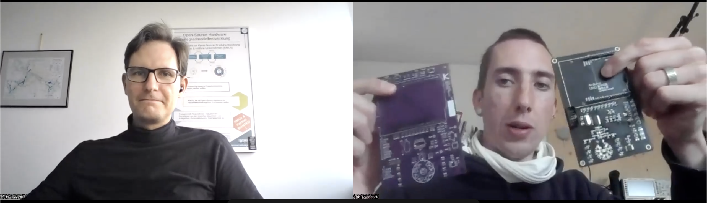
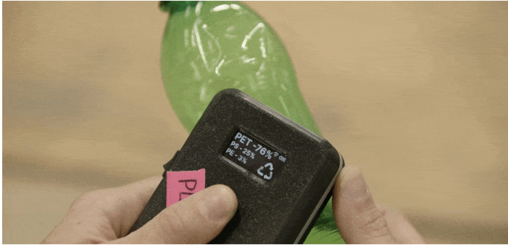

# Interview: Plastic scanner

*by the Open make team, and Jerry de Vos. Copyright to the authors, distributed under a CC-BY 4.0 licence.*

**Sections:**

-   [The project](#the-project)
-   [The hardware](#the-hardware)
-   [The research outputs](#research-outputs)
-   [The participants](#participants)

*Banner image:*

> Date: 05/2022
>
> Interviewee: Jerry de Vos (TU Delft)
>
> Interviewers: Robert Mies (TU Berlin) & Moritz Maxeiner (FU Berlin)
>
> Transcription and editing: Diana Paola Americano Guerrero, Fabio Reh, Robert Mies, Moritz Maxeiner & Julien Colomb

*Screenshot of the interview.*

The plastic scanner will be a device that can identify the most common types of plastic, in order to make plastic recycling simpler, more accessible, and more viable!
All in an open source way.

Jerry de Vos developed the first prototype during his master thesis, and its development continues in collaboration with the TU Delft.



*Photos of the plastic scanner, screenshot of video from Jerry de Vos.*

-   Main website: <https://plasticscanner.com>
-   Project start: 2020
-   Core development team size: 2

### Hardware products

The plastic scanner is an infrared spectrometer.
If you do a scan of a plastic object, it gives you a graph, which will change depending on the type of plastic.
By comparing this spectrum to known values, you can hopefully tell what type of plastic it is.

At the moment, it's a printed circuit board, an Arduino Uno that is connected to the computer and a sensor area.
We have schematics of all the different components and how they're connected together.
Further, we have firmware and software.

### Hardware maturity

Prototype stage.
There is always the uncertainty of if and how well it will work.
We're at a point where we will not change much on the PCB itself anymore.
We are still designing the housing (currently using a spacer, or divider between the sensor and LEDs).
If we change it, properties could change.
There's a lot of dependencies on hardware, firmware settings, PCB and software, which are all dependent on each other.

### Rebuilds

I think at that point, people will hopefully hack it, or adjust it to their needs.
There's one guy in Shanghai who wants to replicate it and we agreed that we would cover all of the material costs and support him as much as we can.



## The project

 
The initial seed for starting the plastic scanner project was me helping out at precious plastic, another open hardware project. I saw the challenges in sorting different types of plastic. I proposed the project to my professor and he said, "That sounds good to research this and to make the graduation project around this."

First, I did research on what are the different sorting methods and how are these used around the world in small or large scale, talking to people from the precious plastic community and some other independent recyclers. All of them  have  one form of infrared spectroscopy, I wanted to see if it would be possible to make a DIY version or a simpler version that people either make themselves or have it made at a FabLab or makerspace.


> Do you think the plastic scanner would be an interesting project we could focus on?
> It would be good to focus on one project you've been involved in closely.


We can talk about different projects. The fume sensor project is a relatively simple project to talk about. It has  benefits as it's both hardware and electronic software and  we have a collaborative interaction within the Delft open hardware group. But it wasn't a lot of people sitting down together regularly trying to optimize this. It was mostly a project from my side. Since I do a lot of 3D printing and soldering, I have a use for it. With that in mind, maybe it's not the most interesting project, because there wasn't a lot of collaboration. With the plastic scanner, we now got to a point where there is more collaboration and more people are involved. But it's still a lot from our side. 


> We would focus on the plastics scanner if you're flexible because it's very spontaneous.


That's fine, let me  get one prototype because it always helps me to talk about it.
These are the more form factor prototypes and the development boards to make it easy to analyze stuff and to have people replicate it in a simpler way. Feel free to shoot questions and  ask as much as you want. It's fully open source.  I don't think any question is inappropriate.



> Let's start with the project area and afterwards we broach the issue of product hardware output and participants.
> How was the project initiated?


The initial seed for starting the plastic scanner project  was me helping out at precious plastic, another open hardware project. I first saw the challenges in sorting different types of plastic. If you have a random plastic product, sometimes at the bottom there is a triangle that tells you what type of plastic it is. If there is no triangle at the bottom, you can only guess or assume what type of plastic it is. There are other methods of identifying the type of plastic, you have different properties of a material. Some plastics float, some sink. There's the option  to burn pieces of plastic and  based on the smell, the smoke or the color of the flame determine the type of plastic. There  wasn't something simple, not harmful and easy to use to help you sort plastic simple. This was something I found, on one hand, interesting was that there wasn't a way and on the other hand, I felt tempted to look into this and give it a try.

The initial start of the idea was at precious plastic in 2017. Then I started my Master's at TU Delft, I had a lot of different other projects and it was the time for my graduation project. I wanted to see like, "Maybe I can pick up this project again and see if I can combine the skills from what I learned during my Master's with the problems that are still facing with plastic recycling". I proposed this to my professor and he said, "That  sounds good to research this and to make  the graduation project around this." That's how I got started. My initial goal was to make plastic sorting simpler. First, I did research on what are the different sorting methods and how are these used around the world in small or large scale. I started talking to people from the precious plastic community and some other independent recyclers to see what their needs were, what they were missing or lacking, how it looked and what the context of their country was. 

The conclusions from the research was that there is a lot of hand sorting being done around the world. They either have a specific product that they collect, they know, for example, each Coca Cola bottle is made from PET plastic, therefore they keep these ones together. Or they take an assumption which is a bit more rough sorting. It's  good enough for them. They said that it will be nice to make that either simpler or  more precise. Something which can determine the type of plastic would  make the plastic itself more valuable because it would  get  a mark that it's identified or it's from a certain quality. 

I started looking into, for example, plastic sorting or waste management in the Netherlands. In the whole of Europe are factories where they have multiple sorting methods  in a row. But almost all of them  have  one form of infrared spectroscopy where they shine infrared light on a plastic product and  based on the reflection they  identify the type of plastic. This I found very interesting because  it was not very invasive to the plastic, you don't have to put it onto water or burn it. It can identify multiple types of plastic at the same time. It would tell you the type of plastic or the most likely type instead of sinking and floating which is more binary. There's a group of plastic that floats and a group of plastic that doesn't. After that you  need to do other density tests to make it more certain. 

Based on that, I wanted to see if I could apply this technology into more developing countries.  I started to contact these manufacturers of infrared spectroscope products to see if I could buy an essential module and make it possible to get it in developing countries. It turned out that these sensors and modules are quite expensive, often thousands of euros. Even though it might be possible with subsidies to get it in different places around the world, besides a lot of challenges or risks  you take with investing large amounts of money in such projects.  I wanted to see if it would  be possible to make  a DIY version or a simpler version that  people either make  themselves or have it made at a FabLab or makerspace. 


 
While looking into the working principle of this infrared spectroscopy, I found the reremeter project (https://github.com/arminstr/reremeter).  I started to contact the author to build upon that work.

I wanted a fully standalone device without the requirements of internet access. 

One development was keeping the plastic scanner fully open source, try to incorporate more feedback from the community and based on that build a product like the best possible open source plastic scanner. Another option would be seeing how this product could be in the hands of people that need it as quickly as possible. I chose the first path.

We chose GitHub because it's well known and relatively easy to use.
Since a few weeks we have a Discord server where people can join for questions if there's something that they don't understand.




That directed me towards electronics and finding out about the working principle of this infrared spectroscopy.
While doing so, I found the reremeter project.
This is a project by Armin Straller, a German guy who made a discrete infrared circuit boards with the aim to identify types of plastic.
This was for his electronics bachelor thesis and he put everything on GitHub.
I started to contact him to see what the status of the project was and if it would be possible for me to have my thesis be part of his project, to develop a version two of what he had or to take his input and build upon that.
He was super friendly and eager to help out.
Currently, he is doing a Master's somewhere in Germany and he didn't have time to maintain or improve the project.
That is what he was happy about, somebody would pick it up from there and work on new versions.

There were some limitations of the work he did and we addressed this to see if my future prototypes could improve this.
From there, I started prototyping and testing a lot of different things.
I made some changes, for example, moving to bigger components to be easily hand soldered.
It was important for me to ensure that people at FabLab and makerspace with a soldering iron could replicate this.
His products needed to be connected to a computer where it would run a Python script which gives an interpretation.
I wanted a fully standalone device without the requirements of internet access because one thing people I interviewed in the beginning highlighted was to have a device as simple as possible and with usability at various places like on the landfill itself.
Based on his PCB design, I made a new PCB that you could connect to a Raspberry Pi Zero.

This does all of the computing and drives a screen which gives output.
That was very close to the final presentation of my thesis.
At the end, I had one more visual model which has a Raspberry Pi inside, a battery charger screen and a PCB where infrared LEDs could be placed.
But the functionality wasn't good.
The maximum values that I would get from this were a lot different than from earlier prototypes on bigger PCBs.
I had one more technical prototype that would show the functionality.

That was for a bit the end of the project because although I wanted to keep developing the plastic scanner, I had just graduated, needed to figure out life and find sources of income.
I registered myself as a freelance designer for engineering design projects.
I wanted to make more of a longer term plan and set out some fishing lines.
Some possible leads that could turn into something.
One of them was intensifying the process of embedding.
They put a hardware group within the TU Delft.
Another thing was submitting the plastic scanner project in the current state to a few design contests.
One thing led to another and suddenly all of these things were realized.
In November, two days apart from each other, I was first being employed at TU Delft and won on the plastic scanner project the James Dyson Sustainability Award.
Quite a lot of things going on.
But what made it super nice is that the James Dyson award came with prize money that I wanted to use to develop the plastic scanner more.
That made it possible.
Now half of the week I'm working on the plastic scanner together with some other people and half of the week I'm working to incorporate the Delft open hardware group at the TU Delft.


 
I first work on this project inside my master thesis, then got the James Dyson award came with prize money (35k€) that I wanted to use to develop the plastic scanner.


> How much money was that?


This was 35,000 euros. It’s some good money and helpful to start. It's difficult to fully develop a product, commercialize it and do large scale stuff with it. It gets you started with something. I was surprised to see how friendly and relaxed the people from Dyson were. Basically, you get the money and you figure out what to do. They always invite you for events with the option to present or tell a bit about the project if you want to. There's no specific contract or commitment that this money should be used for the plastic scanner or that within a year you should be at a certain stage. It's up to you which is nice. At the beginning of this year I sat down and had to think what to do. In my mind have been two options. One was keeping the plastic scanner fully open source, try to incorporate more feedback from the community and based on that build a product like the best possible open source plastic scanner. Another option would be seeing how this product could be in the hands of people that need it as quickly as possible. That would most likely have a bit more of a commercial aspects and a bit more of a larger scale in terms of manufacturing and optimizing.

In the end, I chose to do the first one. I’ve worked this year fully open source and have tried to be as open as possible. That became the plan for 2022. After this year we might have a nice working prototype people can replicate and that works well. Afterwards I think it can be very interesting to make either a small series we can sell or maybe like a Kickstarter where people can just order it. Because I get some e-mails from companies or institutions that want to have a plastic scanner but don't want to go through the effort of reading the documentation and soldering it themselves.


 
I think it can be very interesting to make either a small series we can sell or maybe like a Kickstarter where people can just order it. If you buy 100 or 500 of LEDs, it's around a quarter of the price of single units. Further we think about something for calibrating.

I think at that point, people will hopefully hack it or adjust it to their needs which is something that we wouldn't be able to do if we make hundreds of them.



Companies and institutions just want to have a plastic scanner, something that is already calibrated. There's one other thing which makes it less attractive to make it open source. If people replicate it, they need to buy some very specific infrared LED’s that are pricey as single units. It’s round 20€ for an LED. If you buy 100 or 500 of them, it's around a quarter of the price. At the end of the year we might share a prototype and people can source all the components and solder it together. We expect it to have a material cost of around 300€. Besides it could be that we make next year 100 or 500 with a material cost of only 75 euros. Then we could assemble it, calibrate it and ship it. You would end up with maybe 300 euros as a price. This is still something that we're also finding out and finding a way. It's always sort of the case that single unit replication is more expensive. It’s for us now very helpful if people replicate it and see if the documentation is up to what they're looking for. We're very happy that there's interest and it's very useful for people to be able to replicate it. I think at that point, people will hopefully hack it or adjust it to their needs which is something that we wouldn't be able to do if we make hundreds of them.


## The hardware

> Have you major issues you came across during the project and how did you resolve them?


There is always the uncertainty if and how well it will work. We had some good experiments and tests with mainly different types of plastics in white color. A lot of infrared light would reflect. With different types of colors, we get less and less of a strong signal back. It's more difficult to process and we don't know to what extent we can optimize that. At this moment, there's a lot of uncertainty. That's due to a lot of things that are still changing. If we make a change in the hardware like the value of a capacitor or resistor, it changes the measurement value. The light intensity sensor measures in the middle. If that changes, we need to scan all of the plastic samples we have now again and build a model based on that. We're at a point to not change much on the PCB itself anymore. At the end of the month, we're going to build a nice, big example database for people to play around more to do the interpretation. But it can be a difference if we build housing instead of a spacer or divider between the sensor and LEDs depending on the size. If we change that, it would change again. There's a lot of dependencies on hardware, PCB and software which are all dependent on each other and firmware settings. 

> Could you classify these different modules in terms of mechanical, electrical and software you developed?


We have a documentation part on the website that briefly introduces what plastic scanner is and how it works. You can see our latest development board. This is meant for people who want to hack along with our project and want to already see if it can be useful in their situation. But it expects a lot of knowledge on prototyping and electronics. At the moment, it's a printed circuit board of 80x120 millimeters, an Arduino Uno that's connected to the computer and a sensor area. In that we have schematics of all of the different components and how they're connected together. There is a pin out that shows you which parts of the board is responsible for what. There is this bill of material you can download as a CSV where you see which components are aware and what traces it has. 

The PCB itself is a technical drawing that helps you if you want to make a divider between the sensor and the LED. At the moment most building instructions we made are about soldering the PCB. After you've sorted the power area, you can supply five volts to a specific location. It expects there's 2.5 and 3.3 fault line. This is to test if this part is working. In the end there’re four areas where you need to place different components and solder it in. The idea is to make this into a video once we're happy with the layout of the board. Further we have firmware and software. Firmware is the part that you upload to the Arduino itself and then this is just on it and waits for input over serial. The software  shows you a spectrum of the different wavelengths. It gives you the values  based on the information that it gets over serial. We have a revision history of where we came from, the different boards we made in the past, starting out with the Reremeter.

We want to keep all of these schematics and building instructions for older versions online that if somebody made this, it's possible for them to recreate or to find this information which leads us to the plastic scanner GitHub page. We have six repositories with the documentation, one is like a next version. If you go to „next docs“ you can see some minor changes  to things we’re improving. Once we're happy with how it looks here, we push it to the main documentation production. We have the hardware documentation files stored but we don't expect people to reach here nor to collect  information here. Everything on our website and the loaded file is the latest release from GitHub. We have different released hardware files to build development boards (e.g. 2.0 or 2.1). That is how we do the hardware. But if people want they can find other things. Lastly, we have firmware and spectral plots. Spectral plots is our piece of software that we wrote in Python, it’s a graphical user interface.  The firmware is what you put onto the Arduino. That shows what the plastic scanner is at the moment on the hardware side. If you do a scan, it gives you a graph which will change depending on the type of plastic. 

It’s important  to calibrate it with a piece of  a specific spectral line to make sure you have  an upper limit of what you expect as a response from the LEDs. Based on that you can take measurements. For now, there is no plastic scanner connected. It's using dummy data to make it easy to develop. The data can be exported as a CSV or you can copy and paste this into Google Docs or similar. Based on this  we collect a lot of data and ideally later it references the current scan to what it has scanned in the past and makes an assumption of the type of plastic. It could be shown either on the screen or on the device itself. 


> Since you have a great documentation, are you aware of anyone having successfully tried to replicated your project?


There's a guy in Shanghai who wants to help out. But it was slightly difficult to find out some specific things that he could help out with. We figured that the first thing would be is him testing the documentation and seeing if he could replicate it. Unfortunately, for the last two months or something Shanghai has been in quite a heavy lockdown.  At the moment, he was only able to find suppliers online and order some components which was super interesting because he was able to find components for a better price than I could find them. I think because for him Shenzhen is super close by and he can talk Chinese which is super helpful. I think he found the original supplier of the place where I buy the LEDs from. One component he wasn’t able to find and he was able to modify the board itself in KiCad to adjust for the component that he could find. That was nice to see, but we're still waiting for him to replicate the full board. This is interesting for us to see where documentation is lacking and if he gets the same measurement values.

We agreed that we would cover all of the material cost and  support him as much as we can from here in replicating. Besides him there's nobody I know of at this point who has replicated the port itself  in the current version. This is partly because we don't encourage anybody to replicate it. We don't know the current state and quality of the product. We haven't really gone out there and say: „Hey, we have this and please try to make it and replicate it“.  It still needs so some changes. We need more time in finding out what needs to be changed and testing all different possible scenarios.


 
The project for me started out as my Master's thesis and with that came my thesis report. There is a paper that Armin wrote about his first prototype and why it works (I think it was in the process of being published somewhere).


## Research outputs

> Have you published the findings in other ways than the documentation on GitHub, like a journal or something?


The project for me started out as my Master's thesis and with that came my thesis report. This is publicly available on the repository of the TU Delft but it's not a paper or a journal. It's not in any other way publicly shared. There is a paper that Armin wrote about his first prototype and why it works. That one is on Research Gate and I think it was in the process of being published somewhere. But I was not involved in any of that.  At the moment, it's me and Jure, a guy from Slovenia who lives here in Delft as well, working focused on the plastic scanner. We  had discussions on where and how to host all of this information. 

Initially, I started out on wiki factory. Later, we decided to move away from wiki factory. One of the problems was that it's not possible to download the files without having an account. Then we found  that our project has some very specific needs or we want to be able to customize it. Additional we want to have it future proof. We see that many of  bigger open source projects put more in a specific place. You can see this in Precious Plastic where an  academy hosts information and videos and a GitHub which hosts  the files. Prusa printers has a knowledge base form cell. Both of them have a website for general information and GitHub to store the actual files and to do version control.


> Why did you choose GitHub?
> Was it easy to use it or were there any barriers?


We chose GitHub because it's well known and relatively easy to use. In the beginning, I didn't understand anything about GitHub. By watching many videos online about how to use it I got an understanding. The possibility to host our documentation website there and Jure is more on embedded systems. He is doing a lot of software and firmware. He was very used to Git and GitHub. He made it that all of the files are in on one platform. Even though the hardware files are not ideal for GitHub, it's nice to have everything in  central place. Over time, I have the feeling GitHub is getting better. Now they can show STL files as a 3D model and you can move it around. The PDF viewer of GitHub is a lot better than from Wiki factory. That's why we chose GitHub. 

> Do you think it is possible to reproduce and modify  the plastic scanner from  what you've published, even if you don't have much feedback?


Yes, I think by now we have a good documentation. It's to a point where people are able to reproduce it. If they stumble into problems, there are some simple things they can check  to get it working or to get feedback. We have written instructions like the PCB files which had an easy EDA. Now we move to KiCad because it is more open source and it's easier to see changes between different proposals of people. On the documentation, we don't only provide the GitHub and the KiCad project, we already made an export to Gerber in a zip file which provides a one click order online. Since a few weeks we have a Discord server where people can join for questions if there's something that they don't understand.


> Where are things you didn't publish?
> Where do you see difficulties?


Things we didn't publish are videos about the build process. In these videos somebody explains how he's making something. This would be very beneficial and much needed for the project itself and what I want to improve or make more publicly available. Further I want  a roadmap or an overview on how to get involved. The other day I found people from One Army who are building a platform. One Army is the overarching company of precious plastic, a project called „fixing fashion“ and some different communities. All of these have  an open source project and there's documentation about  how to reproduce something and knowledge that people want to share. They first build a precious plastic website, later they thought this would be very useful to have for other projects. It would be useful to have different communities be able to use a template. That's what they're building now and they're testing it with, for example, Project Kamp. They have this documentation and different resource research topics. 

In the end, they want to have something that people can fork and adjust to their community. On their GitHub page is a lot of very specific issues or things that need to be fixed with  an explanation. There’re labels and people can earn money by fixing these things. They have full documentation of how it works, and if you want to contribute to the project, they have a monthly developer meeting. It’s much easier for external people to get to understand the project and to hopefully be involved in the project. That is something that the plastic scanner is missing very much at this moment and it's something that we want to improve but  we still are figuring out. It takes a lot of management to define these exact roles, assigning people and talking to people. Most of the time I want to do physical hardware hacking instead of talking to people and explaining the project.


> At what maturity are the different parts of your hardware?
> Are the firmware, software and hardware a prototype, demonstrator or market ready?

  
In general, I think the project is in a prototype stage. We're happy with the electronics. That's frozen now in order to focus more on the firmware, the software and the housing. From these four different particularities the electronics and the PCB are the most developed. Next is the firmware, followed by the software and last is the housing. I expect the PCB to have a few more revisions. The goal is to have  something at the end of the year with that we can encourage people to replicate it. There is a data sheet on the quality of the scanning of the plastic. At the moment, we're with two people and the plan is to expand to four people in the next coming months. 

 
It's super interesting to see all of the different people that reach out like companies who want to improve.


> What was was successful about this project and what wasn't?

  
What's successful about the project is that I get to do what I like to do, it’s inventing stuff. It's very cool to see that people support this and  get excited. It's super interesting to see all of the different people that reach out. On one hand, it's companies who want to improve  and see a cheap scanner they want to use. At this moment, I need to disappoint them a bit, but maybe at some point it will be useful for them. One guy who is around seventy,  read it in the newspaper and wanted to help. He spent his whole life into spectroscopy and gave feedback on our design choices, to have, for example, better signal strength. I enjoyed hanging out with these people for a day and to get a lot of information.  A lot of things that I never expected before or are good to know. In one afternoon people can tell as much as you could spend years finding out or learning about. That's super nice and super helpful. 

The project isn’t successful in having more results quickly and being able  to delegate tasks or parts of the projects to specific people. When I helped with fresh plastic, it was nice because I could do my own team. For a while that was, for example, making a CNC milled mold, for people to give them guidelines on, if you want to have a CNC milled mold, how to go about. And that was something that I could develop individually without all of the other people helping out but here the project is very specific, and everything is more dependent on each other. So yeah, there's a lot more communication and waiting for each other or not being able to give somebody a very specific task because you need to know like the availability and there's a lot of expectations if it is delayed for a week or something. So that's something that could be better or that I would like to find out how to improve this over time.


 
The project isn’t successful in being able to delegate tasks or parts of the projects to specific people.
There's a lot of communication involved, and a lot of waiting for each other.

We always need to find a balance between high tech, nice solution and low tech easy to implement solutions.


## Participants

 
Since I work at the TU Delft, I don't pay myself for the project. Jure gets paid by the hours that he actually spent on the different tasks. 

One guy read it in the newspaper and wanted to help. He has been his whole life into spectroscopy and gave feedback on our design choices.  In one afternoon, people can tell as much as you could learn in years finding out or learning about.


> What's the background and the occupations of the people your working with?

  
Currently, Jure helps out. He’s a guy from Slovenia who's studied at the TU Delft and did his Master's in embedded systems. He knows a lot about electronics and programming. We can think of different things on how to develop the project. The only downside is that he needs to go back to Slovenia. We're now looking for new people in the directions of graduating or who were just graduated. In the end, we only have around 35,000 euros. If we want to pay three people full salary for full time, we're going to be bankrupt in a few months. We can give people compensation around 12 to 15 euros per hour and we're looking for people who can help out for two to four days a week. It's not fully lean back and see what happens. It's not a full time job and crazy busy.  We want to find people in Delft who can come over. We have a workspace that can host these people. In general I find it works quite nice for people to be able to talk to each other and see how the plastic scanner itself is developing. It will be good to have  a list of GitHub issues that people can help out remotely. One of the things that helps a lot is using this dummy data when there's not a plastic scanner connected and check that it shows an output graph and if it does the right pre-processing, clean up the data and if the right button show up in the program.

The people we're looking for go towards embedded systems. One person would be for algorithm and clustering the different types of plastic. Another person is ideally one with a physics background that has knowledge about optics.


> Are you still looking for these persons?

  
There is this Dutch company TNO who helps industry. They make satellites and defense stuff but they have a lot of technical high knowledge. They help out sometimes where they can give feedback on, as maybe you can try it with more reflective. Let me give you a bit of insight. There are six scanner boards. There is a ring which is all of the specific wavelength to LEDs and they flash one by one. In the middle is a gas sensor that measures the reflectivity. The idea is to have something around it that all of the light first bounces off the sample. We always need to find a balance between high tech nice solution and low tech easy to implement. For this we probably found a solution which is an easy to apply aluminum tape. Aluminum is great for reflecting infrared light and you can cut it to size. Sometimes we get these feedback from physics people and then we need to find out how to incorporate it. The guy from 70 here was proposing to have a piece of glass fiber and then turning it in a certain angle to make sure that the light was hitting the sample at just the right angle. If we can not do that and and still get decent results, this outweighs the benefits that we would get. It's always a balance.


> How did you find the people you work with?
> They have very valuable content competences.

  
For the new people this is mostly internal, asking friends if they know somebody. Especially because we want to have people helping out at the TU Delft or at Delft itself. It's often TU Delft students or people from the college. For example, we put some posters up or mention it in conversations.


 
we have a Monday morning meeting where we go through the week. We make a plan and based on that we assigned tasks.  We have a place where we put all the tasks, assign a person to it, assign in which area it is, the estimated hours and the actual hours.


> How did you coordinate the work between the members of the project?

 Me and Jure, most of the time, we have a Monday morning meeting where we go through the week. We make a plan and based on that we assigned tasks. We have a place where we put all the tasks, assign a person to it, assign in which area it is, the estimated hours and the actual hours. For me personally, since I work at the TU Delft, I don’t pay myself for the project. Jure gets paid by the hours that he actually spent on the different tasks. For him, it’s more important to keep track of these hours.

 
People like to get a purpose and a specific project that they can work on.

The benefit for citizen scientists would be to be mentioned in videos or include the project on one's own resume. For me, it's being associated with this project and doing the things that I like: inventing stuff. That's very beneficial.


> As a conclusion, could you maybe say how the different members in your project have benefited from working on it?

 Jure was previously working at Accenture as an embedded systems engineer and for some reason they hired him without having specific projects that he could work on. After half a year of working there he wasn’t assigned to a specific project. He was paid to do nothing. That frustrated him so much that he quit the job, even though he was payed very well. People like to get a purpose and a specific project that they can work on. That is the benefit for Jure from working on this project, apart from getting paid a bit. Pranav, a guy from Shanghai, wanted to help out. He has a normal job but in his spare time he wants to contribute to this project. The benefit for him would be that he gets mentioned in videos or he can put on his own resume to have worked on this project. For me, it’s being associated with this project and doing the things that I like. That’s very beneficial. 
