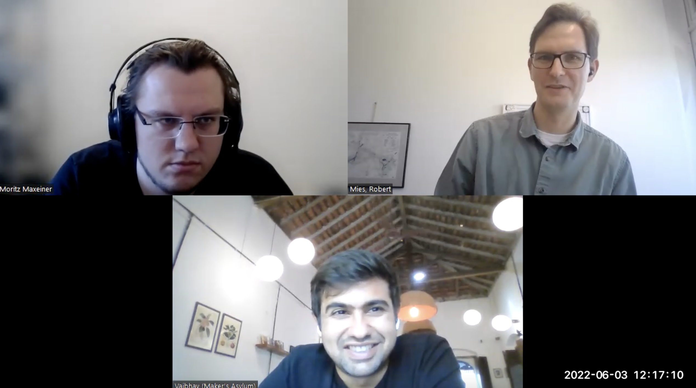

# Interview: M19 Oxygen Concentrator

Vaibhav Chhabra organised the development of an oxygen concentrator during the Covid19 pandemic. The present version is called M19 Oxygen Concentrator.

*by the Open make team, Vaibhav Chhabra. Copyright to the authors, distributed under a CC-BY 4.0 licence.*

**Sections:**
- [The project](#the-project)
- [The hardware](#the-hardware)
- [The research outputs](#research-outputs)
- [The participants](#participants)

*Banner image: maker's asylum logo*

>Interviewee: Vaibhav Chhabra
>
>Interviewers: Robert Mies (TU Berlin) & Moritz Maxeiner (FU Berlin)
>
>Transcription and editing: Diana Paola Americano Guerrero, Fabio Reeh, Robert Mies, Moritz Maxeiner & Julien Colomb

*Screenshot of the interview.*



*Photos of the M19 Oxygen Concentrator *

- Main website: https://makersasylum.com/m19o2/
- Project start: 2020
- Core development team size: 10-15

### Hardware products
It's an oxygen concentrator that gives you about 15 liters per minute, the oxygen is at 90 plus percent efficiency or purity.  We were able to look at a few issues and work on issues around humidity and tropicalisation of the concentrators.

### Hardware maturity
Version one was a high flow rate oxygen concentrator, the second was completely open. The third was made using locally available parts.
### Rebuilds
Many other organizations were able to take our design and go to market with it.



## The project

 
The oxygen concentrator project started in the second wave of the pandemic.
We decided to do two things. One was to build them, understand how they work, and share that knowledge. At the same time, we "tropicalised" them.
We involved a lot of communities across the country.

Then we went through the certification process of output and input. We didn't go through the full medical use certification but for validating our input and output. We  know exactly what's coming out of it and what's going into it.

> How did it all start with the M19 Oxygen Concentrator?

  
The oxygen concentrator project started in the second wave of the pandemic. Initially, we were a few of the lab. We had already done projects before around active respirators and making face shields. During the first wave when we worked on face shields we realized that one of the issues have been quality checks and quality assurances that weren’t followed. During the second wave, one of the reasons why we took up the oxygen concentrator project was to relook at the quality check and the quality assurance issues.  

In the case of the oxygen concentrators,again, a lot of people were trying to build them, and a lot of people were talking about them. However, there were no certified oxygen concentrators that were documented and available in an open source format. We decided to do two things. Firstly,to build them, understand how they work, and secondly, to share that knowledge. Concurrently, we tropicalised them because none of them were suitable for tropical environments like India, where the humidity is over 90%. We wanted to look at all those issues and open them up. We started using locally available materials to be able to build them. We involved a lot of communities across the country. 

It was exciting to get insights from a lot of different kinds of people as a scuba dive technician because they anyways use the PAC system for making nitrox. We got insights from them, learned a lot about oxygen concentrators and used all of that to build our own version of the M19 oxygen concentrator that’s been missing. It took us about three to four weeks to make it. Then, we went through the certification process of output and input. We didn’t go through the full medical use certification but we went for validating our input and output. We know exactly what’s coming out of it and what’s going into it. Apart from that, we’re able to share that knowledge with a lot of other labs, some of them even took it to manufacturing which is quite cool. Further we’re able to add insights to the same. 


> What was the core benefit of this project? How does the hardware fit in the overall project?

  
One core benefit was that we were able to increase the output to 15 liters per minute above 90 percent (humidity or purity?). Another benefit was to find alternative power sources and we are still looking for more. Further, we looked at humidity. We were able to add moisture separators and a few other things to the device to increase the lifespan of the zeolites in humid conditions. 

 
We received a bunch of small grants, from various organizations. The largest donor was Schmidt Futures which is a rich man's foundation. We received it from the European Union and Cambridge University. Besides we raised some crowdfunding money.


> How’s the project funded? How much overall budget did you receive?

  
We received a bunch of small grants and I would say overall budget would be  100,000 to 150,000 dollars. 

> Where did you receive the budget from?

  
We received it from various organizations. The largest donor was Schmidt Futures which is a rich man’s foundation. We received it from the European Union and Cambridge University. Besides, we raised some crowdfunding money.


> Could you describe the overall process of the project? 

  
We worked with the University of Cambridge professors who were spending their time on it along with pretty much the open community of hardware enthusiasts in India and with smaller organizations. We used to have calls every night. During the day we developed our system.
In most of these calls and videos we automate update videos. At the website of Maker’s Asylum M19 initiative you can go to the M19 O2 project to see multiple videos of the different stages of the project. We have four or five videos talking about the philosophy and similar things.


 
We worked with the professors at University of Cambridge  ,the open community of hardware enthusiasts in India and with smaller organizations. We used to have calls every night.

We divided ourselves in smaller groups. The tech team used to have calls at a different time than the management team.

Having this kind of network helped everyone trying to make a difference.


> How did you organize the entire process?

  
We were using Telegram as the main source of communication. Apart from that, we had regular calls, daily or at least two times per week. We divided ourselves in smaller groups eventually, when the team became bigger. The tech team used to have calls at a different time and management team would have calls at a different time. 


 
We had a lot of technical issues and inconsistency amongst other labs:it was an issue of getting the same parts.

We had a bunch of issues primarily on the supply chain end, because we don't manufacture some of these things in India. 


> On the project level, what major bottlenecks have you come across? How did you resolve them?

  
We had a lot of technical issues. Over four or five weeks we were able to fully resolve most of them. Sourcing was one of the major issues. Another was to have the consistency amongst other labs as well, it was an issue in terms of getting the same parts. For example, zeolite [microporous, crystalline aluminosilicate materials commonly used as commercial adsorbents and catalysts - Wikipedia] were all coming from China. That meant we need to import it from China. Unfortunately, it wasn’t available at that time because all of it was used up by various other projects in the world. Zeolite was a big shortage that we had to figure out a bridge. We had to figure out where the gas compressors come from because those are coming from China, too. There’ve been huge supply chain issues. We had a bunch of issues primarily on the supply chain side because we don’t manufacture some of these things in India.


> How did you solve that?

  
We couldn't, because one can't start manufacturing zeolite as a country overnight but eventually it caught up. Now it's available everywhere. There are few Indian organizations coming up to contribute in that space.


 
There were three of us who were making certain decisions. We were listening to everyone. But it was important to move fast.


> How were decisions made within the project?

  
It was pretty democratic for most of the way to be able to move quick. At that time, it was important to be able to move quick. Internally, there were three of us that were making certain decisions. We were listening to everyone. But it was important to move faster. The guys leading the project were taking massive decisions and listening to everyone and moving forward.


 

Almost about 150 organizations were able to join up for M19 collective. We build an oxygen concentrator. We were able to build on top of it and do a lot of service in terms of repairing. 

We were trying to figure out how do we create a system where we are able to make it easier for folks to certify hardware for medical use. I think it's a work in progress always.


## The Hardware

> What exactly was the hardware product that you have developed?

  
It’s an oxygen concentrator that gives you about 15 liters per minute, the oxygen is at 90 plus percent efficiency or purity. This is pretty standard now. But one was a high flow rate oxygen concentrator, the second was completely open. The third was made using locally available parts in India and without anything that was not available at that time. We were able to look at a few issues and work on issues around humidity and tropicalisation of the concentrators. We realized when we opened up a lot of concentrators coming from outside of India that they had physical damage as well.


 
Mechanically, we have to create the entire structure and assemble all the parts. Electronically, we designed our own PCBs. One of the labs/teams was able to design a software to calibrate the machine because one of the issues was timing and calibration.


> How would you classify the product in terms of mechanical, electrical or software components?

  
Mechanically, we have to create the entire structure and to assemble all the parts. Electronically, we designed our own PCBs. Initially, we worked with Arduinos and others but we designed our own PCB and now we have open source turned around. What do you need to ensure the development of the PCB? The software. We designed it earlier, one of the labs/teams was able to design a software to calibrate the machine because one of the issues was timing and calibration. They worked with LabVIEW and in a pathway calibrated the machine.


> On the electronic side, did you need to develop any chips or are you only using premade chips?

  
We use premade chips on a PCB to connect them all together.


> If you were to rate the maturity of  the product in terms of  prototype, demonstrator and market ready, where would you place it?

  
The software for the prototype is complete. Many other organizations were able to take our design and go to market with it. 30 organizations were able to recreate the same in their patients. Some of them created bulk orders of the same and manufactured it. I don’t know if they pass through certification or not because getting the full oxygen concentrator certification should have taken longer. But they were selling under recreational use or something like that, like the Chinese one.


 
30 organizations were able to recreate the same in their patients.
They were part of the calls and then they used the designs that were shared by us.

We started using locally available materials to be able to build them.


> Those other entities have independently produced this hardware or did they take instructions from you? Were there any?

  
They were part of the calls and then they used the designs that were shared by us as well. 


> Are you aware of any entities that have built, produced or modified the design independently of you?

  
I'm sure there are. I know at least one or two but there will be more. If you put it out in the open source domain, that happens.


## Research Outputs

> When you started the project, what were the envisioned outputs of the hardware development in terms of publications, prototypes, documentation and learning? 

  
For us, it was about learning about the process and documenting it and sharing the knowledge. We use that, and we are still building programs around how to tell people to fix them and things like that. It’s more on scaling and learning.


 
Our project is on https://hackday.io and a few other websites, including our own. We still need to write some papers on it, which we are hoping to finish.

We published the repair manual with the European Union on their website.

Instead of writing a paper, we went backto running the rest of our organization and back to work. 


> Have you published the project findings in relation to the hardware?

  
We have published our project, it's on hackday.io and a few other websites, including our own. We still need to write some papers on it which we are hoping to finish.


> Did you publish the repair manuals?

  
We published the repair manual with the European Union on their website.


> What information have you shared like bill of materials, CAD files and assembly instructions?

  
They're the bill of materials, CAD files and assembly instructions on GitHub, with all the schematics as well.


 
It's all on GitHub, Hackaday and a few other websites.
With the European Union, we did a report on repairing EU. That's been published on their website.


> How did you publish the hardware?

  
It's all on GitHub, Hackaday and a few other websites.
With the European Union, we did a report on repairing EU. That has been published on their website.


> Why did you choose those platforms?

  
We chose GitHub because we were documenting ourselves on GitHub and since the beginning most of our projects are over there. Hackday and PLOS is the most systematic to use. Hackday.io fits us because I know who the cofounder is, he also writes for them. We use that to document and publish our project.


> Were using those platforms easy or were there any barriers involved?

  
No, it was straight forward. 


> Why haven’t you published the results in papers?

  
I guess we went back to running the rest of our organization and back to work. We should publish a paper.


> What would you say deters projects or persons from publishing results? 

  
I’m not sure. It’s different for different people. I guess for us it was more about to make it right. We like to build stuff. When it comes to going back and documenting and writing all that down, it’s always a different process and takes different skill sets. I personally know how important it is and various organizations have tried to do that with that. I think now we have time because we were working with Cambridge University and they have send us some people. We’re waiting to get some stuff from them. We were hoping to publish a paper with the University of Cambridge. When they publish a paper, they go to some journals and publish it.


> Did you share some testing data of the prototypes? 

  
We weren’t able to actually do clinical trials or testing on patients. We were able to do lab tests. For that we have data.
The one that we shared is on repairing the EU which was repairing existing oxygen concentrators. Therefore we gave them back to the hospital. You repair them, fix them, check them using our equipment and then give it back to the hospital. We don’t have any testing data on them. In our case, on the M19 O2, we were able to build and test them. We don’t have any testing data apart from the lab certification and the lab results.


> Did companies who produced it share any of this testing data?

  
We didn't follow up. 


 
We managed to build the product ! The project grew really fast. We were able to solve a lot of the local issues, and create it using locally available material (apart from the zeolite). We were able to build services in terms of repairing it within the country as well.

But we didn't manage to figure out how to scale, in medical devices production, while following a certain quality assurance. We were trying to figure out how to create a system where we are able to make it easier for folks to recreate the certification in different phases.



> What was successful about the project and what wasn't?

  
We managed to build the product. But we still didn’t manage to find the answer to how do you scale in medical devices or anything else in a distributed fashion while following a certain QA and QC because the regulatory authorities don’t allow certification to be passed on. That’s not possible. We learned a lot in the process. If I build a hardware and then you make the same hardware in Berlin or wherever, the same certification would not apply. But are you allowed to redo the certification? We were trying to figure out how do we create a system where we are able to make it easier for folks to recreate in different phases while following a certain QA and QC. We don’t have a complete answer. That’s why we didn’t really get to that part. I would say that we were unsuccessful on more research into it, I know that.


> What is the success you see today?

  
Almost 150 organizations were able to join up for the M19 collective which was quite good. That meant that a lot of people wanted to participate in open hardware research in India and especially this project, they were all excited about it. It was at the time of the pandemic, that really helped. The project grew really fast. We were able to build the oxygen concentrator within four to five weeks. We were able to solve a lot of the local issues, we were able to create it using locally available material apart from the zeolite. I think we were able to build on top of it and do a lot of service in terms of repairing it in the country as well. We're still doing research over that. I think those are all the successes, I would say or the good parts of the project that worked out. The bad side was that we still don't have an answer for what we were looking for. I think it's a work in progress always.


## Participants

 
I would say about 10 to 15 in the core team but overall, it has been about 50. 

I would say some technicians, makers, engineers and people with a design background as well. As I mentioned, some have diving backgrounds. Last we have some manufacturers and industrial doctors.



> What made you work on this project?

  
The excitement of it and to be able to build an oxygen concentrator. Furthermore, none of us knew hardware before. It was an opportunity to learn and contribute.


> How many members have contributed to the project?

  
I would say about 10 to 15 in the core team but then a lot of people contributed by sharing things from outside and from the other organizations. Overall it have been about 50. 


> What were their occupations? Possible examples are researchers, postdocs, technicians, students, professors, practitioners and makers.

  
I would say some different technicians, makers, engineers and from design background as well. As I mentioned, some have diving backgrounds. Last, we have some manufacturers and industrial doctors.


> How did you find suitable people with the needed competences?

  
We were just talking about our project. More and more people were reaching out to us, we didn’t have the time to reach out to any new people. I think it was nice that they were reaching out to the group and contributed.


> Where were you talking about the project, just online?

   
Through our social media and other organizations, we talked about it. It was a lot of word of mouth because we were working on the project and people were adding other people to it. 


 
We coordinated it over (daily, or biweekly) calls and over telegram.


> How did you coordinate the work between the members of the project?

  
We coordinated it over calls and over telegram.


 
I think all of us got to learn a lot in terms of the function of devices and how to make it.

There was a lot of attention and publicity about it. We were able to raise a few grants during that time.


> How have the members who provided the inputs benefited from the work and the project?

  
I think all of us got to learn a lot in terms of the function of devices and how to make it. There was a lot of co-creation happening to understand what is available. What are the kind of materials available in what part of the country. There was a lot of sourcing help that was given by other folks that were trying to build similar devices. That was organic. Having this kind of network helped everyone trying to make a difference.


> Have the participants perceived some personal or monetary rewards?

  
I’m not sure how a lot of folks benefitted. Maybe it’s a question we should ask the folks.

Robert Mies


> How did you benefit yourself?

  
We were able to raise a few grants during that time that helped make this happen. We were able to create a project which was an example of work we can do. Did we make a lot of it? I think it was more of a learning experience for us regarding this and we were able to present about it in a few spaces and talk about it. Through our work of the facial chameleon patients, it became a documentary. There was a lot of media and publicity about it, especially about the facial, whatever we did and not that much about the oxygen concentrator. Some papers have been written about it.


> What was the actual impact of the project?

  
It may have saved some lives but I don't know. The first one maybe has and the second one which is the oxygen concentrator might save lives in the future.


