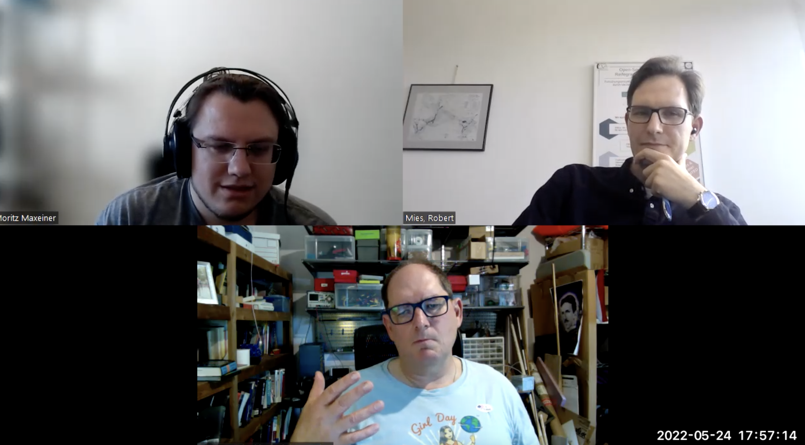

# Interview: VentMon

*by the Open make team and Robert Read. Copyright to the authors, distributed under a CC-BY 4.0 licence.*

**Sections:**

-   [The project](#the-project)
-   [The hardware](#the-hardware)
-   [The research outputs](#research-outputs)
-   [The participants](#participants)

*Banner image: VentMon logo, distributed under a CC-BY-SA 4.0*

> Interviewee: Robert Read
>
> Interviewers: Robert Mies (TU Berlin) & Moritz Maxeiner (FU Berlin)
>
> Transcription and editing: Diana Paola Americano Guerrero, Robert Mies, Fabio Reeh, Moritz Maxeiner & Julien Colomb

*Screenshot of the interview.*



*Photos of the VentMon*

-   Main URL: <https://github.com/PubInv/ventmon-ventilator-inline-test-monitor>
-   Project start: 2020
-   Core development team size: 4

### Hardware products

I built a ventilator test device which became the Ventmon.
It has wifi connections with "Internet of Things" enabled.

It allowed a quality assurance for the teams that were attempting to build mechanical ventilators.

### Hardware maturity

The VentMon is halfway between a demonstration and commercial product, it is the most mature product.
You can't buy it right now and I don't have an inventory of them.

The PolyVent is somewhere between a prototype and a demonstration because we attempt to build an educational platform with it.

### Rebuilds

It was built by the team, and used to test ventilators worldwide.



## The Project

> Would you call yourself the principal investigator in the VentMon project ?


I call myself the invention coach. If I were a university professor, I might call myself a principal investigator. I don't use that term in Public Invention.


 
The VentMon project started in March of 2020 when COVID-19 was first identified. There was a extremely urgent belief that there might not be enough mechanical ventilators for all the people.

Instead [of building a ventilator like other teams], I wanted to be in service to those teams. I knew they all needed a test device. Instead of making a ventilator,  I built a ventilator test device.



> How did it all start with the VentMon project?


The VentMon project started in March of 2020, when COVID-19 was first identified. There was an extremely urgent belief that in the wealthy nations of the world, like Germany and the United States, there might not be enough mechanical ventilators as needed for all the people. This turned out to not be true, but it wasn't a panic. It was based on good evidence that we had at the time; we didn't know that social distancing would work. We didn't know that people with COVID-19 can survive hypoxic conditions that would be life threatening if they were caused by a different disease. I observed many teams attempting to solve this problem by making mechanical ventilators. They had no coordination all over the world, including in Europe, the United States, Latin America, Africa and India. I built a spreadsheet and kept track of them ,which became a little bit famous in this space. I built a scoring rubric and evaluated these. I thought I shouldn't become another team doing this. Instead, I should be serving those teams. I knew they all needed a test device. Testing is  critical for this kind of thing. Instead of making a ventilator,  I built a ventilator test device, which became the landline.


> Could you say what have been the core benefits of this project?
> How does the hardware fit into the overall project?


The original core benefit was the ability to test the mechanical ventilator you designed. Before, you didn't know if it worked well. There wasn't a monitor of some kind. You can solve the initial problem with just a fan. Pushing air is not a difficult problem. For medical purposes, you have to do it very precisely, and you have to test it to know it's working correctly. That was the problem that VentMon meant to solve. It allowed a quality assurance for the teams that were attempting to build mechanical ventilators.


 
It was funded by my nonprofit,  which is called Public Invention, itself funded by donations.

We got grants to manufacture and give Ventmon devices away. One was from the Mozilla Open Source Foundation and one was from Protocol Labs.


> How is it funded?


It was funded by my nonprofit which is called Public Invention. It's a US 501(c)(3) public charity.  I started working on it before we had specific funding for it.  Public Invention has a small amount of money from donations. Then we got upto $20,000 grants to manufacture and give it away. One was from the Mozilla Open Source Foundation and one was from Protocol Labs which was very generous to other teams as well. With that money we manufactured 30 of them and gave them away free of charge to teams all over the world. I'm sad to say,when you're dealing with a crisis,there's always confusion and chaos. Many of them were not used. I think six or seven of them were heavily used and were extremely important to the engineering teams who received them. They sent me nice e-mails about it. But the others thought they were going to use them; they got them and just put them on a shelf. 


 
On this project I got lucky and I had really good volunteers and that wasn't a problem.

We tried to identify libraries or sub modules which can be taken out and reused.

I'm taking techniques developed by the open source software world and applying them to this new realm.

Not all of our work is currently documented at good level because the documentation often kind of lags behind where we are. The goal is to document everything with CAD files, Bill of Materials and tips like use a hot melt glue gun to attach this to the side of the enclosure, those kind of assembly instructions which are necessary for someone to reproduce the device.


> Could you describe the overall process how that happened?


Because of the unemployment caused by COVID-19, I got two excellent volunteers, Lauria Clarke and Ben Coombs. Ben Coombs is in New Zealand, Lauria Clarke is in the United States. Besides, I had assistance from a very senior electrical engineer named Geoff Mulligan who wasn't unemployed but wanted to help. We originally built the device and put it in an acrylic case that we drilled holes into. It wasn't very professionally done, but it worked and  was good enough to be used. 

One thing that Geoff Mulligan suggested was to be 'Internet of Things' enabled; he's kind of famous for having created IPV6. We did that very early on. We made it Wi-Fi enabled, using an ESP-32 chip that had a Wi-Fi connector built in. One of the side benefits is that an engineer in Houston could observe an engineer in New York running the machine because Internet of Things is enabled. Many of the teams using the VentMon were geographically distributed in the first place, because COVID-19 prevented people from being close together in the same room. The whole team could look at it simultaneously on the internet. It's a browser based data lake, where you can see a live performance of the ventilator with about a two or three second delay. We created a spreadsheet of requests for it. Some of those requests came from people that I was personally in contact with because I built the spreadsheet. We held some virtual symposia and workshops. People got to know it that way. We had a spreadsheet of people who were requesting them and as soon as we could manufacture them, we shipped them out to them.


31b8e172-b470-440e-83d8-e6b185028602:dAB5AHAAZQA6AFkAZwBBADIAQQBEAFUAQQBZAGcAQQAxAEEARABnAEEAWgBnAEIAawBBAEMAMABBAFoAQQBBADMAQQBEAEEAQQBOAHcAQQB0AEEARABRAEEAWQB3AEEAegBBAEQAQQBBAEwAUQBBADQAQQBHAE0AQQBPAFEAQQAzAEEAQwAwAEEATQB3AEIAawBBAEQAawBBAE8AUQBCAGgAQQBHAE0AQQBaAGcAQQA1AEEARwBFAEEATQBRAEEAMQBBAEQAYwBBAAoAcABvAHMAaQB0AGkAbwBuADoATwBBAEEAeABBAEQAYwBBAE8AUQBBAD0ACgBwAHIAZQBmAGkAeAA6AAoAcwBvAHUAcgBjAGUAOgBlAHcAQgA3AEEARAB3AEEASQBBAEIAagBBAEcARQBBAGMAZwBCAGsAQQBEAEkAQQBJAEEAQQBpAEEARQB3AEEAYgB3AEIAagBBAEcARQBBAGIAQQBBAGcAQQBIAEEAQQBjAGcAQgB2AEEARwBRAEEAZABRAEIAagBBAEgAUQBBAGEAUQBCAHYAQQBHADQAQQBJAGcAQQArAEEASAAwAEEAZgBRAEEAZwBBAEEAbwBBAEkAQQBCAFgAQQBHAFUAQQBJAEEAQgBvAEEARwBFAEEAWgBBAEEAZwBBAEcARQBBAEkAQQBCAHoAQQBIAEEAQQBjAGcAQgBsAEEARwBFAEEAWgBBAEIAegBBAEcAZwBBAFoAUQBCAGwAQQBIAFEAQQBJAEEAQgB2AEEARwBZAEEASQBBAEIAdwBBAEcAVQBBAGIAdwBCAHcAQQBHAHcAQQBaAFEAQQBnAEEASABjAEEAYQBBAEIAdgBBAEMAQQBBAGQAdwBCAGwAQQBIAEkAQQBaAFEAQQBnAEEASABJAEEAWgBRAEIAeABBAEgAVQBBAFoAUQBCAHoAQQBIAFEAQQBhAFEAQgB1AEEARwBjAEEASQBBAEIAMABBAEcAZwBBAFoAUQBCAHQAQQBDAEEAQQBZAFEAQgB1AEEARwBRAEEASQBBAEIAaABBAEgATQBBAEkAQQBCAHoAQQBHADgAQQBiAHcAQgB1AEEAQwBBAEEAWQBRAEIAegBBAEMAQQBBAGQAdwBCAGwAQQBDAEEAQQBZAHcAQgB2AEEASABVAEEAYgBBAEIAawBBAEMAQQBBAGIAUQBCAGgAQQBHADQAQQBkAFEAQgBtAEEARwBFAEEAWQB3AEIAMABBAEgAVQBBAGMAZwBCAGwAQQBDAEEAQQBkAEEAQgBvAEEARwBVAEEAYgBRAEEAcwBBAEMAQQBBAGQAdwBCAGwAQQBDAEEAQQBjAHcAQgBvAEEARwBrAEEAYwBBAEIAdwBBAEcAVQBBAFoAQQBBAGcAQQBIAFEAQQBhAEEAQgBsAEEARwAwAEEASQBBAEIAdgBBAEgAVQBBAGQAQQBBAGcAQQBIAFEAQQBiAHcAQQBnAEEASABRAEEAYQBBAEIAbABBAEcAMABBAEwAZwBBAEsAQQBDAEEAQQBDAGcAQQBnAEEARgBjAEEAWgBRAEEAZwBBAEgAYwBBAGEAUQBCAHMAQQBHAHcAQQBJAEEAQgB0AEEARwBFAEEAYQB3AEIAbABBAEMAQQBBAE0AUQBBAHcAQQBDAEEAQQBiAHcAQgB5AEEAQwBBAEEATQBnAEEAdwBBAEMAQQBBAGIAdwBCAG0AQQBDAEEAQQBZAFEAQQBnAEEARwBRAEEAWgBRAEIAMgBBAEcAawBBAFkAdwBCAGwAQQBDAEEAQQBaAGcAQgB2AEEASABJAEEASQBBAEIAMABBAEcAZwBBAFoAUQBBAGcAQQBIAEEAQQBkAFEAQgB5AEEASABBAEEAYgB3AEIAegBBAEcAVQBBAEkAQQBCAHYAQQBHAFkAQQBJAEEAQgBqAEEARwA4AEEAYgBnAEIAMgBBAEcAawBBAGIAZwBCAGoAQQBHAGsAQQBiAGcAQgBuAEEAQwBBAEEAYgB3AEIAMABBAEcAZwBBAFoAUQBCAHkAQQBDAEEAQQBjAEEAQgBsAEEARwA4AEEAYwBBAEIAcwBBAEcAVQBBAEkAQQBCADAAQQBHADgAQQBJAEEAQgB0AEEARwBFAEEAYQB3AEIAbABBAEMAQQBBAGEAUQBCADAAQQBDADQAQQBJAEEAQgBYAEEARwBVAEEASQBBAEIAdABBAEcARQBBAGUAUQBBAGcAQQBHAFUAQQBkAGcAQgBsAEEARwA0AEEASQBBAEIAegBBAEcAVQBBAGIAQQBCAHMAQQBDAEEAQQBkAEEAQgBvAEEARwA4AEEAYwB3AEIAbABBAEMAQQBBAFkAZwBCADEAQQBIAFEAQQBJAEEAQgAzAEEARwBVAEEASQBBAEIAaABBAEgASQBBAFoAUQBBAGcAQQBHADQAQQBiAHcAQgAwAEEAQwBBAEEAWgB3AEIAdgBBAEcAawBBAGIAZwBCAG4AQQBDAEEAQQBkAEEAQgB2AEEAQwBBAEEAWQBnAEIAbABBAEcATQBBAGIAdwBCAHQAQQBHAFUAQQBJAEEAQgBoAEEAQwBBAEEAYgBRAEIAbABBAEcAUQBBAGEAUQBCAGoAQQBHAEUAQQBiAEEAQQBnAEEARwBRAEEAWgBRAEIAMgBBAEcAawBBAFkAdwBCAGwAQQBDAEEAQQBiAFEAQgBoAEEARwA0AEEAZABRAEIAbQBBAEcARQBBAFkAdwBCADAAQQBIAFUAQQBjAGcAQgBwAEEARwA0AEEAWgB3AEEAZwBBAEcAWQBBAGEAUQBCAHkAQQBHADAAQQBMAGcAQQBLAEEASABzAEEAZQB3AEEAOABBAEMAQQBBAEwAdwBCAGoAQQBHAEUAQQBjAGcAQgBrAEEARABJAEEASQBBAEEAKwBBAEgAMABBAGYAUQBBAD0ACgBzAHUAZgBmAGkAeAA6AA==:31b8e172-b470-440e-83d8-e6b185028602 31b8e172-b470-440e-83d8-e6b185028602:dAB5AHAAZQA6AFkAZwBBADIAQQBEAFUAQQBZAGcAQQAxAEEARABnAEEAWgBnAEIAawBBAEMAMABBAFoAQQBBADMAQQBEAEEAQQBOAHcAQQB0AEEARABRAEEAWQB3AEEAegBBAEQAQQBBAEwAUQBBADQAQQBHAE0AQQBPAFEAQQAzAEEAQwAwAEEATQB3AEIAawBBAEQAawBBAE8AUQBCAGgAQQBHAE0AQQBaAGcAQQA1AEEARwBFAEEATQBRAEEAMQBBAEQAYwBBAAoAcABvAHMAaQB0AGkAbwBuADoATwBBAEEAMQBBAEQATQBBAE8AQQBBAD0ACgBwAHIAZQBmAGkAeAA6AAoAcwBvAHUAcgBjAGUAOgBlAHcAQgA3AEEARAB3AEEASQBBAEIAagBBAEcARQBBAGMAZwBCAGsAQQBEAEkAQQBJAEEAQQBpAEEARQAwAEEAWQBRAEIAcQBBAEcAOABBAGMAZwBBAGcAQQBHAGsAQQBjAHcAQgB6AEEASABVAEEAWgBRAEIAegBBAEMASQBBAFAAZwBCADkAQQBIADAAQQBJAEEAQQBLAEEARgBRAEEAYQBBAEIAbABBAEMAQQBBAFkAZwBCAHAAQQBHAGMAQQBaAHcAQgBsAEEASABNAEEAZABBAEEAZwBBAEcAawBBAGMAdwBCAHoAQQBIAFUAQQBaAFEAQQBnAEEASABjAEEAWQBRAEIAegBBAEMAQQBBAGQAQQBCAG8AQQBHAEUAQQBkAEEAQQBnAEEASABBAEEAWgBRAEIAdgBBAEgAQQBBAGIAQQBCAGwAQQBDAEEAQQBkAHcAQgB2AEEASABVAEEAYgBBAEIAawBBAEMAQQBBAFkAUQBCAHoAQQBHAHMAQQBJAEEAQgBtAEEARwA4AEEAYwBnAEEAZwBBAEcAOABBAGIAZwBCAGwAQQBDAEEAQQBZAFEAQgB1AEEARwBRAEEASQBBAEIAdQBBAEcAOABBAGQAQQBBAGcAQQBHAEkAQQBaAFEAQQBnAEEARwBNAEEAYgB3AEIAdABBAEcAMABBAGEAUQBCADAAQQBIAFEAQQBaAFEAQgBrAEEAQwBBAEEAZABBAEIAdgBBAEMAQQBBAGQAUQBCAHoAQQBHAGsAQQBiAGcAQgBuAEEAQwBBAEEAYQBRAEIAMABBAEMANABBAEkAQQBCAFgAQQBHAFUAQQBJAEEAQgBoAEEASABRAEEAZABBAEIAbABBAEcAMABBAGMAQQBCADAAQQBHAFUAQQBaAEEAQQBnAEEASABRAEEAYgB3AEEAZwBBAEcARQBBAFoAQQBCAGsAQQBIAEkAQQBaAFEAQgB6AEEASABNAEEASQBBAEIAMABBAEcAZwBBAFkAUQBCADAAQQBDAEEAQQBkAHcAQgBwAEEASABRAEEAYQBBAEEAZwBBAEcARQBBAEkAQQBCAHQAQQBHAFUAQQBiAFEAQgB2AEEAQwB3AEEASQBBAEIAegBBAEcARQBBAGUAUQBCAHAAQQBHADQAQQBaAHcAQQBnAEEASABRAEEAYQBBAEIAaABBAEgAUQBBAEkAQQBCADMAQQBHAFUAQQBJAEEAQgB0AEEARwBFAEEAWgBBAEIAbABBAEMAQQBBAGUAUQBCAHYAQQBIAFUAQQBJAEEAQgB6AEEARwBrAEEAWgB3AEIAdQBBAEMAQQBBAGMAdwBCAHYAQQBHADAAQQBaAFEAQgAwAEEARwBnAEEAYQBRAEIAdQBBAEcAYwBBAEkAQQBCAHoAQQBHAEUAQQBlAFEAQgBwAEEARwA0AEEAWgB3AEEAZwBBAEgAUQBBAGEAQQBCAGgAQQBIAFEAQQBJAEEAQgBwAEEARwBZAEEASQBBAEIANQBBAEcAOABBAGQAUQBBAGcAQQBHAGMAQQBiAHcAQgAwAEEAQwBBAEEAZABBAEIAbwBBAEcAawBBAGMAdwBBAGcAQQBHAEUAQQBiAGcAQgBrAEEAQwBBAEEAZQBRAEIAdgBBAEgAVQBBAEkAQQBCADMAQQBHAFUAQQBjAGcAQgBsAEEARwA0AEEASgB3AEIAMABBAEMAQQBBAFoAdwBCAHYAQQBHAGsAQQBiAGcAQgBuAEEAQwBBAEEAZABBAEIAdgBBAEMAQQBBAGQAUQBCAHoAQQBHAFUAQQBJAEEAQgBwAEEASABRAEEATABBAEEAZwBBAEgAawBBAGIAdwBCADEAQQBDAEEAQQBhAEEAQgBoAEEARwBRAEEASQBBAEIAMABBAEcAOABBAEkAQQBCAHoAQQBHAGcAQQBhAFEAQgB3AEEAQwBBAEEAYQBRAEIAMABBAEMAQQBBAFkAZwBCAGgAQQBHAE0AQQBhAHcAQQBnAEEASABRAEEAYgB3AEEAZwBBAEgAVQBBAGMAdwBBAHUAQQBBAG8AQQBDAGcAQgBVAEEARwBnAEEAWgBRAEEAZwBBAEcAawBBAGIAZwBCADAAQQBHAFUAQQBjAGcAQgBsAEEASABNAEEAZABBAEEAZwBBAEcAawBBAGIAZwBBAGcAQQBIAFEAQQBhAEEAQgBsAEEAQwBBAEEAYwBBAEIAeQBBAEcAOABBAFkAZwBCAHMAQQBHAFUAQQBiAFEAQQBnAEEARwA4AEEAWgBnAEEAZwBBAEcAMABBAFkAUQBCAHIAQQBHAGsAQQBiAGcAQgBuAEEAQwBBAEEAYgB3AEIAdwBBAEcAVQBBAGIAZwBBAHQAQQBIAE0AQQBiAHcAQgAxAEEASABJAEEAWQB3AEIAbABBAEMAQQBBAGIAUQBCAGwAQQBHAE0AQQBhAEEAQgBoAEEARwA0AEEAYQBRAEIAagBBAEcARQBBAGIAQQBBAGcAQQBIAFkAQQBaAFEAQgB1AEEASABRAEEAYQBRAEIAcwBBAEcARQBBAGQAQQBCAHYAQQBIAEkAQQBjAHcAQQBnAEEARwBnAEEAWQBRAEIAegBBAEMAQQBBAFkAZwBCAGwAQQBHAFUAQQBiAGcAQQBnAEEARwBZAEEAWQBRAEIAcwBBAEcAdwBBAGEAUQBCAHUAQQBHAGMAQQBJAEEAQgB2AEEARwBZAEEAWgBnAEEAZwBBAEcAawBBAGIAZwBBAGcAQQBHAEUAQQBJAEEAQgB6AEEASABRAEEAYwBnAEIAaABBAEcAawBBAFoAdwBCAG8AQQBIAFEAQQBJAEEAQgBzAEEARwBrAEEAYgBnAEIAbABBAEMAQQBBAGMAdwBCAHAAQQBHADQAQQBZAHcAQgBsAEEAQwBBAEEAVABRAEIAaABBAEgASQBBAFkAdwBCAG8AQQBDAEEAQQBNAGcAQQB3AEEARABJAEEATQBBAEEAdQBBAEEAbwBBAEMAZwBCAEoAQQBDAEEAQQBkAHcAQgB2AEEASABVAEEAYgBBAEIAawBBAEMAQQBBAGIAQQBCAHAAQQBHAHMAQQBaAFEAQQBnAEEARwBZAEEAYgB3AEIAeQBBAEMAQQBBAGMAdwBCAHYAQQBHAE0AQQBhAFEAQgBsAEEASABRAEEAZQBRAEEAZwBBAEgAUQBBAGIAdwBBAGcAQQBHADAAQQBiAHcAQgAyAEEARwBVAEEASQBBAEIAMABBAEcAOABBAEkAQQBCAGgAQQBDAEEAQQBiAFEAQgB2AEEARwBRAEEAWgBRAEIAcwBBAEMAQQBBAGIAdwBCAG0AQQBDAEEAQQBjAHcAQgBwAEEARwAwAEEAYwBBAEIAcwBBAEgAawBBAEkAQQBCAHkAQQBHAFUAQQBZAHcAQgB2AEEARwBjAEEAYgBnAEIAcABBAEgAbwBBAGEAUQBCAHUAQQBHAGMAQQBJAEEAQgAwAEEARwBnAEEAWgBRAEEAZwBBAEgAYwBBAGIAdwBCAHkAQQBHAHMAQQBJAEEAQgB2AEEARwBZAEEASQBBAEIAdgBBAEgAQQBBAFoAUQBCAHUAQQBDAEEAQQBjAHcAQgB2AEEASABVAEEAYwBnAEIAagBBAEcAVQBBAEkAQQBCAHoAQQBHADgAQQBaAGcAQgAwAEEASABjAEEAWQBRAEIAeQBBAEcAVQBBAEkAQQBCAGgAQQBHADQAQQBaAEEAQQBnAEEARwA4AEEAYwBBAEIAbABBAEcANABBAEkAQQBCAHoAQQBHADgAQQBkAFEAQgB5AEEARwBNAEEAWgBRAEEAZwBBAEcAZwBBAFkAUQBCAHkAQQBHAFEAQQBkAHcAQgBoAEEASABJAEEAWgBRAEEAZwBBAEcAMABBAGIAdwBCAHkAQQBHAFUAQQBJAEEAQgBoAEEARwA0AEEAWgBBAEEAZwBBAEcASQBBAFoAUQBCAHoAQQBHAGsAQQBaAEEAQgBsAEEASABNAEEASQBBAEIAdwBBAEgASQBBAGIAdwBCADIAQQBHAGsAQQBaAEEAQgBwAEEARwA0AEEAWgB3AEEAZwBBAEcAMABBAGIAdwBCAHkAQQBHAFUAQQBJAEEAQgBtAEEARwBrAEEAYgBnAEIAaABBAEcANABBAFkAdwBCAHAAQQBHAEUAQQBiAEEAQQBnAEEASABNAEEAZABRAEIAdwBBAEgAQQBBAGIAdwBCAHkAQQBIAFEAQQBJAEEAQgBtAEEARwA4AEEAYwBnAEEAZwBBAEgAUQBBAGEAQQBCAGwAQQBDAEEAQQBjAEEAQgBsAEEARwA4AEEAYwBBAEIAcwBBAEcAVQBBAEkAQQBCADMAQQBHAGcAQQBiAHcAQQBnAEEARwBjAEEAYQBRAEIAMgBBAEcAVQBBAEkAQQBCADAAQQBHAGcAQQBaAFEAQgBwAEEASABJAEEASQBBAEIAMABBAEcAawBBAGIAUQBCAGwAQQBDAEEAQQBaAGcAQgB2AEEASABJAEEASQBBAEIAMABBAEcAZwBBAGEAUQBCAHoAQQBDADQAQQBDAGcAQgA3AEEASABzAEEAUABBAEEAZwBBAEMAOABBAFkAdwBCAGgAQQBIAEkAQQBaAEEAQQB5AEEAQwBBAEEAUABnAEIAOQBBAEgAMABBAAoAcwB1AGYAZgBpAHgAOgA=:31b8e172-b470-440e-83d8-e6b185028602

> What major issues have you come across during the project and how did you resolve them?


In any technical problem project, there are many issues that come up that I don't think you want to hear about. Since people weren't paying for them, the biggest issue was that people would ask for one and not be committed to using it. We attempted to address that with a memo, saying that we made you sign something saying that if you got this and you weren't going to use it, you had to ship it back to us. Several people did that. They shipped them back to us when they decided they weren't going to use it. That was kind of the biggest social problem that we had. Now, on many other projects I have trouble getting volunteers. On this project I got lucky and I had really good volunteers and that wasn't a problem.


> Did you have problems on a technical level?


I wouldn't necessarily say we had problems but we've had difficulties where things could've been better. One thing we did that I'm very proud of was define a data interface called the Public Invention Respiration Data Standard, which has a JSON binding. It has a byte level binding  where we take samples and do something that's a little different from what's normally done with time series. We put a time stamp on each sample based on milliseconds. Microcontrollers don't generally have absolute clocks, but they have good millisecond clocks. We put a time stamp on each sample. Now I would love for our standard to become an accepted one for intercommunicating respiration data.  Whether it comes from the Vent Monitor and is used for some other purpose. There is no such standard today.If international teams want to transfer data, there is no agreed upon unit for the pressure and resolution,how many bits of data you should have, how to treat it as a time series and how to put events in terms of a failure or an alarm event of some kind into the data stream. But I have not yet gotten anyone who isn't directly associated with my teams to use that data standard. 


> One question about the time series part, do you know why it isn't common to put datetime timestamps?


When I was looking at data representations for human respiration data, most of them assumed a standard data interval like five milliseconds or ten milliseconds. They assume everything comes that way. Of course, that has advantages because you can do an FFT on the data and various other things. But it's not advantageous at the time you're collecting the data if you're using a microcontroller, although it may vary. The technique may very well have been invented 100 times, but no one has taken the time to produce an international standard for it. 

Robert Read 
I will make a brief digression about a related problem. The interest in the problem of making open-source mechanical ventilators has been falling off in a straight line since March 2020. Because people  don't care anymore. They think COVID-19 is over, although the mechanical ventilation crisis in the wealthy nations has disappeared. But it's still a problem in low and middle income countries to some extent. One team had their own data standard that was different from mine.  I wrote an adapter for my data standard into their data standard. With this adapter, they could download my data without a software change and display it using their equipment. That's an example. If you want to estabilsh a standard, you're going to have to address how you transfer data in and out of those things. The best way to solve it is socially by accepting a standard data format that has been agreed upon by some kind of consortium or standards body.

As an aside, a czechoslovakian team talked to me about it. They just weren't willing to give up regular time intervals. We briefly had a meeting about doing this and we decided not to continue working together because they just didn't want to do it that way.


 
We made decisions as a team with the four major volunteers Lauria, Geoff, Ben and myself, a small team.


> How were decisions within the project made?


Within the VentMon, we made decisions as a team with the four major volunteers Lauria, Geoff, Ben and myself, a small team. We didn't have a lot of dissension. The larger your team is, the more likely you are to have disagreements. In this case it was easy to make decisions because it was a small number of people.


## The Hardware

 
There is a software system that's very important.
The idea was to build VentOS and then we use hardware drivers to change based on which kind of mechanical equipment you have.
VentOS GUI which is closely related to VentDisplay, is a software control mechanism that's like a clinical display a doctor would use.


> Which hardware projects have you developed as part of this project?
> Just the ventilator or are there more components?


I would refer you to the free spirit code document which sort of answers your question. There is a software system that's very important which was not developed by public invention, it's develped by helpful engineering, I'm on the board of helpful engineering as well, called VentOS which was initiated by an Australian anesthesiologist named Eric Schultz. It's the software which runs on the PolyVent machine. PolyVent is a mechanical ventilator. If you think of a family of technologies, there are quite a few. I'm going to name them now.

As a computer scientist, you understand the modern way this is done in software. You end up having a lot of GitHub repositories or GitLab repositories corresponding to a project. You try to identify libraries or sub-modules which can be taken out and reused. We've done that as much as possible. If you look at the Public Invention GitHub there are probably 20 repositories, in one way or another that relates to the free spirit ecosystem. I call it ECOSOC but I'm  going to tell you the main ones. One is PolyVent a mechanical ventilator. Another one is the VentMon. The PolyVent runs the VentOS. 'OS' originally meant operating system but that isn't really an operating system. It's a platform for mechanical ventilation. 

The idea is VentOS should be able to run any microcontroller-based mechanical ventilator because they're all fundamentally the same. Even if the mechanism which powers them use a piston, compressed air, a bellow, fan or blower. Fundamentally, they all do the same thing. The idea was to build VentOS and then we use hardware drivers to change based on which kind of mechanical equipment you have. There's nothing original about this except that it had never been applied to mechanical ventilation before. If you were building a computer or something else, you would do the same thing. I'm taking techniques developed by the open source software world and applying them to this new realm. 

The other thing is, we have a system called VentOS GUI which is closely related to VentDisplay. VentDisplay is the code that I wrote which runs in a browser and does a real time display of the Public Invention respiration data system. Right now, the VentMon is the only thing that produces a data stream like that, but we've  produced it in simulation or in silico. The software renders that, which is an important part of a medical ventilator to be able to see that way before the doctors need to see it in order to understand the health of the patient. VentOS GUI is another project of Helpful Engineering which is an attempt to build a software control mechanism that's like a clinical display a doctor would use. The PolyVent ventilator has no hardware control on it, it has no knobs. Currently, it has no way for you to change the respiration rate, you change that programmatically through the serial port. As a separate module someone has to build. For example, we're using a Raspberry Pi and a little seven inch touchscreen.  It's something where the doctor can increase the pressure or decrease the pressure. 




One thing we did that I'm very proud of was define a data interface called the Public Invention Respiration Data Standard.
But I have not yet gotten anyone who isn't directly associated with my teams to use that data standard.

The technique may very well have been invented 100 times, but no one has taken the time to produce an international standard for it.
One team had their own data standard that was different from mine.
I wrote an adapter for my data standard into their data standard.

It doesn't matter how reliable the device are, they must have alarms: Things go wrong even if you built the very best device in the world.
Right now the PolyVent has no alarm mechanism, it cannot make a noise or a light.
I've been trying to recruit volunteers to make a general purpose alarm module.

Most people would say the best I did was the spreadsheet which was a service to the community: it made something that was invisible visible and discoverable.


> Are there other parts that need to be developed?


Yes, there are.  First, let me mention that Ben Coombs is developing a oxygen concentrator, a pressure swing and a adsorption oxygen concentrator. If I could go back in time, we believe more lifes would have been saved by building a robust oxygen concentrator than by building a mechanical ventilator. But I'm stubborn, I don't let projects go. We started on the mechanical ventilator and we're going to finish it. Besides Ben Coombs working very slowly on the idea of making an oxygen concentrator. He forked VentOS and made a modification for running his oxygen concentrator because a pressure swing adsorption oxygen concentrator raises the pressure, changes some valves and lowers the pressure. That's very similar to what a mechanical ventilator does, it happens that the pressures are about 100 times higher than for human breathing, fundamentally it does the same. 

There is another piece which is very important from a medical point of view. On all of these devices, especially if you're trying to make open source devices that people don't necessarily trust, part of reliability is to produce monitoring and alarms. For Example, Drager is a famous medical device firm that is on top of the line. They make the best medical equipment and the most expensive medical equipment in the world. Even their devices, it doesn't matter how reliable they are, must have alarms because a nurse will trip over the hose or the patient will vomit into the tube. Things go wrong even if you built the very best device in the world. Electricity will fail, pressure coming out of the wall will fail. You have to tell the medical staff that something went wrong. Right now the PolyVent has no alarm mechanism, it cannot make a noise or a light. It cannot tell you that something has gone wrong. Although the computer inside is powerful enough to figure out that it's trying to raise the pressure and the pressure is not going up that probably means the hose is disconnected, but, here is no way to report that data. This is an example of where I haven't been successful. I've been trying to recruit volunteers to make a general purpose alarm module. 

The long term goal of this is for a firm to make open source respiration devices which will probably be sold in low and middle income countries. We're very far away from competing with Drager at what Drager does best. We're very far away from getting  FDA or CE approval of a medical device because there's a lot of paperwork and a lot of reliability that is needed. But we must have an alarm mechanism before we even have all of the components that are necessary for that. I will point out that wasn't true in the middle of the pandemic, when, I can only speak for the United States, the US FDA issued emergency use authorization. There were primitive mechanical ventilators which were approved for marketing which didn't have alarm mechanisms and a lot of things.  I hope none of our loved ones ever have to use those devices because  they were pretty primitive. In theory however, they could have saved lives.


> Where would you rate your products and the components on a scale of prototype, demonstrator, market-ready product?


The VentMon is the most mature product but it's not a commercial product. You can't buy it right now and I don't have an inventory of them. We're redesigning to make the case smaller. The electricity is going to stay the same, but Ben is making the case significantly smaller. I would call it's halfway between a demonstration and commercial product. Not quite a commercial product but with the possibility to be. It is not an FDA ready commercial product. It could be sold as a spirometer for athletic purposes or for horn players to measure their breath strength for blowing tubes. But it could be produced quickly as a commercial product. 

The PolyVent is somewhere between a prototype and a demonstration because we attempt to build an educational platform with it. At Rice University in Houston a professor, she happens to be on the Board of Public Invention, is willing to use the PolyVent machine in classroom demonstration. It would be an educational product, except she isn't paying for it yet. We're not creating a firm to make an educational product, but it's almost an educational product. The data standard is an acceptable one. I think  versions of it will be produced. There's no reason why people wouldn't accept it as a completely reasonable data standard today, but that's easier because it's software.
The oxygen concentrator is further behind. It's a prototype. It works but only on a desktop. It's not close to being ready.


> Are you aware of anyone who tried to reproduce your hardware from the online schematics and information?


I think one person about a year and a half ago may have made a homemade VentMon. They only made it for their own personal use. Besides, I don't think anyone has used these. Since they're published with open source licenses, they don't have to inform me. But I would have heard of it if someone had seriously undertaken to make these things.


> What was your goal of the publication?
> Do you want people to rebuild it or did you have other goals?

 
Yes, my goal is for other people to use it. The fundamental goal of Public Invention is to save lives and alleviate poverty worldwide through technology. Public invention doesn't want to manufacture devices except what I call "short run production". We will make 10 or 20 of a device for the purpose of convincing other people to make it. We may even sell those but we are not going to become a medical device manufacturing firm. I would love if someone would take one of my designs, do something with it and make $100,000. Although there are members of my board who disagree with this position, I would love to hear that a German firm had taken the VentMon and done proper industrial design. This is very simple by industrial design standards. You could sell it as a spirometer and make a million dollars. That's the goal of Public Invention.


> Has there been any further development or contributions you found?


No, Ben Coombs is making the next version of the VentMon. But as far as I know, no one has ever taken anything that I've done and tried to make a commercial product out of it.


## Research Outputs

 
Everything we do has an open source license on it from the start.

They're a technical report, from an engineering point of view on how to build something, they're not the kind of thing that is considered to be interesting from an intellectual point of view.

 That's for the peers to say not for me to say whether it's worthy of publication or not. If it doesn't, it will  be a non peer reviewed publication at GitHub.
 
 It's a lack of time that keeps some things from being published.


> What are the envisioned outputs of the hardware development for all the parts on the components?

 
The way Public Invention works is, we start a project, we make a GitHub repository and we publish everything at the end of the day. We believe in working in the light. Everything we do has an open source license on it from the start. At the beginning it's completely unusable. But we just constantly do that, like the open source software idea of release early and currently I like to write academic papers. The VentMon has been published in Hardware X. I believe, I will someday write an academic paper about VentOS and PolyVent. I believe that is a useful way to disseminate knowledge. I aim for an academic paper for most of these devices if they're worthy of it. Not everything is interesting enough to be published in a journal. I would do it more but my time is limited. 

I don't have all the volunteers that I'd like to have and these papers are a certain class of publication. They're a technical report, from an engineering point of view on how to build something, they're not the kind of thing that is considered to be interesting from an intellectual point of view.  Some people would say, it's very applied research, not basic research. Public Invention does write pure math papers, I've done some pure math work that I consider more interesting. I'd like to do it more. But I feel like I have a moral obligation to try to help people. For me math is fun. But there are people who are dying. I have to make these things.


 
I like to write academic papers. The VentMon has been published in Hardware X.
I believe that is a useful way to disseminate knowledge.


> About the contents of what you've shared on GitHub and within the papers, are there Bill of Materials, CAD files, assembly instructions, documentation?
> What does it all entail?

 
All of that, except we're incompetent. Our goal is to make every device reproducible. That is harder than it sounds. I would say that the journal Hardware X does a very good job on insisting that you rise all of the material to the level of repeatability. When you see something published in Hardware X, it's documented well enough that an average engineer could reproduce the work. Not all of our work is currently documented at that level because the documentation often kind of lags behind where we are. The goal is to document everything with CAD files, Bill of Materials and tips like use a hot melt glue gun to attach this to the side of the enclosure, those kind of assembly instructions which are necessary for someone to reproduce the device.


> Do you intend to publish those components in Hardware X if you have enough time?


Yes, or some other journal depending on what it is and if it's  interesting. Our goal is to publish a technical report in GitHub. I can't say that any journal is going to find my work interesting  to publish. If it doesn't, it will  be a non peer reviewed publication at GitHub. I prefer peer reviewed publications and I think the world should prefer a peer reviewed publication. That's for the peers to say not for me to say whether it's worthy of publication or not.


> How did you come about GitHub and Hardware X and why did you choose those platforms?


Git has been used by the computer science community for a long time. Before, it was CVS, Subversion and a bunch of other. It's been developed that way. More and more, Git is starting to be used for hardware.  I use GitHub although I hear good things about GitLab. But I use GitHub because I started there and they make it completely free if everything is open source which all of my work is.  I do pay some kind of fee for GitHub for other reasons.  GitHub is a very good platform for this kind of publication. Hardware X is devoted to open source hardware and they insist that everything is open source. That's the reason it exists. I found that doing a journal search.


> Have you encountered any barriers in using either of those platforms that you had to struggle with?


No, GitHub is very easy. With Hardware X you have to do a good job writing the paper. It's a peer reviewed journal. You have to convince them to publish it. But I've only got one paper in Hardware X, I'm not like an expert.


> Do you have other reasons of not publishing results that you've not published yet?


My intention is to publish everything. It's a lack of time that keeps some things from being published. About CAD designs and software, everything is  published in GitHub. If my computer were thrown away, everything would be in GitHub. Those things are not easily consumed by an outsider,  a computer scientist would have a hard time understanding it without better documentation.


> The goal of Hardware X is that anything could be reproduced by an average engineer.
> Would you say that your projects have reached that stage and aren't published on Hardware X yet?
> Or, is there still work to reach that level of reproducibility?


The VentMon has been published in Hardware X, it is completely reproducible. Academic papers represent a snapshot in time, they don't evolve. By definition, an academic paper stays forever, but the software evolves. The latest version of the VentMon is not described in the Hardware X project but it is described in the VentMon repository. That's going to be true for all evolving hardware and software. At one time the previous version of VentMon was 100% described well enough that someone could manufacture it. Now, all of the information to make the PolyVent is in a GitHub repository, but you would have to hunt around to find all of it. If someone wants to do that I recommend they come to us and we will explain  where it is and how to find all of the different parts of it.


> What've been the successes you reached in this project?
> At what parts you have not succeeded?


No one else in the world may believe this. But I believe the most important thing I did was defining the Public Invention restoration data standard and defining the Public Invention restoration control standard.  Although those are not glamorous, defining those standards is a very important contribution to the state of the art. Most people would say the best I did was the spreadsheet which was a service to the community. I was surprised no one got mad at me about it. I  I evaluated 100 teams, you would think people complain and people sometimes asked to be regraded, but no one yelled at me which was surprising. But people would say that was a great service because it made something that was invisible visible and discoverable. 

There started several projects in Germany which were competent engineers doing their own thing but they may not have been aware of a project in France, Brazil or the United States which was doing the same thing.  I made it possible for them to learn about those other projects. The VentMon is a partial successful product because the six teams that used it  would say, it was absolutely critical to their success. But that means 24 teams didn't use it. You could say that was a failure. After two years, the PolyVent has only reached  the first glimmer of success because a major university said they're willing to use it in a class. That's like one grain of sand of success. 

By the way, it was started by a guy named Victor Citroen who lives in Germany now. He agreed to make it open source in exchange for Public Invention funding it.  Now, it's a Public Invention project, but he started it before he knew about Public Invention. His goal was to build a medical device that would save lives. That's my goal as well but both of us know that's  a decade long goal. The goal is to change the way medical devices are made worldwide and to develop them the open source software way. It's a very difficult social, political and economic problem. There's a little crack and we put a screwdriver in that crack. We're trying to pry it open. That's about all we've accomplished so far. 


> You said at the Open Hardware summit that the success rate of all the projects is very low because most of them haven't made it to the market.
> Therefore your list may not show a great success in terms of impact in reality.


That's one of the valuable lessons of open source software. The world is littered with. At GitHub almost like nine out of 10 repositories, aren't used by anybody. You could say that's a failure. But I would say it's not a failure, it's a success because those are pieces of material that can be used by other people and are used by other people to build upon and to build other things. It's a strange situation.  Thomas Edison said, you need perspiration and a giant pile of junk. The open source software and abandoned projects are a giant pile of junk but it's extremely valuable junk from which other stuff is built.


## Participants

 
I believe in a coming Star Trek universe, a bright universe where humanity works together, national differences have dissolved and we do wonderful things.

I didn't do this until I became financially secure.Now, I can finally do what I've always thought should be done. I started this nonprofit.

All of these people did it  out of the goodness of their heart. All of them don't mind getting academic papers. Geoff doesn't need an academic paper, but Lauria's career was advanced by an academic paper. Ben Coombs finds the work interesting and it expands his universe, kind of socially.

For young people, I think they had a very strong resume type situation. I  will write them a strong recommendation.


> How did you end up working on that project?
> In fact, what motivated you as a person how did you decide for it or what made you start?


This is going to get a little weird. I'm going to tell you the honest truth. When I was a freshman in college, one of my friends gave me a book by Buckminster Fuller who is an American philosopher. He invented the geodesic dome. His argument was, technology isn't neutral. There's a difference between making nerve gas and neutron bombs that are only good for killing people and making things like shelter and vaccine which are mostly good for helping people. It's not entirely true because shelters can be used to house attack helicopters. Nothing is pure in this world. But his argument was technologists aren't relieved of moral responsibility because it's difficult to know the impact of your technology. 

I've always believed that and I'm an Unitarian. I believe  the Thomas Jefferson, Benjamin Franklin, Jonas Salk and Richard Stallman model that by developing technology we enable and ennoble humanity. I think of it as American but I'm sure there are other examples. Someday we're going to explore the stars together in peace. We're going to quit killing each other. All this petty stuff is going to go away, poverty is going to be solved and we're going to  work together to explore the stars. I know that may sound completely wacky but I believe in a coming Star Trek universe, a bright universe where humanity works together, national differences have dissolved and we do wonderful things. I recognize the future may be darker than that, we may blow each other up instead. But I'm not a politician and not a preacher. I'm a technologist. What I can do with my technology, is try to build the best technology that helps people instead of hurting them. That is what motivated us. 

I want to point out , I don't know what the correct phrase would be, that I'm not a saint and not a choirboy. I had a family and made money. I didn't do this until my kids became adults and didn't need me anymore and until I became financially secure. When my kids were grown up and I was financially secure, I didn't have to work. Then I can finally do what I've always thought should be done. I started this nonprofit. If I can say one thing that's a little sharp, I find it really weird that many people like myself, would rather spend $100,000 on a sports car, than spend $100,000 on some invention that they've had in the back of their mind. I don't know why they want to do that but I don't.


> Could you tell us about the other people you've worked with?
> How many members worked on the project?
> What've been their occupations?
> It's not just doctoral researchers, postdocs or research engineers, could you break it down?


Public Invention has done some different projects, some are more academic than the pandemic related project. I'm very proud of the people who worked on the VentMon. First of all, Geoff Mulligan has a Wikipedia page. He was a Presidential Innovation Fellow with me in the Obama administration. It's a program where you can go and work for the US federal government trying to innovate things. He and I met there when the pandemic started. He's a very kind hearted guy and a very senior electrical engineer. He put a little bit of time into it and some senior guidance. Lauria Clarke is a young woman who has a master's degree in electrical engineering but she's now studying art. She had got into art school, but it was delayed because of the COVID pandemic. She made a decision  to take a gap year except she had a Master's degree. She found me and sent me her resume and immediately started working on the VentMon. She did the electrical design. Ben Coombs is in New Zealand, he did the mechanical design, the enclosure and some other stuff. He did the 3D printing and the manufacturing of this, although Lauria designed the electrical schematic. He did the layout of the physical part. He was under employed at the time and had owned his own businesses. I think COVID-19 was making transition. All of these people did it  out of the goodness of their heart. All of them don't mind getting academic papers. Geoff doesn't need an academic paper, but Lauria's career was advanced by an academic paper. Ben joined the project so late, he's not an author of the Hardware X paper which is a problem.


 
What I can do with my technology, is try to build the best technology that helps people instead of hurting them. That is what motivated us. 

No one, including me, gets paid by Public Invention.


> How did you find those people?


No one, including me, gets paid by Public Invention. There are some exceptions. I sometimes pay people for services, but the main volunteers don't get paid for their intellectual work. Lauria sent her resume to me, I don't know how she found about Public Invention. Geoff Mulligan was a personal friend of mine before this started. Ben Coombs, I think he came to one of the conferences that I put on and then contacted me after the conference.  Occasionally people come  from the website. I have a volunteer coordinator who uses  something called "Volunteer Match" as well to find new volunteers. But it's a real problem because currently employment is very high. Anyone who could do volunteer work for Public Invention, could either get a job or would be asked to work extra hours at the job that they're already working. It's a serious problem. I'm financially secure and I've chosen to spend all my time doing this. There aren't many people who are financially secure, technically able and energetic enough to spend 40 or 50 hours a week working. 

There are some retired people who in theory are sympathetic to the idea but they don't necessarily want to work that much. I'd like to meet more of them. It isn't obvious that you can find volunteers who you don't pay to do Open Source Hardware in a strictly humanitarian mode. The same issue exists in Open Source Software. For a long time, people did open source software, maybe because it was fun or they got career benefits. Recently, we've heard  people throw up their hands and reject this because of being tired of working hours without payment. Large corporations take advantage of my work and I don't get paid. On the other hand, there's still open source software being developed. I would like for society to move to a model of simply recognizing the work of open source software and open source hardware more and besides providing more financial support for the people who give their time for this.

I don't believe we can turn a switch and say these highly skilled and energetic engineers are going to be paid what they're worth. Because their payment would be arnound $100,000 to $200,000. One of the models Public Invention uses is to  call it the no out of pocket expenses policy. We only have $35,000 in the bank, we can't pay people what they're worth. If you buy microcontrollers, 3D filament and soldering irons for hardware engineers they seem to react emotionally as if you've given them six times that amount of money. I don't know why. But if you buy them equipment, they highly appreciate it. They could have made that much money by  working some extra hours. But psychologically, it makes them feel appreciated if you're purchasing equipment for them and they don't have to pay for it themselves.


 
Many of the teams using the VentMon were geographically distributed. 

We held some virtual symposia and workshops.

We use GitHub and Git issues to represent issues and weekly meetings. I'm a big proponent of agile development. When I was in industry, I was a manager who used user stories, velocity tracking and the whole scrumn framework. I know how to do that. I find that people don't want to do that.


> How did you coordinate the work with these people?


I'm tempted to say badly, but I meet with them in Zoom all the time. Unfortunately they're small teams, I would love to have five person teams actively working at any one point in time. But I have four one person teams working. With the younger people I meet weekly. Ben Coombs, is very senior, he can work on his own. The VentOS project meets once every two weeks. We use the same things that are used by open source software. We use GitHub and Git issues to represent issues and weekly meetings. I'm a big proponent of agile development. When I was in industry, I was a manager who used user stories, velocity tracking and the whole scrumn framework. I know how to do that. I find that people don't want to do that. If I had a five person team, I would be quite disciplined in doing all of that work. But I've never had a big team that requires that level of coordination. 


> How the members have benefited from the work in the project?

 
You might have to ask them, but most of them have got a real sense of satisfaction out of it. I would say Geoff Mulligan believes that he made the world a better place by helping with the VentMon. Lauria Clarke appreciates that she got an academic paper. It's a small paper in Hardware X but I don't think she'd published that much before. Her publications are artistic. The kind of art she wants to do is electronic mixed media type work. For her that publication was valuable. Ben Coombs finds the work interesting and it expands his universe, kind of socially. New Zealand is a relatively small island. There's not that much going on. I think he feels  this makes him part of the part of the larger world. Victor Citron, who runs the PolyVen Project, has his own medical device company. He does it purely because he gets satisfaction out of it. I don't think it hurts him when people find out that he donates his time to a humanitarian project. He runs a project which is a money making thing, he's got a chance of becoming a multimillionaire with the the project he's working on. But he wants to do humanitarian work, too. He's young, energetic and has the time to do it. For some people it would be hard to run a business and devote time to humanitarian project as well. There's a young man named Nathaniel Bechard. A Canadian from Montreal who is about to turn 18. He was the main electromechanical designer of the PolyVent.  I think he turned his hobbies into something that the world can see and is going to advance his career. He's applying for college. I don't know what's going to happen there. He has an astounding thing to put on his resume and to apply to college with saying I was the lead designer of a well reported open source project to address the ventilator and I did all that before I was 18. I think he had a very strong resume type situation. I  will write him a strong recommendation. That's one thing I do a lot. I'm working on a completely unrelated project with a young woman doing a Ferro fluid pump thing.  I think she wanted to do something that might help her get into medical school and I recently wrote a recommendation for her for medical school. She's a biomedical engineer by training. 


 
