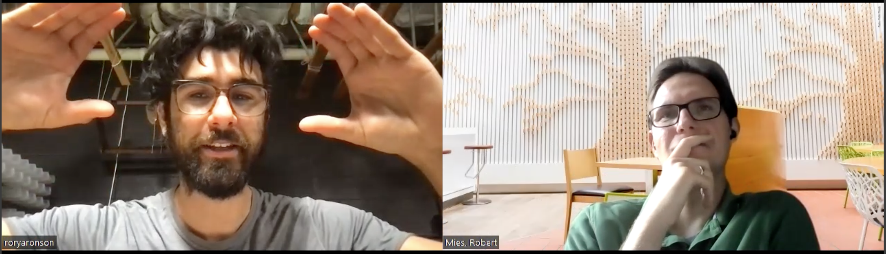
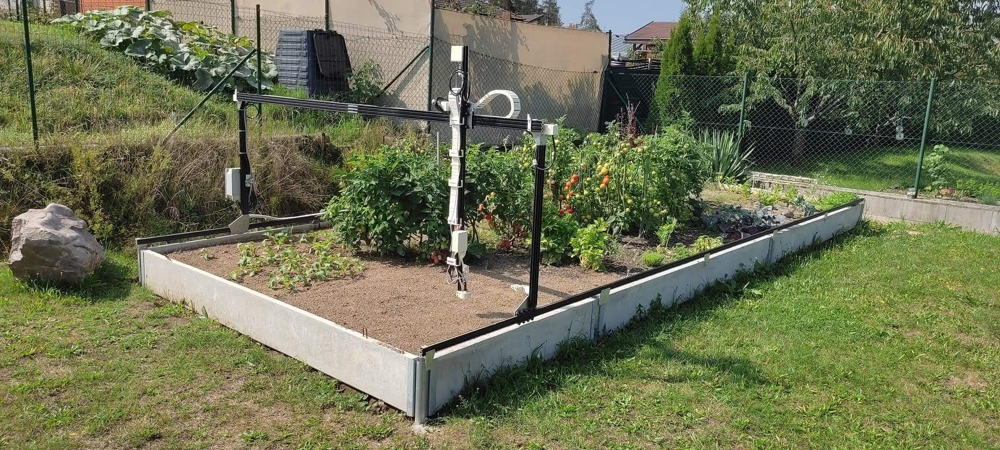

# Interview: Farmbot

*by the Open make team and Rory Aronson. Copyright to the authors, distributed under a CC-BY 4.0 licence.*

**Sections:**
- [The Project](#the-project)
- [The Hardware](#the-hardware)
- [The Research outputs](#research-outputs)
- [The Participants](#participants)

*Banner image: , distributed under a CC-BY-SA 4.0*

>Interviewee: Rory Aronson
>
>Interviewers: Robert Mies (TU Berlin) & Moritz Maxeiner (FU Berlin)
>
>Transcription and editing: Diana Paola Americano Guerrero, Robert Mies, Fabio Reeh, Moritz Maxeiner & Julien Colomb

*Screenshot of the interview.*



*Photos of Farmbot in action, by FarmBot Inc, CC-BY*

- Main website: https://farm.bot/
- 2023 White paper : https://farm.bot/pages/whitepaper
- Project start: 2013
- Core development team size: 3-5 paid people + around 5 external contributors.

### Hardware products
The FarmBot is basically a large, outdoor resistant, 3D printer for the garden. Instead of extruding plastic, it plants seeds and sprays water.
### Hardware maturity
It is a full manufactured product.
### Rebuilds
The reality is that most people want to buy the machine from me.

Two companies tried to reuse the spec, but failed mostly because the manufacturing quality was not sufficient.



## The project

 
I essentially wrote a white paper like a senior or capstone project. It’s about 50 pages long, it outlines at a very high level the concept how the hardware could look like and roughly what it would cost.

FarmBot has become a default hardware choice for a lot of those researchers. They need to do some very specific specialized stuff for their experiments and FarmBot is very much useful because it's open source and it's well documented. 


 
A lot of that knowledge for farming and gardening is kind of inaccessible unless it's your profession or major hobby. 
There's not a lot of open source, community created or community shared agricultural related projects out there.


>How did it all start with the project FarmBot?


FarmBot started when I was in school studying mechanical engineering at a university in California. I have a lot of different interests but primarily it’s engineering. In my third year in school, I took an organic agriculture class. I grew a garden at home in my spare time and I wanted to learn more about how farmers and people do it on a bigger scale. Besides I was working at a makerspace and playing around with 3D printers, laser cutters and CNC machines of all different types. All those different ideas came around in my head and I thought where's the 3D printer for the garden? You know, I’m out there in the backyard with a hose and a shovel, looking at the information on the back of a seed package for how to grow the vegetables.  I'm doing it all by hand the way every average gardener does it. I would have problems and need to go out of town for a weekend. If it is the wrong weekend where the plants are really small, and they miss a watering or two during hot period, all of my initial effort would go to waste. Maybe I get busy with school or I become uninterested in the garden because it's not necessarily my number one hobby. Sometimes it can feel like a chore more than fun. If I dropped the ball and go on a bike ride instead of tending to the garden and if I do that a couple of days in a row, the garden really suffers with that inattention. Meanwhile, you work with a laser cutter where you can press go on your on your part file, walk away for 10 hours and come back with the work done. I thought where's the CNC machine or 3D printer for the garden? Where is a machine that I can install with an initial upfront cost but then I can more or less press „go“ and trust that it's going to tend to the garden as best as it can? If there is a problem that it can't address, it will let me know. I googled around and didn't find such a machine.  I was taking this organic agriculture class and getting some ideas from there. That's where the concept for FarmBot came from. It was a three axis machine inspired by the maker hobby level CNC equipment of the time. 

I took the concept of 3D printers, Arduinos, Raspberry Pi's and all that stuff and weatherizing it to be outside in the rain and sun. Instead of having a CNC mill on the end, a laser or a plastic extruder it has implements that are useful in the garden. These tools are a watering nozzle, a seed injector and a camera that you can monitor things and eventually analyze that data to make smarter decisions in combination with a soil sensor. That's where the concept came from. I started working on the concepts after I graduated from school. That was in 2013. I essentially wrote a white paper like a senior capstone project. It’s about 50 pages long, it outlines at a very high level the concept: this how the hardware could look like, this is roughly what it would cost, this is what I imagined the software to look like, it was very inspired by Farmville. This was a game on Facebook where you drag and drop plants and come back every couple hours to tend to them. This would be very addictive. This would be Farmville but on the other end there would be a machine that does everything for you and and hopefully you wouldn't have to log in every four hours. You could do it maybe every four weeks.

A paper explored this idea. A major component of this was the idea to make Farmbot, the concept and eventually the company, all open source. I researched how everyone else in the agriculture industry does things. Hundreds of years ago, farming was much more collaborative and more like gardening. It was in everyone's interest to share seeds, methods, tractors and tools. We're all in this together, we're trying to grow food for the community and our families. It's in our interest to get everyone as many resources as they can and share those resources that we're all more successful. Over time, as it likes to do, capitalism sort of co-opted that 'feel good, do good' mentality with more profit seeking. In the agrarian industry are several players that have pushed a more proprietary approach. The advent of adding software into tractor technology is now leverage for the tractor company to exert control over the end user. The farmer now can't just repair a tractor on their own if there's a little sensor that's gone out. The software locks the tractor down and says you need to go to the certified or official OEM Service Center to get this thing repaired. Otherwise, you can't use your tractor.

That's pretty opposite of how things used to be. That's probably all good for John Deere's profit margins but for everyone else it's no good. Same goes with seeds, they were pushed to proprietary seeds which perform better in certain circumstances. But you get locked into this proprietary ecosystem, you can't share those seeds and you can't save those seeds. Once you buy into this system, you're locked in and stuck in that system. It's not good in the long run, they may be good in the short term. A lot of farmers struggle for those reasons.  

I was looking online for resources on gardening in the backyard. It's funny, a lot of the resources are really cumbersome and hard to use. If you research online how to grow tomatoes, you're going to find a lot of blogs and people who are kind of explaining their life story and a bunch of other irrelevant information mixed in. What I found there was no comprehensive, machine readable, searchable, well organized database of how to grow stuff. There are lots of books and research papers that have kind of an academic spin to them. Books that might be more talking about farming techniques in general rather than how to grow something specific. A lot of that knowledge for farming and gardening is inaccessible unless it's your profession or major hobby. It's definitely not accessible to machines. There’re no good API's available for what's the expected height of a cherry tomato plant after 23 days. That type of data doesn't exist or if it does, it's probably very proprietary.
 

 
 I thought where's the CNC machine or 3D printer for the garden? [...] I googled around and didn't find such a machine. 
 I started working on the concepts after I graduated from school. That was in 2013. 
 
 I researched how everyone else in the agriculture industry does things.
 
  I published this paper, it's all open source. I asked who wants to help me building this.


>You're referring to this kind of intergenerational knowledge, this word that comes traditionally with farming, isn’t it?


Yes, absolutely. With the internet age, that type of knowledge has not transferred online and has not become machine accessible. There are so many makers and hobbyists who have little Arduinos, a Raspberry Pi and little sensors, who would love to automate some aspects of their garden. They're starting from scratch. There's not a lot of open source, community created or community shared agricultural related projects out there. In the early days, when I was writing the FarmBot white paper, I was looking at these practices by John Deere, Monsanto or other big agricultural players. I thought about how farming used to be and from a technologist and a geeks perspective.

Further I thought about how cool it is to be part of the 3D printer community. There were the proprietary 3D printers based on patents that were tens of thousands of dollars. Later those patents expired. They were from around the 70s. Suddenly, these DIY hobbyists started making the open source 3D printers. They're laser cuttable, you could make them at home if you had a printer. You could print even more parts for somebody else. That community really blossomed around the 2010s. There was pretty robust open source software that people could install, it was well documented. There were forums where people were exchanging ideas for how to troubleshoot problems. A bunch of websites, like Thingiverse, popped up where you could share 3D models. There were good standards for the data. Regarding interoperability, there was a lot of different software tool chains and the hardware to back it all up.


>From a technology point of view, 3D printer indeed are similar to CNC, the analogy is there.


Exactly, the FarmBot is basically a large 3D printer. Instead of extruding plastic, it sprays water. It's comparing apples to apples there. I was excited about the open source 3D printer movement and how you could see on a daily basis innovation happening from people in their garage. A lot of those people went off to start companies that produce and make 3D printer equipment. A famous one is  Joseph Prusa of Prusa printers. He started in his garage playing around with 3D printers. He liked the technology and made an improved design. Then people wanted the design, they said this is cool and want to buy one from him. He said that the design is open source, you can just build it yourself. But people responded that he can make it better. I want to support you and just pay you money to make this. Now that's one of the most successful big name 3D printer companies for hobbyists out there. 

A lot of my business model is based on that business model. People who are stuck in the old ways will say that you must have a patent on this FarmBot. Then I say that it's all open source. All of the design files are free online and everyone just jumps to the conclusion that somebody's going to steal them. But I think if they want to use them to make their machine better or to make their own machine, that's totally fine. The reality is that most people want to buy the machine from me. It's a lot of work to make the machine yourself. You need a lot of skills and equipment. It's going to be a lot of labor and time to make. If your hobby is making stuff, by all means go ahead and make the machine. You're going to have a great time. But most people are interested in what FarmBot does once it's built which is to grow the garden for you. Our vision for the FarmBot is everyone who has space will have one. It will be a home appliance like a washing machine, dryer or microwave. If you have the space, it just makes sense to have one. The FarmBot kind of works in the background. Most of those people want to just buy the unit and have it work and have a company that they can call up to get replacement parts and customer support. 

If there was a cool open source microwave out there, the geeks would build it themselves Most people would probably buy the ready to go microwave. Being open source empowers the people who are more passionate about the technology itself. These are people who want to improve the technology and truly own the technology. When you buy a tractor from John Deere, it's questionable if you really own it. If you buy a FarmBot from us, you really own the whole thing in and out. You own the physical hardware, the software, the CAD models and all of the technical specifications. You have free access to all of that stuff and you can review it on our websites or you can download it to have it on your computer forever. There’re no restrictions. That's very much how intergenerational knowledge of gardening used to be and how farmers used to be able to fix their own equipment. They can call on a friend or look at the manual and figure things out on their own.
 
Plenty of companies have come and gone. It’s especially startups or smaller companies who have a cool idea but maybe they are ahead of their time or have some unfortunate circumstances even if they were really good. The team could be really good at coming up with ideas and engineering but they weren't good at business, marketing or other aspects required to make a sustainable business. If an idea comes into existence which is proprietary and the business goes out of business, all of that knowledge is lost. It lives on in a couple people's heads and a filing cabinet or hard drive of papers and documents that nobody has access to except the original founders. Whereas with FarmBot, every hour of work that we've done and documented online is available to everyone in the world for the rest of time. As long as there's not some catastrophic data loss somewhere, the information is forever in the hands of the humans like the dictionary. People come up with words and make definitions. This information is put out in the world, everyone makes copies of it and stores that information in their head. FarmBot is kind of that way. We’ve put this information out, people have made copies of it, they've inspected it and now it lives on in perpetuity. This is another important aspect because if my business fails tomorrow, the vast majority of the work we've put into this business is available and preserved. It's still very valuable.


 
In the early days it was very much assessing all the people who were getting in contact with me. I empowered them with resources and told them what we've got so far.
"If your skill set is with Arduinos and writing microcontroller software, here is some research, documentation and a GitHub repository. Let's hop on a call and and figure out some features, framework or something that you can help build. We'll just go from there."

 I was orchestrating all the people that were interested and gathering their contributions into one central space and empowering somebody else who came along with the information they needed to make a meaningful contribution. 


>Could you describe the overall process from how you evolved out of a student project to making a company? How is that structured around the idea of community?


When I was still a student, I wrote the paper. I decided that it would be open source. When I published the paper online, it was revolutionary in a way. The 3D printing world was getting a lot of momentum, it had a lot of attention on it. All of the same hardware and a lot of the software concepts have been applied in a different way. That was very palpable. Everyone knows what a garden is. Everybody eats and wants to eat fresh vegetables. There's millions of people excited about 3D printers in their garages right now tinkering with them in 2013. All of a sudden they make your 3D printer bigger and look what it can do. It wasn't just a product that you can buy from a company which is proprietary and patented. There is all of the information you need to build it yourself with the machine that you just made. It’s a project where you can actually use your other project to do something with. 

It was the right idea at the right time.  I published this paper, it's all open source. I asked who wants to help me building this. I do mechanical engineering but I'm going to need people who are experienced with software and know how to manufacture stuff. We need to take this from a concept to a prototype and eventually a product. I published that paper and lots of people were very excited about it. They shared it on Twitter, Reddit and various other online forums. People were just talking about it. A number of people emailed me because I had my email on the paper. Maybe somebody helps a couple of hours on the weekends or somebody is in between jobs and wants to commit to this project for a little while. In the early days it was very much assessing all the people who were getting in contact with me. I empowered them with resources and told them what we've got so far. "If your skill set is with Arduinos and writing microcontroller software, here is some research, documentation and a GitHub repository. Let's hop on a call and and figure out some features, framework or something that you can help build. We'll just go from there."

Some people would say that they were just looking around and don't want to help out too much but they’ll keep watching. Other people would say that this is great, I have these ideas and will work on something this weekend, let's exchange more emails and things would start to progress. The people who were more committed stuck around and eventually became my cofounders for the company. The people who were more peripherally interested made some contributions and they went on to some other project or got busy with something else. I was orchestrating all the people that were interested and gathering their contributions into one central space and empowering somebody else who came along with the information they needed to make a meaningful contribution. 

A big part about being open source isn’t making a zip file available of all of your stuff. It’s making your source useful. There's a difference between open source and useful source. Open simply means it's public available and feel free to dig through whatever documents we have. If a person isn’t deeply familiar with your project over time, probably the open source files aren’t that useful. If you're trying to find e.g. one technical specification, you can probably find it. But if you're trying to actually use the open source files to either build the machine yourself or do some significant modification, you need to have a really good understanding of what are the considerations for making this modification. What parts need to be modified? What software do I need to open up these part files? Is the software itself free or do I need $1,000 license to open these part files? Are all the files organized and named in a way that makes sense? From some open source projects I've downloaded the file and it's a bunch of part names that don't make any sense. It's like part 001 and part 002.

It's very unorganized and not very useful. If the documentation isn’t complete or very sparse, it’s really difficult. You want to find some information, you go looking for it and it's not there.


## The hardware

 
It is really important to go from not just open source but useful source.

If my business fails tomorrow, the vast majority of the work we've put into this business is available and preserved. It's still very valuable.



>Could you classify  the different products in terms of mechanical, electrical and software?

 
On the software side, there’re three primary code bases. One is the web application which runs on a server in the cloud. That's how most users will interact with the FarmBot. They log on with their web browser. That's like the Farmville style interface. That controls and saves all the data associated with the FarmBot. Another one is FarmBot OS which is an operating system that runs on the Raspberry Pi. It communicates with the server over WiFi or Ethernet. It has its own database. It essentially issues commands to the Arduino. The Arduino has its own code base which receives the command. It's like a G-code command which is pretty standard amongst CNC equipment. It receives a G-code command that makes the motors move, turns on the lights or opens the solenoid valve to let water flow. Those are the three code bases. In addition to the source code each of them have a documentation associated. That's a big difference. You could say my project is open source if you just send somebody the GitHub link. But if there's not documentation for how that code works and how you would add an additional G-code to make more functionality, the person must spend hours, days or weeks reverse engineering the code to figure out how it works to be able to make their addition.

It is really important to go from not just open source but useful source. You give them the link not only to the codebase, but also to the documentation where you describe how the thing works. You can read about it in under an hour and have a pretty good understanding. If you want to interact with it in a new way or modify it in some way, you know more specifically where to go and how to do that. If you have questions, you know what to ask.  You're not just given this jumble of lines of code and say good luck.


 
The FarmBot is basically a large 3D printer. Instead of extruding plastic, it sprays water.

On the software side, there’re three primary code bases. (web application,  FarmBot OS which is an operating system that runs on the Raspberry Pi, Arduino code base).

Being a useful source means reducing barriers to use that source content for something useful.


>Do you need previous knowledge to understand the documentation?

  
You don't necessarily need to have the skill set that the author of that code base had. You could be a mechanical engineer or a person on the hardware side. I think many non engineer people are familiar with how to modify hardware. 

We have designed all of our CAD models for the mechanical,  non electronic hardware in a 3D CAD system called Onshape. Onshape is great because it's a web browser based CAD system. Being a useful source means reducing barriers to use that source content for something useful. If I give you a Google Drive folder link with a bunch of CAD models in it and those are SolidWorks CAD models, you need to have a computer that can run SolidWorks. It's got to be a Windows computer and you need to pay a couple of $1,000 for a SolidWorks license. Then you can open up the CAD models that I made. That's not very accessible. There's a lot of barriers to entry there. The barriers aren’t only financial, but you need a certain type of computer. Onshape, on the other hand, eliminates much all of those barriers. You just have to make an Onshape account which are offered free for hobbyists. You can use it on your phone, Mac, Linux, Chromebook, Windows and iPad. You can access the files in a way that's much easier and lower cost. It's much easier and better than giving somebody a folder of SolidWorks files. 


>Do you need to pay for Onshape if you use it commercially?


We as a company pay for the license. We have some extra features, private documents and work in progress files that don't necessarily need to be shared right now.

When we finish something, we're able to distribute the final result to all of our customers and anybody else who wants to look at them. They can access for free. That was  a technological and tooling choice on my end. I could have done things in SolidWorks, Autodesk or a variety of other programs. But I wanted to use the programs that would offer the most useful experience downstream to the customers and other people. There’re tooling choices for other types of the development. For software the choice is GitHub. You have a public repository and anybody can view the source code. It would be not well received if you chose a software code management tool where somebody had to install special software on their computer to look at the code. It wouldn’t be accepted if it wasn't accessible on the internet or if you need to download the repository in a Google Drive folder. It's not what I would expect, it's cumbersome. A lot of being useful is about choosing the right tools for internal development and external sharing with people. 

When it comes to the documentation, it’s important to have it well organized with a search function and distinction between the current version and previous versions. You need to be thorough in the documentation. Some people have problems to prioritize updating the documentation over sending one person an email response. For example, if somebody emails us with a problem, our support policy is to  update the documentation and send them the link rather than helping with their problem via email. Afterwards we ask if this helped to solve your problem? Hopefully it does. In theory, nobody else or very few people will ever have this problem. If they have the problem, they can look up the information. 

On the documentation side, it's more important to have a system that is internally easy to use and affords the functionality that you want internally. Most likely, the people who are creating the product are going to be the authors of the documentation. Once in a while we get a person outside of the company who submits some information to the documentation. But that's rare. People are mostly just reading that and consuming it. If they're going to make modifications to something, it's mostly to the hardware and not to the documentation itself. It’s important to have a system that is good for internal use to be incentivized to constantly update it. It would be hard to use if you have a document in Microsoft Word and every time you make an edit you have to export it as a PDF,  upload it to a website and delete some old version or do some convoluted process. It’s going to deter the continuous updating of the documentation because it's going to be cumbersome.  Whereas if you have a Google Doc which is a living document and always updated,  somebody comes to it and sees the latest version. That's a better technology choice.
Further, you need collaborative tools that allow  interoperability with other systems.

It's easy to have conversations in Slack groups or over email, but those conversations are quickly lost. Maybe some conversations could take place in a public forum where it's on the internet, searchable and people can find it through Google. They can come to the forum, search for certain problems and find the solutions on the forum. It's about having the right information in the right places and formats.

Contrary, it's important to not overshare. A lot of people, when they're wanting to find information, they just want to get the end result. They want to find the a CAD model or the schematic for this electronics board. They don't necessarily need to know about all the decision making that went into this electronics board. They want to get the end result that they can check the value of some resistor or some specification and move on. Maybe you do want to have some of the conversation and some of the previous iterations available. You have to  think if this is useful to a good percentage of people or it’s going to make too much noise. It's about the signal to noise ratio. You don't want to share the previous versions or be extremely visible if 99% of people want the final schematic and 1% of people want to look back at previous versions of the schematic that were interesting from an engineering perspective but had problems and never been used. You'd want to highlight the latest and greatest and in side note show the previous versions. If you really want to, you can find it. But you don't have a list with everything equally important. You want to direct people to the information that they actually are looking for. I know some open source projects which record all of their zoom calls and publish them on a YouTube channel. I'd rather get the meeting minutes and  scan through it in three minutes than spending an hour watching a video.


 
When I published the paper online, it was revolutionary in a way.

A major component of the paper was the idea to make Farmbot, the concept and eventually the company, all open source.

Our work in progress is only shared amongst people who are actually working on that next feature or version of the FarmBot. That’s our internal team and maybe some small number of community members who are helping us doing some things. 

We'll do the big publish and public release when the product is publicly available.

A lot of being useful is about choosing the right tools for internal development and external sharing with people. 

If somebody emails us with a problem, our support policy is to  update the documentation and send them the link.

They can come to the forum, search for certain problems and find the solutions on the forum. It's about having the right information in the right places and formats.

You want to direct people to the information that they actually are looking for.


## Research outputs

>What information do you share in the end? 


The software, the source code, is on GitHub. Besides we have a documentation site for software users. These are the end users of the farmbot who use our app and need knowledge how to use the app. That's like a tutorial or a user manual. Further, we have a developer documentation for people who write software and want to use our API's. For the hardware, we share all of the CAD models on Onshape, they're all publicly accessible. We link to the CAD models from our Bill of Materials page. For the hardware, we have the step by step assembly instructions which is like the user manual along with trouble shooting stuff. 

Even if you buy a proprietary product, it probably comes with an assembly instruction, manual and troubleshooting stuff. We go deeper in terms of the technical specifications of every part in the kit. You can click through to the CAD model and  3D print your own if you want. You could download the file in a common format for machining or laser cutting. We handle the circuit boards the same, you can download the source models and you can view the schematics like modifications. You could send it to a PCB manufacturer and get your own made. The last component of our documentation is the open source business documentation. That's information about how we run the business. If you are thinking about starting your own business, you could look at FarmBots and inform yourself what the margin is on our hardware. It’s information that would help somebody start their own business. Maybe it's another FarmBot business, a 3D printing company or something else. That sums up what we share. It's your normal product information with assembly instructions and troubleshooting stuff along with all the information you need to make modifications to the machine or to build it yourself.


>The software information is on GitHub mainly or where can I find it?


The source code is on GitHub. The documentation is at docs.farm.bot. They are all of our different documentation hubs. There is Genesis express the software developer. The education one is open source. It's a curriculum for teachers to do presentations and similar stuff with the aim to learn about robotics with FarmBot. We describe CNC machines, X, Y and Z axes and similar stuff. 


>How important is the scientific community for your business? Is the scientific community part of what you're doing today?


It's becoming increasingly important for the business. In particular people in universities who are doing agricultural research. They have budgets and grants that they write to do certain types of research with growing plants, new seed genetics or different soils in different environments. There's a lot of research happening. FarmBot has become a default hardware choice for a lot of those researchers. People say that they want  to build out a new lab where they have students coming who do a research project on cucumbers for the next three years. They're going to grow different seed varieties and use different growing methodologies. They need a machine to run their experiment for them. The FarmBot is the obvious choice for that type of experiment. It suits good in the academic setting because often the researchers are pushing the limits of what's possible with agriculture. They need to do some very specific specialized stuff for their experiments and FarmBot is very much useful because it's open source and it's well documented. A lot of universities have resources to do this. It's the perfect platform to take it as the baseline functionality with the possibility of individual modification. For example, they have a very specialized type of LED growing lights that their electrical engineering department has come up with and nobody else in the world has these specific LEDs.
I saw a project from some Netherlands students,  they made a robot arm to pick up things. There are lots of different projects out there. That's quite fascinating about the Farmbot for me.

If you have a proprietary product, it’s a black box, this is what you get. It would be impossible or extremely expensive to combine a blackbox  with a specialized implement. But FarmBot is open source because we've designed the products to be conducive towards modification from a hardware and a software perspective. People come to us all the time and ask if we can do this. We respond that here's the link to the API that you need. There’re some examples written in Python. Besides we provide a link  to the universal tool mounts. You can 3D print your own attachment and you can control it with your own Python code.  People response that  this is exactly what they need. With one engineer and one software engineer a team can build a working machine that can do the very specific things that they need to have done and nobody else in the world needs except for them.


>How many FarmBots have you sold over the years?


It's about 3000 sold FarmBots up to now with an average selling price of $3000.


 
They get the base machine from us and they make modifications. 

There have been two other FarmBot businesses where somebody wanted to sell the hardware. Both of those businesses failed (It was cheaper but there were problems and the quality wasn't as good).


>Do others have independently started their own business with this information you provide? Have others made their own FarmBot without calling it FarmBot?

 
People have definitely made their own FarmBots for personal use. A lot of people do modifications. They get the base machine from us and they make modifications. There have been two other FarmBot businesses where somebody wanted to sell the hardware. Both of those businesses failed. They were taking the open source models and making exactly what we make but they didn't build it as good in terms of quality. It was cheaper but there were problems and the quality wasn't as good. They ended up realizing that the market isn't as big as they thought. The current market is more interested in quality than having it be $500 less. If people want  to save money they can make it themselves which some people do.  The other companies sold from a couple to a few dozen FarmBots. On our forum you see people still complaining about them and telling their problems or that they ended up returning it and buying the original one. Until the other companies produce a better quality many go with the original. It's worth it. Both of those companies existed for around six to eight months and both ended by stopping operations.
 
I think, one day there will be more FarmBot companies. For others to make it and be a successful company, they either need to have higher quality or they need to have taken our base FarmBot and make some modifications. They need their own product angle that they're coming at the market with. Maybe one develops an adoption for hydroponics and sell their version of it. This way they tap into a new market. Another possibility is that one sells a simplified, lower cost version of the FarmBot. People could develop a more scaled up industrial version of the FarmBot which is good for bigger plants. 


>Could you benefit from more skills to the ecosystem because of other people creating a similar businesses?


Further, it would bring in more customers and people who make modifications. It would expand the total market and interest in this type of technology. It would be good to have somebody come in with significantly different products offering which are based on the same core.


 
There was the Shuttleworth Foundation. They provided a grant in the beginning over $125,000. 
Then, we had an initial crowdfunding campaign, It’s a preorder crowdfunding model.
 The reality is that most people want to buy the machine from me. 


>How did you start with the FarmBot?
How did you get some funding after you were  a student? 


There was the Shuttleworth Foundation. They provided a grant in the beginning over $125,000. This was enough to go from the prototype to a product that we marketed in our initial crowdfunding campaign. Since the beginning we have operated on a preorder model. We announced the new version of the FarmBot and we say, order now to get a discount and the money goes towards the manufacturing of this new version. Six months later,  we finish making and we ship them to people. It’s a preorder crowdfunding model. We always manufacture more than we've accepted pre-orders for.  Then we have a little bit of inventory left. Because of the margin we have a little bit of money left to do the R&D and to make the next version of the FarmBot.


 

We don't publish anything until it is ready for the public.

We try to not share that because it will confuse people more than help them. We'll do the big publish and public release when the product is publicly available.

[The source is]  normal product information with assembly instructions and troubleshooting stuff along with all the information you need to make modifications to the machine or to build it yourself.  With one engineer and one software engineer a team can build a working machine that can do the very specific things that they need to have done and nobody else in the world needs except for them.



>Is there something you don't publish?

 
We don't publish anything until it is ready for the public or if it’s work in progress. If we have competitors in the future, we want to maintain that as our competitive edge as this is our next product we're working on it. We want to be the first to market with that new innovation. The other aspect of why we don't publish work in progress is because it confuses people. If you have a problem or you're learning about foreign buyer and you come to the website for the first time and it shows the work in progress, you might think that this is what it is. Later, you realize there's problems with this design, it's not thoroughly documented yet or you might expect to be able to buy it and it's not actually available. It causes more problems than it helps. Our work in progress is only shared amongst people who are actually working on that next feature or version of the FarmBot. That’s our internal team and maybe some small number of community members who are helping us doing some things. They help testing, fixing some bugs or doing little features. We try to not share that because it will confuse people more than help them. We'll do the big publish and public release when the product is publicly available.


## Participants

 
The people who were more committed stuck around and eventually became my cofounders for the company. The people who were more peripherally interested made some contributions and they went on to some other project or got busy with something else.

One is a software developer. The other is our customer support and salesperson. I am the CEO, do the hardware design and interface with the manufacturing partner.

They mostly find us. People will come onto the forum and they'll post about something that they're working on. 


  
>How did you end up working on this? 

 
Just after school I faced several different options for what to work on. I could get a job at an engineering company, work on the Farmbot, go traveling or do different things with my life. I always forge my own path, like to be  independent and have freedom. Working for another company didn't sound compelling to me. I wanted to do my own thing and had several ideas. One of them was obviously the Farmbot and it felt that was the right idea at the right time. I saw that no other product like this existed. I saw this and was a part of the 3D printer movement taking off which I really liked as a hobbyist. 3D printing is really fun. It was a project that suited me. I was familiar with all of this technology. It sounded exciting to work on. That's what I decided to work on. Success was never guaranteed at any moment. It was one step at a time, let's write the paper, flesh out this idea and see if anybody  could have failed at that point. I could have published the paper without anybody interested in it, maybe only a couple hundred people read it. Then I would not have a team and  much momentum. It could have ended there. But people were interested in it and it gave me confidence that this could be successful. I found people who wanted to help and I found money that was was available through the Shuttleworth Foundations. Each of those little things was one more step in this puzzle to make it happen.

I followed the path and the path worked out. We could have used the Shuttleworth Funding, developed the product and launched it with our kind of crowdfunding video. It could have been not successful. It could have been only 20 orders.

If we didn't have enough momentum, we would have said that's not enough to make this a company and to do manufacturing. We could have returned the money and excused ourself. But that's not how it happened. We ended up getting 250 orders and that was enough to do manufacturing. It could have ended after the initial spike of success. Now we're more and have ongoing success. We have ongoing sales of these machines. If you’re novel, a bunch of people share your video and you have a big splash of momentum. But it's another game to have ongoing sales and  marketing along outreach and getting people to give you money. Maybe it's a preorder, maybe it's to buy a product from inventory. We could have failed at that moment as well.


  
 
I could have published the paper without anybody interested in it, maybe only a couple hundred people read it. Then I would not have a team and  much momentum. It could have ended there. But people were interested in it and it gave me confidence that this could be successful. 

It's about 3000 sold FarmBots up to now.

Being open source -what it really does-, it empowers the people who are passionate about the technology itself, to improve the technology.


>How many people worked on the project? 

  
Internally, the team has only three people. It's myself and others. We're smaller than most people think from the outside because we have such a large online footprint. We had five people internally at one point. All of the core are full time. We have our manufacturing partner they're in Shenzhen, China. I don't count them as our internal team, but we do work closely with them. They have tons of people to help with some of the engineering and manufacturing and gradually produced the product. Then we have a couple of other people on the periphery that help out. We contract with them for video stuff or some engineering expertise. Further, people volunteer their time and help out. It's usually about three to five people. It rotated through the years. People come in and are excited about FarmBot. They make contributions like CAD models,  3D prints or  additions to the software. They help out for around a year and then they move on to other projects and they still use their FarmBot. But they're not as active with it anymore. Usually, there's about three to five people who kind of come and go.  
We don’t pay them. They help in their spare time and weekends.


 
>What are the occupations of the others?

  
One is a software developer. The other is our customer support and salesperson. They're on the phone with people explaining the products. People have questions and like the schools and universities, they go through an order process. It’s paperwork.


 
>What's your main role?

  
I am the CEO, do the hardware design and interface with the manufacturing partner. I do a lot of the documentation and marketing videos and help leading the development of the software. 

>What are the occupation of the volunteer working people?

  
It's both. If it's researchers, they do modification like the people in the Netherlands who did the robotic arm. It's a school project and they publish their paper at the end. They maybe make a zip file of all their part files and other stuff. If it's consumers and average people, maybe it's a little 3D printed model that they make to improve their FarmBot. Maybe it's just helping people on the forum by answering questions. It can be  people who make little integrations between the FarmBot web app and another software systems as a home automation hub, a cell phone app that they have or another Arduino and Raspberry Pi they have in their house. They design something like clicking a button to tell the FarmBot to do something. Little contributions like that are from average people. 


  
>How do you find suitable people?

  
They mostly find us. People will come onto the forum and they'll post about something that they're working on. Maybe you interact with them, maybe you don’t. The people, who  have a bigger skill set, are more dedicated to making it happen. Other people, who are more casual, just look around and have a couple of questions. They'll come and they'll go. 

 
Primarily they'll benefit from getting their FarmBots and do something that they wanted to do. 

 I think secondary benefits are the feeling of contributing to a bigger thing. People like to see their work used by others or to help other people.
 
 If you find yourself in searching around for information, keep in mind that all of that information was produced by people at some point. Everything that we find on the internet is because of contributions from people. YouTube videos, written words in forums, images, photographs and CAD models  were made by people and that's rewarding to know that this information is used and helps people accomplish what they want to accomplish.



>How do people benefit  from working on your project?

 
Primarily they'll benefit from getting their FarmBots and do something that they wanted to do.  Out of the box the Farmbot is pretty capable. If you're doing some very specific research or if you are a big DIY maker person and  you want to give your FarmBot some extra functionality at home, working on the project will allow you to accomplish that. It will allow you to conduct the research that you want to accomplish. It will allow you to automate  your home garden more or make your vegetables grow better. That's the main benefit. I think secondary benefits are the feeling of contributing to a bigger thing. People like to see their work used by others or to help other people. If you're coming on the forum and you're helping people or if you're making a software improvement that fixes somebody's problem, it’s rewarding. 

The idea is that your contribution is leaving a legacy  which is going to live on the internet. This can be in form of a CAD model or some troubleshooting advice that can  help a lot of people. If you find yourself in searching around for information, keep in mind that all of that information was produced by people at some point. Everything that we find on the internet is because of contributions from people. YouTube videos, written words in forums, images, photographs and CAD models  were made by people and that's rewarding to know that this information is used and helps people accomplish what they want to accomplish.


