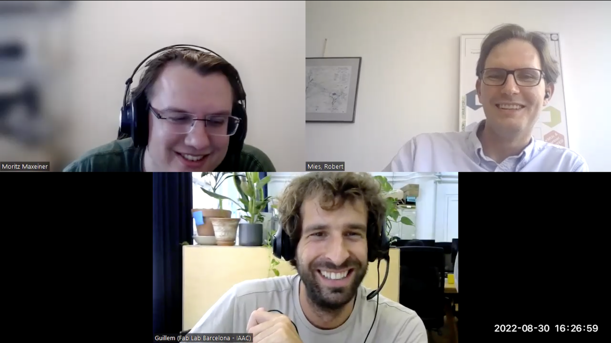

# Interview: Smart citizen kit

*by the Open make team, . Copyright to the authors, distributed under a CC-BY 4.0 licence.*

**Sections:**
- [The project](#the-project)
- [The hardware](#the-hardware)
- [The research outputs](#research-outputs)
- [The participants](#participants)

*Banner image: fixme, By CERN, distributed under a CC-BY-SA 4.0*

>Interviewee: fixme
>
>Interviewers: Robert Mies (TU Berlin) & Moritz Maxeiner (FU Berlin)
>
>Transcription and editing: Diana Paola Americano Guerrero, Robert Mies, Fabio Reeh, Moritz Maxeiner & Julien Colomb

*Screenshot of the interview.*

Fab Lab Barcelona is a part of the Institute for Advanced Architecture of Catalonia. It is one of the leading laboratories of the worldwide network of Fab Labs. It is home to numerous educational and research programmes in the field of digital fabrication. At Fab Lab, projects of different scales, from smart devices to new production models, for cities are carried out. 

One such project which was developed at Fab Lab is the Smart Citizen. Following up on the concept of building smart cities, Tomas Diaz, the former director at the Lab, came up with an idea of a DIY smart device which could be used to collect data from the citizens of a city, so that the data could be visualised and analysed to understand how it could be used.



 

*Photos of FIXME*

- Main website: https://smartcitizen.me/
- Project start: 2012
- Core development team size: 30-40

### Hardware products
So basically, the device is composed of what we call the Smart Citizen Kit, which is the central concept around having a minimum set of tools to measure the environment.

This includes a data board, which is basically an open hardware data logger. That can store data locally, also can store data on an SD card, can send data over Wi Fi, can work in different ways and can be powered by solar panel, like batteries, etc.

### Hardware maturity
So, the B2C channel, has a high TRL (Technology readiness level), because you are sending devices i.e people are buying devices and devices should work.
And in B2B case, the TRL is lower, because I think that maybe, they go from the lab to deployment in a month.
### Rebuilds
Well, our device doesn't fully comply with Japanese radio, magnetic, electromagnetic frequency, legislation and etc. So, they had to do certain changes in the board to certify and to be able to use it in Japan.



## The project

 
This project started here at Fab Lab, Barcelona, in 2012.
At that time, the concept of smart cities was fairly new and confusing and we decided the best thing to do was to start prototyping the smart city by ourselves.

Students could install the sensors on their balconies, they helped us prototype this idea of "citizen as infrastructure".

To scale up, We did a crowdfunding campaign in Goteo in 2012, and then a bigger crowdsourcing campaign in Kickstarter in 2013. We saw a lot of people just buying the devices, but not actually engaging in the vision that we originally had.



> How did it all start with the Smart Citizen Kit?



So well, this project started here at Fab Lab, Barcelona, at The Institute for Advanced architecture of Catalonia. Officially the project launched in 2012. But just to give you a bit of perspective, here at the lab, we were questioning what is up there. 
So when people started to talk about the smart cities, we were asking ourselves actually what smart cities are, and what smart cities would be; and we were, confused by all the ideas that were being promoted, mostly by big corporations, but also being followed by some city councils, I just say some because at this time, the ideas were a bit new and not as adopted as they are now. So, at that time, we decided the best thing to do was to start prototyping the smart city by ourselves. And so, Tomas Diaz, who was the former director at the Fab Lab, now Foundation director at Fab City, had this idea to build a small DIY sensor kit at the lab. And let's start collecting data to run. First collecting of  data and actually seeing how this data could be used. But then at some point, also, how do you collect the data? and at this point, during the first term research studio, at the Masters in Advanced Architecture, he said, if we asked the students to build their own smart city, let's say, by installing sensors outside their balconies, collecting data, and then researching ways to visualize that data and to use that data on the overall design process, and thus we were doing these across the three months period. And we realised that we originally just wanted to buy some kind of existing equipment, but we figured it was too expensive. The companies that were already selling some sort of a smart city equipment, were not selling at a price that we could afford as makers and not as students. 

So, at this time, we developed the original kit that we call the Ambient sensing kit. And these kits actually never went public. But it showed us that the students could install the sensors on their balconies. And they could be a prototype of this idea that we liked to call for a while the citizen as infrastructure, or the idea that the citizen is part of the making of the city infrastructure. So, let's say, most of the people see themselves sometimes as a consumer in city environment, right? They don't see themselves as actually the ones making the subway system, they use the subway system, but don't make the subway system.

So, students helped us prototype this idea. When this happened, or after we finished, these students were actually led by Tomas Diaz and already Marco Polo. Both very important people here at the studio. We realized that actually the idea works in a way and also worked at a really minimal scale. And actually, we were thinking, okay, why don't we try to scale it? No, what if we try this idea that we tested with let's say 50 students in Barcelona, what if actually we involve real citizens? Or in a way? Is it just something that our students did, because we asked them to do? or is it actually possible to engage citizens to do something like this? to install devices on their houses to collect data and also to share it, to put it in very simple words. 

We did a crowdfunding campaign in Goteo, which is the local crowdfunding company here in Barcelona, which is mostly focused on open-source projects. So, and these basically targeted the local community of geeks, you know, of the city who bought one of those devices, installed it, and that's how we basically, kind of, not fully validated, but at least had an idea that there was an interest for this kind of projects. And hence it was possible outside the scope of the Fab Lab, Barcelona, outside the scope of IAAC, to use this kind of tools and to show, to test this idea that actually, we could talk about, or we should talk about smart citizens and not smart cities. And actually, through these crowdfunding in Goteo, which was in 2012, more or less approximately was the first time that we actually call the project as smart citizen. So, this was the official public launch, that then went into a bigger crowdsourcing campaign in Kickstarter. And this was about in 2012, we are now in 2015, more or less the, the Kickstarter was 2013-2014. And at that time, we figured, we actually had a map of the world full of points, but in reality only few people were engaging into keeping their devices online. So, we saw a lot of people just installing the devices, or maybe not even installing, buying the devices, but not actually engaging in the vision that we originally had. While how, let's say a smart city could become a city of a smart citizens and contradict with the original idea, no?. 


 
We research why people, even though they were interested in the device, and were buying it, were in reality not fully engaging in the full process of collecting or actually using this device to create change in their cities, that is, why were they not using this device to actively contribute. 

We consolidated the project not as a startup that's trying to make sensors and sell them, but as a platform for open participation, not only of citizens, but also of scientists and experts.

The reason I see so many people engaging in the project is to learn. [Our project] work as knowledge transfer and knowledge engagement tools or platforms.




At this point, what we need to understand is that one of the communities that had helped us test a lot of the devices, was the one in Barcelona, but also the one in Amsterdam, by Bach Society. So, collecting, all the insights that we got from Barcelona, from Amsterdam, particularly from Bach Society, using this device on the field, we decided to put together a research project. Where actually, we will start assessing why people even though they were interested in the device, and were buying it, were in reality not fully engaging in the full process of collecting or actually using this device to create change in their cities, that is, why were they not using this device to actively contribute. 

And we found out that there were four main issues, the first one was that the technology was not reliable enough, so it was actually sometimes hard for people to get the technology to work. More than reliability,it was actually hard to install it. So, the problem was not only about the reliability, but it was maybe even more about the user friendliness of the technology. 
The second one, was more on the meaningfulness of data. Okay, so for many people, 65 decibels : is that noisy or not noisy ?
The other one was actually about the lack of community engagement. So, you might find people buying the device, but not sharing it with their neighbours. So, in actuality, you're alone, playing with something. And basically, that's all, there's a long list of issues that we found out that we wanted to address. 


 
- the user friendliness of the technology
- meaningfulness of data
- lack of community engagement

How you set in place the training of trainers, procedures, so that communities are self-sufficient

Sometimes hardware is a bit more complex than software. You need to spend more time explaining to others why you take a decision



Hence we put together that project which we call "making sense". And this was the first project where, we started to approach the idea of participatory sensing, or the idea behind a smart city in a more formal way. So, let's say, trying to understand it's not only about the hardware, nor is it only about the software, it's actually about the world connection between the citizen participation and the technologies that we set in place. And we develop a framework where it's based on the idea of sensing or measuring, the idea of awareness. So actually, understanding the data we collect, and how through awareness, we trigger action. So, it's not only about collecting and complaining, but also about collecting and explaining, collecting and changing. Let's say, the overall environment, in this case, through data. And after making sense on a bunch of other research projects and continuing it, in a particular one, which was called iSCAPE project, focused more on what was always a big and pending subject for the device, which was how to measure air quality properly, because the original device was good at measuring simple things like temperature, but not good at measuring things as air quality. So, we continue with this project called iScape and others such as organic city, for example, that we work a lot on the idea of visualization platforms, etc. All of them arise on 2020 projects. 


 
It's not only about the hardware, nor is it only about the software, it's actually about the world connection between the citizen participation and the technologies that we set in place.



This led us to release maybe four years ago, what was the version 2.1 of the device, which basically became the next successful commercial hardware that we'd release and the one that now it's kind of the default. There are many versions of it, but it kind of became the new platform that solves many of the issues that we had in the past, on data consistency, on being user friendly, etc. and also help to consolidate the project not as a startup that's trying to make sensors and sell them, more as a platform for open participation, not only of citizens, but also of scientists and experts who contribute more on the design of the hardware, on the design and the research of the sensors being used and also the data processing part etc. 


 
It's part of the Fab Lab Barcelona, it's not like a spinoff, we can manage it from here, there's a team of researchers that work on a research area that we call "Sense Making".

Smart Citizen is managed by a team of two full times. That two are who manage the day to day of the project. But then we are a team of 30 at the Fab Lab.



The project right now continues to evolve. It's part of the Fab Lab Barcelona, it's not like a spinoff, we can manage it from here, there's a team of researchers that work on a  research area that we call "Sense Making". And inside that area, we've developed multiple projects around this knowledge, some or most of them using the specific hardware that we design, and the software does makes it an ecosystem, let's say, but also looking always at the edges.  And trying to bring in new fields. For example, we just finalized our project where we map the microbiome of Barcelona, the bacteria that lives in Barcelona. Consider it as, we do something that maybe 10 years ago we were not thinking about. Where other species that co-habit around us, so Sense Making basically is the area where we look at all these things, and we continue to develop. 

Basically, the Smart Citizen project right now is used in research projects, where we have active partner researchers. In research projects where we don't have an active part, we just support other institutions, whether for open hardware or open software to do that, and also for commercial use. Commercial use that are connected to environmental institutions, citizen communities all over the world that either purchase the devices directly from us or purchase through some other distributors. And maybe just to wrap these up, what we are now most focused on, is consolidating the use of the Fab Lab network to provide support in the use and manufacturing of these devices. That means that if a community, let's say, in Santiago, Chile wants to use that device, it's not reaching us directly, it goes to the Fab Labs there. And we are providing the capacity to the Fab Labs there. Not to make the full electronics, for example. That's something that for economies of scale, we always make in a way, which is more or less centralized. But for the final assembly, the enclosures and more importantly, for actually the technical support and the community and engagement support. You know: what are you measuring, why you want to measure, why you want this sensor or another sensor?


 
Citizen communities all over the world that either purchase the devices directly from us or purchase through some other distributors.

We are providing the capacity to the Fab Labs locally, for the final assembly, the enclosures and more importantly, for actually the technical support and the community and engagement support.

Something we always need is to use the word kit.
The liability is not on the manufacturer, it is on you who are assembling that.

Some Japanese people developed and end up with a version of the device, which is fully compatible with their own country legislation.


> That was a lot of necessary background. Did you resolve the bottlenecks you mentioned earlier, about the reciprocal processes ?


I would say yes, a problem is never fully solved, and that's the truth. The only way to do the project is to confront yourself with reality. So, what's more important, as I was explaining you before, everything we did was always tested, we never do tests alone here in the lab, we never tested with just one community in Barcelona, but with communities all over the world with big research projects. So, in a way what we actually test  if our ideas work, and if sometimes they fail, and then we have to redo them. But yeah, I'll say that on the technical part, I think we achieved a level of maturity that we are very happy with. In the level of data quality tool, no one was believing, let's say, in the local sensors we found ways to actually do a much more scientific assessment of the data we collect, of why we choose certain ways of measuring things and not others, etc. I think something important still is actually considered knowledge transfer, which means, how you set in place the training of trainers, procedures, so that communities are self-sufficient. To actually solve the issues they are tackling, collect the data they're looking for in an independent and resilient way.


 
Everything we did was always tested, with communities all over the world with big research projects.

What is very important to us at the end, is to find people that provide contributions more than being experts in something, they become experts as it happens.

I think that's very beautiful, in the way that disciplines are combined.

We distribute the work mostly, as coordinators.



> What is the overall budget of the Project?



It's something that might sound a bit weird, but I never had the time to do a proper calculation. But I could average that we are around 1 million euros. 
Just to get an idea. The contribution of projects such as 'Making Sense' was 200,000. 'iScape' was closer to 400,000. So, if you put them all together, at the end, it's about 1 million. I mean, if I consider even the projects running right now would be we'd be on that. And maybe even a bit higher. Because you know, there's projects, that sometimes we do have some parts connected to the Smart Citizen project, and there's parts which are not connected to it, but yeah, the overall is approximately that.


 
I never had the time to do a proper calculation. But I could average that the bedget is around 1 million euros.


## The hardware

> What hardware products have you developed around the Smart Citizen Kit?**


We come from a mindset that's not that much product oriented. With projects like these, also for us as a Fab Lab part, it's a bit of a statement of how we can reconsider what products are, right? So, for example, something is very clear from the beginning that is, this device doesn't have an enclosure per se, there's a full repository full of different enclosure designs done by us or contributed by others. And actually, when we work on a specific deployment, we may customize the enclosure, we may ask the community to make the enclosures themselves, based on some of the designs that we publish. So, it's an interesting process. With consumer appliances they have a specific shape and a specific look that you buy on a blister or somewhere and you open and that's a bit different. That's one thing that we were doing to the products but in detail, let me list them. 

So basically, the device is composed of what do we call the Smart Citizen Kit, which is the central concept around having a minimum set of tools to measure the environment. This includes a data board, which is basically an open hardware data logger that can store data locally, can store data on an SD card, can send data over Wi Fi, can work in different ways and can be powered by solar panel, batteries, etc. And then minimally when we call the Urban data board, which is a board designed with sensors to measure the Urban environment, from particulate matter to noise, temperature or humidity. On top of that, this was a basic kit. We start adding more accessories, which could allow us to adapt this device to any specific location, let's say we want to put it on a bike, so a GPS or we want to put it in the middle of the ocean, so waterproof enclosure and solar panel, but also to extend it with much more advanced metrics. So, we have a set of components that allow you to extend it with electrochemical sensors for measuring much more specific air pollutants, or let's say waterproof to actually measure pH, water conductivity and values such as these. And when we assemble this kind of bigger systems, we call them as stations, and a station is not the single design it's stations in plural, it's how we call our platform that enables us or a researcher to configure complex systems. 
What's good about that is either when you use the stations or when you use the kit, the hardware platform is the same and the configuration platform is also the same. And that's something that many people value. You could design a system, which is quite high end, when it comes into the number of sensors it has. And yet, the installation process is still the one that even a citizens could install it. So, you could cap this big box, that costs 2000 euros,  let's say, sensor for water. And you know, and you could still configure it using the kind of user-friendly system that you use for the kit, which is something that's small.


> How would you classify the product, are there only electronic parts, or are there electrical or mechanical parts as well?



That's an interesting question. Something we always need is to use the word kit. And this word is very important. That's like the same when you buy an airplane as a kit, I don't know if you are familiar with this, but you could buy airplanes as a kit and assemble them yourself. The liability is not on the manufacturer, it is on you who are assembling that. And that's very important when you work with this. Because you know, when you are iterating as fast as we do, in particular not for the main kit, but for the kit and all these accessories that are around. We cannot certify everything as a bundle, we make different configurations, and we allow people to do configurations on their own. So, the idea of the kit means that you purchase the components separately, and then you assemble them. 

Going into what you asked, the basic part is a set of electronic components, we say that because these are the parts which are harder to access. These parts either you buy it assembled completely or it's very hard for you to assemble, even to source an electrochemical quality sensor or buying one per unit, it's not something that a general citizen or general person could do. Then it comes all the mechanical part that supports the installation of that, some that we supply, some that you could 3d print, some that you could buy from external suppliers. And these actually, is what together makes the bundle, when it comes to the hardware. Which at the end is like the tools for the specific transducers and the specific microcontrollers with the data logging capabilities. And then the mechanical system that supports those, we'll have to say at the beginning, the mechanical systems were very minimal because the device was designed only to be installed in balcony. We now have devices installed in bicycles, devices installed in boats, devices installed underwater. So actually, the mechanical design has become more and more complex. Yet as being part of the Fab Lab network. This isn't a scale of manufacturing that is highly scalable. Let's say, it's hard for a Fab Lab to do certain electronic manufacturing processes. But it's easy for a Fab Lab to make mechanical parts at the size that we are talking right now which is let's say smaller than one cubic meter. So that we benefit from that a lot.


 
So, the B2C channel, has a high TRL (Technology readiness level), because you are sending devices, people are buying devices and devices should work.

And in the B2B case, the TRL is lower, because I think that maybe, they go from the lab to deployment in a month. 
they're the ones mostly used by scientists, who want to be at the edge of what's there.


> How would you rate the maturity of your products in terms of prototype, demonstrator or market-ready product?


So, we keep two lines. We always have a version of the device that is sold directly to customers as a standard product, which mostly is sold by Seeed Studio, which is a Chinese company that makes the electronics and then sells it to their retailer, their distributors network, and also sells it back to us. And then we keep our own, what we call it B2B channel. So, the B2C channel, has a high TRL (Technology readiness level), because you are sending devices, people are buying devices and devices should work, so devices are also tested. We'll say we had a TRL line, or even higher because people bought it, installed it, and it works. 

But then we also have a lot of other work, which is more on these kinds of B2B field, so it's more for companies, communities, research centres that contact us, and we help them not to do something fully customized from the beginning but we assemble things based on the hardware ecosystem and the software ecosystem we built. And in this case, the TRL is lower, because I think that maybe, they go from the lab to deployment in a month. And that of course, is the beauty of it, keeping these two things in parallel, because one thing benefits the other. Actually, if you look, you'll see PCBs, which are in white, are PCBs, that are, fully tested. And PCBs in black are kind of the pro PCBs, they have a lower TRL and are the ones that work in the lab, but they're being tested. So, they're the ones mostly used by scientists, who want to be at the edge of what's there.



> You have already mentioned Seeed Studio as the manufacturer, but has this hardware been built, produced or modified by others independently?


As far as I'm aware, many people use the documentation on sensory integration that we provide. We don't design our transducers from the ground up, we go for a company that makes a temperature sensor or an electrochemical sensor, and then we integrate it. So, when we integrate, we document actually how you integrate that sensor and what decisions we take and how we evaluate that. So, we know many people actually takes our guides, as a way to support the integration of these sensors or similar sensors into their products. Which is different than forking the wall design, you're just forking a bit of your design, like it happens in open source many times. This thing we know it happens. And then of course, we also know of specific cases where people fork our device directly. For example, I know a particular case, well, so our device doesn't fully comply with Japanese radio, magnetic, electromagnetic frequency, legislation and etc. Right? So, they had to do certain changes in the board to certify and to be able to use it in Japan. So instead of us doing that, this was done directly by some Japanese people to end up with a version of the device, which is fully compatible with their own, with their country legislation.


## Research outputs

 
And to summarize everything, I'd say publications, open documentation and open books (not scientific or peer reviewed publications, yet, very relevant), open data (let's say, environmental data), open source hardware and software.


> What were the envisaged outputs of the hardware development in terms of the hardware itself, prototypes, publications, documentation, learning about the processes involved?


We contributed a lot of information on the use of local sensors, the involvement of citizens in the collection and also the use of open data. That goes from the documentation that you could find online and into publications. I'll say that in this project the impact, it's more in the documentation that we released, than in a specific scientific publication. But I think for the size of the project, what actually is more relevant, is the amount of information you'll find in the Smart Citizen Website, from the docs of smart citizen that includes all the documentation, to the books that have been published related to that. For example, the Making Sense participation book suggests, the data that has been contributed by citizens into the platform itself. Because something that we haven't talked that much is that while people collect this data, this data by default goes open into a platform.
And when you install one of those devices, you need to make the data open for others to reuse it. Recently, we added a feature where you could close the data. And for that, you need to have a specific role of a researcher, and to become so you need to request officially in the forum. And the idea of closing data is because we are starting to work with data, which is very sensitive, such as, for example, location data of bikes. And that's not something you want to release openly. But what I'm trying to say is that all this data is there. And this data doesn't mean that you could just go and look for the sensor in the middle of New Zealand and use that data to tell if there's air pollution or not. Because you don't know how that sensor is installed. Yet the sensors aggregated, has a value to help you assess the performance of the devices, benefit you build models that might help you, for example, not only to improve the data, or the quality of the data, but also understand when there are issues on one device. So, there's a lot of open data that has been published. 

And to summarize everything, I'd say publications, open documentation and open books (not scientific or peer reviewed publications, yet, very relevant), open data (let's say, environmental data), open source hardware and software (which is also going to do a recommendation on open data such as on repositories like GitHub), you could find a lot of different software and hardware projects that we develop that make this project. And finally, I will say a kind of a more broader contribution is, how we'd helped policymakers adopt the wording of Smart Citizen versus the smart cities, and also how we have shown that the Fab Labs could actually make specific tools that not only support the fab lab users into making their own things, but also support society in a much more broader way, or how Fab Labs contribute in the idea of city making, of making tools that makes it feasible to transform cities.


 
I'll say that on the technical part, I think we achieved a level of maturity that we are very happy with.

What's good about that is either when you use the stations or when you use the kit, the hardware platform is the same and the configuration platform is also the same. And that's something that many people value.

While people collect data, this data by default goes open into a platform.

We helped policymakers adopt the wording of Smart Citizen versus the smart cities.


> Did you publish any project findings related to the hardware itself? And if so, what have you shared?


Everything that you need while using the Smart Citizen Kit or the Smart Citizen platform, is fully open source, from the hardware to the software. The hardware is always released in two ways. First, its released in GitHub, or in a git repository. We use GitHub, where we usually release the hardware, together with the software that runs on that hardware. But on top of that, what's more important is not only to release the design files, it's also to release all the knowledge behind why we take these decisions, know why we decided to make it in that shape, why we decided to actually use that particular manufacturing process, how actually you could assemble it. Sometimes we forget, all these things which are around that are also important. It's not only about releasing the design as an STL file or in a STEP file. And that's why we spent a lot of time during the last years building this documentation, which not only information on the users or how users could use it, but also in how you could replicate it. And if you go there, you'll see there's information more targeted into how you install a device, but also, there's information on how you make an enclosure. To give you an example, let's say what decisions we took to implement that sensor or the other. 

And with all the things on top of releasing them, we also try, but not always, to release them as peer review publications too. In particular, when we finished one of the biggest hardware iterations, which was a 2.1. We released that article in HardwareX, where we actually explained the full ecosystem for other scientists to replicate it. We know that the data we will publish, will be updated and the information in docs.smartcitizen would be much more relevant. Yet we also know that was the only way to ensure, first, to have something peer reviewed. Second, to have a DOI; so, to have something that you could cite in another publication.


 
We use specific journals such as HardwareX, and
Git repositories, particularly GitHub for software and hardware.
Then we also use a lot of websites, which run on top of Git for version control. In this case, we use specific study documentation generator, called Material for MK docs.
When we finish a big milestone, we archive all the GitHub repositories into Zenodo.

The information in docs.smartcitizen would be much more relevant. Yet we also know that [publising in hardware X] was the only way to ensure, first, to have something peer reviewed. Second, to have a DOI; so, to have something that you could cite in another publication.

And people sometimes they forget that open-source solutions are also a way to create sustainable models.



> You have already mentioned HardwareX and GitHub, have you used any other platforms for publishing? And why did you choose these platforms?


We use four platforms. We use specific journals such as HardwareX, the one we like a lot. Now, we are starting to prepare another publication on a different project called ROMI, which is robots for micro farms and also other open hardware projects which we are still developing. So, Journals, Git repositories, particularly GitHub for software and hardware. We also like the idea of using it for hardware, hence using version control for hardware is something that is very important, hope we get better tools for that. Then we also use a lot of websites, which run on top of Git for version control, yet they present to the user as web pages, that's like the latest one I showed you, docs.smartcitizen. In this case, we use specific study documentation generator, called Material for MK docs, but within a scheme called Material which we now use in all projects, because we like it a lot. And finally, we use Zenodo, which is an archiving platform by CERN. And we mostly use that to store big datasets. So, we design our data analysis workflows in such a way that, automatically when we finish a data analysis procedure, they publish things to Zenodo. So, we don’t use it for hardware, we use it more for the software part, yet the software is fully connected with the hardware. And also, a small detail, when we finish a big milestone, we archive all the GitHub repositories into Zenodo. So, we get the DOI and have a tarball too. This is a best practice that we see is good, you know, in case that one day we disappear, and suddenly Microsoft closes GitHub maybe the Europeans will have something to do, and they will still have things in Zenodo properly archived.


> Are there any parts or information that you do not publish? If so, why?


It's a good question. Actually, we could make it available. One of the beauties that we use,  HackMD, for this internal note, is that it's easy to share with others. And we share it with a lot of collaborators or people that are interested, but it's true, as you said that we don't have a public archive with all those. And  there's no reason not to do it. Because at least at the moment, in the way we work, we could disclose them, there's no reason to not do it. 

I would say an important thing is not to confuse people. And the truth is, when you release lot of information, sometimes, you also have to add a lot of warnings and writing warnings takes time. So that's something important. And this happens when you start to have multiple versions of hardware, software, etc. I say, sometimes hardware is a bit more complex than software. You need to spend more time explaining to others why you take a decision, or please be aware that these two things are not the same and these things take time.


> Is there some information you're holding back because you're afraid that it could be unsecure otherwise?


I mean, yeah, we don't release the passwords, of course, or the public keys of our servers. But what's true is that all the software that runs this kit is open. So, you could go to GitHub, and you can install your own platform and run it. So, there's nothing that we hide in the way it's configured or done.


> In your view, what generally deters or hinders projects from publishing results?


I'll say that mostly two things. One, is time. It takes time to do that. And, to invest time, you need to perceive there's value in doing so. And I'll say maybe people, they don't see the value of doing that. And I think the value has a lot to do with the culture. So, by culture I mean, unless there's a culture of sharing, a culture of actually reusing the results from others, a culture of explaining yourself through results, it's hard that people find value to do so. And that's something very important to promote. I hope we see more and more scientific publications, which are backed by releasing the software they use or the hardware they use and documenting it properly. Because that's sometimes more important than just the conclusion that you achieve. 

The other one, which I'm not emphasizing that much, because maybe you know more about it than I do, it's when we talk about exploitation, intellectual property, etc. Now, that's a different field. In which one maybe, many people are a bit confused. Let's say for example, what prevents Google from releasing in a smart citizen, or Aliexpress to start shipping one, is not that it's not public. It's not that it requires an open hardware license, if they want to do that could perfectly do it. Many of the things are hardly patentable, the only thing you could do, maybe, it's a model of utility, you are not inventing something that actually a game changer. I think sometimes people don't understand properly about intellectual property. They'll think that just by not releasing something, you will prevent others from stealing it, and I think, sometimes you need to understand that the best you could do with your ideas is to share them as a way that they create impact. As we like to say at the Fab Lab, there's always three options that you should consider when you do a project like this. Either it is because you like to make a smart citizen, and the best way you could do it, is to find a business model to make a smart citizen for all your life. The second is because you want to change the world and create, in fact, then look for a way, which makes people copy you as much as possible, so the impact grows. And the last one is that you may want to make a lot of money because you have a better idea, that's not a smart citizen. And then maybe you need to protect it and try to find a business model around it, that makes you to create a startup and sell it soon, to make a lot of money. So, it's important, to understand why you are doing things. At the end, what you need to understand that it's about, how you got into the project sustainability. And people sometimes they forget that open-source solutions are also a way to create sustainable models.


> What would you say was successful about the project and what wasn’t?


So, I'll say what was successful, was the impact it has created, the societal impact created, we see, a lot of people look at the smart city with different eyes. They criticize what the smart city was meant to do. And they were able to come up with new ideas and to consider what's the role of the citizen there. So, we see, that has an impact. That's something we did good. We also saw that this project has shown many other projects that, open hardware is a reality, starting from the Arduino. And then just to build a very well-known project, and then also all the child projects, how they evolve, the Red Rock project, etc. 

This is the reality, if I'll have to criticize the project, what I will say is that, despite we being many years on that project, it's still hard to find massive adoption of these tools. In particular, I think, the situation maybe at its worst now, than when we started the project. More and more people have a relation with technology only as a consumer, people don't want to spend time understanding how technology works, people don't want to spend time actually empowering themselves to different things. People, they just like to live in this kind of fake reality, where technology such as apps makes you feel that you're actually doing something, but most of the things you are doing are actually guided by the application. And I think these things are worse now, than when we first started the project. And which is sad, because we do these projects only because scientists, engineers, they build on top of them, we also do this to explain that we could have a different relation with technology. And it looks like we are always hurried by time. And we are always choosing things that are the easiest ones to do and the easiest ones to use. And it's sometimes hard to see how a project like this actually will have an impact not only on development, research, engineering, but also on the consumer scale now.

 
## Participants

 
It's a project that had helped me a lot, personally, to learn, because it's the kind of project that connects many things together.

It confronts you with the realities and you implement decisions sometimes in the morning especially in software, and then in the afternoon you are testing them.
the idea of working to be at the edge of technologies.


> What made you work on this project?


The most important thing for me, and that's usually why I like to work in project, is to learn. It's a project that had helped me a lot, personally, to learn, because it's the kind of project that connects many things together. It's a project where there's a big part of engineering, which is software and hardware too. And there's also a very big part, which is mostly more connected to society, to working with people, and for me, these projects where they confront you, as a designer, as an engineer to work, from software to hardware, you start the day with hardware, then you go into fixing something in software, but in the afternoon, you have a workshop, and you have to go and put yourself in front of 30 citizens, which are complaining about air pollution under a bridge and actually have to work with them to look at the data they collected and then analyse it, either you or someone who can help you on that. But actually, it's very beautiful, because it's not only working in the lab environment. It confronts you with the realities and you implement decisions sometimes in the morning especially in software, and then in the afternoon you are testing them. And that's very beautiful and it makes you much more aware of the impact of your decisions.
People who maybe making a comment on Facebook or Instagram ads, they actually know about the impact. But when you work that way, you confront yourself with the impact of you, and I think that's very relevant and it's something I enjoy a lot. And then also the idea of working to be at the edge of technologies. I mean now, as a matter of design, it's not edge technology anymore. But in 2012, designing connected devices actually meant that you had to be a bit on the edge. So, you had to invent many things from the ground up. And nowadays, there's plenty of standards about how you connect devices, how you onboard the device to the internet etc. At that time, many of the things which existed were not mature enough. So, at the beginning, we had to actually come with creative solutions sometimes even breaking standards. And I think that's also nice. It's a way of doing engineering that, in a way, is bad, because you break standards, and then you have to fix them years after, at the same time they put you between these much more creative approach to technology, maybe that happened a bit more at the beginning, for example with computers. But then now we lost this aspect “let's invent everything from the ground up”. But I think that's also an important creative aspect, at least to learn as a designer how to do things.


> How many members have contributed to the project? And are there more in the hardware domain or the software domain?


I have to say right now I'm no more the official lead. There's Oscar Gonzalez from my team, who has experience here, with Victor Barberan and a full team of people. But I still try to be at least a bit involved, not to forget and to keep learning about how the things evolve.

The number of contributors is very big at the end. I mean, if I look at people, who have actually contributed to the design of the software or the hardware, I'll say we are talking around at least 40 people.
I think the hardware vs software team is more or less the same. The only thing is that contributions are different. It's hard to tell, because you'll say software is easier to contribute. Yet, in system like that, it is also doing a contribution in hardware. So, software is easy because the process is easy. But at the same time, you need to understand fully how the whole system works at a level that's sometimes in hardware where you could do kind of more satellite contribution, and yet it has an impact.


> What were the occupations of the people who contributed?


I'll say it's a mixture of engineers, designers and when it comes more into the co-creation guides and the citizen participation tools, also people with kind of social sciences backgrounds. What is very important to us at the end, is just to find people that provide most of the contributions more than being experts in something, they become experts as it happens, for example, Oscar Gonzales, who now is the lead of that project, he comes from the automotive engineering, he worked for Nissan many years. And then at some point with the diesel gate, and all the things, he started to be more concerned about air pollution, he joined as a part of the community, that was using a smart citizen, then he started to collaborate with us as a collaborator and then he became a complete part of the staff. But he's someone who arrived here with a background more on calibration, on data post processing for calibration of combustion engines. And then and now he's someone who's designing PCBs in KiCad. So, we see a lot of people learning the tools as the interest happens. So, it's very interesting. And also connecting with the idea that tools are more and more accessible. Designing PCBs 20 years ago meant having Altium installed and paying a license that was one year of your salary, and now we have it free, using open tools, which I'm not saying it's a regular citizen maybe, but we have engineers switching, for example, I see more and more engineers, which are, electronic engineers, willing to do a bit of CAD design so all these things are happening, I think that's very beautiful, in the way that disciplines are combined.


> How many full time people are involved on and off over time? How many people are co tributing freely? And how much time roughly?


Yeah, actually right now Smart Citizen is managed by a team of two full times. That two are who manage the day to day of the project. But then we are a team of 30 at Fab Lab Barcelona, which means that, there's all sorts of people coming in and out, but there's two full times that run these projects and then there's people coming in and out, for communication aspects, for writing documentation, shooting videos, doing a pilot and things like that. And the community around, it's hard to measure because it keeps going in and out. But I'll say there's always a standard group of around 10 collaborators that come in and out. Most of them nonpaid collaborators, which means that they just contribute to the project as Brain Parrot, for example, designing things because they are useful to them, and then they're sharing them. And then sometimes also paid collaborators like working on specific things like designing an algorithm for the calibration of a particular sensor, things like that.


> How do you co-ordinate the work of this key contributors?


We distribute it mostly, as coordinators. I mean, at the end, what we do, is that we set goals, and the goals go mostly in two directions. We have more of the research goals, which are more connected to the research projects that we are doing on that field. And then we have the requests that we get from the communities that sometimes are mostly linked to a customization service that we do for others. Basically, at the end it's always about speaking up forward, so the research we did today is useful in two years, by the communities and back and forth, and we keep testing that.


> How have the different members benefited from the work in the Project?


The reason I see so many people engaging in the project is to learn. I saw graphic designers who wanted to learn about software development joining the project, I saw citizens were complaining about noise pollution issues for years, joining that project, so now they actually know what a decibel means. I saw scientists that were actually willing to do their own hardware designs, because they were tired of buying instruments and then they wanted to do their own instruments joining the project. So, I see these projects at the end and the most important thing is that they are catalysers for knowledge. They work as knowledge transfer and knowledge engagement tools or platforms.

