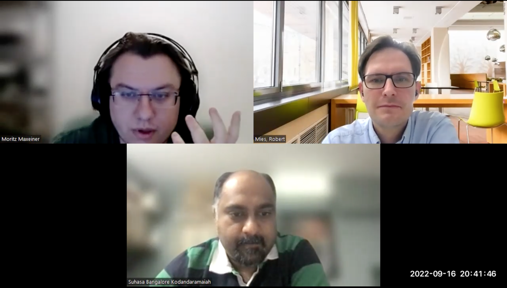

# Interview: Craniobot

*by the Open make team, Suhasa Kodandaramaiah. Copyright to the authors, distributed under a CC-BY 4.0 licence.*

**Sections:**
- [The project](#the-project)
- [The hardware](#the-hardware)
- [The research outputs](#research-outputs)
- [The participants](#participants)

*Banner image: fixme, By CERN, distributed under a CC-BY-SA 4.0*

>Interviewee: Suhasa Kodandaramaiah
>
>Interviewers: Robert Mies (TU Berlin) & Moritz Maxeiner (FU Berlin)
>
>Transcription and editing: Diana Paola Americano Guerrero, Robert Mies, Fabio Reeh, Moritz Maxeiner & Julien Colomb

*Screenshot of the interview.*

FIXME



*Photos of FIXME*

- Main website: https://github.com/bsbrl/Craniobot-2019-ver-1.0-
- Project start: 2017
- Core development team size: 8

### Hardware products
The Craniobot is an open source tool that allows you to do precise microsurgical procedures on rodent models commonly used in neuroscience research. It is a robotically guided tool to precisely chip away the bone of the head.
### Hardware maturity
somewhere between a refined, well put together laboratory prototype and a turnkey. The labmaker version is more mature and is produced commercially.
### Rebuilds
Labmaker is selling it. Few groups have rebuilt it, making improvements in the hardware and the software.



## The Project

 
There was a clear need within my group that I needed to solve. Like I said, solving this for us meant solving it for a whole bunch of other people. 


>How did the project Craniobot start?


The Craniobot is an open source tool that allows you to do precise microsurgical procedures on rodent models commonly used in neuroscience research. These models, including mice and rats. They can be bred up in the lab quickly and their brains are very similar to humans. For instane, humans and mice have parts of the brain for processing visual information, the visual cortex. They're good analogs. 

Whenever we need to do anything to interface with the brain, for instance to insert electrodes or implant windows on the brain to image or visualize neural activity: it involves a procedure called craniotomy. Craniotomy is a process where you remove the skull on top of the region of the brain, that you want to access. That can either be replaced with, for example, a glass coverslip or it could be a burr hole through which you insert an electrode. If you want to do any invasive neuroscience experiment, that is the first step you do. It's challenging because the skull of a mouse is really thin in the range of 50 micrometers to a few 100 micrometers depending on where you are. 

Traditionally, craniotomy has been done by neuroscientists using tools that are adapted from dentistry. It’s similar to what your dentist uses to chip away plaques around your teeth. With this tool we need to do it very carefully. You want to only remove the bone and not damage the brain underneath. This was a nice process for us to automate. It’s a challenge for us and a lot of other neuroscience labs. We come from an engineering background. If you have a sense for how thick the skull is at a particular location and what the contour of the skull is, you can program a computer numerically controlled mill or some kind of robotically guided tool to precisely chip away the bone. All of this is done without shaking hands. That would be otherwise hard to do for beginner surgeons. There's a lot of skill involved. That is what motivated us to work on the Craniobot.

 
>What are the benefits of using the Craniobot compared to classical surgery?
 

It removes the damage to the brain completely. We’re talking about a very delicate procedure. There’s skill and speed involved. The faster you can complete the procedure, the better it is for the animal's health later on. The skill factor is relevant because everyone is different and had different levels of coffee in the morning. Your hands are shaking during a surgery. Humans are bad at performing precise motor sequences or activity repeatedly. If I ask you to follow a trajectory in 3D space multiple times, there's going to be a lot of jitter. That's precisely what you need to do for these kinds of procedures. That’s why a robotically controlled cutting tool is very useful. It takes away that variability in human motor activity. 


>How's the project funded? 

 
This was funded through lab startup funds, and a NIH grant for a PhD student for 2 years.



Initially, it was all funded through lab startup funds. This is one of the first projects we took up. If you start a lab at any university, usually you end up with some startup funds. Most of this was funded through those funds. Later, we had support from NIH. NIH is the National Institute of Health here. I guess it’s the equivalent of the European Research Council.


>How much overall budget did you receive?


It was a much larger grant for a bunch of related activities, because the project didn't cost a lot. The whole objective was to build tools that can benefit the neuroscience community. You don't want to build anything that's sophisticated and needs a lot of monetary resources. If you look at lab maker, they're selling it for about $3,500. It's a lot. Most of the money was used to support graduate students through their PhDs for their work. Graduate students in the US cost about $45,000 to $55,000 a year with stipend, tuition and health insurance.
We were funded for a certain period of time for a student to make this. This project took about two years from the ground up.

 
 
 
I was the primary supervisor of two students, Dr. Leila Ghanbari, who is now graduated with a PhD, and  Matt Rynes, who is still in the group. They worked together. Leila mostly worked on the engineering aspects, while Matt worked on the animal research.

We didn’t recruit them for this particular project.


>Could you explain the overall process, on a technical, project and community level?


Our objectives from a design standpoint were very simple. In the past, I had worked and helped on a related project, when I was a postdoc. We tried to do the same thing through impedance sensing. This means to recognize when a probe is going through the skull. When it does, the impedance drops. We tested here a force sensing method, which we thought was more reliable. We wanted to build something that was built for machining rather than something that's integrated into an existing surgical apparatus, in contrast to what previous architectures were exploring. This allowed us to take a CNC mill that's used by hobby woodworking enthusiasts. Our hobby woodworking enthusiasts use sustainable top CNC. You can buy it from Amazon for about $500. We want to do a force sensing based method. One of the innovations we had to figure out, was to build a contact sensor that could measure contact with the skull surface accurately enough, while applying very very little force. The mouse skull is soft, it's not a rigid structure. That was the primary innovation. Once we had that, we could leverage all the CNC routines and other things that people typically use in robots to control the machine. The impedance sensing method wasn't reliable for a number of reasons. We thought this force sensing approach is a more robust and alternative approach and that's what we wanted to do.


>How was the process organized? 


I was the primary supervisor of two students, Dr. Leila Ghanbari, who is now graduated with a PhD, and  Matt Rynes, who is still in the group. They worked together. Leila mostly worked on the engineering aspects, while Matt worked on the animal research. That was the bifurcation.


 
One bottleneck was focus on inexpensive mills. We wanted to make this affordable from the ground up. That meant that the mills aren’t very accurate.
We were trying to do this in animals, that added complexity. Some of these evaluations are much slower than if you're dealing with inanimate objects. The iteration cycles are quite slow.



>What bottlenecks did you come across and how did you solve these?


There were a few bottlenecks. One bottleneck was focus on inexpensive mills. We wanted to make this affordable from the ground up. That meant that the mills aren’t very accurate. It's not a sophisticated machine shop tool with the same accuracy. These mills have drifts. Because people will try to use this for very delicate animal procedures, we needed to be careful. We had to iterate a bit in that space. There was a trade off, you couldn't just buy the cheapest CNC mill available. We lost quite a bit of time dealing with this issue.


>Did you make it from the ground up or how did you design it?


We bought off the shelf parts. Some of them didn't work out because, from a control perspective, they weren't accurate and repeatable enough. We were trying to do this in animals, that added complexity. Some of these evaluations are much slower than if you're dealing with inanimate objects. The iteration cycles are quite slow. There's only one evaluation you can do in a particular day. You have to prep the animal, do your testing and evaluate if the instrumentation was working according to what it needed to be. Further, anything biological has high variability. Machine tools, that are designed for accurate machining of inanimate solid blocks of metal, are different from machining a soft living tissue. 


>What were the new aspects you developed and what existing designs have been used?


A lot of the components are off the shelf. The innovation came in from the system integration side. The main integration would be how to do contact sensing of the skull using very small millimeter scale forces. You accurately determine what the skull surface is and make use of that information. The other innovation is determining how to make use of the information: how deep do you need to go into the skull and in what regions? It’s a lot of experimental heuristics.


 
It has to do with the PhD-student academic advisor dynamic. When we started the project, both students were early in their training. This was more authoritative.
As the students became more independent, the decision making was more democratic, like in any mentor-mentee relationship.


>How were decisions in the project made? Was one person or the group responsible for making the decisions?


It was a mixture of both. It has to do with the PhD-student academic advisor dynamic. When we started the project, both students were early in their training. This was more authoritative.
As the students became more independent, the decision making was more democratic, like in any mentor-mentee relationship.


## The Hardware

 
You can break it down to three main components. 
- There's the CNC mill itself, that is off the shelf. 
- The. stereotactic apparatus: We had to develop a specific apparatus that allows to anesthetize these mice or rats and fix them securely within the CNC mill. We needed to build one that's customized to fit into a programmable CNC mill device. 
- The third component is the contact sensor.

We want to do a force sensing based method. One of the innovations we had to figure out, was to build a contact sensor that could measure contact with the skull surface accurately enough, while applying very very little force.

A lot of the components are off the shelf. The innovation came in from the system integration side.



>What hardware products have you developed? 


You can break it down to three main components. There's the CNC mill itself, that is off the shelf. We had to develop a specific apparatus that allows to anesthetize these mice or rats and fix them securely within the CNC mill. This is called a stereotactic apparatus. We needed to build one that's customized to fit into a programmable CNC mill device. The third component is the contact sensor. 


>How would you classify these components in terms of mechanical, electronic and electrical?


I would say the CNC mill itself is an electromechanical component. The stereotax is primarily mechanical. It's a structure for securing. There's nothing electrical. 
The contact sensor is a combination of precision engineered mechanical elements and sensing electronics. It's electromechanical.


>Does it have a software portion?


There's a software that we developed. It’s written in Python and MATLAB and does the overall control of everything. 


>How would you rate the maturity of your product? Is this more of a prototype, demonstrator or market ready product?


It's somewhere between a refined, well put together laboratory prototype and a turnkey. If you look at what LabMaker has done, they have a turnkey product now, that they're selling on the website. We spent about six to eight months with their engineers. Besides, people can take the designs that we have published and put on GitHub and other repositories. There have been a few labs that have independently got this system to work.


>Has this hardware been built, produced or even modified by others independently or with your assistance?


A few groups did it. York Winter's group is one example. They did a few design improvements and iterations to make the contact sensor more robust. They used different spindles. The tool is rotating more precisely and with less noise. There’re a few iterative design improvements that York Winter's group did. They were looking at it from a standpoint of making it more turnkey. They have created nice hardware interfaces. A second group is at Rice University. They improved this control software and they wanted to adapt it for a more specialized procedure. These are two examples which show the efforts. There are other groups who have taken it and modified it for various other applications.


>Were you working with these groups or was this independently?


Some modified it independently and I got to know about it from conferences. In some cases, they actively got in touch with us. 


## Research Outputs

 
The primary objective was the publication.
We took the time internally to build a refined version of the Craniobot, which we published as a follow up at Nature Protocols.



>When you started this project, what were the envisaged outputs of this hardware development process in terms of publications, journals, products, prototypes or documentation? 


The primary objective was the publication, but also building a tool that would be very useful in our lab. I didn't want new grad students coming in and spending months learning how to train and to do these procedures. I knew if we solved this internally, it could be a widely applicable tool. A lot of the open source push happened because of the response we got from the community when we started presenting this work. That was when some of the conversations with the York Winter happened. They were interested in taking open source tools and making turnkey products, that they sell out of their LabMaker outfit. This way the collaboration came about.

We realized that the initial prototype needed a bit of refinement, before we can start supporting other groups. Taking a laboratory prototype and providing those designs by themselves can be challenging, because there's a lot of troubleshooting. We spent a lot of time working with the early beta testers. We took the time internally to build a refined version of the Craniobot, which we published as a follow up at Nature Protocols. It was a multi-step process.


 
There have been a few labs that have independently got this system to work.
Labmaker is selling it.


>How was your first deployment of the machine?


There was no sudden finishing moment. It was a slow iterative refinement, until it worked well. Afterwards we thought about experiments to show that it works well enough.


>What did you publish about the hardware? What types of files and other information did you publish, like bill of materials, CAD files and assembly instructions?


Everything is accessible. We published a detailed, step by step protocol. It contains, for example, the CNC machine and what you need to adapt. We have a detailed protocol on how to put the hardware together. The protocol covers how to do initial testing in the benchtop, before you do surgical procedures on rodents safely and in a sterile fashion. All updated designs are available on our GitHub repository, whether it's software or CAD files. 


 
We published the hardware in the Nature Protocols paper.


>Did you use any other publication platforms other than Github? Did you publish any of the hardware in a journal?


Github is the primary repository that we use. We published the hardware in the Nature Protocols paper.


>Why did you choose these platforms for the hardware publication?


I think GitHub is mostly easy to use. We use Github internally to share files and repositories. Nature Protocols is the best place to publish procedural documentation. It's a nice avenue and widely read by biologists as well as engineers. 


>Did you encounter any type of barriers in your efforts to publicize on these platforms?


No, we perceived no barriers on these platforms. 


 
It's always a balance. How much do we need to take this further? If we take it further, what are the subsequent benefits to us and to the community?

We work in an academic lab and we've moved on to other projects.

>Did you have any problems somewhere else? 


Sure. It's always a learning process.  What's the best way to disseminate the tools? What's the best version? Do you continue refining? Is the software ready? Every group and end user is different. As an academic research lab, there's a huge bandwidth on tool improvement and refinement, for which we don't get academic credit. It's always a balance. How much do we need to take this further? If we take it further, what are the subsequent benefits to us and to the community?


>Did you try some solutions before you ended up on GitHub? 


We didn't specifically think about any other. We tried publishing the preprint of the protocol on an online repository, like bioRxiv.  BioRxiv has a policy of not publishing protocols, which is an interesting barrier. BioRxiv is about open science. They rejected us, which is the only rejection I've ever had from BioRxiv now, because their policy is to only publish new results or other kinds of prospectives. I don't think they publish review articles.


>What have you not published?


We have published everything, after the Nature Protocols paper, we worked with York Winter's group. This is as much as we can do. 


>Is the hardware development finished? How did you continue?


We're using it regularly within our group. We work in an academic lab and we've moved on to other projects. We help other open source tools that we've developed.


 
 It opened up a whole bunch of other approaches. It opened the idea that you don't need to have sophisticated tools to do this kinds of automation.



>What was and what wasn’t successful about the project?


Our lab and at least a few labs will benefit from the project. It opened up a whole bunch of other approaches. It opened the idea that you don't need to have sophisticated tools to do this kinds of automation. It takes time and work, but it's possible. That would be one thing I can point out. The second thing is the benefit to the community. There are quite a few groups that are building on it and automating other aspects of implantation. 
One direction, that we've taken, is to discover more precise, without contact and non invasive sensing of the skull thickness. I guess, it would be hard to make that open source, because it involves much more expensive optical coherence tomography and imaging. That's something that we're actively pursuing. It's an extension from a different approach. I don't know whether it will result in an open source tool, like we had envisioned when we originally started off.


>Do you have an idea maybe why people would not publish the results? Why did you decide to not make it open source?


It’s about the costs. We're trying to figure out if we can non-invasively and as a non contact fashion determine the skull thickness, because right now we're going in blind. That involves using OCT imaging, the imaging system by itself is pretty expensive. We're talking about €20,000. We could make it open source. I don't see any reason why we wouldn't. I think there's a difference between building an open source tool that costs €5,000 versus €30,000. The benefit of open sourcing is probably lost in those price ranges. 
We go for something that'd be open source but accessible only to a few select labs. 

For example, there's an open source, two photon miniature microscope that's been developed by the Moser group in Norway. And there's a single photon miniature microscope that's been developed by the UCLA group and a whole bunch of others built it. The two photon miniaturized microscope is extremely useful in terms to the value proposition, resolution or other capabilities that it brings. However, it requires a two photon laser, which costs €150,000. It can be open source, but it is going to benefit a significantly smaller number of labs, compared to an open source microscope that doesn't involve such a laser. 


## Participants

  
>What made you work on this project as assistant professor?

 
There was a clear need within my group that I needed to solve. Like I said, solving this for us meant solving it for a whole bunch of other people. We were in the right place and time to do it, because I straddled both disciplines as a neuroscientist and predominantly running an engineering group. We had the necessary skill sets to tackle this problem.

 
>How many members have contributed to the project overall?

 
Quite a few people assisted us who played supporting roles. Daniel Schulman did a lot of coding. Sarah did refinements on the surgical side. Greg Johnson worked on the mechanical hardware and structural engineering. Michael Laroque contributed to the mechanical design.

  
>How many people contributed overall?

 
It’s been 8 people in total.

  
>Did people outside of the university contribute, like LabMaker or Rice?

 
They contributed later on. Especially, Labmaker helps us. They have experience in taking lab prototypes to market ready products. Some doctoral researchers supported us from Rice University.

 
>Did you need any technicians from the university to step in?

  
No, we didn’t need them.

 
>Did some students participate in the project, for example by doing a thesis?


Jay was a master student. Matt was a master student and now he's a PhD student. He was doing his master's thesis. Daniel Schulman was an undergraduate student. 

 
>How did you find suitable project members with the needed competences? 

 
They just congregated. We didn’t recruit them for this particular project. We have a good engineering department who have a lot of the skill sets, that are needed for this project.  I had expertise about neural engineering and animal work, which is what I train them to do.

  
   
At any point, there was probably one student interfacing directly with me.


>How did you coordinate this work between these members of the team?

  
The engineers had specific tasks to do. Someone had to do the lab recording. Another one needed to do the animal research. Often, these tasks were staggered across time. Different people came in at different times and did the needed improvements, like refining a particular structure or mechanical part. At any point, there was probably one student interfacing directly with me.

 
>Is this kind of surgical method also used for humans? 

 
We've thought about it. It would be useful in humans. We've explored that a little bit, but we have nothing active at this point.

 
>Do you close up the skull after the experiments? 

  
Yes, definitely. In terminal experiments, the mice are euthanized at the end of the procedure. If it’s a survival surgery, you need to close up the animal and there are some procedures to do that safely and in a sterile fashion.

  
   
Leila directly benefited from this by becoming a research engineer in a big medical devices company.

This tool is the very first paper that came out of my group. To lead something was the biggest benefit.


>How did the members benefit from the work on the project?

  
For Leila, who was a PhD student, this is a significant part of her PhD thesis. This is generally true for most trainees in my group. They primarily come from engineering backgrounds and get to work in a very interdisciplinary environment, which is tackling instrumentation problems for neuroscience. That translates to a lot of work in the medical devices industry. Therefore, you need people with the engineering skill sets and quantitative skill sets to be able to speak the language of clinicians and biologists and come up with solutions in that domain. Leila directly benefited from this by becoming a research engineer in a big medical devices company. Matt, who was co-first author, won the University of Minnesota distinguished Master of Science thesis award for his work. That benefited his career. He has won a number of other fellowships since then. But this was the launchpad. Michael Laroque went from engineering to medical school and he tries to be a doctor. Daniel Schulman did a lot of the mechatronic aspects of the project as well as the coding. He's now a grad student in Michigan, where he's doing very similar things, but at a much finer and more precise application. 

  
>How did you benefit?

 
This tool is the very first paper that came out of my group. I benefited hugely, because I learned how to direct a research project and publish a paper, which is a huge learning curve for someone who's starting their own research group. Everything I did  previously was under the supervision of somebody else. To lead something was the biggest benefit.
