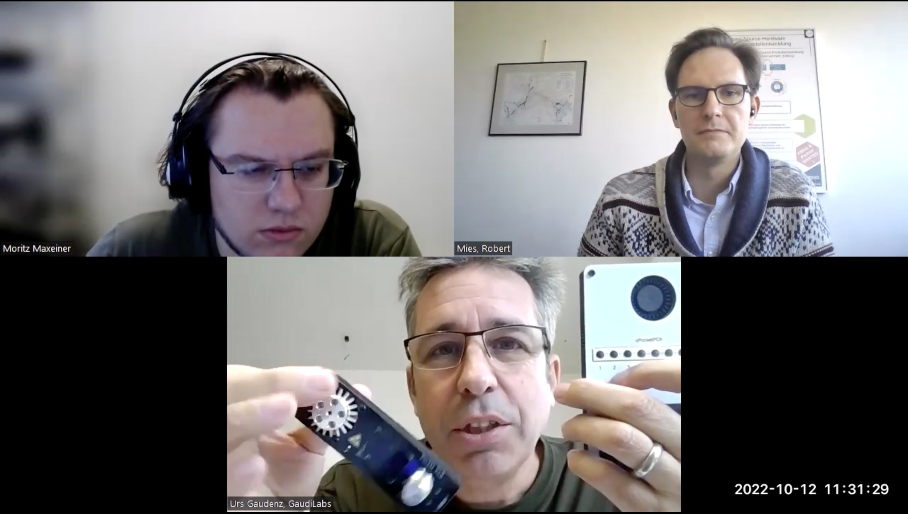
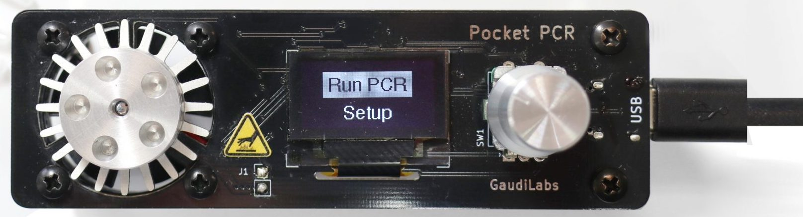

# Interview: GaudiLabs

Urs Gaudenz has been part of hackteria and similar open source hardware communities for a long time. Nine years ago, he started Gaudilabs, a "desktop manufacturing" company that is selling open source hardware produced in small scale. One of these product is the pocket-PCR machine.

*by the Open make team, Urs Gaudenz. Copyright to the authors, distributed under a CC-BY 4.0 licence.*

**Sections:**
- [The project](#the-project)
- [The hardware](#the-hardware)
- [The research outputs](#research-outputs)
- [The participants](#participants)

*Banner image: fixme, By CERN, distributed under a CC-BY-SA 4.0*

>Interviewee: Urs Gaudenz
>
>Interviewers: Robert Mies  >(TU Berlin) & Moritz Maxeiner (FU Berlin)
>
>Transcription and editing: Diana Paola Americano Guerrero, Robert Mies, Fabio Reeh, Moritz Maxeiner & Julien Colomb

*Screenshot of the interview.*



*Photos of a real Pocket-PCR machine.*

- Main website: http://www.gaudi.ch/GaudiLabs/
- Project start: 2019
- Core development team size: 2

### Hardware products
PocketPCR: a USB powered PCR (polymerase chaine reaction) machine for 5 samples at a time.
https://gaudi.ch/PocketPCR/ 

### Hardware maturity

It’s mostly used educationally and from hobbyists doing it at home.
It is not certified.
A new product to do quantitative PCR is in development.
### Rebuilds
None known (it is different for other GaudiLabs product)



## The project

 
At some point, there was always the question if you can make a viable business from open hardware and how to distribute it. I was interested on going a step further and not just doing the blueprints and collaborative development, but also go into a company and try to distribute and develop the product to a point where it's a commercial product.


> How did you start GaudiLabs, what relation does it have with Hackteria?



I came from micro engineering and was trained as an engineer. Then I worked for a consulting company because of my former education in innovation management. I learned more and more about technology collaborations with open communities. We worked in the consulting with designers, artists, creative people, and people from different traits. It's an interesting aspect to do engineering and technology in collaboration instead of on my own. 

While teaching at university, open innovation management became popular and I was teaching it.  At the same time, I made my experience in this open community. You mentioned Hackteria, it was one community, which is more directed towards biological art. 
We built a lot of scientific equipment for artists that could otherwise not access this technology. Besides, I was active in other global communities, like the Gathering for Open Science Hardware (GOSH), DIYBio or biohacking in general. We developed new ways to approach scientific instrument, the open hardware, and learned about publishing openly, sharing and collaborating. 

At some point, there was always the question if you can make a viable business from open hardware and how to distribute it. I was interested on going a step further and not just doing the blueprints and collaborative development, but also go into a company and try to distribute and develop the product to a point where it's a commercial product.
I kept the completely open character of the hardware and by this I kept the collaboration with other people in the world. Around eight years ago, I started GaudiLabs, which is a node in the network. It's sometimes described as desktop manufacturing. I don't have a big facility here. It's 60 square meters of office in the centre of Lucerne, a city in Switzerland. I started producing some of the hardware. I was selective about what, about which hardware because we have developed various hardware projects. I had to select  what  is going to be a viable product. 

I first started the OpenTheremin (https://gaudi.ch/OpenTheremin/). It’s a music instrument, that is older and has a big community, because it is considered as one of the first electronic music instruments. It’s older than the keyboard and electronic guitar. I developed it over several years with a lot of help from different people. I was inspired bya Swiss mechatronic Art Society. At some point ,I started producing 10 or 20 pieces of this hardware and put it on some online shops. There are nice online shops like  Etsy, Tindie, eBay. 
And I set up an e-commerce using WooCommerce, an open source online shop. 

There are  ways to promote small-scale hardware and cheaply set up online stores, including MasterCard and PayPal payments. All things that have developed over the last 20 years help even the smallest businesses to distribute and produce products worldwide. 

Some services get you parts manufactured. For example, you can order PCBs from PCBWay or PCBGogo. These are Chinese manufacturers. From PCB manufacturers you can get cheap parts nowadays. Assembly in China is getting more affordable. You can send the bill of material and they're going to send you the assembled board. 
I'm using a lot of 3D printing for some parts. While I can do one or two prototypes myself now, there are services that print you 100 or 500 pieces. I checked the prices recently: if you go up to 1000 or 5000 pieces, it’s still cheaper than injection moulding. For pieces below 5000 parts, you can get 3D printed as a service. 
A 3D printing farm in England is now producing for me. I'm also using the online webstore hubs.com, where you can get machine parts, from one part to 1000 parts in a few days or weeks. The prices are reasonable. All this comes together to do production on a desktop while ordering parts from different places in the world and putting them together.


 
I kept the completely open character of the hardware and by this I kept the collaboration with other people in the world. Around eight years ago, I started GaudiLabs, which is a node in the network. It's sometimes described as desktop manufacturing.

Always when I develop, I spend 80% of my brain on how to develop something that is easy to produce, manufacture and ship. 

I think, the closed way of working  is just the default. It's not much reflected and not the best way to do it.

Sometimes,  I leave something half finished in the hope that it can motivate others to take it up and finish it or develop on it. 



> Could you give an overview of how many products you have commercially distributed?



There are some early numbers on my website. 	They should be updated because I want to do open business data. 
The OpenTheremin started relatively slow. I was producing  five or ten for selling. With time I got more experienced, spent more time on it, and got involved in the gloal theremin community, promoting that I'm selling it or that I'm producing it. 
It took a while until I sold the first 1000. Now I sold several 1000 or maybe 5000 of Theremin instruments. Over time it became a bit more elaborated. In the beginning it was just a PCB. At some point, I was doing the antennas and more complete kits. Now, we produce the full instruments. My daughter is sitting next to me, she's producing the OpenTheremins at the moment.

One day per week, she's studying psychology and helps me put the kits together. Now we're selling 500 to 1000 Theremin’s per year. The price is between 130 and 190 euros. 

This is already a number that is not easy to produce if you want to do it in desktop production. From all the different designs or ideas of products we had, I selected the ones which were best to produce in small scale. Always when I develop, I spend 80% of my brain on how to develop something that is easy to produce and manufacture. 

The Theremin is a circuit board that has two connectors. Everything, even the potentiometer, is assembled on the SMD production line. There is nothing we need to do except bending the antennas and putting everything into bags, putting the screws. Even the programming is done in the production line. And it's simple for us to ship it to the customers. 

When the OpenTheremin worked well, I was interested to sell it as a small-scale open hardware project, I was curious to see if there was more in the field of science I could do. That's how I started doing OpenDrop (http://www.gaudi.ch/OpenDrop/), a project I've been developing for a long time with a bigger community. Three companies came out of this community that we call digital biology. One got integrated into Merck. Another is independent in Canada and just had a management change. I'm the third company in this community that sells digital microfluidic prototyping platforms. In the beginning it was very specialized for some very special customer. I didn't even promote it on the shop or online. I just got some requests from people that saw what we were doing. Meanwhile, OpenDrop has about the same turnover per year as the Theremin. I sell around 100 pieces a year. The margin (or the total cost) is higher. It's a different project because it goes mostly to universities and technology startups. It's more expensive and more difficult to maintain. There’re more details like the cartridge with the hydrophobic coating and some biological stuff that I sell with it. It's a more elaborate project but I was interested in going from electronic music into open science hardware. It has developed well as a product. I saw this as a proof that it can be applied to different fields and different products.

 

> What is the price range of the OpenDrop products?


The products are in general a bit more expensive. (Starting at 975 Euro)
This is relatively low cost for scientific equipment, especially in a field with very few products available. I think it's still in a reasonable pricing.

  

 
GaudiLabs is a node in a bigger network and in the community. I spend a lot of time going to hackerspaces, festivals, and meeting communities. This is what I like to do and where I like to be, and where I like to meet people and talk about things. 

From 100 projects, I think one or two are good to go into the production and sales part.

By producing and selling the hardware, it develops to a more mature level than by just experimenting with it.


> Could you describe the overall process on the technical level and project level? How is the community still involved?

 
There are always a lot of constraints like: is it going to work well enough? If it works, the next questions are about compliance with the regulations. Is it affordable and can it be manufactured in a reasonable way?

If it's in the community, it’s more about give and take. We work together and collaborate



The Labs have been called a node in the whole network and in the community. I spend a lot of time going to hackerspaces, festivals, and meeting communities. This is what I like to do and where I like to be, and where I like to meet people and talk about things. 

From 100 projects, I think one or two are good to go into the production and sales part. Many things are not, like I have a laser scanning microscope. I was worried about the laser and it's complicated to put together. Some projects have an educational character and are not suitable. Some are too heavy to produce, or too complicated. But I get a lot of inspiration in this community. What I contribute back is providing the hardware. By producing and selling the hardware, it develops to a more mature level than by just experimenting with it. In any development, I start it open source. I don’t hide it in my closet and later present the product. 

Now I'm working on open qPCR. It’s a new product that is already on GitHub, even though it's not fully working yet. It's an early prototype. I'm still not sure, if it's possible to make it into a final product because of some technical issues. There are always a lot of constraints like: is it going to work well enough? If it works, the next questions are about compliance with the regulations. Is it affordable and can it be manufactured in a reasonable way? I was at a community meeting in Paris, we were working on open-source projects like qLamp and qPCR, which are detection methods for molecular biology. When we did the prototype there, I built a cheap prototype with hot glue and the results were good. I thought I should go on and develop it further. Last week, I was in Cameroon at the AfricaOSH gathering. I decided to try to develop this to a prototype or to a stage within the time from Paris to Cameroon. For me, this is the place where I go. I go to the community meetings to discuss and meet people; I want to progress in the development until the next meeting. We had a nice meeting in Cameroon. We shared and tested the device together. Meanwhile, I put everything on GitHub and talk a lot to people about how I should do a specific detail. It's a process that is relatively open, while I'm doing it. 

For example for the OpenTheremin, I work with designers. The newest version was a colaboration with a Dutch designer. Sometimes I ask in the network if there is someone that might be suitable for this project. I pay people when I give a direct job. If it's in the community, it’s more about give and take. We work together and collaborate. There have been several designers that are mentioned on the website and on the product. They do graphic design or other aspects. 

Further, I'm working for the OpenDrop with a software designer from Paris. He's working on a new platform. In this case, he's paid on a contract level. He's doing a new platform website for the OpenDrop, which hopefully going to be up early next year. This development is on GitHub. With external partners we usualy agree that they work under an open licence and put the work online, even though I pay them. They put it on GitHub or any public website. They don't sell the product to me. They just put it online. This way it's open source and I can use it for my company. 

Sometimes customer, like  universities, ask me to do a special adapter for OpenDrop. I make with them a contract to get paid for the work while keeping it open source. I do the work and publish it online. They can use it from their application but it stays open source.

It’s a system of promoting open-source hardware and open publication. This can involve different ways of collaboration, like to meet, give and take, and sometimes work from me for others based on a contract. The outcome should always be open for the community.

I never sign any non-disclosure agreements because I don't want to get involved in any information that is non-disclosurable. Otherwise, I can get into problems and usually don't like work, that goes into proprietary or closed source. It's not going to be in the spirit of what the company does.

 

> Have you come across some bottlenecks in processes and how did you resolve them?

 
I usually say, as a joke, open source is my competitive advantage. This is what makes me much faster, better connected, easier to work with, with the customer also.

You can gain a lot by doing open source: you have lower transaction costs, you don't need to fight with lawyers or do the protection of intellectual property, you can freely share documents and freely talk about everything you do. 



I tell even customers from big companies, when they approach me, that we can do it but an open license on all the results must be included if we want to collaborate. Sometimes they accept and sometimes they don’t, that is ok with me. I had a discussion with my friend Ryan Fobel from Sci-Bots in Canada. Sci-Bots is another company producing digital microfluidic devices. He said he was talking to this customer a year or two ago, trying to convince him to go open source and he was not ready to do so. Maybe two years later, the customer came again, and my friend suggested it again, then he was ready. So it may take some time to convince people. I usually say, as a joke, open source is my competitive advantage. This is what makes me much faster, better connected, easier to work with, with the customer also.

You can gain a lot by doing open source: you have lower transaction costs, you don't need to fight with lawyers or do the protection of intellectual property, you can freely share documents and freely talk about everything you do. 
I think it's a big advantage. At some point, customers realize that there are many things in this platform that I can freely use. They have all schematics and  software. On the other hand, if I become a customer, I want to  participate and contribute by developing a part of it which helps others.

For me it’s somehow more natural and for the customers and my partners it is more natural than people might think. In the beginning by default many people say, if you do it open, you give everything away and people are going to steal from you. You're never going to make a business. 
In fact, it's the opposite. It makes your life easier, and people are happy with it.



## The hardware

> You mentioned two products, the OpenDrop and OpenTheremin, can we stick to the OpenDrop? Or do you suggest another product?


PocketPCR is maybe 20% of my sales. It's a small product, but I like it a lot. Because it is a nice product.


> We could stick to PocketPCR. Is this product  market ready or are you selling it already?


PocketPCR is ready. I sell PocketPCR for several years. I have a new line with both, the PCR machine and fluorescent reading called qPocketPCR. It's with real time analysis while the other one just does amplification and no measure of fluorescence.  

 
> Could you shortly explain the working mechanisms and different implemented technologies of the machine?


I think you're familiar with PCR. After Corona, everyone has undergone a lot of PCR tests. This PCR test is an enzyme, a biological molecule that replicates the DNA. It can copy DNA. To do this, you need special temperatures. This device is a temperature controller. It’s called the thermal cycler, which changes the temperatures for this enzyme to be activated and copying the DNA. The enzymes and the DNA are inside tubes. It copies the DNA, but you don't know if the copying is successful. With the new device, you can measure in real time by adding a fluorescent dye if the DNA gets copied. You get the test result immediately. 

For Corona, all tests have been done with this qPCR machine. At the same time, you can determine how much of the virus is there, which is important to know.
 

> If it’s market ready, do you have a certification for the devices?


I consider this one for educational purposes. It’s not certified for diagnostics. It’s mostly used educationally and from hobbyists doing it at home. You can’t do Corona test with it. In the beginning of Corona, I got a lot of requests and I put a statement online that it’s not suitable for Corona tests. 

People can take it and try to certify it or use it in a different way. This is up to the people that use it. If there's a country with a need for a cheap PCR machine and somebody wants to start a business, they could get the certification and provide it to hospitals. That's possible. But I didn't do it and I don't recommend it. It's not certified from my side for that and, as I said, it's still a prototype. We had some discussions and connections with people that are familiar with the certification process for clinical or diagnostic applications. It's not done yet, but it might happen at some point.
 

>  What were the intended outputs of the hardware development at the start in terms of publications, prototypes, documentation, and the learning process itself? 


It's a well-known product in the scientific field and within biological technologies. It's perceived like a holy grail. They love this machine because it has a lot of applications and it's important for every microbiologist. A Nobel Prize was given for the development because, it combines biology and engineering in a unique way. That's Kary Mullis who found this way of replicating DNA and DNA tests with PCR became famous. There were many patents in the beginning. Most of them are expired today because it's so old. In the early time of Do-it Yourself Biology, a group worked on an open source PCR. They did an 800 US dollar machine. It’s called the OpenPCR and was a big hit. It was the first time in open biotech that someone built a machine like this. It became popular. They did a good business with selling the kits.

In the first meetup of Hackteria, the open bio art network, we started working on a PCR machine, because this was the thing that people did at the time. We were trying to make a PCR machine with a hairdryer. This was around 12 years ago. Since then, I started working on open PCR machines. I was always doing different variations. For a long time, I kept doing it with a lot of people in the community. There are a lot of different developments on open PCR. 

At some point, Yanwo Guo, a friend who was working at Friedrich Miescher Institute for Biomedical Research in Basel at the time,  contacted me when he saw that I'm building PCR machines in Lucerne. He asked if he can come for a visit. I agreed. He came here and he had the idea to make a very small PCR machine. Usually there are many blocks to run PCRs on different samples, at least 32. Here the idea was to do it very small, only for five samples.

I was curious why we should do it so small. He, as a biologist, convinced me that the smaller the heat block the less energy you need. If you make it smaller, it can be run by a normal USB power supply. At that point, I was amazed that he came up with this idea. I never thought only about the size of the block. He did a nice prototype of a small PCR machine. We started collaborating on this and developed it further to a working product. He showed it in many meetings that he could do a PCR  in half an hour with a small machine from battery power. He was thinking of producing and selling it. Somehow, he was working at university and moved on to Oslo. He was the laboratory manager and didn't have the energy, or time to produce it commercially. 

That's why I made a different, easier to produced version of this small PCR. His was called picoPCR. I call it PocketPCR.  I started to produce some, and  it works ok but it's not the biggest product that I have at the moment. I'm quite happy with it. 

I developed a special way of putting the heat block on to aluminium PCB for cooling. It’s directly soldered on the PCB with a little blower on the bottom to cool it. Everything is on one PCB. It can be produced almost entierly on a electronic assembly line. You can finish it with an optional 3D printed case to make it to look more like a finished product.
 
> How is the device structured regarding the mechanical, electrical and software part?


I actually did the layout work while being on a conference in Munich where I stayed overnight in an Airbnb. I did it in the night and in the bus from here to Munich and back. That was more an entertaining product but later, it turned out nice. Sometimes being on the road or a conference and doing something on the side can turn out nice. 

The software writing was an easy-going process. Sometimes, it's complicated with the camera, ESP-32, and everything. I’m having a bit of trouble with the software. But on this one, it turned out to be quite easy.  I always tried to do the minimum. There is a USB connection, you could read or write the data as USB. I didn't do any of this. Even though people sometimes ask me  why they cannot control it via USB. I think there is someone from the community who develop the software for it. I usually try to do the bare minimum to be able to handle it myself and don't have too much work in supporting and changing. It's relatively basic and everything works.

 

## Research outputs

 
100% of what GaudiLabs sells is open source online.
Sometimes, I have PDF files and different kinds of information on my website.
I use GitHub basic functions, and I push my stuff there. I try to push it early and often.

A lot of people get to my company through the scientific publishing.


> Did you publish the project findings in relation to the hardware? 


All the hardware and software are open. 100% of what GaudiLabs sells is oen source and online. I don't sell any product that is not open source. Further, people can send me emails about detail they need to know like a special glue I’m using or how long I cure it. I'm open to share anything about the hardware and software. But I didn't a document a lot about the process. I am giving lectures at the University and taught open hardware alongside open innovation. I am talking there about the process and how I'm doing it. But I did not document too much of the development process yet.

Sometimes people are calling me to give an interview and then they are documenting the process [laughts].



> Do you share testing data on GitHub, or was it is merely about the device itself?

 
The hardware and software, that I'm sharing and testing: they were from different projects. We were applying for funding to do data about open science hardware and data publishing, but this was not funded. I don’t have much testing data. 

In the GitHub repository is sometimes a folder with measurements I did. Usually, they're a bit cryptic and not very well documented, to be honest.

 

> You mentioned GitHub as your main publishing platform, why did you choose this platform?

  
It just happened. For other open hardware projects, like laser cutting, I have PDF files and different kinds of information on my website. But GitHub is a standard platform that I am using. I'm not very good at using GitHub, but I can use it. Most things that I'm doing, I'm not very good at, but I just do a lot of things at the same time. And I am learning from other people.

 
>   Did you run into any barriers while using GitHub?

  
No, I use it basic, and I push my stuff there. I try to push it early and often.

 

 
We have a publication with a friend, Mirela Alistar, about version 01 of openDrop.

I don't really write papers. There’re some papers I am co-author and they get mentioned. 


> You didn’t publish the hardware in journal?

  
No. An early version of OpenDrop has a publication. Now we are at version 4. We have a publication with a friend, Mirela Alistar, about the early version 1. We got like 50 citations of this paper. OpenDrop has a lot of researchers working with it. I try to not compete with the researchers on the publishing. Therefore, I tried to develop, promote, and support the hardware but not publish research myself. The researchers will often do that when buying the product.

Currently, there's a new paper coming from someone in the community that I was helping and I’m going to be coauthor on it. Usually, I don't really write papers. There’re some papers I am co-author and they get mentioned. 
I think it's good because I don't like traditional or paid advertising. What I do is more like inbound marketing by being active in the community and people writing about what I'm doing. This helps to promote the products and ideas. And new people find the company through the scientific publishing.

 

> Are you aware of the hardware PocketPCR being built, produced, or modified by others independently of your work?


I am not aware of anyone producing the PocketPCR at the moment. The Theremin was produced in different ways and was sold as parts or kits. The OpenDrop was produced by other people. Some of the researchers make modifications and produce it themselves. One group produced a bigger batch for a conference. This is part of open hardware and the idea. People can build and produce on it. Further, I try to collaborate with the people that work on it. I try to keep them in the loop and in the community.

  
> The PocketPCR has a lot of components. Did you implement some existing technology or design the whole device from scratch? 

 
 I'm using the same basic design as Adafruit Feather M0. Adafruit is an open-source company that does a lot of cool software, like display drivers.  
The idea of doing the small-scale heat blocks came from Yan, the engineer from Oslo.


  
I always try to use as much as possible of what is around. It is the philosophy of open source that you don't need to start from scratch. Definitely, there is a lot of things you should use. I'm using the same basic design as Adafruit Feather M0. Adafruit is an open-source company that does a lot of cool software, like display drivers. 
When I do software, I usually pick pieces from different places and put libraries together. The software is a collection of different contributions from different people in open-source space. 

As mentioned earlier the idea of doing the small-scale heat blocks came from Yan, the engineer from Oslo. The clever part of this device is inspired by someone else who shared the idea with me. 
I'm using open software such as KiCad, which is an open PCB design software and it’s very capable and good. 
I try to use the technology in a fun way.  I'm using a lot of the PCB manufacturing in China. The PocketPCR uses an aluminium PCB, which is used for like power LEDs. You often see these power LEDs on aluminium PCBs. I get inspired by technologies that are available and easily accessible.  I decided to do this cooler with the aluminium PCB technology because it's cheap and easily available. I'm not trying to go into milling something specific for my application. I try to use the building blocks that are there and available. Of course, 3D printing is another important development that wouldn't be possible without open-source hardware and software. I like 3D printing as it is easy to share the 3D files. I usually use Thingiverse. I'm trying to use and promote a bit these platforms that do work in the open-source community.

 

 
Pocket PCR sells and there is not too much support that I have to do.
It costs below 100€ which was the aim.



> What  was successful about  the Pocket PCR and what wasn't?


I'm quite happy with it. The OpenDrop is quite successful, but it's a lot of work to support it and it’s not selling too much. Pocket-PCR sells and there is not too much support that I have to do. Apparently, people are happy with it. It's quite unique because its battery powered and super small. It costs below 100€ which was the aim. The commercial alternatives are several 1000€. It's 99 euros currently for a Pocket-PCR. It's a low price for this kind of product. It's fun, fancy and looks good. It's easy to produce and  works. Overall, I'm quite happy with this product. 

It's limited in the software and there is no heated lid. For PCR you usually want to have heated lid, which isn’t done for this device and some people are missing it. On the other hand, there is a connector and the lid that comes with it can be heated, but I just didn't finish the development. Sometimes,  I leave something half finished in the hope that it can motivate others to take it up and finish it or develop on it. That's something that isn’t done yet.

If someone really wants it, they can do it probably because the things are already there, and it’s basically software that needs to be written and maybe a bit of hardware.



## Participants

 
It takes years of promoting, developing, and selling it until the first one or two people start contributing. It really needs to be an established and well working product or project until people join you to collaborate.


> Have  you had contributions like that in the past? 


People are contributing. I'm always working in these communities and I’m interacting with a lot of people that helped me. Often, people think they publish something online, some kind of early prototype, and then hundreds of people will flock onto the GitHub and start collaborating. From my experience it's the opposite. It takes years of promoting, developing, and selling it until the first one or two people start contributing. It really needs to be an established and well working product or project until people join you to collaborate. OpenTheremin is almost 10 years old and has a big community. The software has been completely rewritten and I hardly understand it myself. People who are much more capable in software writing have contributed a lot to the software. It has MIDI, special linearization, better quality, and other extra functionalities. A lot of people have contributed substantial improvements to this project. But it took a long time. It was not in the first one or two years. It was years after it was in production.  I'm thankful for it because a lot of these things, I couldn't have done  because I'm not good at them or because I don't understand enough of the Theremin audio characteristics.

  
> What made you start to work on these projects with GaudiLabs?


I started when I was 15. I was working with Commodore 64. I was part of the  early computer age. Later, I enjoyed open source by changing and using open-source software. While studying at Lausanne, I learned about open hardware. I thought it was a nice expansion of open source. I started doing open hardware. One of the first products was an open smartwatch, which I did 15 years ago. Since then, I started learning more about the community. These communities became strong through the global social network. It became part of different local communities. This motivated me more.  It's a long journey and it is difficult to say where it started.

 
> Maybe I should rephrase it a bit. How did GaudiLabs start as a business?


I was already selling some hardware when I was a student to earn some money.  I was interested in starting my own company and having my own business. Later I joined Sensirion, when it was still a startup company. 
 This startup became successful and big. But I realised that's not the way I want to go. I lost interest because I saw what it means to build a big company with employees, the procedures, sales, and marketing. 
That's why I went into consulting. Then later, when I was a lecturer at university, it kind of just happened because I had to rent an office and I started selling some products. 
Still, I don't want to scale this company and turn it into a big manufacturing company. That's why I'm happy that just my daughter helps me out a bit. 
For the moment, I have more work to do than what I can handle myself. 
But I don't want to grow into a bigger company at the moment. I have this business in a network idea. If it should grow, I want others to grow it with me. It should still be a small node in a bigger network. 
After teaching open innovation for over 10 years,  I wanted to go a step further and like see what can be turned into commercially viable businesses. GaudiLabs is more an experiment on how to do open-source hardware business than attempting to grow a big company.

 
> How many people are working in GaudiLabs today? 

 
On the payroll, we are three or four people now and in all part time.

I sometimes contact people, sometimes people contact me and sometimes it just happens.



I'm a paid employee. My daughter is working one day a week and maybe she's going to do more in the future. I have someone who does the cleaning once every two weeks and I have freelancers that do software or graphic design. When people do a contribution on GitHub, I try to give back something.
On the payroll, we are three or four people now and in all part time.


> Do you give them some share of your revenue? How do you pay them for a particular development?


That's a good question. That's something I'm thinking about a lot because I want to work more with biologists and other people from the community. But I'm struggling a bit. I think I should share. I don't want to have a real partner without sharing. Besides, I want to build it in a democratic way. 
This is something I think about how to share if it scales in a network. There's a lot of discussion in the network.
I'm not the only one that thinks about this. There is no good model that I know of. 
There are some white papers on collaborative corporations and democratic distributed manufacturing collaborations companies. But it's an ongoing process.  I'm always trying to find out more how to do it in a good way.

 
> How do you find these people, or do they find you when you give them development contracts? 


Sometimes, I'm looking for people if I have a specific work to do. I like being out of the office at festivals and meetups. Then I get to know a lot of people. Sometimes they're doing  what I need now. The best is if people come and  want to see what I’m doing. It's a network thing. I sometimes contact people, sometimes people contact me and sometimes it just happens.

 
> Could you say how the people who've been involved closer in GaudiLabs have benefited from their work in GaudiLabs?

 
I like to meet people and talk about things.

Whenever possible, I ensure that the collaboration is mutually beneficial.

Sometimes I hire people for a job when I can

Sometimes people get a lot of inspiration from what I'm doing. They can be inspired to do something similar or to do the same.



There are different ways I'm selling interesting products. If you go on Etsy for the OpenTheremin, there is a lot of positive feedback. People are enjoying the product. Sometimes I hire people for a job when I can. Sometimes people get a lot of inspiration from what I'm doing. They can be inspired to do something similar or to do the same. There is all the open-source content that I do. The commercial products are a part of all products on the GaudiLabs website. You can explore non-commercial products and find blueprints on how to do it and a YouTube video. 

I give interviews and I talk to scientists. A lot of people, especially in OpenDrop, apply for funding with a related project. They  want to do their research on the OpenDrop platform. And I think it helps them to get funding. I sometimes think I should apply for funding myself, because I'm basically living and working from sales and profit that I make from the sales. I usually don't get grants or cultural funding with the company. 

  

 
I'm basically living and working from sales and profit that I make from the sales. I usually don't get grants or cultural funding with the company. 


> Can you live from this business?


I earn less than at that university because universities in Switzerland pay very well. But I'm happy to do what I do, while earning enough money to be happy with what I have.
 

