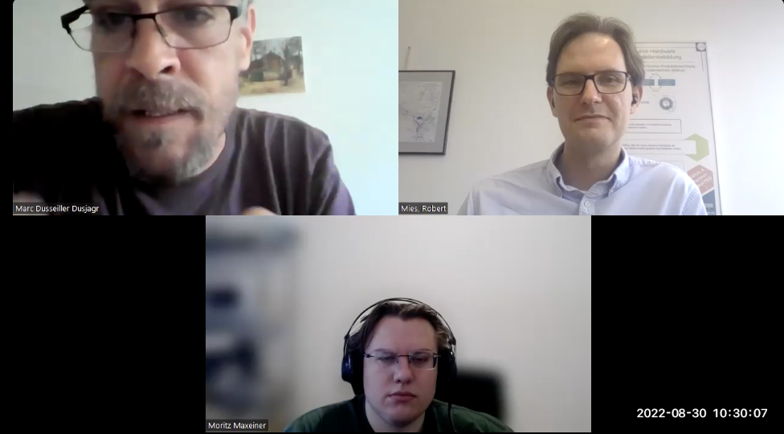

# Interview: Hackteria

*by the Open make team, Marc Dusseiller. Copyright to the authors, distributed under a CC-BY 4.0 licence.*

**Sections:**
- [The Project](#the-project)
- [The Hardware](#the-hardware)
- [The Research outputs](#research-outputs)
- [The Participants](#participants)

*Banner image: fixme, By CERN, distributed under a CC-BY-SA 4.0*

>Interviewee: Marc Dusseiller
>
>Interviewers: Robert Mies (TU Berlin) & Moritz Maxeiner (FU Berlin)
>
>Transcription and editing: Diana Paola Americano Guerrero, Robert Mies, Fabio Reeh, Moritz Maxeiner & Julien Colomb

*Screenshot of the interview.*

FIXME



 

*Photos of FIXME*

- Main website: FIXME
- Project start: FIXME
- Core development team size: FIXME

### Hardware products
FIXME
### Hardware maturity
FIXME
### Rebuilds
FIXME



## The Project

>How did the project Hackteria start? 


I would describe the beginning of Hackteria from my personal path. It was a group of people that started the project together. A few months before Hackteria, I was trained in nanotechnology and material science, so I have a technical and  scientific background. But then, I started to teach both in independent communities, what I call hackerspaces or makerspaces. When I left academia in 2007, I joined the group that already had the dream of starting a makerspace. They had regularly organized workshops on "do it yourself" electronics. In the late 2000s, I had a strong interest in open culture, creative commons and open hardware. I had embraced the DIY electronics and open hardware movement from quite early on. It was a hobby during my late PhD and then became my main profession. I became a cultural organizer, for organizing workshops. I did workshops in Switzerland with the Swiss Mechatronic Art Society. But I got invited to places like Taiwan where we did a creative FLOSS workshop. FLOSS means Free Libre Open Source Software.

I was more or less forced to shift entirely into open source software during a FLOSS workshop, which also involved installing Linux on my computer. I was highly motivated by the open culture approach and its creative applications. We conducted workshops for artists and creatives, focusing on using Arduino, electronics, and sensors. This took place between 2002 and 2008. Additionally, I began teaching at the University of Northwestern Switzerland, where I found inspiration in the open hardware and DIY methodology. I believed it to be a fruitful tool for project-based learning, which is now widely adopted by most universities.

During my time there, I taught a class on nanotechnology and microfluidics for life science. However, since I didn't engage in any research at the university, I served as an external lecturer. Unfortunately, I couldn't involve the students in my own research or an existing laboratory, as there was no research opportunity available. Given this limitation, I set a goal for the students to construct their own nanotechnology laboratory as a DIY project, utilizing open source software and open hardware. Building the nanotechnology laboratory was relatively straightforward. For example, in 2008, we needed a syringe pump and the students ingeniously constructed one using Lego. Similarly, we created a spin coater for surface coating, and repurposed an old record player, conceptually similar to a high-speed spin coater.

One of the projects I developed with the students during that time involved building a microscope from a webcam. I had previously experimented with this concept years ago in the early 2000s or even earlier. A microscope holds significant importance as a fundamental tool for science education and research, historically expanding human senses to observe the microscopic world. Microscopy plays a pivotal role in scientific pursuits.

In addition to constructing their own learning technology laboratory, I had a strong inclination to utilize a wiki for the project, drawing inspiration from the mid-2000s wiki culture and embracing an open-source philosophy. The subsequent year, students could build upon the knowledge established by the previous batch. This approach fostered a progressive pedagogical structure, allowing each student to build upon projects initiated by the previous year's participants. Since the students had limited time, beginners often didn't have fully developed ideas. However, the ideas were promising, even if the hardware aspects were not extensively developed within the short timeframe of half a semester, with students devoting one afternoon per week to lab work. Although time was limited, it marked the beginning of my interest in DIY and open culture, and integrating them into the teaching of my original background, which revolved around microfluidic analog technology.

The framework I established for this class was called wetPONG. While I couldn't involve the students in research activities, I thought they might enjoy creating a game. Although the website is no longer accessible, it was called wetPONG and involved hybrid games in nanotechnology. Over the course of a few years, students were expected to develop setups utilizing dry laboratory equipment. The intention was not to conduct real scientific experiments but rather to create interactive games. I recall a few other individuals in the same field who pursued similar endeavors, such as a person at Stanford who referred to the entire framework as "bionic games." The game revolved around electrode placement, microorganisms, cameras, and manipulating or overlaying them in a unique way. In the end, the game was played on the screen, rather than directly involving the living systems themselves. This framework was initiated at the end of 2008. 

>Have these experiments mainly been  for  educational purposes?


Yes, I developed a lab course project-based learning, but this newly found enthusiasm for open source culture using wikis and open hardware was super interesting to me. I missed this sharing culture a bit, even though in academia you're meant to share everything as publications. There is an embodied and deeper level of this open lab books. During my PhD, I followed the sharing of early experiments online using wikis in science. I found a truer openness in this maker culture. That's why I left academia and worked in more media art-related networks. There are places in Berlin where all the artists use open source software, make their own WiFi, and have interactive artists with sometimes critical work. From 2005 to 2010, I was very motivated by meeting the artists who work with open source. Most of these people never studied art; they may be coming from IT. They may have a PhD in architecture and ended up becoming media artists. It was an interdisciplinary group of people that showed up. I participated in a lot of workshops, and there were some cool offerings. I found even more openness in these circles than I had hoped for in academia.

***A sad fact in academia is that you work in your little networks and think that innovation could be stolen by others. You have to be the first one to publish something. It's not even true. I found more enthusiasm about openness and doing self-intrinsically motivated research in these media arts-related networks, where people work for years on the same topic and go really deep.*** 

At the same time, in 2008, I followed some blogs about DIY biology. Besides, when I was a student, I followed an event called iGEM (Internationally Genetically Engineered Machines Competition). It started in 2003 or 2004. It's a very interdisciplinary summer school for engineers and computer scientists to work with microbiologists or molecular biologists as a student competition. MIT started it, and ETH was one of the early ones to join the competition.  I heard about it, and everything was wiki-based. All the protocols that the students developed had to be open, and all the constructed genetics had to be shared. Through this interest in synthetic biology and student competitions, I heard about do-it-yourself biology. I was interested in the openness and experimenting at the molecular or nanotechnology level outside of university student competitions. I followed it somewhere on a blog. I heard about an event that happened in Madrid called "Interactivos" by Medialab Prado. This was a call to collaborate on ten projects simultaneously for two weeks. They were selected by someone, and you could join one of these projects. All had a strong focus on everything being open source and documented on a wiki. It was about starting with a new idea in a collaborative setting. I ended up going to Madrid and joining one of the projects called "Garage Science." The overarching theme was doing science in the garage. 

The specific project I joined was "Garage Astrobiology." It was about making the search for extraterrestrial life available in your own garage. The artist leading the project was Andy Gracie. He does work on machine life interactions, like robots that interact with crickets. He led the "Garage Astrobiology" project, and I brought along my newly developed LabCorp. I brought this DIY microscope, Lego syringe pumps, and some PDMS. I got along well with Andy Gracie. This DIY microscope was a fantastic contribution to the project's ideals. We hunted for tardigrades. We went out every day and collected some moss to find these extremophiles. They survive extreme conditions of pH, temperature, and pressure. They are famous for surviving a spaceflight by the European Space Agency. We were trying to mimic outer space. We used data from Voyager space probes and tried to mimic the electromagnetic fields in outer space on a microscale using our DIY microscope and put some tardigrades there. 

In the end, it's a conceptual installation, not a scientific experiment. That was when I met a lot of other people at this event. Again, it had a strong focus on open source. There were people building open source 3D printers, unmanned aerial vehicles, and little model flights controlled with an Arduino and some GPS sensors. Other people worked with balloons for environmental sensing. Many of these topics are still around, but this event was very pioneering with a strong focus on open hardware. Furthermore, it was kept in mind that whatever was done by the end of the week was not finished. It was a starting point. I met another musician called Yashas Shetty, who is a musician and educator at the art school in India, Bangalore. It's called Srishti Manipal Institute for Art, Design, and Technology. We got along and made music together. He mentioned that he's interested in joining the iGEM competition that I mentioned before. But he was interested in joining as a team of artists and designers who have access to a biological lab, not as an engineer or biologist. I was really interested. I had been following this iGEM and doing teaching inspired by open source and nanotechnology. I was building these microscopes. With other people, we talked about all the artists working around the topic of biological sciences. There's a field called biological art. We were there for a week talking about DIY cell biology iGEM and DIY microfluidics. We thought we were onto something using this more DIY and open source approach. We wanted more creatives, like media artists, designers, or educators, to participate in open source and wiki-based projects. This could be applied to artistic practices and allow people to get started working with living systems as a medium for their artistic expressions. **That was the starting point, and we were critical of iGEM. Only the top universities, the usual suspects, are allowed to join, and it costs money to join.**

**We had more of a philosophical perspective, but it's much more of a PR gag for genetic engineering**. **It’s about brainwashing young students that every problem in the world can be solved by a plasmid in a bacterium, instead of looking at a more global scale of how to approach a problem, which was very influenced by my Indian collaborator living in a different context than MIT. We thought to continue this.** We had this DIY microscope, and we could make some other open hardware devices to create laboratory equipment. Andy had an enthusiasm for making these kinds of machines. For example, a pump to move fluids around to work with bacteria and his artwork. We started our own wiki for my Indian collaborator and myself. We started Hackteria as a wiki platform to share instructions about working with life science in a creative environment. Hackteria is and was about open source biological art. 

This is the very starting point. It was an online platform for people to share instructions. We were a bit late, but between 2005 and 2010, thousands of these platforms emerged. Wikipedia also gained popularity. It was inspired by other platforms. Instructables came up along with other platforms, and even social media emerged. Sadly, Facebook killed most of these other projects. But it was typical of that time to have a wiki and a mailing list to try to motivate people to document a project online. I had to travel to India to set up his website. He had a server and had already started the wiki for his iGEM class. We built on that work and realized it on the server of our office and school. 

>Did you get any funding? 


**Andy, Yashas, and I kept in contact by email. I involved my good friend and collaborator, Urs Gaudenz. With some other friends, I had already organized a workshop around this team. We thought there was a lot of potential with this microscope, and artists were doing some tracking with openFrameworks. They tracked the microbes and made music with it. We held a workshop in Berlin in 2009, the first workshop ever in Hackteria. We had four mentors and one participant.**

**The workshop lasted a full week, at a venue called N.K. in Neukölln. This workshop focused on developing the microscope project and the next stage. Additionally, we built some other weird, sound-based laboratory equipment. After that, I went to India, and we set up the website hackteria.org. Right after our encounter,** 
I had the idea to apply for some funding. I applied at the Ministry of Culture, which had a special program at that time for what I would call media art. It was in Switzerland.

This was a special funding program for media art from 2000 to 2010. In 2009, I applied and received 10,000 CHF. That's a lot for art funding. With this funding, we were able to start and buy some hardware, equipment, and travel. Art funding is a bit different. First of all, you never receive any money as a fee. You're not allowed to pay artists with public money in Switzerland; that's against the law.

I visited Andy Gracey to discuss the vision of the project. We had a bit of money for the flight to India, to buy 20 webcams, to use them for workshops, and to buy some chemicals and other stuff needed to set up a laboratory in our studio. 

**At that time, I was in an art technology studio with some friends. I was able to join a workshop in Hong Kong about tardigrades and a media art festival in Indonesia called Cellsbutton Festival in 2009. I brought my microscopes and my DIY methodologies there to conduct workshops.**

In this founding year of Hackteria, we set up the website in India, held the first workshop in Berlin, and continued personally to conduct DIY microscopy workshops in a place called Jogja in Indonesia.


>Would you always bring local artists and university students together to spread openness in different places?


Yes, this was not planned. I went to Indonesia and participated in a workshop. They suggested that it would be cool to go to the university and conduct a workshop there as well. It was a two-week festival, but they didn't provide all the details of their plans.

I simply went along with it. **As I mentioned earlier, I got involved as an open-source enthusiast. Even during my PhD, I started following the open-source community and its political aspects, such as the Berlin Declaration on Open Access.** My experience in Indonesia was interesting on two levels. I found myself on the other side of the world, and yet these people had the same stickers on their computers. I collaborate with other enthusiasts to create visuals using open-source software, particularly Pure Data. I was surprised by how the internet connected us. We all used the same software and open frameworks for tasks like image analysis, live VJing, and music production. Sometimes, when I meet someone in Zurich, I feel more culturally distant from them due to different value systems, even if they are not into software but rather into theater. In contrast, I found myself on the other side of the planet, where I had never been before, and met a group of people who were connected through mailing lists and similar software. This group strongly embraced the open-source mindset, with Pure Data being one of the most popular software choices. Pure Data is a visual dataflow programming language, similar to Max/MSP, primarily used for creating music and audio-visual expressions.

**Personally, I used it more as a lab tool, similar to LabVIEW. You have these little boxes that perform different functions, the data flows out, and then it becomes accessible. I often utilize it in my workshops.** 


>Did you create your workflow with the software to organize the workshops? 


No, when we have the microscope, we analyze the motion of the particles, put it into an oscillator and make music. The Arduino sensors can be connected. I send it to the serial port and I have all this data in my software. I use it for changing the color of the screen or similar things. 


>Is this the bio hacking? 


Yes, these are bioelectronic devices. Of course, I have to input them into the computer from the real world. Sometimes I can even provide feedback. The software was openly cryo to sculpt the data. It's open source. I met these people on the other side of the planet, and they worked with the data. We even developed this microscopy software together and improved it for VJ purposes during the festival. 

That's how the Hackteria network slowly grew through meeting new people. In this first year, a network or collaborative group of friends was formed. The network has a strong bias towards the east because we started in India and Indonesia with these activities. Furthermore, we were invited to Hong Kong for a workshop, and I conducted another workshop in Taiwan. The beginning of Hackteria was a big coincidence, and the tendency towards Asia was just a random phenomenon. Collaborations and friendships began. After one or two years, we met 22 people who were enthusiastic about using open source for art science projects, bio art projects, or workshops. We were invited to many places to conduct workshops.

The key learning after the first year was that the platform itself didn't work by simply having a wiki and telling people to put something on it. The small core group used the wiki as a tool. To make the wiki work on its own, we thought to organize events to create content for it.  

>Would you say solving the problem with events and meeting someone worked?


Why would someone put something on the wiki? It's not a famous thing that people are proud their article is out there. It's a small wiki out of many thousands of others. Academic scientists are forced to publish by the system. Freelancers, artists, and creatives don’t have this pressure to document their work. We thought about having more social events. We spend a weekend and call it a wiki sprint. We define a topic and have some beers or get some pizza and have a social activity around the topic. With the output on Sunday evening, a new workshop is developed. The sprints were later used as hackathons or something similar. It was something like the first event I mentioned before. It had aspects of a creative group gathering. From there on, we figured out that the platform itself isn't enough to create content. We have to organize activities, meetups. We call them Hackteria Lab. These are like temporary labs where people work for 10 days. Hack camps are similar formats out there. We focused on the topic of open-source biological art. From time to time, we had the money to invite people. In 2010, we did the first Hackteria Lab, small. We figured out that we have to do more and for a longer duration. We did one in 2011 and another one in India, Indonesia, and Japan. This became more of an organizer of these creative development and production weeks or events to create content for the wiki. 


>Was the output mainly artistic or  functional to be used for research or education?


The platform itself does not have the goal to be an artwork. Maybe the individuals make artwork. This isn’t my problem. This isn’t in the frame of what Hackteria offers. Hackteria offers a platform to learn, share and  document. The output is knowledge. Hackteria isn’t an art collective that produces an artwork. The individuals involved might build on the stuff and do an artwork. They might build classroom activities or an instrument for your lab that's not seen. A lot of the people involved in the Hackteria activities have a scientific background or are researchers at an institute. It was always a radical transdisciplinary approach and we do want always to involve artists.

There are some values and critical positions that we are very much embrace as a method. 


>Are all the things on the wiki DIY? Has anything been sold or was put by a company on the market? 


Many have been sold. Pedagogic concepts are sellable products. We receive requests to conduct workshops where I utilize the generated knowledge. Being a technical object is not a prerequisite for being considered a product. As an educator and organizer, I find satisfaction in this role as a product. Some concepts are transformed into DIY kits, containing a package with ordered components. Personally, I am more interested in knowledge and organizational aspects rather than physical products. For instance, Urs Gaudenz, who played a crucial role in the development of Hackteria, has taken some of these DIY prototypes and creative projects and manufactured them on a small scale, selling them as products.

I believe he sells the PCR. In the DIY open hardware biology community, we construct thermal cyclers (PCR) using an Arduino, a hairdryer, Eppendorf folders, and coolers to perform PCR reactions. These prototypes are remarkable in terms of opening up the black box and revealing the inner workings of these scientific instruments. They are not magical; instead, they are primitive technical devices. We even build spectroscopes and transform them into actual products. Urs Gaudenz manufactures items in his small factory, while I incorporate them into pedagogic concepts as well.


>Was Hackteria focused on the educations aspects?


Hackteria became mostly a network, beside a functional website that some people use. 

People that continue collaborating may join some activity. If we get a request to do a workshop, I invite some other people from the network. It became a network of  20-30 enthusiastic people and with some friendships. It didn’t became a self running conceptual thing that people are so motivated by this open source biological art idea that everybody anonymously contributes. It became more a small group of friends that keeps collaborating and innovate on the individual level. Some people have a career and sometimes their work intersects with Hackteria.


## The Hardware
## Research Outputs
## Participants

 

 

 

 

 

 

 

 

 

 

 


 


 


 


## Hackteria

 

Robert Mies  
What kind of outputs have been produced from the projects?

Marc Dusseiller  
I advise you to make an interview with Urs Gaudenz. I think he has a lot to say. This engagement in the community is part of how he developed the project and how he distributes. It's a very unique, small scale industry that is inside this creative communities. **He is an engineer who knows how to manufacture stuff. He's an extremely talented engineer. He's 50 years old and has 20 years of experience in the industry and under the age of 40 he entered this creative zone that I described before. 
He’s very experienced and non academic. He did work at the university.**
To get information about the real product, which comes manufactured to your home in a little box, I would ask him and not me.

Robert Mies  
Do you have information about publications, education, prototypes and documentation?

Marc Dusseiller  
I’m really not interested in publications, like scientific journals. I left the field for a reason.  I can publish on the wiki and get feedback from the community and mail list. It's as important for society as a journal paper that no one has access to and no one reads besides you, the PI and peer reviewers. 

 I followed scientific literature that describes DIY and open hardware laboratory equipment. I’m mostly interested at pedagogic concepts as a product that comes with some hardware. We did a lot of sessions or events around this. We call them workshopology symposiums to reflect on this methodology for doing workshops. **And what is the role of the hardware in achieving the learning goals? That is a product. The product is a list of materials, a conceptual pedagogic framework, how to set up the space, and how to scale up. For example, I order from different manufacturers, put it in a little box and I bring it as a teacher to my activity. I'm not selling it independently of my service as a teacher.** I focused mostly on pedagogic concepts as a product and on a concept of low cost kids to raise your pedagogic goals. **I worked in Indonesia and a lost cost device from Europa costs over there more than a month’s salary.
Everything that uses an Arduino is expensive. It's not a low cost tool.**

Marc Dusseiller  
An Arduino is a great pedagogic tool, but it's not per se a low cost microcontroller as you know. We even go away from low cost to no cost. To expand these activities, it has to be free of charge, which means we have to have someone else paid for it. To reach the large audiences with a microscope it has to be even  cheaper than what we consider cheap in Western European.  My Asian collaborator, we work together on the on the DIY microscope, really pushed it further. He made maybe 50 workshops throughout the region and taught teachers to do it. He even made it into a product that he produced 100 of them. They can give it away for free to schools and because he donated it from his own talk, but it has to cost only $2, because he can’t afford to donate something that's $20. 

Robert Mies  
Yes. 

Marc Dusseiller  
He’s called Nur Akbar Arofatullah. He's been an accelerator. From one workshop that has happened, he did another 100 workshop to various people and teachers who now implemented in the schools. But this isn’t documented. This works in circles of some teachers in Indonesia. They speak a different language and aren’t interested in writing a scientific publication. They're more interested in making sure that people have a quality education. They will publish in some local educational book or maybe in a newspaper in Indonesia or some science magazine. I don't have an overview of what happened in Indonesia.

Robert Mies  
Do you publish videos, results and the structure of these workshops on your website like the debating tool?

Marc Dusseiller  
I don't write scientific publications. Maybe one reason is that I'm lazy. I was always happy if other people write scientific publications or press articles about these things. Especially, if your idea is to spread the knowledge and values on open hardware and openness in research. I appreciate empowering people to build your own scientific equipment. The press is a fantastic outlet. I'm always happy if the press calls me and I can talk about these things. The Swiss TV came and some other people wrote articles in nature and other places about this independent DIY scene. Of course, I was happy about it and to promote some of the projects that I'm involved in these channels.

**I did try to make a product. It's called eight bit mixtape. 
It's less of a scientific equipment. It's an eight bit synthesizer that runs on an a tiny microcontroller. It looks like a cassette tape.**

**I tried to do what Urs Gaudenz is doing. I thought, it's nice to develop one thing to that level of an object. It's very well designed. I sell it as a kit or finished. I need to solder it by hand. But I have lost interest. I’m not interested in selling products. I didn't go all the way in my life to put stuff on the post and write an invoice. This isn’t the job I want**. 

Robert Mies  
What was successful about Hackteria and what was not?

Marc Dusseiller  
The idea of a self running knowledge platform, like Wikipedia, didn’t work. I think the topic is very niched and it's one platform out of many others. Some activities, researchers or Makerspaces have their own wiki. Why should they use this platform? That was something that didn’t work. A platform alone will never create content, even if you add fancy functionalities to it.
 
I think we should do a moratorium on setting up new platforms and use the existing ones. I'm really happy about GOSH that we've not set up another platform because there are already platforms, which are good. Technically,  we weren’t capable to develop the platform to be more functional or easy to use to motivate people. It was a basic and badly installed wiki. But it has a lot of stuff on it. The switch to social activities and event based knowledge production worked. But that’s a lot of work. It costs which means we need to apply for funding. Over the year we had many fundings small ones or project funding.

Robert Mies  
What was the total amount of funding you received over the years?

Marc Dusseiller  
On the wiki are around 125 projects. Some of them are just some raw ideas and notes and some are more developed. We have a discussion forum that was active and recently it's a bit less active.

Robert Mies  
How did the activity in the project develop?

Marc Dusseiller  
It's always more active if it's surrounding an event. That's an observation I made. I became a network and an organizer for activities and events. Over the years, we had a lot of collaborations with larger research projects, where universities are involved. With some big European projects, it was problematic because of different power structures and money. I'm a freelancer and I can pay my rent. But all of us don't have salaries. Every hour I spent, I'm not spending on something else that I make money with. There’s a little conflict. When people on payroll want to collaborate with communities of freelancers, artists and creatives, it’s sometimes a bit difficult. I'm a freelancer as an educator. 
With the **walker (????)** we had a lot of problems because they never pay you anything. But they brought all the ideas for the community and put it in the EU project. It's sometimes problematic to work with academic researchers that don't understand that different models of living exist. Sometimes power structures produce conflicts. **for example with organizations like the VA The VA(????) is huge, they have 70 employees. They have to make money to pay the salaries. But they light creative networks without paying them on.**

The power structures are sometimes problematic in these collaborations of self motivated communities and more established institutional players like academia or large NGOs. Although there's much we can learn from each other. A very successful development for Hackteria was to join the GOSH, the gathering for open science hardware. A lot of people we knew each other already and somehow we ended up being a fundamental element within the start of GOSH. It has a big diversity on the planet. It's not just a bunch of Western rich universities involved, which some of the founders are. I think GOSH has great different involvements of artists and activist and Hackteria has played a partial role. Public Lab, which is very environmental activist oriented, had a strong role on that. The GOSH is far beyond a pure academic conference. It does involve successfully artists, activists and a lot of people from the Global South.

**Moritz  
Did you need an authorized VISA?   
Marc Dusseiller  
The Indonesians need one and they got more or less uninvited. That means we have more time for our local event**

Marc Dusseiller  
We were successful in the beginning. We had regular small project funding, which always came from arts and culture. It was good enough to do all this work and pay some artists. We weren’t able to have a long term funding to scale up as an organization and to institutionalize. 
The newest thing about Hackteriais that we now have a space in Zurich. It’s a small lab in a hackerspace in an art center in Zurich. We have the potential to set up a more continuous activity locally in Zurich. This is very new and we just started. **The place is very cheap. Because we aren’t good organized at the moment, we have no proper administration. The last two years all my applications failed in citizen science, arts, youth work and culture stuff. I have seven or eight letters of rejections here in the back of my office.
Robert Mies  
Yes, yes, relating**

Marc Dusseiller  
We’re not hot anymore. In the beginning, we were fresh and hot. Everybody threw money at us even if it's a small amount of money. To have long term, sustainable and larger funds to institutionalize it didn’t work. **For example, Urs Gaudenz managed to make this a full time job. He has a running company. It’s a very unique model.** It is possible to develop some of these activities in the open hardware and open science into a small business. **It’s not a big successful startup with 1000 employees. He still works alone, his daughter helps him packing the bags. He wants to have a one man company. That's what he wanted. He doesn't want to have a boss, colleague or nuisances of other people. He wanted to be a company by himself.** 

Robert Mies  
You gave a lot of people the room to develop in this project. How many people participated over the time? Was this more or less a constant amount? 

Marc Dusseiller  
Organizationally, the core has shrunk but the larger network is still around there. Of course it helps to maintain but within GOSH we merged some stuff. I personally thought it was good to support GOSH as much as possible instead of insisting that this is a Hackteria project which has to go on our wiki. 

Robert Mies  
What have been the occupations of people participating in Hackteria?

Marc Dusseiller  
Professors have been the least. A lot of people, who participated at workshops, were organized independently and maybe were postdocs. They enjoyed to work with science and technology in this creative zone. We had many mid career, frustrated scientists that were happy to have a more social activity around some interesting topics of science and art. 
The participants at more structured workshops have been mainly students. I integrate my students, which are second year biomedical engineers, with building open source medical devices, prototyping. Some of the others  students are agricultural microbiologist students in Indonesia or students of art design in India. A lot of the Hackteria related activities were implemented on a pedagogic level, even in kindergartens. The workshop element within Hackteria is one of the core things. A lot of people are educators and reach other students through workshops. 

The least impact we had on the higher level of academic people. In GOSH isn’t a single professor. It's mostly frustrated postdocs, that are enthusiastic in GOSH, because it's motivating and people are energetic and interested in your work. It's hard to find enthusiasm in academia from your PI.

**My PI was fantastic. He's a great mentor and manager of teams. I had a fantastic time, but some people suffer. You're in this face of not knowing where your career is going to lead. A lot of the GOSH or Gauche and Hackteria people, that joined and enjoyed it, ask themselves the question wether to stay in academia or not to stay. It’s an enjoyable social activity, because it's DIY and a playground. There’re motivated and interesting people from all over the world. But the higher level career oriented academics never showed to our activities.** 

Robert Mies  
Some of them become professors or assistant professors now.
Is there a new mindset that has to be observed?

Marc Dusseiller  
That's why it helps in a later stage to infiltrate the students. They will use this open mindset in their PhD, which will maybe influence the whole group or at some point, they start their own group. Some open hardware research groups are now established. Their influence came from outside of academia. They learned this mindset in the local hackerspaces or some other online communities. They didn’t learn it in their own academic environments. We tried to bring this into the universities.

Moritz  
What is the most important thing to make open hardware more accessible to more people?

Marc Dusseiller  
I do think this larger networks, like Gosh, are the players to connect the platforms. We have a discussion forum, on how to connect the platforms, there are working groups around that as well. But instead of setting up another platform we need to connect people towards a larger community. Besides it’s interesting that GOSH has not started with a three year project grant. I see other platform with a three years lifetime because the grant expires. If the platform is established, it has to be beyond individual project grant. This is more sustainable. It's an organization issue and not a technical issue.

If people meet and if people go to events like GOSH, this is where I can tell you to look on my platform. I go to this activities at the GOSH event where maybe 500 People participate, that helps. If it's a more structured, defined European research project, it's hard to reach 500 people. I would recommend to use the existing platforms and share it on your platform too. The most problematic thing is that most platforms, and Hackteria is the worst example,  don't have a focus. It's too broad as a platform. A platform can work if it has a narrow focus about one type of technology.
 
We had this extremely open and broad idea of the Hackteria knowledge platform. In the end people don't know what is there and think that their project doesn't fit because none of them fits.  If it's more applied to a specific topic, like soil management, it makes sense. But if it's about open hardware in general, it doesn't make sense. 

Robert Mies  
How have the members benefited from the work in the project?

Marc Dusseiller  
A lot of the activities in Hackteria have been very influential for many people. Having a very creative and playful environment is very inspiring for people to get started in a certain direction. A lot of new collaborations were started by having face to face meetings and durational activities, which contain cooking, hiking and living in a Mountain House for a week. That is beyond Hackteria. The outputs are friendships and collaborative projects, which aren’t on the Hackteria platform anymore. The very international aspect  was for some people inspiring. It might be their first time to meet or work with a Taiwanese person. They might end up  having a project one year later. I think the cultural exchange worked very well, because there is a shared interest. In this case it's narrow enough that we can go beyond cultural boundaries to work on a shared value and enthusiasm. The transcultural events worked well. That's at the core of the foundation which started in India and  Indonesia. The Indonesian collaboration has a continuity of more than 10 years. 

Urs Gaudenz is another example. We know each other for 15 years. For him, it was a good way to rearrange his life and to go out of the classic engineering scope. The creativity and feedback you get from the artists is helpful, because you can develop some hardware device in a day when some people need a year. You get positive feedback from these people that use your stuff. I wouldn't say that we gave people purpose. That's a bit outcasts. But these workshops definitely had an impact and empowered some to start with or in a new direction.
