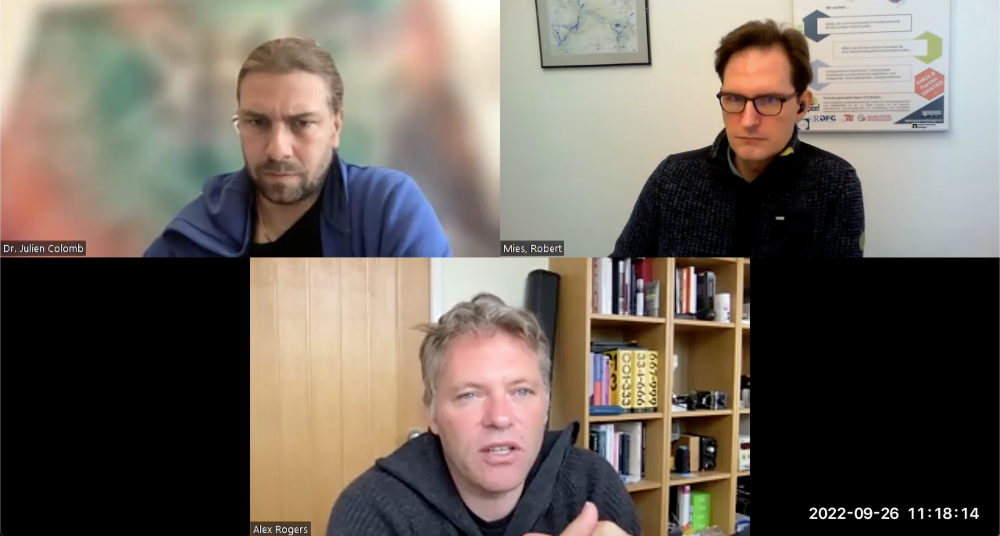
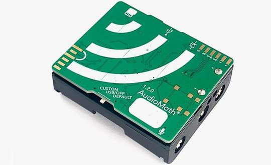

# Interview: audiomoth

Alex Rogers is a Professor of Computer Science who lead the team that developed the audiomoth, a low-price passve sound recorder used for biodiversity monitoring in the wild.

*by the Open make team, Alex Rogers. Copyright to the authors, distributed under a CC-BY 4.0 licence.*

**Sections:**
- [The project](#the-project)
- [The hardware](#the-hardware)
- [The research outputs](#research-outputs)
- [The participants](#participants)

*Banner image: logo of the openacousticdevices company, By openacousticdevices, used with permission

>Interviewee: Alex Rogers
>
>Interviewers: Robert Mies (TU Berlin) & Julien Colomb (HU Berlin)
>
>Transcription and editing: Diana Paola Americano Guerrero, Robert Mies, Fabio Reeh, and Moritz Maxeiner
>
> Editing and summary writing: Julien Colomb

*Screenshot of the interview.*



*Photos of the audiomoth setup*

- Main website: https://www.openacousticdevices.info/audiomoth
- Project start: 2015
- Core development team size: 3

### Hardware products
AudioMoth is basically a single board PCB. It's mounted directly onto the battery holder.
That’s the minimal assembly requirement. The hardware on here is a microcontroller, an SD card, the microphone and some memory.

HydroMoth is one version that can be deployed underwater.

### Hardware maturity
It is market ready, but not certified.
### Rebuilds
A few people did it. We expected more people to do so.



## The project

### Project start
We figured out that it'd be handy for a research project that we were doing to put some recorders into the forest and leave them. We looked at commercial recorders that did that. At the time they were all about $1,000. We saved a lot of money and made our own small low cost recorder.

*The project was pitched and two PhD student (Andy and Peter) were inteseted and worked on audiomoth development.*

### Project process

*The process included discussions with end users early on, and a particular care in designing things that can be easily manufactured.*

There's a challenge to overcome the inertia and actually make the connections by going out and talking to people, finding end users. 
If you just ask the end user what they want, they will naturally give you a wish list. That doesn't help you making any decisions. You need to interact with them and discuss the possibilities.

Sharing isn't the end.
Our average user wants to get a hold of the assembled hardware. It gives them some comfort that the design is available. But most users aren't going to manufacture it for themselves.

I think designing for scale at the very earliest stage is really important.

### Funding

It's generally  hard to fund this type of work because it is interdisciplinary and focuses on building tools for others rather than computer science research in itself.  I'm indirectly funded through small pots of innovation based funding. But the two PhD students in Southampton were funded by EPSRC which is the standard funding body.

### Major issues

One of the challenges was to find end users who are willing to work with prototype hardware.

Using machine learning tools effects a bit the energy consumption because you typically try to minimize energy and running your models is quite expensive in terms of computation. But computation tends to be a little bit cheaper than writing to the SD card.

### Success and failures

*The project gots useful for us and for others.*

A general take-away is the need to design with a view to the final device being manufacturable at reasonable scale.

There’re lots of early design choices which can impact the deliverability of the device. For example, batteries. With removable batteries, you can post it to people and they can put the batteries in. Some of these very early design choices are quite critical to how it’s used. 

## The hardware 

### Hardware importance in the project

The idea was to deploy some recorders that would last for a year and continuously listen to the forest and counting gunshots in parallel. At the end of that year, they understood some of the distribution of where and when people hunted and what at time of the day or night they come. It was about collecting information for future protection measures and initial basics of data to understand what was actually happening in the forest.

### Hardware components

Particularly with AudioMoth, we sacrifice lots of technical requirements. For example, the standard approach would be to avoid have the microphone on the same PCB as the SD card. That improved sound quality due to less electrical and mechanical noise. However, if you separate them, the assembly gets much more expensive.

Another thing is that we put a huge AudioMoth logo on the front of the device. This seems quite trivial but it makes the device instantly recognisable and it's easy to see what devices other researchers are using.

### Decision making

It didn't seem different from a regular PhD research project, but it was more interactive. The students talked much more to people than a typical computer science or engineering PhD.

But most of the time the students reported back to me the findings and I validated them, and most of the time they made the right decisions.

### Production

We made it available to people through the GroupGets campaign. We open sourced the design but then tried to figure out how to actually get it in the hands of people who just wanted to buy the hardware and not to assemble hardware themselves.

There’re a couple of manufacturing models we have used. [LabMaker](https://www.labmaker.org/) manufactures and sells AudioMoths. Their focus is manufacturing open source designs and they typically hold stock and ship devices as they are ordered by customers. [GroupGets](https://groupgets.com) is another model. They run group purchase schemes where customers come together and order in bulk. It's a great way to acheive cost savigns and is really good for exploring demand before commitng to manufacturing.

## Research outputs

## Publication strategy
I think we shouldn't be too driven by publications. The metric should be if the work is useful.

The final point of the two PhD theses were a hardware publication in a proper journal publication. They needed it for their PhD.

If you're open source, GitHub seems to be the first choice.
For a while, we experimented with CircuitHub which is a really interesting model which combines hosting of open-source designs with the ability to order assembled devices.

Our application notes are interesting things that we’re doing with AudioMoth. They're on the open acoustics website.

## Participants

### Personal gains

Peter and Andy did their PhD and now work full-time on the further development of AudioMoth and supporting users. 

The project has definitely changed the things that I focus on. When I think about potential PhD student projects I could supervise, I'm interested in where does this go beyond the end of the three year PhD.
