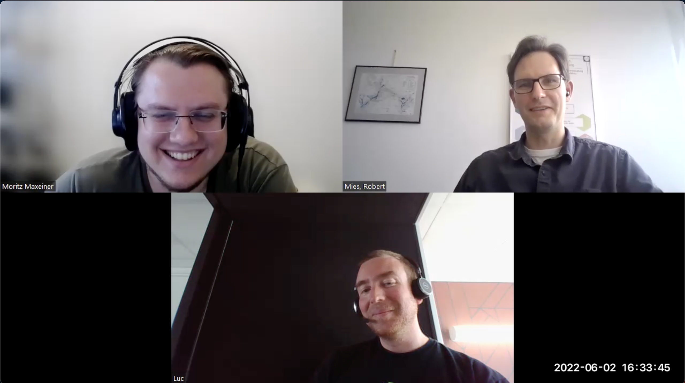
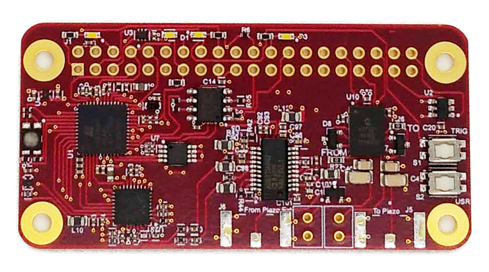

# Interview: Ultrasound device

Luc Jonveaux has been developing open-source ultrasound devices in his spare time for several years. His motivations have been to have fun and give back to the commons. Different devices were created in his lab/flat in Paris, and they are used by quite a large community of enthusiasts.  

*by the Open make team, Luc Jonveaux. Copyright to the authors, distributed under a CC-BY 4.0 licence.*

**Sections:**
- [The project](#the-project)
- [The hardware](#the-hardware)
- [The research outputs](#research-outputs)
- [The participants](#participants)

*Banner image: map of the world pointing users of the un0rick hardware.

>Interviewee: Luc Jonveaux 
>
>Interviewers: Robert Mies (TU Berlin) & Moritz Maxeiner (FU Berlin)
>
>Transcription and editing: Diana Paola Americano Guerrero, Robert Mies, Fabio Reeh, Moritz Maxeiner & Julien Colomb

*Screenshot of the interview.*



*Photos of FIXME*

- Main website: http://un0rick.cc
- Project start: 2018
- Core development team size: 1-5

### Hardware products
The un0rick has is a fpga-based pulse-echo device. Its smaller, lighter alternative is the lit3rick board, the size of a Pi Zero. 
The pic0rick, a rp2040-based, modular device is under development. 

### Hardware maturity
The boards are shared on the market

### Rebuilds
There are known users who built their own hardware through fabs or produced it themselve across the globe, maybe 20% of the devices in existence.



## The project

 
I started my career as a research engineer at Philips in medical imaging. We were working on simple, low-cost medical imaging device at the time.

In 2014, Mehdi Benchoufi, Olivier de Fresnoye, Paul Bourrier and I started echOpen as an association, officializing the objective of developing an open source  ultrasound device.
I continued on a parallel path in 2016: echOpen aiming for a medical device, when I wanted to focus on opening the technology itself, I wanted people to be able to play with the technology. 



> How did the open source ultrasound project start?


The project is about providing an 'Arduino of ultrasound' to researchers, academics and makers, simply because nothing existed in the market. 
I was a research engineer at Philips in medical imaging around 15 years ago. It was a great opportunity to work on low cost medical imaging devices, where we got to a proof of concept working with an OLPC ([One Laptop per Child initiative](https://en.wikipedia.org/wiki/OLPC_XO)). 
A few years passed, and in 2014 I met with Mehdi Benchoufi and we had an initial discussions for what became echOpen afterwards. 

Mehdi, Pierre, Olivier and I, started a project, which became the echOpen association. We wanted to post the technical project of having open source with ultrasound. I spent less time with the association in 2016 or 2017 because I wanted to focus on something that would be used by makers, hackers and layman while echOpen took a different approach, going into making a medical device. 
At this time, I started to experiment more on the hardware components. This was initially a functional block approach, where each block captures a function, allowing one to swap modules and try different approaches.

That worked relatively well, and confirmed the interest from a couple of individuals, the core of the community. Along with this initial pitch, the design got more mature and more integrated, leading to the first product. 
The un0rick board is interesting as an approach. I am not an electrical engineer, and knew very little about electronics design.The open source approach allowed me to get in contact with the right people to help with the toughest electronic parts, and we got to a design that is far from perfect but still in use today. 

The more I knew about the project, the more I was able to concentrate on my skills and vice versa.
I improved my skill and by this the complexity of the project.

This went well until the pandemic in 2020 and the  supply shortage. the project could not move forward, as I could not try new designs or build new boards. Therefore I stopped developing the product. Then, we started a smaller version of the board - smaller, and also cheaper, and it has a bit more performance. Today, we work mostly on new parts like the raspberry pico chips, opening exciting doors.

What was done for Ultrasound can theorically be replicated in the MRI space. If we look purely at the technology, we are talking about signals in the megahertz range. What we're discussing right now is to what extent we could build a common tool, a basic Arduino, that could be used for both technologies, ultrasound or MRI. 



 
The project process is quite organic. I simply started with documenting what I was doing, for my reference.  When you build stuff during evening and weekends, then take a break, you can't always remember where you were you come back to experiment. Documentation helps with this.
Then, people have reached out with email, and we opened a Slack channel to allow people to talk to a wider community.

A good consequence of working on free time, is that hardware takes time. I could put everything on hold for two months and just maintain communication in the community, and then pick up work again. 

There is no roadmap. Developments are more organic, the interesting experiments usually get priority.


> What was the core benefit of the project?


The core benefit is to provide an arduino of ultrasound. And for me, to have a blast and learn while contributing to the commons. 

The side benefit is to generate something you don't keep under lock and key. I see the value in the commons, and egoistically I also benefit to know that what I made benefits others. Apart from this, the greatest benefit is that I like to believe my users are getting access to technology that they wouldn't have access to normally.  Users are academics who want to have a system to test ideas. I have also seen startups using that to develop proof of concepts, teachers to have a demo tool for their courses, institutional organization collaborating to build customized solution. 



 
Funding is mostly out of pocket. The community helps by sharing costs when producing a batch, which helps keep the cost down. 

Being an individual, without a "research home", makes things a bit more difficult, for example to get funding, institutional support even simply to to have a 'official mail' when registering to events, or online services. 



> Is the project funded in some way?


It is mostly funded by me as an individual. The community helps keeping the cost down when doing a batch.  As an individual maker, I have no structure in terms of business, this is a side project, and it has  no official structure. 

Funding is a good question. I cannot get funding or institutional support, because one needs to be affiliated to an institution  to register on any research publication institute, so it's impossible for me to get that kind of support.

  Similalry,  I have tried publishing articles about the open hardware, methodologies and sources I'm using, but I'm not affiliated with any lab, which makes classical publicationdifficult Hopefully, this is something recognized by the open source imaging community, and I am sure there will be initiatives to tackle this challenge.


> How much money have you put in yourself?


That's a good question. I spent maybe between 5 and 10k out of my pocket over the past few years, in getting batches out, but I'm not necessarily keeping track of the ad-hoc, smaller parts bought for tests and experiments. Part of the larger batches do help keeping the cost of prototypes acceptable.



 
This project is a side project, and I don't want to  be a bottleneck in the community communication. Most of the interactions are through slack. A few physical interactions occur spontaneously. The base coordination itself It's pretty much organic and defined in the long term. 

When it comes to specific activities, for example for teams with specific needs, these teams take the lead for their tasks, and drive the development of their needs.



> Could you describe the overall process?



I guess an open source starts with documentating an idea. I just started with documenting what I was doing for my own purpose. When you progress on a side project, on some evenings, weekends, from time to time: you usually come back to the table with no memory of the details of what you were doing. It is definitely helpful to keep a lab log, for you first, but also to 'build in public'.

The documentation brought the interests of some people and publications. I've done a couple of publications since, on, for example, the Journal of Open Hardware. That helped raise the profile of the project.

 People usually come to the documentation, then to me by email and/or to the community open Slack channel (to allow people to talk to me and to a wider community). Some physical interactions occurred when a few current members came through Paris or London and we met to chat in meetings, like what we did in Grenoble in 2022.

I don't want to be a bottleneck in the community communication. If I were to be hit by a bus tomorrow, I still want the community to organize itself.  There are also opportunities to meet with the wider open communities, especially with echOpen, and the wider open imaging community.

The community is pretty much organic. Today, on the Slack are around 240 participants, the community is bigger if you consider people who have an interest for school or an academic project who would be active for 6 months and then leace. The activist circle would be five people, the authors of the paper we published. 


 
One could say there are no real issue because this is a side project. Nobody's life depend on it. As a side project, it progresses when people want to, and have the time to. 

Still, issues like components shortage over the last year(s) significantly slow down the development of the project.

Another minor challenge is having no lab. For me, the lab is home, in Paris, and you can only squeeze that much development before things get cramped. But electronics and hardware can be developed on a simple, minimalistic bench.


> What major issues have you come across during the project and how did you resolve them?


One could say there are no real issue because this is a side project. Nobody's life depend on it. If someone is rude, they get ignored. If there are no resources, development is put on hold.  The major bottleneck is time. As a side project, it progresses when people want to, and have the time to. 

There is a minor bottleneck which has been the components shortage over the last years and it froze the project's development. No new boards could be shared. 

Another challenge usually is that building hardware takes time. But in this case, it is a benefit. As a side project, if you have to wait two months for a board and you can't do anything, well, just freeze for two months, just doing some community management. And because it's a side project, there is no added stress.

It's pretty much organic and defined in the long term, so a slow pace fits our objectives.

It's pretty much organic and defined in the long term, so a slow pace fits our objectives.

It's pretty much organic and defined in the long term, so a slow pace fits our objectives.


 

Our community is around 300 individuals when checking our Slack channel, with maybe a rotating 20 active members. There are also representatives from startups, researchers or teachers. Most of the active contributors have this willingness to share back to the community.

> Do you have to make decisions in the project or how are they made?



As this is an informal community, there is virtually no governance nor governance processes. From a technical perspective, people making the decisions are people doing. They make decisions based on their requirements. 

I sometimes collaborate with organisations. These organisations share their requirements, and we discuss past learning and opportunities to improve. They lead on the decision of the joint project, which, when possible, can be brought back to the community, if they develop new things that come back to the project. The agreement is that I advise them on the points they do not know, and in exchange, they put technical and professional skills into this joint effort. A good example is the latest iteration of lit3rick board. It has been co-designed by professionals from a Canadian institution. They have come in with specific needs, but also excellent electrical engineers, and together we optimized the previous iteration.

Coming back to the decisions, the project does not have a specific roadmap. It's just what is interesting to pursue at the moment. The perfect example is what we'd like to do with open MRI initiative: there is definitely a good intellectual challenge there, and we will learn from both modalities and this will allow us to build something new, hopefully better.



## The hardware

 
The project hardware started as a series of bricks that could be assembled together to become effectively a pulse-echo device. It evolved towards a more integrated system and more efficient system.

A lesson is that a project reflects the technical knowledge of its key developers. It started very simple, and the more we learnt, the more the hardware evolved and matured. The path started with off-the-shelf bricks, then we started integrating FPGAs as the technology opened, and now are exploring specific capabilities of the new raspberry pico chips.



> What hardware products have you developed?


The first was the Murgen board, which was a BeagleBoard add-on, similar to the 'hats' on the Raspberry. We came back to a module-based concept where the different functional blocks of the hardware split into individual physical elements, named as 'echomods' project. The next iteration was to integrated lessons from the modules into the 'un0rick', an integrated, slightly overspecced design, and its 'lit3rick' counterpart, which are smaller, approximately the size of a Pi Zero. Today, i'm still working on the smaller raspberry pico chips. 


> How would you classify the product? Is it mainly a board, or are there other components, like mechanical or software, that you had to develop? 


The device is electronics at heart. I do not have the space or resources to do more like building the board physical transducers (or sensors) or the mechanical aspects.


> I see that the board has FPGAs on it. Did you develop any gateware, or is that up to the end user?


The device has its own gateware. FPGAs (field-programmable gate array) have been historically under proprietary tools. Fantastic work was done by Claire Wolf and team on developing an open source tool chain for a specific family of FPGA. This work was fundamental for the integration of the modules design in a single board, to allow users do things but also make it user-friendly. This in turn helps the end user, not me, to get the gateware they need. A very good example of that is my work with a non destructive testing (NDT) team. The team did not know anything about FPGAs, but with the visual editor interface,	 it was easier for them to get their own gateware, by tweaking variables. 

Fantastic work was done by Claire Wolf and team on developing an open source tool chain for a specific family of FPGAs, which are highly configurable integrated circuits.
There are both [VHDL](https://en.wikipedia.org/wiki/VHDL) and Verilog (hardware language for FPGA) designs, but I must say the open-source toolchain has been a game-changer.



> Where would you rate the maturity of the product in terms of prototype, demonstrator  or market ready?


The lit3rick is market ready. It's to some extent due to  the collaboration with professionals in the sector who also tested the device. The un0rick has been around for a while so that would make it market ready, too.


> Has the hardware been built or produced by others independently?


All the source files are shared and are openly accessible. Most of the electronic files are Altium or Kicad files, and we're trying to move more towards KiCad which is more open. 

Some users did their own batches through fabs and produced it on their end. I know of people who have used the designs for their own purpose and they have reused some parts completely, and did some slight adjustments to other parts before sending it for production. I also spotted forks of my designs for tangent purposes, namely tomography. 
It was good to see the design was reused, even if these specific people fail to mention our project in their description.
When people are cooking what you're often cooking, it's a good sign for the recipe.


> Did these people modify it as well?


Absolutely. And the great thing is that they also come back with more questions about your initial design and that helps cross-pollinate both projects!



## Research outputs

 
The community as a core team of maybe five to ten persons. We recently have published a community paper together. 

There are also two other papers on the Journal of Open Hardware about the project, and I have published a couple of other less mature notes on Zenodo: this was a way to get some results out without going through the trouble of publication and peer review. 


> What were the envision envisaged outputs of the hardware development in terms of publications, the hardware itself and documents?


The initial objectives was to get something like an arduino of ultrasound that I could play with. And then I realized that the documentation was really needed to achieve that, especially if I wanted it to be in the public space. 

The documentation itself became a priority, seen as a lab log. I created scripts scripts to help classify and manage the information and data (pictures, screenshots, gas) generated during experiments. 
The data itself of the experiments is tagged with metadata that allows to find back what were the conditions of the experiment. The same applies to pictures, using for example the EXIF tags. I have been running the scripts since 2016, and they are still used in generating the documentation. It’s been real helpful not only for me, but also for example to onboard people: I can point them to a session where I tried tomography and  where we would find the gateware for the FPGA. They would find the corresponding scripts , and reuse them relatively easily. That became the primary output. 
The community is a byproduct of the work on the hardware. I have no objectives when it comes to the community. We can say fun is the number one expected output.

 
I think, the board and documentation have been the focused outputs. The publications and community are outcomes. 

> Did you publish your project findings in relation to the hardware somewhere?


There are a couple of papers that are not exceptional, to be honest, but at least the knowledge is out. There are two papers in the Journal of Open Hardware, plus a couple notes on Zenodo. These note usually are PDF that double as zip files: you get access the source files by renaming and unzipping the PDF. The rest of materials, more day to day related, is archived on GitHub.



 
There were couple of publications on, for example, the Journal of Open Hardware, which helped raise the profile of the project. The core content ar eonline material, which would be in GitHub and Zenodo, and the rest is published on GitHub.


> What kind of information have you shared regarding the bill of materials, CAD files and assembly instructions?


Project is mostly electronics so you will find the usual gerbers, BOMs, and kicad or altium files. There are no mechanical elements, so we have no CAD files. When I'm doing an experiment, I'm sharing the data of the experiment. It's hard to keep track of what I've done during the experiment.


> How did you publish the hardware besides in journals? Did you publish the hardware overall?
 

Hardware files and documentation in general lives mostly in GitHub. The core publications are online material, which would be in GitHub and Zenodo. I think we used arXiv for preprints, too. 


> Why did you choose these platforms?


I choose GitHub because that's easy and universal tool. It provides the version control system. I choose Zenodo because I wanted to have an independent platform to store notes a get a DOI for further referencing. 


> Were there any barriers in using these platforms?


The learning curve for GitHub is low if you're doing software already. Zenodo is also straightforward.

I experimented with a platform called upverter, which is an online hardware editor. Some designs are still available there but not maintained, as I'm trying to keep the constraint of using open, commonly used tools.


> Is there anything you didn't publish? 


Apart from holiday pictures, I've published everything I've done. 
I believe most topics are documented, even things that might be less relevant for users. When it comes to the hardware, everything is published.



 
I have no objectives unless having fun. It was successful in having fun. And failure to adapt to components availability can cost a lot of resources.


> What was successful about the project and what wasn't successful?


That's another good question! You can be successful if you know your objectives - and I have no objectives apart from having fun. I was successful as I have fun. I had a lot of frustration due to the component shortages during the pandemic. If the supply chaine is broken, I can't do open source development anymore.

Meeting a dedicated community was an unexpected positive experience.



 
Most of the most complex, mature boards are in collaboration with a professional fab. Because the community is global, we have a global preferred fab. Apart from ready-made devices, community members also produced their own devices, and devices variants, based on the shared documentation.


## Participants

> How did you end up working on the project?


It strated with my frustration of not being able to contribute to the commons in the company I worked for. I do believe that giving back to the commons and being open are some of the ethics when you're into technology. It's about how we can, as individuals and organizations, safely contribute and give back to the commons.


> How many members have worked on the project and hardware?


It depends on your metrics.  I've done a bit of publication on Hackaday at the beginning, where the project has close to 2800 followers. Our slack has around 300 users, which is my only metric for the moment. Say 2800 interested, 300 talking members, 10 to 20 doing actual development, and possibly 10 to 20 papers or theses using the hardware.



> Do you know anything about the occupations of the people that have worked on the project with you?


Most of them are ultrasound professionals, researchers, or start ups. Startups usually seek hardware, equipment and advisors. There are also teachers who use the devices for their courses.

If you look at the map of the purchases, there is a higher density, for example, in east Asia, with a very strong medical imagery ecosystem as well. In the USA or Europe, the orders come from mostly universities, a few startups and individuals. 


> Have all these different groups contributed to your project? How many people have contributed?


Maybe to 10 to 20 people have regularly contributed and 5 to 10 have rarely contributed.


> How did you find suitable project members to contribute? 


I'm not finding them, they are finding me. I'm currently not really active, but maintain a room open for discussion. People drop by and some stay, and contribute if that aligns with their needs and aspirations. 


> How did you coordinate the work between the members?


Our communication channel is open  about what is happening at a given point: the community members have their own projects and talk about them, and what they're doing. I can coordinate by saying here is X and they are doing Y. 


> Can you say how the members or the contributors have benefited from their work on the project?


Users in general benefit because they have access to dedicated, simple hardware. Contributers are usually curious people. They are looking to learn and try things, like me. Maybe that's a bias in selecting and engaging with the community. Most of the active contributors have this willingness to share back. A couple of professionals wanted to have tools and are staying because they found a cool place to share and communicate. One of the categories of the contributors would be academics and researchers with an obligation to publish. With that respect, they've shared, for example, a master thesis or their research work. 



 
The main benefit is, to be honest, that I have a blast learning and connecting with a community of like-minded makers. 

Also, having a meaningfull challenge can be fun, asI see value in providing something to others.  The users are getting access to a technology that they wouldn't have access to normally.

I do believe that giving back to the commons and being open are key values when you're into technology.


> How did you benefit from the project?



I benefited by learning and talking to people with great ideas: people that came in are amazing. It's also about this intellectual challenge. I am not an electrical engineer, but a research engineer and having a physics or electronics challenge is refreshing. 


> Would you do it again if you if you think back?


Yes, definitely. Hardware takes time and you need to take time. That allows you to reflect on what you do. I also like this process because it give me a different perspective on software development. Definitely would do it again.

We are discussing the same adventure in a different space right now with an opportunity in the open MRI space. Right now, talking with the community (mostly in Berlin) is opening a door to the next challenge. I'd definitely love to access to an MRI machine, better understand how it works, and work on the open-hardware magic! 


