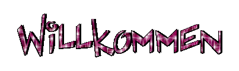
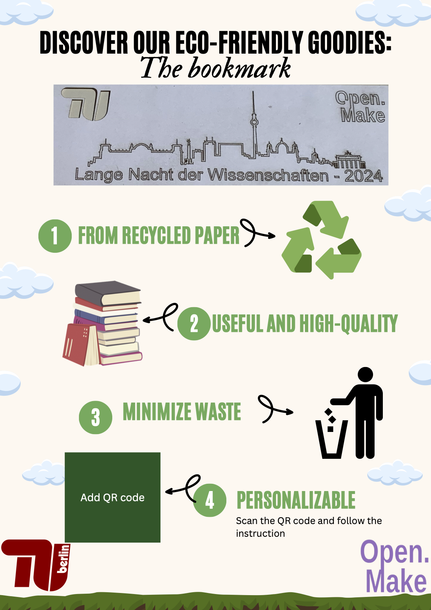
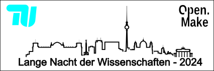

This post is in German, an English summary and alt text to images will be added in the coming weeks.
Aknowledgement: I want to thank my son Jeff (10) for corrections of my text.

Hallo liebe Besucher*innen, auf diesen Website erklären wir, worum dieses Projekt OpenMake sich handelt und warum wir es betreiben. Auf den [homepage](/..) können Sie sehen, dass 

- Wir sind aus verschiedenen Unis in Berlin.
- Wir arbeiten seit 2019 über offenes Hardware in Akademia.

## BUA

https://www.berlin-university-alliance.de

## Mobile LAb

Heute präsentieren wir unseren Mobile Lab konzept. Mit dem werden wir in die Unis vor Ort sein und erklären, was mit "open source" für hardware gemeint ist. Als Beispiel haben wir laser cut bookmarks entwickelt. Diesen Blogpost zeigt unseren Lernprozess.

# bookmark Produkt

## Die Idee

Ein kleines ökologisches anpassbares Goodies, der was laser cutting  machen kann zeigt.

## Versioning

Durch Design und Prototyp Wiederholungen haben wir Probleme gesehen und das Produkt geändert.

Skyline hat den Bookmark zerbrechlich gemacht -> wir haben Brücken eingebaut.

## (Open) Source : Wiederbenutzen können und dürfen

Das Produkt ist nicht durch findbarkeit offen, sondern weil es eine offene **Lizenz** hat: Man darf es wiederbenutzen. 

Anderseits, um nützlich zu sein, das Design muss in einen Format verfügbar sein, das jeder Mensch ändern kann. In diesen Fall sollten wir den Bild als `vector format` mit den Text als fonts benutzen.

Wir bereiten eine wiederbenutzbare Dokumentation vor: https://github.com/open-make/Goodies2printorcut.

# Laser cutting: eine open source Machine

Wir haben die Machine selbst gebaut, der Betriebs- und Bauanleitungen sind offen : https://github.com/fab-machines/Fabulaser-Mini.

---

**[Lassen Sie uns ein Kommentar !](https://cryptpad.fr/form/#/2/form/view/TK1nV0MX0O82kMMn0WAKg9MYbCTxr40Rpq3Vojw71FU/)** 

