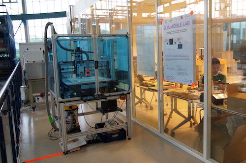
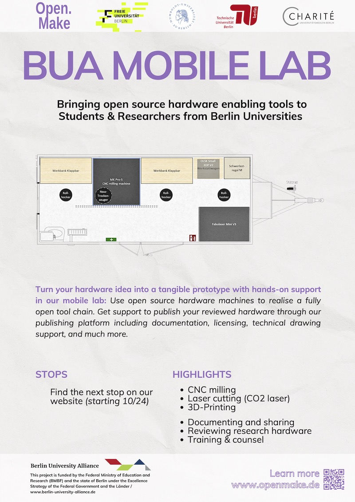
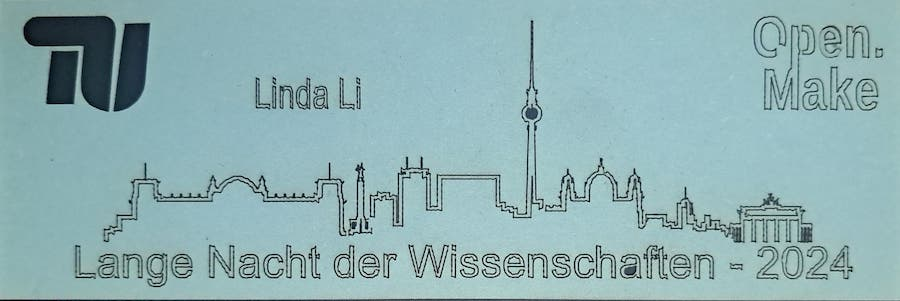
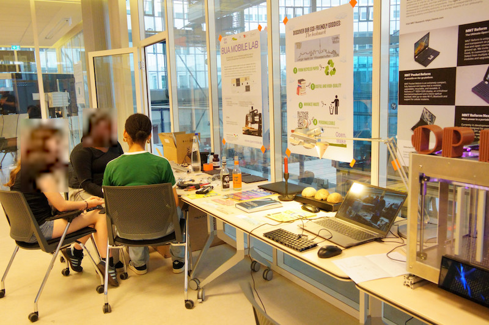

Dear Reader, 

We presented the BUA Mobile Lab project at the Long Night of Science 2024 in Berlin. During this [annual event](https://www.langenachtderwissenschaften.de),
universities and research institutions showcase scientific demonstrations, lectures, and interactive activities, making science accessible and engaging for all ages. 

We used the occasion to present the BUA Mobile Lab concept, and showcase the three open source manufacturing machines we collected for that purpose: a [3D printer](https://www.inmachines.net/open-lab-starter-kit#Small3DPrinter), a [laser-cutter](https://www.inmachines.net/open-lab-starter-kit#SmallLaser) and a [CNC mill](https://www.mekanika.io/mekanika-cnc-milling). These machines provided a actualisation of the concept of open-source hardware and our vision of supporting students and researchers at the BUA partner institutions in Berlin.

   

*Fig 1: CNC Milling*  

We navigated the attendees through the concept of open source hardware as well as digital manufacturing using the examples created during the event.
Visitors had the  opportunity to view our open-source hardware machines in action, and we could demonstrate a fully transparent toolchain, from initial concept to final product. In particular, the laser cut personalized bookmarks gained attraction among the visitors.

## Mobile lab concept

Inside Open.Make II, we had planned a prototype mobile lab, where we would showcase open source hardware to Berlin students and researchers. We extended the concept to build a long-lasting mobile lab that will be probably be reused at the TU Berlin once the project is over. 

## Showcased Projects

Throughout the event, we showcased several projects that illustrated the power and versatility of open-source hardware machines which created interest by visitors and had positive response

* Customized Bookmarks: Leveraging the precision of the Fabulaser Mini, we created personalized bookmarks from recycled paper for visitors, showcasing the creative potential of laser cutting technology.

   

* MNTRE Keyboard: The keyboard, sourced from the open-source company [MNT Reform](https://mntre.com), featured a casing manufactured by students using our CNC milling machine. This project illustrated how the BUA Mobile Lab can facilitate  design and creation of intricate components and empower students and researchers.

* Building a Screen Printing Machine: During the event, pupils gathered to develop an [open-source screen printing machine from Mekanika](https://www.mekanika.io/shop/category/screen-printing-4?gad_source=5&gclid=EAIaIQobChMIpqfWjaK_hwMVm1qRBR3CMg-wEAAYASAAEgLP-fD_BwE). The purpose of this workshop was to demonstrate how we can successfully replicate the machines.

  

## Future of the mobile lab

In addition to providing hands-on access to maker hardware, the BUA Mobile Lab will offer comprehensive support for all creators looking to review and publish their hardware design projects. We will assist BUA researchers in documenting their project, securing appropriate licenses, and support them for their technical drawings. Our platform will ensure that innovations are shared within the community and further foster collaborations.

Stay tuned for more updates from the BUA Mobile Lab !