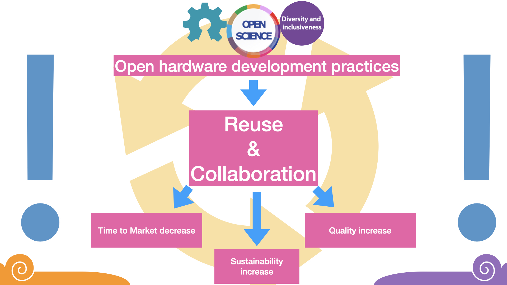
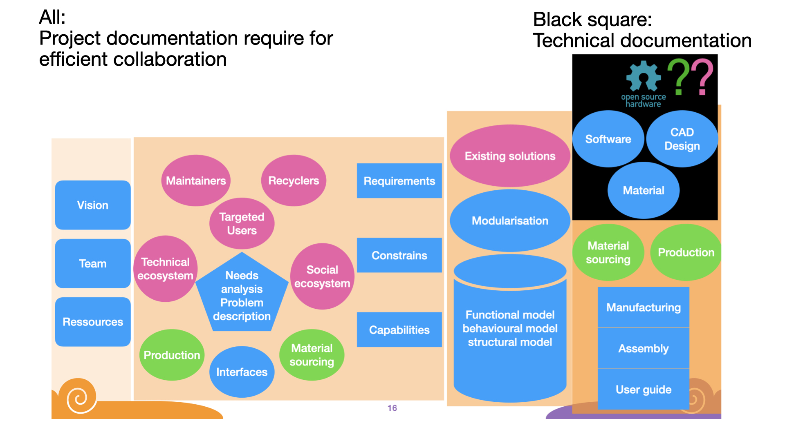

During the Hannover Messe 2025, we realised our academic research is
fully relevant for the industry. We indeed talked to several experienced
engineers and managers about how documentation and open collaborative
work can strive open source hardware development. They listened
carefully, mentioning the industry too, needs more cooperation and
communication.

## Five days at the Hannover Messe

The Messe is five days long, and we are still quite tired, while writing
this post. The world of the industry is quite different from the
academic conference, as most people are there to build business
connection, sell or buy products. We were in the hall dedicated to
future technologies and research, which had its own flair. Each evening
had its party, with live music, free drinks and free food. Canada was
the host country and the party they organised was pretty crazy.

We went there with our mobile lab to present our work on OSH inside
openmake and inside the LAUDS Factory project. We had a visit from the
XXX of Berlin on Monday (Fig. 1), and had a talk on Thursday. In
general, we spend most of our time talking to people, both presenting
our work and collecting data on the different subjects defined before
the Messe. We also drank a lot of coffee, while both food and drinks
were organised by the GREAT TUBs team (thanks again to all of you !)

::: fig-1

:::

### Highlights

We come back from Hannover with the impression what we do is useful, and
we should continue doing it. Understanding how collaborative work can be
organised, is a valuable input not only for researchers but also for the
industry, which face very similar problems. We come with solutions to a
problem that older engineers had faced for years.

As a direct input, we will start a collaboration with the transfer
office, as they want to implement a hardware documentation review for
all patents, as they realized most patents filed are unusable once the
people leave the university.

### Our Stand

We had a small booth at the main space organised by TUBs for the Berlin
and Brandenburg region. Our "smoothieclette"" was also set there, next
to our booth. Ten meters away, we parked our mobile lab, which is set up
with a 3D printer (prusa 4KS), a laser cutter and a CNC mill (Makanica
Pro version). We also have a set of manual tools. During the Messe, we
produced some acrylic information plaques. For instance, we had then a
plaque with a QR code linking to the documentation repository of the
smoothieclete. We also produced a staircase using the CNC mill machine
during the Messe !

This was possible as Xavier Klein (from Mekanika) joined us from Tuesday
to Thursday. Chia-Lin (TU student) was also there most of the time,
notably designing and graving plaques and presenting our work in the
mandarin language. Our new colleague Sebastian helped us on Friday,
notably screwing the stairs together.

We were showing some literature about hardware documentation guide, the
Open Next book (), the low tech teaching book and information about
Mekanika. The fact that two OpenNext books were stolen is probably a
sign that the topic is relevant...

### Outreach and politics

The Messe was pretty politic this year, as canada was host country and
due to the event in the USA. We also had a pretty political topic,
fostering collaboration and data exchange inside open source hardware
project in the industry. We were surprised to see how well our message
was received, with several people mentioning they have seen issues in
communication and collaboration inside industry for a long time, and
were wondering what one could do about it. It was particularly
interesting to discuss how a new market could develop around open source
hardware projects, and how to manage creativity and experience in
innovative processes.

### Redefining open innovation

Talks during the Messe are not well attended, we received nevertheless
very good feedback from the people present. As we had to give the slides
for our talk one week before the Messe was actually positive, as it
helped define our main messages:

1.  Open innovation has to be redefined with collaboration and
    inclusivity as their main values, similar to how open science was
    redefined in the last ten years.

1.  In order to allow collaborative work, hardware project documentation
    much go well beyond the technical documentation of the objects.

## Discussions and feedback

### Makerspaces in the industry

Makerspaces are seen either as learning places or places for rapid
prototyping. In this latter case, such "creative labs" are run inside
the company, and have both machines and personal, such that designers
are not involved in the production. The created prototypes are then used
to discuss the design further. Experts in production are often then
involved and the design is often modified consequently at that stage.

Makerspaces are not really considered as a place to produce economically
relevant product or a place to develop deep tech, but are known as a
learning place. In terms of learning place, the mobile lab concept and
the low-tech approaches were received positively. While some people
emphasized the role of such places to teach creative processes, the
possiblitiy to run a project along the whole process was reported as a
important experience. Getting an overview of the process can help better
understand the diverse part of product development. This also includes
marketing approaches: how to connect with target users, what skills are
needed at that point. Manufacturing and sales are indeed usually
connected functions in a company.

### Joint project and collaboration with Universities

People reported both from short projects with bachelor and master
students, and longer projects where the PhD and the professors were the
collaboration partners. A personal connection between one company
director (or a startup CEO who is a former student) and the professor is
often the base for such collaborations. Usually, the company provides
machine and space, the researchers are using them to test new processes
and then publish data and manuscript, while any improvement on the
hardware is kept secret. Sometimes the company is paying for the
research, sometimes not. These collaborations are often difficult and
slow (and expensive), which makes it frustrating.

The technology transfer coming from these collaborations may go via
different ways. In some examples, the product is made open source and
the company develop it further. In other case, the student become author
of a patent, which is licensed to the company. When working on open
source products, the company makes its output open source in some cases,
or make patents on their adds-on in other cases. They may also produce
both the open source solution and their proprietary adds-on.

### OSH, industry and market

While we were asking about the role of open source hardware in the
future of manufacturing, we got different kind of answers. We had
several talks on putative modification of the business models, but also
discussions on missed opportunities or problems OSH may solve, and
personal note on how individuals would love to work open source but
their companies do not want to play along. In academia, we see similar
issue when people said: "We provide what the politics measure" (in this
case number of patents)

#### OSH and documentation

In makerspaces, sometimes some people build machines. Once that person
leaves, the machine usually become unreparable and soon unusable.
Similarly, universities often pay for patents that cannot be used,
because the people leave the university without providing enough
documentation to develop a product out of the patented technology.

One Indian company was working with precious plastic, developing an
extension to work with mixed plastic sources. The documentation is not
ready but will be made open source. One could question this practice of
waiting for the documentation to be "ready" to make it public.

There were little knowledge about what tool can be used to facilitate
collaborative working like Git forges.

#### OSH, patent or secret

Legal aspects of OSH is still an issue for many developers. In
particular, it is not clear whether and how product designers are liable
in case of accidents. We also see example of "open hardware" licensed
with a MIT license (which is a permissive open source software license).
This stress the need to expand the knowledge in these areas with two
open questions: What happen if someone build a product based on
licensing your patent: how liable are you? How does CERN licenses
protect you from liability issues.

We discussed several times how OSH may be a way to do "defensive
publishing". We heard a case where a company had been secretly
developing a new technology, and a competitor had fined a patent on that
technology before they published anything about it. They end up not
being allowed to use their own technology, because it is protected by a
patent their competitor owns.

The topics that stay ubiquitous is the fear for competitors to steal
your technology and provide the same product but cheaper. This kind of
stealing does happen when technology is patented, and we had someone
reporting they had been in legal fights for more than ten years.

#### OSH and standardisation

Several projects would talk about their need for standardisation, such
that different companies can produce products that are compatible
between them. One "strategy" is to buy components from sub-contractors:
when several companies have the same contractor, they (may) build
compatible products.

We tried to bring the idea that working openly may facilitate and speed
up that process. We also questioned people from the ganter norm company
present in hall 6. This is a good example where 130 years ago, one
company created a standard by publishing their specification. They soon
became market leaders because they could deliver faster and had cheaper
product. Nowadays, they are still the market leader, because they have
the greatest inventory of product and a good reputation based on quality
of their products.

The definition of vision and motivation can change through time, when
new team members (including investors) enter the project. Documenting it
and making sure everyone agree on the vision is an important aspect of
the team work. Documentation of the processes is particularly important
when scaling up the startup, when the team goes from 3-5 people to 30
and up. A good documentation early on will save a lot of burden down the
way.

### Prototyping processes and quality checks

Interestingly, the process can be different in different companies. One
of them told us they were looking for funding after stating some
specification from an idea. One funding is secured, they engage in
concept refinement and prototyping. Other companies have continuously
development team creating prototypes, and have these prototyped
discussed with a larger team on site.

We had several discussion on the process of getting from a prototype
toward a product that can be produced. Apparently, the creative
processes done during prototyping are often limited by the relative low
knowledge of production processes. For instance, one expert in bleach
production told us he could reduce the production cost by 3 by changing
details in the design. This happened relatively late in the development,
even though he told us he could work at all stages of development (a
idea description on paper is all he needs): the expert was called very
late in the process, but could have given his advice much earlier.
Actually, such expertise (production, maintenance, gluing
technologies,\...) are very important. Their feedback is usually
provided at the prototype stage, during in person meetings.

We have seen companies creating and providing documentation only if
their client pay for it. Some senior managers told us they were doing
the documentation work because developers were not doing it, or because
it helped starting a project: the manager wrote the documentation (from
10 to 100 pages) and the team would then react to the (bad) proposition
made. Another company was asking their developers to write a daily
journal on what they did during the day and why. For electronics, board
design are usually completed with a text document giving information on
the board and its sub-components.

# Conclusion

It was a long and productive week at the Hannover Messe for our team. We
come out strengthened in our confidence in two apects: the topic of our
research is highly relevant also outside of academia, and we are a team
strong enough to make the project a success.
