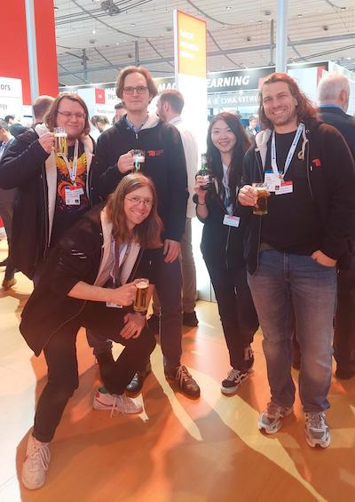

During the Hannover Messe 2025, we presented our mobile lab, and both
the Open.Make and the LAUDS factories projects. We got the chance to
talk with experienced experts from industry including engineers,
managers, consultants and business leaders about hardware development
practices. Key topics included how they are currently documenting their
projects and how open collaboration can be a valuable tool for driving
innovative open source hardware development. The most valuable outcome
for us was to realize that our academic research is of relevance to the
industry and could find application there as a means for open innovation
projects and research transfer. We were also invited to join the GITEX
Europe fair that will be next week in Berlin.

{width="100%"}

We will report our take home message from both fair in a blog post
series. In this first episode, we will present our personal experiences
at the Hannover Messe fair, while following episode will (probaly, stay
tuned) talk about "Open innovation = together", "prototype review and
quality check", the "role of makerspaces", and "Open Source Hardware for
the industry".

## Five people, five days at the Hannover Messe

The Hannover Messe sets an ambitious five-day exhibition presence. The
world of an industry fair is entirely different from an academic
conference, as most people are there to build business connections or to
introduce, sell and buy products. We were in the *Hall 2: Future Hub*
dedicated to future technologies and industrial research, which had its
own exciting flair of deep technology, applied research for industrial
transformation, research transfer, startup culture and international
networking. Each evening between the exhibition days had its own party
with live music and free food and beverages for exhibitors. As Canada
was the host country, they came with a large delegation and a lot of
well-curated booths in various halls. Also, the party they organised was
a pretty large concert and DJ performance by dynamic young Canadian
artists, which represented well the fresh breeze by the Canadian
corporate delegation.

We went there with our BUA Mobile Lab to present our work on open source
hardware (OSH) and open and sustainable manufacturing inside both the
Open.Make and the LAUDS Factory project. While our presented research
activities are geared towards manufacturing with digital machines as
used in fab labs and makerspaces, both projects share a special focus;
the potential and challenges for developing, transferring and producing
open source hardware for new alternative research transfer and market
opportunities as well as societal benefits.

We were five at the Messe: the three main researchers of the Open.Make
project (Dr. Mies, Dr. Colomb, Mr Maxeiner), one TUB student, and Mr
Klein from the Mekanika company, which is one of our partner in the
LAUDS Factory project. Mr. Krüger, another TU colleague came on Friday.
Our stands was presented on the messe webpage :
[ttps://www.hannovermesse.de/exhibitor/tu-berlin-university-alliance/N1579275?editor=visitorView&scene-node=qdlmca3k&exhibitor=77sbexz9&tdom-loc=xz532fiw](ttps://www.hannovermesse.de/exhibitor/tu-berlin-university-alliance/N1579275?editor=visitorView&scene-node=qdlmca3k&exhibitor=77sbexz9&tdom-loc=xz532fiw)



We had a small booth at the main space organised by TUBS for the Berlin
and Brandenburg region on top of our Mobile Lab setup. On the TU space,
we presented our design review and publication tool. In addition, our
"low-tech" demonstrator, the "smoothieclette" was also set there (it is
a treadmill used to make smoothies,REF). We used the Low-tech fanzine
and book from the LT4sustain project to discuss the concept with the
visitor. Later on, we also added a laser engraved QR code (created using
the R package qr_code, REF) linking to the documentation of the project.


```{r}
qrsmoothieclette = qrcode::qr_code("https://codeberg.org/openmakeXlowtech/PedalPoweredMachine-4fablab")
plot(qrsmoothieclette)
```

Ten meters away, we parked our BUA Mobile Lab (REF), which is equipped
with a 3D printer (Prusa MK4S), a laser cutter, a CNC milling machine
(Mekanika Mk2 PRO), and a set of manual tools. This setup is designated
as a mobile, entry-level makerspace offering for open source hardware
development by students and researchers at the Berlin universities, and
we had completed it just in time for the Hannover Messe. During the
Messe we produced a few acrylic information plaques (like the one for
the smoothiclette described above). We also manufactured a staircase
using the CNC milling machine during the Messe. The staircase allows for
more people to enter the BUA Mobile Lab, and was a lot of fun to create
(both designing and producing it was a learning experience). Om the
back, we also installed the Mekanika screen printing press and printed
some bags.

The Mobile lab doors were decorated with two mini poster presenting the
Open.Make and the LAUDS Factories concepts: On the left door, a poster
about transforming makerspaces from prototyping and teaching spaces,
into production facilities; on the right a poster on open source
hardware: opening up the product, opening the process to achieve better
and more sustainable products.

We were also showcasing our hardware documentation guide (add link), the
OPENNEXT handbook
([https://berlinup.books.tu-berlin.de/produkt/978-3-98781-013-8/),](https://berlinup.books.tu-berlin.de/produkt/978-3-98781-013-8/),){.uri}
and the OPENNEXT project video explaining the basics of open source
hardware development and the need for physical manifestation in
makerspaces
([https://www.youtube.com/watch?v=tWyUDsQLEVc).](https://www.youtube.com/watch?v=tWyUDsQLEVc).){.uri}


This was enabled by the presence of Xavier Klein from the Brussels-based
startup Mekanika, who joined us from Tuesday to Thursday. Mekanika
enriched the BUA Mobile Lab booth as co-exhibitor showcasing their open
source CNC milling machine technology. Their capabilities came in handy
for us not just as open source technology provider, but as part of a
train-the-trainer approach as important component for creating viable
offerings for supporting prototyping within open source hardware
projects.


Chia Yin Lin (TU Berlin student assistent) was also there for the whole
week, notably designing and graving plaques and presenting our work to
international visitors, in several instances even in Mandarin. Our new
colleague Sebastian Krüger joined us on Friday, notably assisting with
the final stages of the stair creation and helped us to secure the
machines for transport at the end of the day.


As highlights during the week, we had the honor and pleaseur to have a
visit from Dr. Severin Fischer, the state secretary of Berlin, on
Monday. On Wednesday, we had important discussions with the person
representing the transfer office of the TU at the fair on the use of our
documentation review system. On Thursday, we got invited to GITEX, which
demonstrate our presence was well prepared and received and we gave a
talk on the technology transfer stage. On Friday, we finished the
production of our staircase. In general though, we spend most of our
time talking to people, both presenting our work and collecting data on
questions defined before the fair. We also drank a lot of coffee to keep
us going, while both food and drinks. All this was scheduled and
organised by the ABSOLUTELY GREAT TUBS GmbH team (thanks again to all of
you!). There was also a very nice and warm interaction with fellow
exhibitors from Berlin Brandenburg as well all the neighbouring stands
in hall 2.

We return from Hannover with a lot of new contacts (TU tranfer office
and other potential research and teaching partners for our courses and
future grant application) and the impression that what we do is more
useful to the industry than the team had anticipated and we should
continue doing it. Understanding how collaborative work for hardware
development can be organised is a valuable input not only for
researchers but also for the industry, which face very similar problems.
We provide solutions to problems that older engineers have been facing
for years. Many visitors also expressed the importance of our work for
wider society.

.jpeg){width="50%"}
