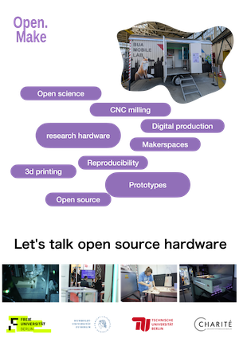

Dear students, dear researchers,

Do you wonder how the concepts of fablabs, makerspaces, 3d printing, open source, open science, research hardware and reproducibility are connected ?
Whether you are building or using hardware in your research, are just curious about makerspaces, the interdisciplinary team of the BUA Open.make project (a project of the Berlin University Alliance, which aims at implementing open and FAIR research hardware in Berlin universities) will be happy to answer this question and many more.

Learn about makerspaces' machines and how you can use them inside your research projects, and learn how to document your work so it can be recognized as valuable research outputs.
Every human is very welcome to the Mobile Lab stop at the FU mensa II, from 02.06 to 13.06.2025 (every workday from 11 to 13h).
We are looking forward to talk to you at the FU mensa II on the Dahlem campus !

------------------------------------------------------------------------

The [BUA mobile lab](/mobilelab/) was created to provide spaces and mentoring to BUA hardware developers and makers.
In a trailer, we have set different digital production machines to demonstrate what can be done in a  
makerspace, as well as show how hardware documentation can be leverage using these tools.
The mobile version of the lab is a complement to the central workshop (the [making lab](/makinglab/)), and will be used following the same rules of action, notably using the same [code of conduct](https://codeberg.org/jcolomb/Labs-codeOfConduct/src/branch/main/codeofconduct.md).
University project will be mentored on the use of the machines and the documentation of their work, via the work of an hardware research engineer.
After being showed to two fairs in May 2025 (Hannover Messe and Gitex Europe), it is time for the mobile lab to fulfill its original function and be deployed at the Berlin universities.

This June, we will show the lab at the Free University of Berlin during two weeks.
We will be present in front of the Mensa and therefore hope to get a lot of traction.
Our initial goal is to raise awareness for this new service and demonstrate the importance of open source hardware for reproducible research.
We will collect feedback from researchers and students about their needs and wishes, and see whether the mobile lab should be deployed for production in the future.
