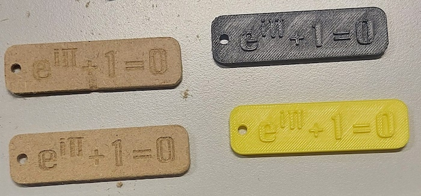

On July the 17th 2025, Julien ran a MINTORING workshop in the Making Lab.
Young FLINTA students (14-16 years old) were invited in the Making Lab, inside the TU/UdK library as part of the [MINToring program](https://www.fu-berlin.de/sites/mintoring/index.html) of the FU Berlin.
We met Dr Mouawad while being on the FU campus with the mobile lab.
Since we are a BUA project, we could easily collaborate with this FU initiative.
We were happy to learn that it was possible to use the Making Lab for a workshop: the alternative being to move the mobile Lab on the FU campus again, which would have been much more time consuming for us.

During the workshop, with the student and [Dr. Nelly Mouawad](https://www.fu-berlin.de/sites/mintoring/ueber-uns/team/Mouawad.html "Weitere Informationen") who is coordinating the program, we discussed what open source means (talking quite a lot about licenses), the difference between free (beers) and free (-dom), and how community can be organised (with the example of wikipedia).
The students were then introduced to the use of the CNC mill.


In the afternoon, we decided to build some objects.
The students discussed what to do and came to the idea to build key holders with the [Euler's identity](https://en.wikipedia.org/wiki/Euler%27s_identity) (Mathematical equation linking e, i and π).
We designed it using Inkscape to write the equation.
We then imported the svg file into fusion360 and designed the key holder part.
We then exported a stl file for 3D printing.

```{r, setup}


```

```{r, echo=FALSE}
options(rgl.useNULL = TRUE) # Suppress the separate window.
library(rgl)
readSTL("images/mintoring.stl", plot=TRUE,  col = "blue")
rglwidget()

```

We also use fusion360 CAM software to create a Gcode for the CNC milling machine.
Here, we used the engraving mill to cut/engrave the text, and a downward 3mm mill to bore the hole and make the contour.
After a first text engraving at 0.5mm, we used 1mm engraving for the other objects, as the text was more visimle.
The results were pretty good, although we could have used a wood of better quality:



The day ended with students using the CNC milling machine all by themselves.
At the end of the workshop, they were asking whether they could not make one extra key holder: "it only takes three minutes"...
and we did another one.
