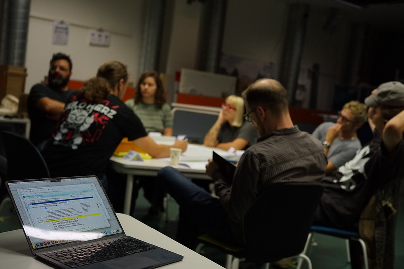
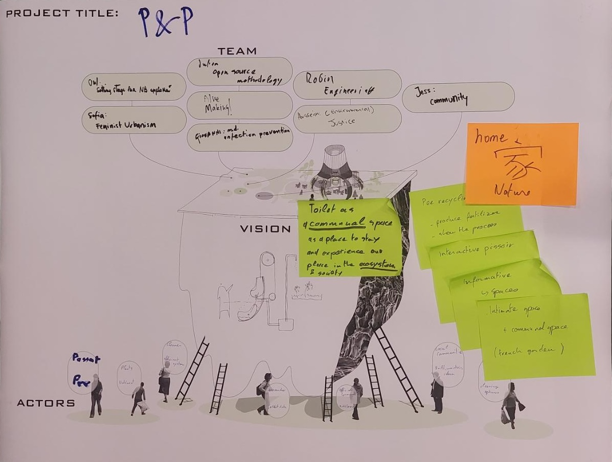
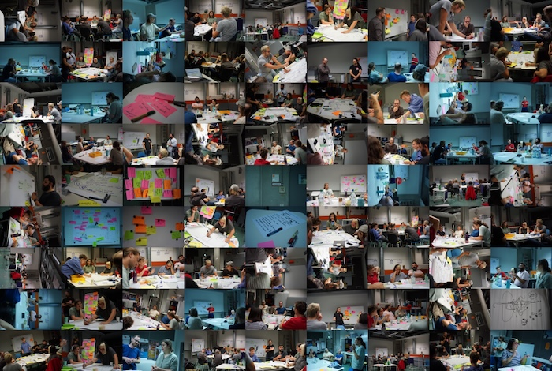

Play and Pee. A Pissoir for every bodies, an hardware concept built in 8 hours !
We report here from a 2 times 4-hours workshop that ended on the 1st of September,
where a small trans-disciplinary team followed a method derived from our 
hardware documentation guide to
created a concept for urban sanitation. 

# OSH as a participatory research method

After developing a guide for hardware documentation, we wondered how the documentation
guide can also be used as a project development guide, and whether such
a  guidance could be applied in trans-disciplinary settings.
Thanks to Pen's incoming fellowship, we had the possibility to test this hypothesis
and organise a participatory workshop. 
The short answer: it worked, not as planned but it worked.

## Participants and topic

Some years ago, I got involved in the looplab collective, born from the 
BUA grand challenge preparatory workshops. I got interested in the problems of 
urban sanitation and this was the opportunity to use and grow the network.

Pen and I therefore prepared a workshop called 
"Transdisciplinary workshop: hardware concept for urban sanitation". I 
reached to different communities of makers, sanitation activist, podcaster, and
researchers and we could gather a team of height people (me included), 
half of them being members of the looplab team (me included again).

It turned out we were a very divers group of very skilled people, including artists, social scientist,
engineers, hacker, medical doctor, and biologist, all with some interesting and deep knowledge of the topic.

## The 2 day Workshop 

The less short answer now. The goal of the first day was to build two teams and
decide what problems and vision each team will work on during the second day.
We started with a round of introduction, where each participant told the group about
their background and relation to the topic (see below), while another participant was 
taking notes on a small card.
Then, after a short input on the topic (helped by a poster) and the daily schedule, each participant 
got one participant card to pin on the topic board, so we got a visual representation
of the main interests of the participants. We then added some elements in the topic
poster using post-it, and discussed several projects people knew of.
We then had a speed dating round, with 4 rounds of 4 minutes  where people were in groups 
of 3 and discussed freely.

Then the participants discussed several ideas (some of which emerged during
the speed dating)
and I took notes using three notepads, one for actors, one for what they want,
and one for what they wanted. After a pretty long round of discussion, we then read some randomised 
combination of these 3 elements.
In the end, we discussed what mission we were giving us in a free round of discussion, and framed in the end
a vision for the work. Then ended the first day, with the missiong "questioning the norms about toilet". Day one ended with a 
small feedback round: everyone enjoyed the day, people wished for more speed dating and 
"have a big piece of paper on the table".

Day 2 started with documenting the team on the poster, it brought people together at the poster starting
the new day with an easy task. We had prepared a smaller table with a large piece of paper, I also
put the cards written at the end of day one on it, as a reminder of ideas we developed.
We then started to discuss the problem we wanted to solve, taking notes on the big piece of paper.
After about 45 minutes of group discussion, I borke the discussion to try a new approach:
each participant wrote one problem they thought should be tackled on a card, we pinned them on 
the wall. Then moved the cards in the center for ideas they thought would be best fit their interest. 
This did not work well in term of choosing a problem,
but it broke the discussion and allowed us to test a different approach.

We then moved to the actor description, the group mentioned different people who would be affected by the
project, stating their needs or whishes, while Pen took notes on cards he pinned on a board. For each actor,
the team frame how they could interact with a public toilet solution. We then read these interaction, to build a 
capactity frame for the hardware solution.
Then one of the
participants draw a representation of the different actors, and the team wrote needs on cards they put on
the drawing. At the end, we reframed the mission and vision for the team "toilet as a communal space, as a place to stay
and experience our place in the ecosystem". We then started to discuss the hardware solution we would envisage.
Through a rapid iterative discussion, ideas were discussed and refined. We discussed
different aspects of the solution, different modules which could be thought, and what element
we would develop first. It was like the idea was developing itself inside the discussions, and drawings helped
frame it concretely. 20 minutes toward the end of the workshop, we had a team, a vision, a problem to solve and a
concept for a playfull peeing interactive machine. We could then discuss the next steps, where the team would next meet, 
and give a round of feedback.

The concept is a pissoir which is set too high to be used. The user needs to take it down, change the angle of the pissoir to use it. Flushing happens when the pissoir is taken up again.

##  What about the plan ?

We had prepared a pretty slick timeplan for the workshop, 
with the plan to have two teams at the end of day 1,
the two teams were then supposed to work independently and report to each other on day 2.
In the end, most of the plan had to be modified on the spot, as free discussion spots were very productive,
we also needed more breaks than planned.
The participants were proactively drawing, bringing a very unexpected and efficient way to discuss
ideas and come to a common understanding.

Importantly, the core work-plan was followed, even if the timeplan was not. 
The important aspect was to follow the 
hardware documentation guide, pushing discussions about solution to the end of the workshop, once people deeply discussed 
their team, vision, mission, the actors ecosystem, and requirements for the hardware. 
The time plan was also important and used when the work was stalling. 
For instance, the problem description discussion was not coming to a conclusion, and 
going back to the planned activity helped the team go forward.
It was also important to not come to conclusive answer anyway in the process.
For example, the team mission framed in day one was useful to come forward 
in the other tasks, but it was reframed at least twice during the workshop.

# Conclusion

The workshop was a success, it showed that the hardware documentation guide can  be used
as a guidance for project conceptualization. With the right format and team, one can get a 
extremely fitted concept in less than 10 hours. 
We are eager to test whether the guide can also be used for prototyping 
and are organising the next workshop to test that hypothesis.

 